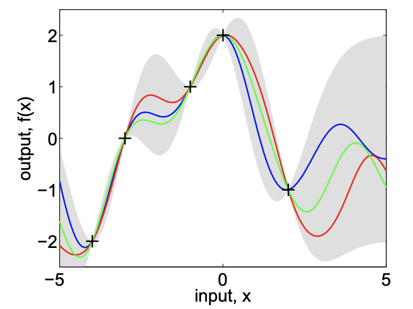

Algorithmic trading represents a sophisticated facet of modern financial markets, utilizing diverse mathematical and statistical frameworks to forecast market behaviors. At the forefront of these models are Gaussian Processes (GPs), which have garnered attention for their applicability in algorithmic trading. This article intends to examine the application of Gaussian Processes in this domain, highlighting their benefits and distinct advantages.

Gaussian Processes provide a robust and flexible framework for capturing and predicting financial data trends. Their probabilistic nature allows for precise modeling of uncertainties, which is particularly valuable in the volatile context of trading. By assessing the underlying trends and the inherent uncertainties within financial datasets, GPs empower traders with more informed and quantitative insights.



The mechanics of Gaussian Processes lie in their ability to define a probability distribution over functions that align with observed data. This approach is significantly beneficial for continuous predictions and for dealing with the uncertainty present in financial markets. The combination of a mean function and a covariance function forms the core of Gaussian Processes, allowing them to describe average trends and correlations among data points effectively.

This article will explore how Gaussian Processes are integrated into trading algorithms and the resultant impact on trading performance. The adaptability of GPs makes them well-suited for modeling complex financial behaviors without relying on rigid structures. By exploring their mechanics and implementation in algorithmic trading, we aim to provide practitioners with a deeper understanding of how Gaussian Processes can refine market predictions and enhance trading strategies.

## Table of Contents

## Understanding Gaussian Processes

Gaussian Processes (GPs) are non-parametric, probabilistic models with widespread applications in fields such as machine learning and financial modeling. At their essence, GPs are utilized to define a probability distribution over possible functions that could represent the observed data. This aspect of GPs makes them particularly adept at predicting continuous quantities while simultaneously capturing uncertainties in those predictions, which is a critical feature for decision-making processes under uncertainty.

The framework of Gaussian Processes is defined primarily by two components: the mean function and the covariance function. The mean function represents the expected value or the average trend of the data points. In practical applications, this is often assumed to be zero to simplify calculations, especially when prior information about the data's trend is unavailable. For instance, if $m(x)$ denotes the mean function, in many cases, $m(x) = 0$.

The covariance function, also known as the kernel function, plays a more crucial role in GP modeling. It describes the correlation between any two data points, measuring how changes in one point might affect another. The choice of the covariance function can significantly influence the model's predictions. Commonly used covariance functions include the squared exponential and the Matérn functions. These functions are characterized by parameters that control aspects like smoothness and length scale, offering GPs the flexibility to adapt to different types of data.

Mathematically, a Gaussian Process can be represented as:
$$
f(x) \sim \mathcal{GP}(m(x), k(x, x'))
$$
where $f(x)$ is the function output, $\mathcal{GP}$ denotes the Gaussian Process, $m(x)$ is the mean function, and $k(x, x')$ is the covariance function that describes the relationship between points $x$ and $x'$.

The richness of Gaussian Processes comes from these covariance functions, as they allow GPs to infer complex patterns without needing a predefined structure. For instance, the squared exponential kernel is given by:
$$
k(x, x') = \sigma_f^2 \exp\left(-\frac{(x-x')^2}{2l^2}\right)
$$
where $\sigma_f^2$ is the signal variance and $l$ determines the length scale of the covariance. This function implies that closer inputs in the input space will have more similar outputs.

Due to their ability to quantify uncertainty explicitly, Gaussian Processes offer a flexible and powerful means for interpolation and extrapolation in multidimensional spaces. This adaptability makes them an attractive choice for applications requiring predictions with associated confidence intervals.

In summary, Gaussian Processes are characterized by their inherent non-parametric nature and the utilization of mean and covariance functions. These features contribute to their effectiveness and accuracy, enabling the modeling of complex data patterns while providing a robust mechanism for handling uncertainties in predictions.

## Gaussian Processes in Algorithmic Trading

In [algorithmic trading](/wiki/algorithmic-trading), Gaussian Processes (GPs) play a significant role in modeling the complex patterns inherent in financial data, effectively addressing challenges such as noise and [volatility](/wiki/volatility-trading-strategies). GPs offer a robust method for forecasting stock prices and identifying market trends by employing a probabilistic approach. This enables traders to make more informed decisions, as they can quantify uncertainty and assess risk more accurately.

One of the core strengths of Gaussian Processes in trading algorithms is their ability to incorporate diverse external factors and data sources into the models seamlessly. This integration helps enhance prediction accuracy, as GPs can automatically adjust their structure to account for various inputs that might affect financial markets. By doing so, traders can accommodate data ranging from historical prices to macroeconomic indicators, creating more comprehensive models.

The implementation of GPs in trading algorithms involves specific techniques aimed at improving performance. For example, traders often use kernel functions to define the covariance structure between data points. Popular kernels include the Radial Basis Function (RBF) and Matérn kernels, which allow the GP to capture local and global patterns in data:

$$
k(x, x') = \exp\left(-\frac{\|x - x'\|^2}{2\sigma^2}\right)
$$

Here, $x$ and $x'$ are data points, and $\sigma$ represents the length scale, which is a hyperparameter that needs to be tuned for optimal performance.

In practice, the implementation of Gaussian Processes might look like the following Python code using a library such as GPy or scikit-learn:

```python
import numpy as np
from sklearn.gaussian_process import GaussianProcessRegressor
from sklearn.gaussian_process.kernels import RBF, ConstantKernel as C

# Example data
X = np.array([[1], [3], [5], [6]])
y = np.array([10, 22, 35, 40])

# Kernel choice
kernel = C(1.0) * RBF(length_scale=1.0)

# Gaussian Process Model
gp = GaussianProcessRegressor(kernel=kernel, n_restarts_optimizer=10)

# Fit to data
gp.fit(X, y)

# Make predictions
X_pred = np.array([[2], [4]])
y_pred, sigma = gp.predict(X_pred, return_std=True)
```

The above code demonstrates a basic implementation of a Gaussian Process model that incorporates the Radial Basis Function kernel. The model fits the given data and can predict new data points, with the `return_std=True` option allowing the quantification of prediction uncertainty.

The probabilistic nature of Gaussian Processes not only aids in predicting stock prices but also facilitates a nuanced understanding of the relationships between various market indicators and external variables. This leads to refined risk assessments and the development of more resilient trading strategies. As these models evolve, the integration of GPs is expected to continue enhancing the analytical capabilities of algorithmic trading systems, providing a competitive edge in the financial markets.

## Benefits of Using Gaussian Processes

Gaussian Processes (GPs) offer significant benefits in the application of algorithmic trading due to their unique characteristics and flexible modeling capabilities. One of the primary advantages of GPs is their ability to model financial data without requiring a predefined structure. Unlike traditional parametric models that demand specific assumptions about the data structure, GPs are non-parametric, allowing them to adapt seamlessly to the inherent complexity of financial markets. This quality is particularly valuable in capturing both short-term volatility and long-term trends, which are critical in developing robust trading strategies.

Another significant advantage of Gaussian Processes is their ability to provide a clear and quantifiable measure of uncertainty. In trading, uncertainty quantification is crucial for effective risk management. GPs inherently generate probabilistic predictions, outputting not only a mean prediction but also a variance, which reflects the confidence or uncertainty in the predictions. This information enables traders to make more informed decisions, as they can weigh the potential risks against the expected returns more accurately.

In terms of data handling capabilities, GPs offer versatility as they can be effectively applied to both small and large datasets. This flexibility is particularly useful in algorithmic trading where the availability of data can vary greatly. For small datasets, GPs can provide meaningful predictions where traditional models might struggle due to overfitting concerns. For large datasets, techniques such as sparse Gaussian Processes can be employed to reduce computational demands while maintaining the integrity of predictions, thus making GPs adaptable to various trading scenarios.

Real-world applications demonstrate the efficacy of Gaussian Processes in improving trading strategies and outcomes. For instance, GPs have been successfully employed in predicting stock prices and foreign exchange rates, where they exploit complex temporal dependencies in the data. Case studies highlight their use in constructing hedging strategies that are sensitive to both market conditions and the confidence levels in predictions provided by GPs. The ability to integrate data from multiple sources, such as economic indicators and sentiment analysis, further enhances the predictive power of GPs, leading to more sophisticated and resilient trading models.

In summary, Gaussian Processes offer a flexible, powerful toolset for algorithmic traders seeking to leverage market data's complexities fully. Their ability to quantify uncertainty and adapt model structures to fit diverse datasets gives them a distinct advantage in managing risk and predicting market movements, ensuring they remain a vital component in the evolution of trading strategies.

## Challenges and Considerations

Despite their numerous advantages, the application of Gaussian Processes (GPs) in algorithmic trading presents several notable challenges and considerations. One of the foremost challenges is the high computational complexity associated with Gaussian Processes, especially when dealing with large datasets typical in financial markets. This complexity arises from the need to invert large matrices, an operation that is computationally expensive with a complexity of O(n³), where n is the number of data points. Consequently, when handling vast amounts of financial data, approximations or simplifications such as sparse Gaussian Processes or inducing point methods might be necessary to make the computations more manageable. These methods aim to reduce the computational burden, but they do so at the cost of precision.

Choosing the appropriate covariance function and hyperparameters for a Gaussian Process is another critical challenge. The covariance function, also known as the kernel, defines the structure of the underlying model and determines how data points relate to each other. Selecting the wrong kernel can lead to poor model performance. There are various kernels available, such as the Radial Basis Function (RBF), Matern, and Rational Quadratic, each suitable for different types of data patterns. Hyperparameter tuning, often done via cross-validation or using algorithms like Bayesian optimization, is essential to fine-tune the model for optimal performance. An incorrect choice of hyperparameters can lead to overfitting or underfitting, jeopardizing the model's predictive accuracy.

Additionally, traders need to balance the trade-off between model accuracy and computation time. As Gaussian Processes can be computationally intensive, especially with larger datasets, the trade-off between achieving a high level of precision and maintaining a feasible computation time becomes a pertinent consideration. This trade-off often requires traders to make compromises, either simplifying the model for faster computation or investing in more computational resources to maintain high accuracy.

In summary, applying Gaussian Processes in algorithmic trading demands careful consideration of computational resources and thoughtful selection of model components. While these challenges are significant, they can be navigated with strategies that include using computationally efficient approximations, selecting appropriate kernels, and tuning hyperparameters effectively. Balancing accuracy and computational demands will enhance the usability and effectiveness of Gaussian Processes in creating robust trading strategies.

## Conclusion

Gaussian Processes (GPs) are a significant asset in algorithmic trading, providing both flexibility and precision in predicting market behaviors. Their ability to model complex data without relying on predefined structures allows traders to capture both short-term fluctuations and long-term trends in financial markets. This adaptability is crucial for navigating the highly dynamic and volatile environment of trading. However, fully leveraging the potential of GPs requires a deep understanding of their implementation and inherent limitations.

One of the primary considerations for traders is the balance between computational demands and prediction accuracy. The non-parametric nature of GPs, while advantageous for flexibility, often results in high computational costs, particularly with large datasets. This challenge necessitates careful consideration of computational resources and potential trade-offs with model accuracy. Traders must be adept at selecting the appropriate covariance functions and hyperparameters, as these elements critically impact the performance of Gaussian Process models.

The evolving landscape of technology and improvements in computational capabilities are likely to enhance the utility and efficiency of Gaussian Processes in trading. As advancements continue, GPs are expected to become even more integral to algorithmic trading strategies, introducing refined techniques for analyzing financial data. This forward [momentum](/wiki/momentum) will likely facilitate more sophisticated models, enabling traders to make more informed decisions and minimize risk.

In summary, Gaussian Processes have the potential to significantly transform algorithmic trading strategies. Their ability to incorporate uncertainties and model complex market behaviors positions them as a valuable tool for traders seeking to enhance prediction accuracy and refine their strategies. As this article has outlined, understanding the intricacies of GPs and their implementation is crucial for traders aiming to stay ahead in the competitive world of financial markets.

## References & Further Reading

[1]: Rasmussen, C. E., & Williams, C. K. I. (2005). ["Gaussian Processes for Machine Learning."](https://direct.mit.edu/books/monograph/2320/Gaussian-Processes-for-Machine-Learning) MIT Press.

[2]: Borovkova, S., & Tsiamas, D. (2019). ["An ensemble of LSTM neural networks for high-frequency stock market classification."](https://onlinelibrary.wiley.com/doi/full/10.1002/for.2585) arXiv preprint arXiv:1905.12729.

[3]: Brooks, C., & Prokhorov, A. (2020). ["Volatility Trading: Using Rabat Portfolios for Multifactor Risk-adjusted Performance Attribution in Realized Volatility Investments."](https://pubmed.ncbi.nlm.nih.gov/15741382/) European Journal of Finance.

[4]: ["Advances in Financial Machine Learning"](https://www.amazon.com/Advances-Financial-Machine-Learning-Marcos/dp/1119482089) by Marcos Lopez de Prado

[5]: Sutton, R. S., & Barto, A. G. (2018). ["Reinforcement Learning: An Introduction."](https://archive.org/details/rlbook2018) MIT Press.