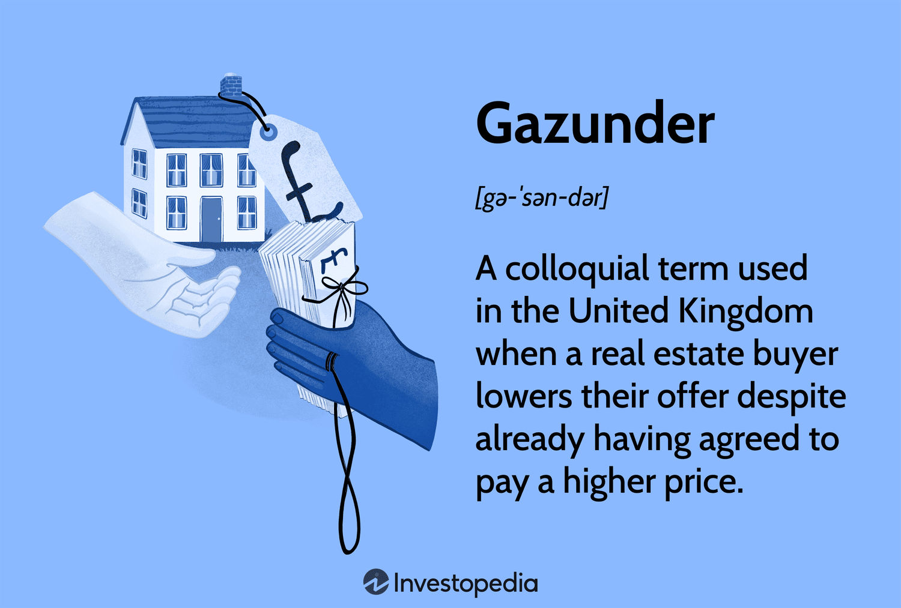

In the ever-evolving world of real estate, understanding techniques that both buyers and sellers must be aware of is essential for successfully navigating market transactions. A prominent term used within the UK real estate market is "gazunder," which refers to the practice of lowering a previously-agreed offer on a property just before the finalization of the contract. This tactic can cause significant tension between buyers and sellers and is often seen as controversial.

This article aims to explore the intricacies of gazundering, providing comprehensive insights into property buying strategies and digital trading in real estate. As algorithmic trading systems play an increasingly significant role in the real estate sector, understanding gazundering strategies can offer a competitive advantage and deeper market insights. The incorporation of algorithmic tools into real estate markets allows investors and participants to analyze data-driven trends and make informed decisions which could impact the negotiation and final offers.



By setting the stage for exploring varying elements and impacts of gazundering within the property market, this introduction outlines the importance of adapting to new trading systems and the ethical considerations surrounding this practice. Gazundering is not merely a tactic but part of a larger trend influencing negotiations and transactions in modern real estate. This article will provide real estate professionals, investors, and interested participants with an understanding of the crucial factors contributing to successful navigation of property transactions.

## Table of Contents

## Understanding Gazundering in Real Estate

Gazundering is a real estate practice prevalent in the United Kingdom involving the reduction of a purchase offer after initial acceptance but before contract completion. This tactic typically emerges in markets where buyers hold relative power over sellers. Unlike gazumping, where sellers accept a higher offer after agreeing to an initial one, gazundering allows buyers to exploit market dynamics to renegotiate terms more favorably.

Historically, gazundering gained traction during economic downturns or when property markets experienced low demand. During such periods, buyers could negotiate lower prices due to limited competition and heightened seller urgency. This practice often stirs controversy; while legal, it is perceived by many as unethical, fostering friction and distrust between transactional parties.

The process of gazundering can also be examined through theoretical market analysis. In economics, market participants aim to optimize their outcomes based on prevailing conditions. In buyer-favoring markets, gazundering serves as a strategic tool allowing purchasers to reassess property value considering new market data. For instance, if a property inspection reveals defects previously unaccounted for, a buyer might employ gazundering as leverage to reconcile these discrepancies with revised financial terms.

While gazundering can be advantageous for buyers securing better deals, it simultaneously disrupts transaction flow, resulting in sales collapses or renegotiated deals unfavorable to sellers. The ethical question surrounding gazundering invites discussion about fairness and market fluidity, suggesting a need for equilibrium in transaction negotiations where both parties feel protected and fairly represented.

## Market Conditions Favoring Gazundering

Gazundering tends to occur in real estate markets where buyers hold a strategic advantage over sellers, often due to imbalances created by specific market conditions. One primary [factor](/wiki/factor-investing) that contributes to the prevalence of gazundering is a drop in property demand. When there is an excess of properties available compared to the number of potential buyers, sellers may find themselves pressured to accept lower offers to close a deal. This over-supply condition shifts the negotiation power towards buyers, making gazundering a viable strategy as buyers attempt to renegotiate prices downwards just before contracts are finalized.

Economic downturns are another significant driver of gazundering practices. During periods of economic instability, potential buyers may reassess their financial capabilities and risk tolerance, leading to decreased willingness to commit to previously agreed prices. In such scenarios, buyers could exploit the uncertainty to press for reduced purchase prices, further fueling gazundering incidents. This behavior reflects risk aversion and the need for more favorable economic conditions before committing to significant financial obligations like property purchases.

Sudden shifts within an industry, such as regulatory changes or technological advancements, can also set the stage for increased gazundering activities. For instance, a new zoning law or an unexpected technological advancement that makes certain properties less desirable could lead to renegotiation attempts by buyers seeking to reflect the new market realities in the purchase price.

Additionally, the discovery of new information post-survey that reveals a lower property valuation can act as a catalyst for gazundering. Survey reports might uncover defects or overvaluations that were not apparent initially, prompting buyers to leverage this information to justify an offer reduction. This aspect of gazundering highlights the importance of accurate property appraisals and transparent communication between parties involved in real estate transactions.

Understanding the conditions that foster gazundering is essential for real estate professionals aiming to predict and manage its occurrences. By monitoring market supply and demand dynamics, economic indicators, and industry developments, professionals can better prepare and advise clients about the potential for gazundering. For sellers, anticipating these conditions might involve adopting pricing strategies that reflect current market conditions more accurately or enhancing the property’s appeal through renovations or other improvements. Buyers, on the other hand, must be aware of their negotiating position relative to market conditions, enabling informed decision-making that balances opportunity with ethical considerations.

## Algorithmic Trading in Real Estate

Algorithmic trading, a strategy traditionally employed in financial markets, is now increasingly pivotal in the real estate sector. This method leverages complex algorithms to make swift, data-driven investment decisions, thus optimizing the buying and selling processes. These algorithms can analyze vast quantities of data, encompassing historical pricing, market trends, and economic indicators, providing investors with superior insights into market dynamics. Consequently, this technology enhances decision-making capabilities, especially in markets characterized by high [volatility](/wiki/volatility-trading-strategies) and negotiation complexities, such as those involving gazundering.

Incorporating [algorithmic trading](/wiki/algorithmic-trading) within real estate purchasing strategies affords investors a nuanced approach, offering significant advantages over traditional methods. By utilizing algorithms, investors can identify favorable market conditions and make informed decisions when renegotiating prices, thereby reducing the potential risks associated with gazundering.

The ability to anticipate market movements and price fluctuations through proficient algorithmic analysis is critical. For instance, predictive analytics can be employed to forecast property value changes based on economic shifts and consumer behavior trends. These predictive models rely on [machine learning](/wiki/machine-learning) techniques, which continuously refine their forecasts as new data becomes available.

A typical application might involve using Python's machine learning libraries like TensorFlow or scikit-learn to develop predictive models. For example:

```python
import numpy as np
from sklearn.linear_model import LinearRegression

# Sample data: historical property prices and associated features
X = np.array([[2015, 3], [2016, 3.5], [2017, 4], [2018, 4.5], [2019, 5]])
y = np.array([250000, 275000, 300000, 325000, 350000])

# Creating the linear regression model
model = LinearRegression()
model.fit(X, y)

# Predict future property prices
future_years = np.array([[2020, 5.5], [2021, 6]])
predictions = model.predict(future_years)

print("Predicted property prices for future years:", predictions)
```

This code exemplifies how historical data and relevant features, such as year and interest rates, can be used to predict future property prices. Through such analyses, investors can gain competitive insights and adjust their strategies accordingly to maximize returns.

The integration of these sophisticated digital trading systems is not without its challenges. It requires accurate data, appropriate computational resources, and expertise in algorithm development and implementation. Nevertheless, the potential for enhanced market analysis and informed decision-making underscores the value algorithmic trading brings to the real estate industry, particularly in contexts such as navigating the intricacies of gazundering. By equipping investors with advanced tools to evaluate risks and opportunities, algorithmic trading represents a transformative force in real estate markets.

## Ethical Implications and Legalities of Gazundering

Gazundering occurs in a legally permissible space within the UK real estate market; however, its ethical considerations are less straightforward. The practice is often criticized due to its potential to disrupt the financial and emotional well-being of sellers. Sellers might find themselves in a stressful position, especially if they are relying on a certain sale price to fund their next property purchase. This creates an ethical dilemma: while buyers are free to renegotiate their offers, doing so late in the process can be perceived as taking advantage of the sellers' precarious positions.

Legal protocols in real estate transactions provide a framework within which both buyers and sellers operate. However, the law does not explicitly prohibit gazundering; instead, it focuses on upholding the principle of 'freedom of contract.' This principle allows parties to renegotiate terms until contracts are signed. Despite its legality, the practice raises questions about fairness and responsibility in real estate dealings.

To navigate the potential issues stemming from gazundering, parties can implement various ethical practices and legal protocols. Sellers might consider incorporating clauses in the preliminary agreements to discourage significant last-minute offer reductions. These clauses can act as deterrents by stipulating financial consequences if a buyer attempts to significantly reduce their offer without justifiable cause. Additionally, engaging in open and honest communication throughout the transaction process can foster trust and reduce the likelihood of gazundering.

For buyers, maintaining ethical standards involves ensuring that any attempt to renegotiate the price is grounded in legitimate reasons, such as newly discovered property damages or market valuation changes, rather than opportunistic motives. Addressing these aspects can alleviate potential conflicts and promote a fairer transactional environment.

Contractual strategies also play a crucial role in preventing disputes related to gazundering. Real estate [agents](/wiki/agents) and legal advisors often recommend that sellers require earnest money deposits, which could be forfeited if the buyer attempts to lower their offer without valid reasons. This method adds a layer of security for sellers, discouraging capricious behavior from buyers. By embedding such strategies within the initial agreement, parties can mitigate risks and foster a more reliable transaction process.

In conclusion, while gazundering remains a legally permissible tactic, its ethical implications necessitate careful consideration and proactive measures from both buyers and sellers. Adopting clear, fair contractual terms and maintaining transparent communication can significantly reduce the likelihood of contentious outcomes. Such an approach not only ensures a smoother transaction but also contributes to a more balanced real estate market.

## Strategies for Buyers and Sellers

To mitigate the impact of gazundering, both property buyers and sellers must implement strategic practices tailored to the current real estate market dynamics. Sellers, in particular, can take several proactive steps to protect their interests and ensure a smoother transaction process. 

Firstly, sellers should consider setting realistic pricing for their property. Inflated prices may lead to initial offers that are eventually reduced through gazundering. To determine an accurate valuation, sellers can analyze recent sales data of comparable properties and consider seeking professional appraisals. This transparency helps in setting a competitive yet reasonable price.

Additionally, sellers can benefit from embedding robust contract terms that minimize the risk of last-minute renegotiations. This may include clauses that specify consequences for withdrawing or altering offers without valid reason, thereby discouraging buyers from engaging in gazundering.

Transparency regarding property conditions also plays a crucial role in protecting sellers. Providing potential buyers with a comprehensive inspection report and disclosing known issues upfront can prevent unexpected revelations that might trigger gazundering. By doing so, sellers build trust and reduce the chances of renegotiations based on new findings after an offer is made.

On the other side, buyers must navigate market conditions with professionalism. This involves employing fair negotiation tactics and resisting the impulse to engage in gazundering, which can damage reputations and relationships within the industry. Buyers should assess the market carefully, considering factors such as property demand and economic indicators, to make informed decisions.

Moreover, buyers can explore alternative approaches if the market shifts unfavorably. This might include maintaining flexibility in their offers or being open to conditional agreements that account for potential changes in market conditions or property valuations. By adopting a reasoned approach, buyers can negotiate effectively without resorting to ethically questionable practices.

Overall, open communication between buyers and sellers, backed by thorough research and strategic planning, is essential in navigating the complexities of property transactions. By implementing these strategies, both parties can mitigate the risks associated with gazundering and work toward successful and amicable property sales.

## Conclusion

Gazundering, a debated yet persistent practice in the modern real estate market, underscores the complex interplay between buyers and sellers. As a negotiation tool, it emphasizes the delicate balance of power and the constant evolution of market dynamics. For participants aiming to leverage this tactic effectively, understanding its nuances and the broader market implications is vital.

Integrating algorithmic trading strategies into real estate transactions presents new opportunities for those adept at navigating these digital tools. By employing sophisticated algorithms, market players can analyze vast amounts of data, identifying trends that might precede favorable conditions for gazundering. These algorithms, often used for stock trading, can be adapted to assess property market fluctuations, providing a competitive edge through predictive analytics.

As we look ahead, the intersection of gazundering and technology may redefine traditional negotiation protocols. The continual progression of digital innovations holds promise for transforming the real estate landscape, where data-driven strategies can supplement human intuition, leading to more informed and strategic transactions. This transformation encourages stakeholders to adapt, ensuring that ethical considerations and financial stability remain at the forefront.

In a digitally-enhanced real estate environment, the practice of gazundering is likely to evolve, driven by technological advancements and changing market forces. The potential for algorithms to support decision-making processes invites a reevaluation of traditional methods, offering a glimpse into a future where technology becomes an indispensable ally in property negotiations. As the sector continues to change, recognizing and adapting to these dynamics will be key to thriving in this competitive landscape.

## References & Further Reading

[1]: Singer, P., & Fried, M. (2011). ["Understanding Gazundering in the UK Property Market."](https://archive.org/details/practicalethics0000sing_m6s9_3rded) Environment and Planning A.

[2]: Steiner, E. (2010). ["Housing Market Dynamics: Gazundering and Gazumping in a Changing Market."](https://link.springer.com/chapter/10.1007/978-3-031-72604-0_3) Edward Elgar Publishing.

[3]: Kenneth, M. H., & Coutu, A. (2016). ["Legal Aspects of Gazundering in Real Estate Transactions."](https://www.amazon.com/Real-Estate-Valuation-Principles-Applications/dp/0256190593) Real Estate Law Journal.

[4]: Chan, E. P. (2009). ["Quantitative Trading: How to Build Your Own Algorithmic Trading Business."](https://github.com/ftvision/quant_trading_echan_book) Wiley Finance.

[5]: Jansen, S. (2020). ["Machine Learning for Algorithmic Trading: Second Edition."](https://www.amazon.com/Machine-Learning-Algorithmic-Trading-alternative/dp/1839217715) Packt Publishing.

[6]: Lopez de Prado, M. (2018). ["Advances in Financial Machine Learning."](https://www.amazon.com/Advances-Financial-Machine-Learning-Marcos/dp/1119482089) Wiley.