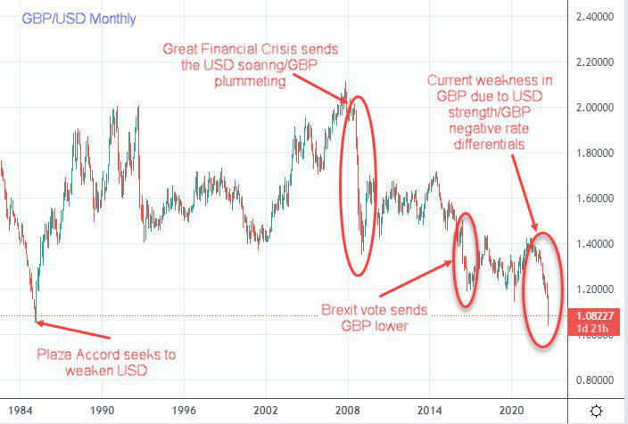

The GBP/USD currency pair, often referred to as 'Cable', is a critical benchmark in the international forex market. This pair signifies the exchange rate between the British pound (GBP) and the U.S. dollar (USD), two of the world's most significant and widely utilized currencies. 'Cable' derives its name from the early transatlantic communications cable that facilitated secure and fast transmission of exchange rate information between London and New York.

Algorithmic trading has revolutionized the forex markets, including GBP/USD trading, by utilizing computer algorithms to conduct trades at extraordinarily high speeds and precisions. The adoption of algorithmic trading has been fueled by its ability to manage vast trading volumes, swiftly analyze complex datasets, and capitalize on fleeting market opportunities. It enables traders to efficiently navigate the highly liquid and sometimes volatile forex landscape, executing trades based on a systematic analysis rather than manual intervention.



This article will address the essential aspects of trading the GBP/USD pair, offering insights into its underlying concepts, economic significance, and the ways algorithmic strategies are implemented within this context. By understanding the historical importance of this currency pair and the transformative role of algorithmic trading, market participants can better navigate and capitalize on the opportunities it provides.

## Table of Contents

## Understanding the GBP/USD Currency Pair

The GBP/USD currency pair, often referred to as "Cable" due to its historical connection to the transatlantic telegraph cable, is among the most actively traded in the foreign exchange markets. This trading pair epitomizes the exchange rate between the British pound sterling and the United States dollar, and its popularity can be attributed to the economic significance of both the United Kingdom and the United States.

### Quotation and Market Dynamics

The GBP/USD pair is quoted as the amount of U.S. dollars (USD) needed to purchase one British pound (GBP). For example, if the GBP/USD is quoted at 1.35, it means 1 GBP is equivalent to 1.35 USD. This pair is typically expressed to four decimal places, with the smallest increment in price movement known as a pip, which is 0.0001 for most major currency pairs.

GBP/USD exhibits high [liquidity](/wiki/liquidity-risk-premium), largely because it operates during the overlapping session between the London and New York markets, when trading [volume](/wiki/volume-trading-strategy) peaks. This liquidity allows for tighter spreads and better pricing for traders. Market dynamics of this pair are influenced by several factors, including economic indicators, central bank policies, and geopolitical events. The interplay between the monetary policies of the Bank of England (BoE) and the Federal Reserve (Fed) plays a crucial role, influencing [interest rate](/wiki/interest-rate-trading-strategies) differentials that directly impact the GBP/USD value.

### Factors Affecting Volatility

Numerous factors contribute to the [volatility](/wiki/volatility-trading-strategies) of the GBP/USD pair. Key economic indicators such as GDP growth rates, employment [statistics](/wiki/bayesian-statistics), and inflation rates serve as barometers for economic health and often dictate investor sentiment. For instance, stronger-than-expected UK GDP data might bolster GBP, hence increasing the GBP/USD rate.

Geopolitical events also have a profound impact on the pair's volatility. Events such as Brexit have historically led to significant fluctuations in the GBP/USD rate, as they foster uncertainty regarding future economic directions and trade relations. Additionally, broad market sentiment and risk appetite can cause shifts in currency values as investors seek safe-haven currencies during periods of economic instability.

To quantify these factors' impact, traders often turn to econometric models to predict currency movements. A simple linear regression model could be used to relate economic indicators to GBP/USD changes: 

$$
\text{GBP/USD Change} = \alpha + \beta_1 \text{(UK GDP)} + \beta_2 \text{(US GDP)} + \epsilon
$$

Here, $\alpha$ is the intercept, $\beta_1$ and $\beta_2$ are coefficients representing the sensitivity of the GBP/USD rate to changes in UK and US GDP figures, and $\epsilon$ is the error term.

### Conclusion

Understanding the intricacies of the GBP/USD currency pair extends beyond recognizing its quotation and liquidity. By analyzing economic indicators, monetary policies, and geopolitical events, traders can gain insights into the factors driving volatility in the GBP/USD market. This understanding aids in developing more informed trading strategies and managing associated risks.

## Historical Context and Key Events

The GBP/USD currency pair has been influenced by numerous historical events, with the Great Recession and Brexit standing out as key moments that have significantly impacted its exchange rate.

The Great Recession, which began in December 2007 and lasted until June 2009, marked a period of severe economic downturn globally, severely affecting financial markets, including the [forex](/wiki/forex-system) market. During this time, the GBP/USD pair experienced high volatility. In late 2008, the British pound plummeted against the U.S. dollar due to the financial crisis's repercussions, driven by increased risk aversion among investors and reduced confidence in the UK's economy. The pair reached a low of approximately 1.35 in January 2009, a level not seen for several decades. This depreciation was primarily caused by the sharp decline in consumer and investor confidence in the UK, as well as the Bank of England's decision to implement aggressive monetary easing, which included reducing interest rates to combat the recession's effects.

Brexit, another pivotal event, refers to the United Kingdom's decision to leave the European Union (EU), which was formally decided through a referendum held on June 23, 2016. The immediate aftermath of this decision was a dramatic drop in the value of the British pound against the U.S. dollar, with the exchange rate falling from around 1.50 before the vote to approximately 1.32 within a day. This drop was driven by market uncertainty regarding the economic implications of the UK leaving the EU, altering trade relations, and affecting investor confidence. Over subsequent years, negotiation periods and political developments surrounding Brexit continued to influence the GBP/USD volatility, causing the pair to fluctuate with every new announcement related to UK's [exit](/wiki/exit-strategy) terms.

These historical events underline the vulnerability of currency pairs like GBP/USD to large-scale economic and political shifts. For traders, understanding the patterns and causes of these fluctuations can provide invaluable insights. Recognizing how past events influenced the GBP/USD exchange rate can help in crafting informed trading strategies, especially during times of economic uncertainty or geopolitical tensions.

In conclusion, the Great Recession and Brexit exemplify how economic crises and significant political decisions can drive substantial and often rapid changes in the forex markets, showing the importance for traders of staying informed and adaptable.

## Algorithmic Trading in Forex Markets

Algorithmic trading, often referred to as algo trading, employs sophisticated computer programs to execute trades in financial markets, including forex markets such as the GBP/USD. These programs operate based on pre-defined rules and strategies, enabling rapid, precise trade execution and optimizing trading efficiency.

One of the primary advantages of [algorithmic trading](/wiki/algorithmic-trading) in the GBP/USD market is its speed. In forex trading, where prices can change within milliseconds, the ability to execute trades instantaneously can be profoundly beneficial. Algorithmic systems can monitor multiple currency pairs, execute orders, and manage portfolios without human intervention, significantly reducing latency and potential errors associated with manual trading.

Backtesting is an essential component of algorithmic trading. It involves running a trading strategy using historical data to assess its viability before applying it in live markets. In the context of GBP/USD, traders can backtest strategies against historical exchange rate data, considering various factors such as economic indicators or significant events like geopolitical tensions. This approach allows traders to refine their strategies by analyzing past performance and adjusting parameters to increase the probability of future success.

Risk management is another critical element of algorithmic trading. Algorithms can incorporate risk management rules that automatically close positions when certain risk thresholds are met, thereby protecting the trading capital. For instance, setting stop-loss and take-profit levels ensures that trades are closed once they reach a specific loss or gain, helping keep emotions out of decision-making and preserving the trader's capital as market conditions fluctuate.

Furthermore, algorithmic trading allows for the implementation of complex, quantitative strategies that may be cumbersome for manual execution. These strategies can incorporate technical indicators, such as moving averages or RSI, and economic factors like interest rate changes or employment reports, which frequently affect the GBP/USD pair. By continuously analyzing these inputs, the algorithms can identify trading opportunities and execute trades that align with the predefined strategies.

In summary, the use of algorithmic trading in forex markets like GBP/USD provides traders a competitive edge by leveraging speed, accuracy, and sophisticated risk management. Through backtested strategies and efficient execution, traders can optimize performance, reduce risk exposure, and potentially achieve better trading outcomes.

## Developing Trading Strategies for GBP/USD

Successful algorithmic trading strategies for the GBP/USD currency pair typically rely on a diverse array of techniques, including technical analysis, economic indicators, and historical data patterns. These strategies aim to optimize trade execution and enhance profit potential by exploiting market trends and anomalies.

**Momentum Trading**

Momentum trading involves capitalizing on the strength of an existing trend. Traders using algorithmic strategies in this context aim to buy currencies exhibiting upward [momentum](/wiki/momentum) and sell those with downward momentum. The underlying assumption is that prices exhibiting strong directional movement will continue to do so in the short term. Algorithms can exploit momentum by quickly processing technical indicators such as the Moving Average Convergence Divergence (MACD) or the Relative Strength Index (RSI). 

For instance, a simple momentum trading strategy might involve checking whether the short-term moving average crosses above the long-term moving average, signaling a buy opportunity. In Python, this can be implemented as follows:

```python
import pandas as pd

def calculate_moving_average(data, window_size):
    return data.rolling(window=window_size).mean()

data['Short_MA'] = calculate_moving_average(data['Close'], short_window)
data['Long_MA'] = calculate_moving_average(data['Close'], long_window)
signals = (data['Short_MA'] > data['Long_MA']).astype(int)
```

**Trend Following**

Trend following strategies focus on joining a trend at its early stage and exiting before it reverses. Unlike momentum trading, [trend following](/wiki/trend-following) does not rely on capturing the movement's early phase but rather on confirming that a trend is established. Indicators like moving averages, Bollinger Bands, and the Average Directional Index (ADX) are commonly used to identify these trends.

An effective trend-following strategy might involve setting up trading rules based on the crossing of moving averages or the breach of critical support and resistance levels. This approach minimizes exposure during trend-less markets and systematically captures strong directional movements.

**Mean Reversion**

Mean reversion strategies assume that the price will revert to its historical average. These strategies are based on the observation that excessive deviations from the mean price are followed by corrections. In the context of GBP/USD trading, mean reversion can involve identifying overbought or oversold conditions using indicators such as the RSI or the Bollinger Bands.

For example, a Bollinger Bands-based mean reversion strategy might generate a buy signal when the price falls below the lower band and a sell signal when the price rises above the upper band. This is predicated on the expectation that the price will revert to the central moving average.

```python
import pandas as pd

def calculate_bollinger_bands(data, window_size):
    sma = data.rolling(window=window_size).mean()
    rstd = data.rolling(window=window_size).std()
    upper_band = sma + 2 * rstd
    lower_band = sma - 2 * rstd
    return upper_band, lower_band

upper_band, lower_band = calculate_bollinger_bands(data['Close'], band_window)
buy_signal = data['Close'] < lower_band
sell_signal = data['Close'] > upper_band
```

Each of these strategies can be adapted to specific market conditions through [backtesting](/wiki/backtesting), which involves running algorithms against historical data to determine their effectiveness and refine their parameters. This ensures that the strategies are resilient to market changes and remain profitable. Additionally, algorithmic traders should continuously monitor the economic indicators relevant to the GBP/USD pair, as these can provide insights into potential market shifts and enhance the robustness of their trading strategies.

## Tools and Resources for Effective Trading

Traders in the GBP/USD market have access to an array of tools and resources that can optimize their trading activities and decision-making processes. These tools are essential for analyzing market conditions, executing trades efficiently, and gaining insights into potential market movements.

### Forex Trading Platforms

Modern forex trading platforms serve as the primary interface between traders and the market, allowing them to access real-time data, execute trades, and analyze market trends. Popular platforms like MetaTrader 4 (MT4) and MetaTrader 5 (MT5) offer comprehensive charting tools, automated trading features, and support for various technical indicators. These platforms also allow for the integration of custom scripts and Expert Advisors (EAs), which are algorithms that automate trading based on pre-set criteria.

### Technical Indicators

Technical indicators are vital for analyzing price patterns and predicting future movements in the GBP/USD pair. Some commonly used indicators include:

- **Moving Averages**: Help identify trend directions by smoothing out price data.
- **Relative Strength Index (RSI)**: Measures the speed and change of price movements, indicating overbought or oversold conditions.
- **Bollinger Bands**: Use standard deviations to indicate volatility and potential reversal points.

### Economic Calendars

Economic calendars provide information on upcoming economic events and releases that can impact currency markets. Events such as interest rate announcements, GDP releases, and employment data significantly influence the GBP/USD exchange rate. Traders use economic calendars to anticipate market volatility and plan their trades accordingly.

### Backtesting Tools

Backtesting allows traders to evaluate their trading strategies against historical data to assess their viability. Tools like Python's `[backtrader](/wiki/backtrader)` library enable traders to simulate trading strategies on historical data, which helps in refining strategies before applying them to live markets. Here's a basic example of a Python script for backtesting a moving average crossover strategy using `backtrader`:

```python
import backtrader as bt

class MovingAverageCrossStrategy(bt.SignalStrategy):
    def __init__(self):
        self.ma_short = bt.indicators.SimpleMovingAverage(self.data.close, period=10)
        self.ma_long = bt.indicators.SimpleMovingAverage(self.data.close, period=50)

    def next(self):
        crossing_up = self.ma_short[0] > self.ma_long[0] and self.ma_short[-1] < self.ma_long[-1]
        crossing_down = self.ma_short[0] < self.ma_long[0] and self.ma_short[-1] > self.ma_long[-1]

        if crossing_up:
            self.buy()
        elif crossing_down:
            self.sell()

cerebro = bt.Cerebro()
cerebro.addstrategy(MovingAverageCrossStrategy)
data = bt.feeds.YahooFinanceData(dataname='GBPUSD=X')
cerebro.adddata(data)
cerebro.run()
cerebro.plot()
```

### Risk Management Tools

Managing risk is crucial in the fast-moving forex market. Tools such as position calculators and stop-loss orders help traders minimize potential losses by determining optimal trade sizes and automatic exit points. Position sizing calculators [factor](/wiki/factor-investing) in the trader's account size, risk tolerance, and market conditions to suggest appropriate trade sizes.

### Sentiment Analysis Tools

Sentiment analysis tools gauge market sentiment by evaluating news articles, social media, and other text-based sources. These tools harness natural language processing (NLP) techniques to provide insights into the prevailing mood of the market, potentially offering early warnings of trend changes.

In conclusion, the effective use of these tools and resources can significantly enhance a trader's ability to operate successfully in the GBP/USD market, allowing for informed decisions and robust trading strategies.

## Challenges and Risk Management

Algorithmic trading in forex markets, particularly involving the GBP/USD currency pair, presents several challenges, predominantly related to market volatility and technical risks. Understanding and managing these challenges is critical for executing successful trading strategies.

### Market Volatility

Forex markets are inherently volatile, characterized by rapid price movements influenced by numerous factors, including economic reports, geopolitical events, and market sentiment. In the context of GBP/USD, volatility can be exacerbated by events such as monetary policy announcements by the Bank of England or the U.S. Federal Reserve, Brexit-related news, or economic data releases like GDP statistics.

Volatility poses significant risks to algorithmic trading, as sudden market movements can trigger stop-loss orders or cause algorithms to execute trades at less than optimal prices, potentially leading to substantial losses. Traders often employ volatility filters in their algorithms to mitigate this risk. These filters can halt trading when volatility exceeds a predefined threshold, thereby avoiding trades in unstable market conditions.

### Technical Risks

Algorithmic trading relies heavily on technology, making it susceptible to technical issues including software bugs, network outages, and latency problems. Such technical failures can result in missed trading opportunities, erroneous trades, or exposure to market risk unintended by the strategy design. 

To address these risks, rigorous testing and validation of trading algorithms are essential. Backtesting, which involves running algorithms on historical data, helps determine how a strategy would have performed in the past. Forward testing, using real-time data in a simulated environment, further refines these strategies before they are deployed in live trading. Implementing robust error-handling and logging mechanisms within the trading software can also aid in quickly identifying and rectifying technical issues.

### Risk Management Practices

Effective risk management is imperative to sustain long-term profitability in forex trading. This involves setting appropriate risk parameters such as stop-loss and take-profit levels. Risk exposure can be controlled by limiting the size of individual trades relative to the account balance, often referred to as position sizing.

Continuous monitoring of trading algorithms is crucial to ensure they operate within expected parameters and adapt to changing market conditions. Automated alerts can be set up to notify traders of significant deviations in trading performance, execution issues, or breaches of risk limits.

Furthermore, periodic review and adjustment of trading strategies ensure they remain effective. This might involve recalibrating algorithms to account for evolving market conditions or revising the underlying assumptions of the trading models. By integrating risk management practices with adaptive strategy development, traders can better safeguard against potential losses while maximizing potential gains.

In conclusion, while algorithmic trading in the GBP/USD market offers numerous advantages, addressing market volatility and technical risks through diligent risk management and adaptive strategies is essential for sustained trading success.

## Conclusion

The GBP/USD currency pair remains a dynamic and lucrative option for traders utilizing algorithmic trading strategies. At its core, algorithmic trading enables the processing of vast amounts of data at remarkable speeds, allowing traders to capitalize on opportunities presented by market fluctuations. These algorithms can analyze a multitude of factors that influence currency movements, such as interest rates, economic data releases, and geopolitical events, making them highly beneficial in navigating the complexities of the GBP/USD market.

To optimize the potential for success, it is essential for traders to maintain a comprehensive understanding of both market trends and the underlying economic indicators that can affect the GBP/USD pair. This involves staying informed about economic policies from both the United Kingdom and the United States, as well as global economic conditions that could impact currency valuations. By keeping abreast of these developments, traders can anticipate potential market shifts and adjust their strategies accordingly.

Employing robust algorithmic trading strategies can significantly enhance trading outcomes. Such strategies often integrate technical analysis, using tools like moving averages or relative strength indices (RSI), alongside historical data to identify patterns or price trends. Furthermore, leveraging backtesting techniques can help traders refine their strategies by simulating their performance under various market conditions.

The usage of advanced trading platforms and analytical tools can further support decision-making processes. These resources provide access to real-time data feeds, customizable indicators, and comprehensive economic calendars, which are crucial for making informed trading decisions. Furthermore, the integration of [machine learning](/wiki/machine-learning) models can enable the development of adaptive strategies that improve over time.

To mitigate risks inherent in forex trading, it is indispensable to implement effective risk management practices. This includes setting stop-loss orders, maintaining a balanced portfolio, and conducting regular performance evaluations of trading algorithms. Continuous monitoring and strategic adjustments ensure that traders can adapt to unforeseen market dynamics, mitigating potential losses while maximizing returns. 

In summation, the GBP/USD currency pair offers considerable opportunities for algorithmic traders who equip themselves with the right knowledge, strategies, and tools. Staying diligently informed about market developments and employing a structured approach can significantly increase the likelihood of success in the ever-evolving forex market.

## References & Further Reading

[1]: Du, Q., & Zhang, Q. (2015). ["Research on Algorithmic Trading and Its Application in Foreign Exchange Market."](https://www.semanticscholar.org/paper/Algorithm-Trading-using-Q-Learning-and-Recurrent-Du-Zhai/8cf62ebb5d973ca0a710241f6484f6255d087176) 2015 12th International Conference on Service Systems and Service Management (ICSSSM).

[2]: Lopez de Prado, M. (2018). ["Advances in Financial Machine Learning."](https://www.amazon.com/Advances-Financial-Machine-Learning-Marcos/dp/1119482089) Wiley.

[3]: Aronson, D. R. (2007). ["Evidence-Based Technical Analysis: Applying the Scientific Method and Statistical Inference to Trading Signals."](https://onlinelibrary.wiley.com/doi/book/10.1002/9781118268315) Wiley.

[4]: Jansen, S. (2020). ["Machine Learning for Algorithmic Trading."](https://github.com/stefan-jansen/machine-learning-for-trading) Packt Publishing.

[5]: Chan, E. P. (2008). ["Quantitative Trading: How to Build Your Own Algorithmic Trading Business."](https://github.com/ftvision/quant_trading_echan_book) Wiley.