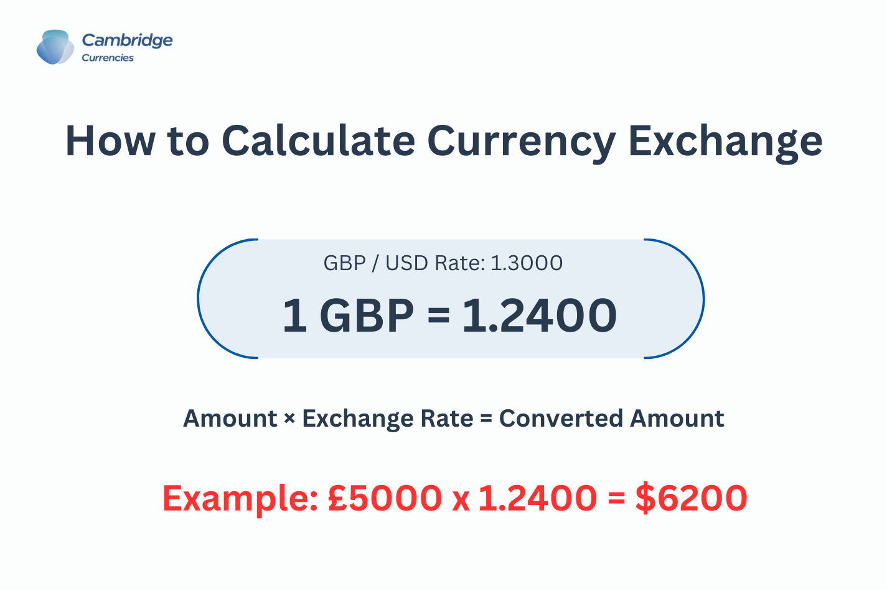

## Table of Contents

## What is the GBP/USD exchange rate?

The GBP/USD exchange rate is the value of one British pound in terms of US dollars. This rate changes every day because of many things like how well the economy is doing, what people think will happen in the future, and what the governments and banks are doing.

Right now, if you want to know the exact rate, you can look it up on a financial news website or use a currency converter online. These tools update the rates all the time, so you can see the most recent number. For example, if the rate is 1.25, it means one British pound is worth 1.25 US dollars.

## How is the GBP/USD exchange rate determined?

The GBP/USD exchange rate is decided by what people think and how they act in the big money markets. When more people want to buy British pounds with US dollars, the value of the pound goes up. This can happen if people think the UK's economy will do well or if they expect the pound to get stronger. On the other hand, if more people want to sell their pounds for dollars, the value of the pound goes down. This might happen if people think the UK's economy is not doing well or if they expect the pound to get weaker.

Many things can change what people think and do. News about the economy, like how many jobs there are or how much things cost, can make people want to buy or sell pounds. Also, what the government and the central bank do can affect the rate. For example, if the Bank of England changes interest rates, it can make the pound more or less attractive to hold. Big events like elections or big deals between countries can also shake things up. All these things together make the GBP/USD rate go up and down every day.

## What factors influence the GBP/USD exchange rate?

The GBP/USD exchange rate is influenced by many things. One big thing is how well the economy is doing in the UK and the US. If the UK's economy is doing better than the US's, more people might want to buy pounds, which makes the pound stronger against the dollar. On the other hand, if the US economy is doing better, more people might want to buy dollars, which makes the pound weaker. Also, news about jobs, prices, and how much companies are making can change what people think and do with their money.

Another thing that affects the exchange rate is what the governments and central banks do. For example, if the Bank of England raises interest rates, it might make the pound more attractive because people can earn more by holding pounds. If the US Federal Reserve does the same, it might make the dollar more attractive. Big events like elections, trade deals, or even big news stories can also make people want to buy or sell pounds and dollars, which changes the exchange rate.

Lastly, what people expect to happen in the future can also move the GBP/USD rate. If people think the pound will get stronger later, they might buy it now, which makes it stronger right away. If they think it will get weaker, they might sell it now, which makes it weaker. All these things together make the exchange rate go up and down every day.

## How can I calculate the GBP/USD exchange rate manually?

To calculate the GBP/USD exchange rate manually, you need to know how much one British pound is worth in US dollars at a specific time. You can find this information from financial news websites or currency converter tools online. Once you have the rate, you can use it to convert pounds to dollars or dollars to pounds. For example, if the rate is 1.25, it means one British pound is worth 1.25 US dollars. To convert pounds to dollars, you multiply the amount of pounds by the exchange rate. So, if you have 100 pounds, you would multiply 100 by 1.25 to get 125 dollars.

To convert dollars to pounds, you do the opposite. You divide the amount of dollars by the exchange rate. Using the same example, if you have 125 dollars and want to know how many pounds that is, you would divide 125 by 1.25 to get 100 pounds. Remember, the exchange rate changes all the time, so you need to use the most recent rate to get an accurate calculation. Also, be aware that banks and currency exchange services might add fees or use slightly different rates, so the amount you actually get might be a bit different from your manual calculation.

## What are the most common methods to convert GBP to USD?

The most common way to convert GBP to USD is by using a bank. You can go to your bank and ask them to change your British pounds into US dollars. They will use the current exchange rate and might charge you a small fee for the service. Another way is to use an ATM in the US with your UK bank card. The ATM will give you US dollars, but it will also use the exchange rate and might add fees from both your bank and the ATM operator.

Another popular method is to use a currency exchange service. These services can be found at airports, tourist areas, or online. They will convert your pounds to dollars using the exchange rate they have at that time, and they might also charge a fee or take a small percentage of the amount you're changing. Some people also use online platforms or apps that let you convert money from one currency to another. These services often have good exchange rates and lower fees, but you need to be careful and choose a trusted service to avoid scams.

## How do economic indicators affect the GBP/USD exchange rate?

Economic indicators are like signs that tell us how well a country's economy is doing. When these signs show that the UK's economy is doing better than the US's, more people might want to buy British pounds. This makes the pound stronger against the dollar. For example, if the UK has more jobs or if things are not getting too expensive, people might think the UK's economy is doing well. This can make the GBP/USD exchange rate go up. On the other hand, if the US has more jobs or if prices are stable, people might want to buy more dollars, which can make the pound weaker against the dollar.

Big economic reports like how much the economy grew, how many people have jobs, and how much things cost can really move the GBP/USD rate. If a report shows the UK's economy grew a lot, people might think the pound will get stronger and buy more of it. But if a report shows the US economy is doing better, people might sell their pounds to buy dollars, making the pound weaker. These reports come out regularly, and traders watch them closely to decide when to buy or sell pounds and dollars.

## What role do central banks play in the GBP/USD exchange rate?

Central banks, like the Bank of England and the US Federal Reserve, have a big say in the GBP/USD exchange rate. They do this by changing interest rates. If the Bank of England raises interest rates, it can make the pound more attractive because people can earn more by holding pounds. This might make more people want to buy pounds, which can make the pound stronger against the dollar. On the other hand, if the US Federal Reserve raises interest rates, it can make the dollar more attractive, which might make people sell their pounds to buy dollars, making the pound weaker.

Central banks also use other tools to affect the exchange rate. They can buy or sell their own currency in the market to change its value. For example, if the Bank of England wants to make the pound weaker, it might sell pounds and buy dollars. This can make the pound less valuable. They might do this if they think the pound is too strong and it's hurting the UK's economy. All these actions by central banks can make the GBP/USD rate go up or down, depending on what they're trying to do.

## How does geopolitical news impact the GBP/USD exchange rate?

Geopolitical news can shake up the GBP/USD exchange rate a lot. If there's big news about the UK, like a new election or a big deal with another country, it can make people think the pound will get stronger or weaker. For example, if the UK makes a good trade deal, people might want to buy more pounds because they think the UK's economy will do well. But if there's bad news, like a big argument with another country, people might sell their pounds because they're worried about the UK's future.

The same goes for news about the US. If there's good news, like a new law that helps the economy, people might want to buy more dollars, which can make the pound weaker. If there's bad news, like a big problem with another country, people might sell their dollars, which can make the pound stronger. All these things can make the GBP/USD rate go up and down a lot, depending on what the news is and how it makes people feel about the future.

## What technical analysis tools are used to predict GBP/USD movements?

Technical analysis tools help people guess where the GBP/USD exchange rate might go next. One common tool is the moving average, which shows the average price of the GBP/USD over a certain time. If the current price is above the moving average, it might mean the pound is getting stronger. If it's below, it might mean the pound is getting weaker. Another tool is the Relative Strength Index (RSI), which tells if the GBP/USD is being bought or sold too much. If the RSI is over 70, it might mean the pound is too strong and could get weaker soon. If it's under 30, it might mean the pound is too weak and could get stronger.

People also use chart patterns to predict GBP/USD movements. For example, a "head and shoulders" pattern can show that the pound might start to get weaker after being strong. A "double bottom" pattern might show that the pound could start to get stronger after being weak. These patterns help traders see what might happen next. Another tool is the Fibonacci retracement, which helps find levels where the GBP/USD might stop moving and start going the other way. By drawing lines on the chart, traders can see where the price might change direction. All these tools together help traders make better guesses about where the GBP/USD rate might go.

## How can traders use leverage in GBP/USD trading?

Traders can use leverage in GBP/USD trading to control a big amount of money with just a little bit of their own money. Leverage is like borrowing money from the broker to trade more than you have. For example, if the leverage is 50:1, you can control $50,000 worth of GBP/USD with just $1,000 of your own money. This can make your profits bigger if the GBP/USD rate moves the way you want. But it can also make your losses bigger if the rate moves against you. So, using leverage can be risky, but it can also help you make more money if you're right about where the rate is going.

When using leverage, traders need to be careful and know what they're doing. It's important to understand how much money you could lose and to have a plan for if things go wrong. Some brokers might let you use a lot of leverage, but that doesn't mean you should. It's better to start with less leverage until you get used to how the GBP/USD moves. Also, always use stop-loss orders to limit how much you can lose on a trade. That way, if the rate goes against you, the trade will close automatically and you won't lose more than you can handle.

## What are the risks associated with GBP/USD trading?

Trading GBP/USD can be risky because the exchange rate can change a lot. If you buy pounds hoping they will get stronger against the dollar, but they get weaker instead, you could lose money. This is called market risk. Also, using leverage can make these risks even bigger. Leverage lets you trade more money than you have, but if the rate moves against you, you could lose more than you started with. So, it's important to know how much you could lose and to have a plan for if things go wrong.

Another risk is called liquidity risk. Sometimes, it can be hard to buy or sell GBP/USD quickly because not enough people are trading. This can make it hard to get out of a trade when you want to. There's also something called counterparty risk, which means the person or company you're trading with might not be able to pay you if you win. To lower these risks, it's a good idea to use stop-loss orders to limit your losses and to trade with a trusted broker.

## How do algorithmic trading strategies affect the GBP/USD exchange rate?

Algorithmic trading strategies can change the GBP/USD exchange rate a lot. These strategies use computers to buy and sell pounds and dollars based on certain rules. If a lot of these computers start buying pounds because their rules say the pound will get stronger, it can make the pound stronger against the dollar. On the other hand, if a lot of them start selling pounds because their rules say the pound will get weaker, it can make the pound weaker. These quick computer trades can make the exchange rate move up and down very fast.

But algorithmic trading can also make the GBP/USD rate more stable. Some algorithms are made to keep the rate from moving too much. They do this by buying or selling pounds and dollars to balance out big changes. This can help keep the rate steady, which is good for people who don't like a lot of ups and downs. So, while algorithmic trading can make the rate move a lot, it can also help keep things calm if that's what the algorithms are trying to do.

## What is the understanding of the GBP/USD currency pair?

The GBP/USD currency pair, often referred to as "Cable" due to its historical connection to the transatlantic telegraph cable, is among the most actively traded in the foreign exchange markets. This trading pair epitomizes the exchange rate between the British pound sterling and the United States dollar, and its popularity can be attributed to the economic significance of both the United Kingdom and the United States.

### Quotation and Market Dynamics

The GBP/USD pair is quoted as the amount of U.S. dollars (USD) needed to purchase one British pound (GBP). For example, if the GBP/USD is quoted at 1.35, it means 1 GBP is equivalent to 1.35 USD. This pair is typically expressed to four decimal places, with the smallest increment in price movement known as a pip, which is 0.0001 for most major currency pairs.

GBP/USD exhibits high [liquidity](/wiki/liquidity-risk-premium), largely because it operates during the overlapping session between the London and New York markets, when trading [volume](/wiki/volume-trading-strategy) peaks. This liquidity allows for tighter spreads and better pricing for traders. Market dynamics of this pair are influenced by several factors, including economic indicators, central bank policies, and geopolitical events. The interplay between the monetary policies of the Bank of England (BoE) and the Federal Reserve (Fed) plays a crucial role, influencing [interest rate](/wiki/interest-rate-trading-strategies) differentials that directly impact the GBP/USD value.

### Factors Affecting Volatility

Numerous factors contribute to the [volatility](/wiki/volatility-trading-strategies) of the GBP/USD pair. Key economic indicators such as GDP growth rates, employment [statistics](/wiki/bayesian-statistics), and inflation rates serve as barometers for economic health and often dictate investor sentiment. For instance, stronger-than-expected UK GDP data might bolster GBP, hence increasing the GBP/USD rate.

Geopolitical events also have a profound impact on the pair's volatility. Events such as Brexit have historically led to significant fluctuations in the GBP/USD rate, as they foster uncertainty regarding future economic directions and trade relations. Additionally, broad market sentiment and risk appetite can cause shifts in currency values as investors seek safe-haven currencies during periods of economic instability.

To quantify these factors' impact, traders often turn to econometric models to predict currency movements. A simple linear regression model could be used to relate economic indicators to GBP/USD changes: 

$$
\text{GBP/USD Change} = \alpha + \beta_1 \text{(UK GDP)} + \beta_2 \text{(US GDP)} + \epsilon
$$

Here, $\alpha$ is the intercept, $\beta_1$ and $\beta_2$ are coefficients representing the sensitivity of the GBP/USD rate to changes in UK and US GDP figures, and $\epsilon$ is the error term.

### Conclusion

Understanding the intricacies of the GBP/USD currency pair extends beyond recognizing its quotation and liquidity. By analyzing economic indicators, monetary policies, and geopolitical events, traders can gain insights into the factors driving volatility in the GBP/USD market. This understanding aids in developing more informed trading strategies and managing associated risks.

## References & Further Reading

[1]: Du, Q., & Zhang, Q. (2015). ["Research on Algorithmic Trading and Its Application in Foreign Exchange Market."](https://www.semanticscholar.org/paper/Algorithm-Trading-using-Q-Learning-and-Recurrent-Du-Zhai/8cf62ebb5d973ca0a710241f6484f6255d087176) 2015 12th International Conference on Service Systems and Service Management (ICSSSM).

[2]: Lopez de Prado, M. (2018). ["Advances in Financial Machine Learning."](https://www.amazon.com/Advances-Financial-Machine-Learning-Marcos/dp/1119482089) Wiley.

[3]: Aronson, D. R. (2007). ["Evidence-Based Technical Analysis: Applying the Scientific Method and Statistical Inference to Trading Signals."](https://onlinelibrary.wiley.com/doi/book/10.1002/9781118268315) Wiley.

[4]: Jansen, S. (2020). ["Machine Learning for Algorithmic Trading."](https://github.com/stefan-jansen/machine-learning-for-trading) Packt Publishing.

[5]: Chan, E. P. (2008). ["Quantitative Trading: How to Build Your Own Algorithmic Trading Business."](https://github.com/ftvision/quant_trading_echan_book) Wiley.