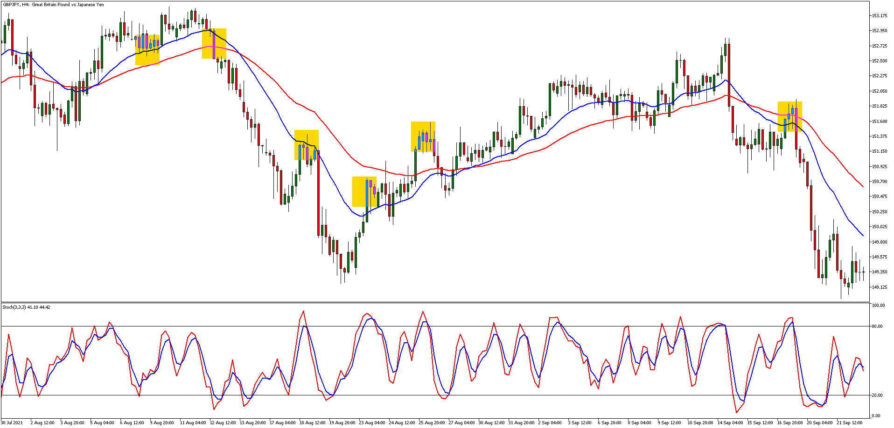

## Table of Contents

## What is GBP/JPY and why is it important in forex trading?

GBP/JPY is a currency pair in forex trading that represents the exchange rate between the British pound (GBP) and the Japanese yen (JPY). It shows how many yen you can get for one pound. This pair is popular because it combines two major economies: the UK and Japan. The British pound is known for being a strong currency, while the Japanese yen is often seen as a safe haven, meaning people invest in it when they are worried about the economy.

This currency pair is important in forex trading for a few reasons. First, it can be very volatile, which means the exchange rate can change a lot in a short time. This volatility can create opportunities for traders to make money, but it also comes with more risk. Second, GBP/JPY is often used as an indicator of how investors feel about risk. When traders are feeling confident, they might buy more pounds and sell yen, pushing the GBP/JPY rate up. When they are worried, they might sell pounds and buy yen, pushing the rate down. So, watching GBP/JPY can give traders clues about the overall mood in the market.

## What are the basic factors that influence the GBP/JPY currency pair?

The GBP/JPY currency pair is influenced by many things. One big factor is the interest rates set by the Bank of England and the Bank of Japan. If the Bank of England raises interest rates, it can make the pound stronger because people want to invest in the UK to get higher returns. On the other hand, if the Bank of Japan keeps interest rates very low, it can make the yen weaker because people are less interested in investing in Japan. Another factor is the economic health of the UK and Japan. If the UK's economy is doing well, with more jobs and more people spending money, the pound can get stronger. If Japan's economy is not doing so well, the yen can get weaker.

Another thing that affects GBP/JPY is what is happening in the world. If there is a lot of uncertainty, like a big political event or a natural disaster, investors might move their money to the yen because it is seen as a safe place to keep money. This can make the yen stronger and the pound weaker. Also, the price of oil can play a role. The UK is a big oil producer, so if oil prices go up, it can help the pound get stronger. Japan, however, imports a lot of oil, so higher oil prices can make the yen weaker. All these factors together can make the GBP/JPY rate go up and down.

## How do economic indicators affect GBP/JPY trading?

Economic indicators are important numbers that tell us about the health of an economy. When these numbers come out, they can move the GBP/JPY rate a lot. For example, if the UK's unemployment rate goes down, it means more people have jobs and are likely spending more money. This can make the pound stronger because a strong economy can attract more investors. On the other hand, if Japan's GDP growth is lower than expected, it can make the yen weaker because it shows the economy is not doing so well. Traders watch these indicators closely because they can give clues about where the GBP/JPY rate might go next.

Another important economic indicator is inflation. If inflation in the UK is high, it can make the Bank of England raise interest rates to slow it down. Higher interest rates can make the pound stronger because investors want to put their money where they can get a better return. In Japan, if inflation is very low or even negative, the Bank of Japan might keep interest rates low or even negative to try to boost spending. This can make the yen weaker. So, when traders see these inflation numbers, they can guess how the central banks might act, and that can affect the GBP/JPY rate.

## What are the common trading strategies used for GBP/JPY?

One common strategy for trading GBP/JPY is called [trend following](/wiki/trend-following). This means traders look at the GBP/JPY chart to see if the price is going up or down over time. If the price is going up, traders might buy GBP/JPY, hoping to sell it later at a higher price. If the price is going down, traders might sell GBP/JPY, hoping to buy it back later at a lower price. Trend followers use tools like moving averages to help them see the trend more clearly. They try to ride the trend as long as it lasts, but they also need to be careful because trends can change suddenly.

Another strategy is called range trading. This is used when the GBP/JPY price is moving up and down between two levels but not going much beyond them. Traders who use this strategy might buy GBP/JPY when the price is near the bottom of the range and sell it when the price is near the top. They hope to make small profits from these movements. Range traders use tools like support and resistance lines to help them find where the price might turn around. This strategy can be good when the market is calm, but it can be risky if the price suddenly breaks out of the range.

A third strategy is called [carry](/wiki/carry-trading) trading. This one is popular with GBP/JPY because of the difference in interest rates between the UK and Japan. Traders who use this strategy borrow yen, which has a low [interest rate](/wiki/interest-rate-trading-strategies), and use that money to buy pounds, which have a higher interest rate. They earn the difference in interest rates, which can be a good profit if the GBP/JPY rate stays stable or goes up. But, carry trading can be risky if the GBP/JPY rate suddenly drops a lot, because traders could lose more than they earn in interest.

## How can a beginner start trading GBP/JPY effectively?

To start trading GBP/JPY effectively, a beginner should first learn the basics of [forex](/wiki/forex-system) trading. This means understanding how currency pairs work, what affects their prices, and how to use trading platforms. It's a good idea to open a demo account with a forex broker. A demo account lets you practice trading with fake money, so you can get used to how the market moves without risking real money. While practicing, try to learn about different trading strategies, like trend following, range trading, and carry trading. Each strategy has its own way of making money, so find one that fits your style and risk level.

Once you feel comfortable with the demo account, you can start trading with real money, but start small. It's important to only use money you can afford to lose because trading can be risky. Set clear goals for what you want to achieve and make a plan for managing your money. This means deciding how much you will risk on each trade and sticking to that plan. Keep learning by reading about the UK and Japan's economies, watching economic indicators, and staying updated on news that might affect GBP/JPY. As you gain more experience, you can adjust your strategies and increase your trading size, but always keep learning and stay disciplined.

## What are the key technical analysis tools for GBP/JPY trading?

When trading GBP/JPY, one of the most important technical analysis tools is the moving average. This tool helps traders see the trend of the currency pair over time. There are different types of moving averages, like the simple moving average and the exponential moving average. Traders often use two moving averages, one short-term and one long-term, to find out if the GBP/JPY is trending up or down. If the short-term average crosses above the long-term average, it might be a good time to buy. If it crosses below, it might be a good time to sell. Moving averages make it easier to see where the price might be going next.

Another key tool is the Relative Strength Index (RSI). The RSI helps traders know if GBP/JPY is overbought or oversold. If the RSI is above 70, it means the currency pair might be too high and could go down soon. If it's below 30, it means the pair might be too low and could go up. Traders use this information to decide when to enter or [exit](/wiki/exit-strategy) trades. The RSI can also show if the trend is getting weaker or stronger, which can help traders make better decisions. Both moving averages and RSI are simple but powerful tools that can help beginners understand and trade GBP/JPY more effectively.

## How does the interest rate differential impact GBP/JPY trading?

The interest rate differential is the difference between the interest rates set by the Bank of England and the Bank of Japan. This difference is very important for GBP/JPY trading because it can affect how much money traders can make or lose. If the Bank of England has a higher interest rate than the Bank of Japan, traders can borrow yen at a low rate and use that money to buy pounds, which earn more interest. This strategy is called carry trading. If the GBP/JPY rate stays stable or goes up, traders can make money from both the interest rate difference and the rise in the exchange rate.

However, the interest rate differential can also make trading riskier. If the GBP/JPY rate suddenly drops a lot, traders who borrowed yen to buy pounds could lose more money than they earn in interest. This is why traders need to watch the interest rates and economic news closely. Changes in interest rates can cause big moves in the GBP/JPY rate. For example, if the Bank of England raises its rates, it can make the pound stronger, pushing up the GBP/JPY rate. If the Bank of Japan keeps its rates low or even negative, it can make the yen weaker, also pushing up the GBP/JPY rate. So, understanding the interest rate differential is key to trading GBP/JPY effectively.

## What are the risks associated with trading GBP/JPY and how can they be managed?

Trading GBP/JPY can be risky because the currency pair can move a lot in a short time. This is called [volatility](/wiki/volatility-trading-strategies), and it means that the price can go up or down quickly. This can be good if you make the right guess and the price moves in your favor, but it can also be bad if the price moves against you. Another risk is that big events, like changes in interest rates or important economic news, can make the GBP/JPY rate change a lot. If you are not ready for these changes, you could lose money. Also, using too much borrowed money, or leverage, can make your losses bigger if the trade goes wrong.

To manage these risks, it's important to have a plan. Start by only using money you can afford to lose. This means if you lose it, you won't be in big trouble. Next, use stop-loss orders to limit how much you can lose on each trade. A stop-loss order tells your broker to sell your GBP/JPY if the price goes down to a certain level, so you don't lose too much. Also, don't use too much leverage. It can make your gains bigger, but it can also make your losses bigger. Keep learning about the market and the news that can affect GBP/JPY, so you can make better guesses about where the price might go. By being careful and having a good plan, you can trade GBP/JPY more safely.

## How do geopolitical events influence GBP/JPY movements?

Geopolitical events can have a big impact on GBP/JPY movements because they can change how people feel about the UK and Japan's economies. If there is a big event like a war or a political crisis in the UK, people might think the UK's economy will get weaker. This can make them sell pounds and buy yen, which is seen as a safe place to keep money. When more people want to buy yen, the GBP/JPY rate can go down. On the other hand, if Japan has a big geopolitical event, like a natural disaster or a conflict with another country, people might think Japan's economy will get weaker. This can make them sell yen and buy pounds, pushing the GBP/JPY rate up.

Traders watch geopolitical events closely because they can cause big and sudden changes in the GBP/JPY rate. For example, if there is a big political change in the UK, like a new government or a big election, it can make the pound move a lot. If people think the new government will be good for the economy, the pound might get stronger. If they think it will be bad, the pound might get weaker. The same goes for Japan. Big events like trade agreements or conflicts with other countries can make the yen move a lot. So, understanding what is happening in the world can help traders guess where GBP/JPY might go next.

## What advanced strategies can be used to maximize profits in GBP/JPY trading?

One advanced strategy for trading GBP/JPY is called [breakout](/wiki/breakout-trading) trading. This strategy works well because GBP/JPY can be very volatile. Traders look for times when the price is moving in a tight range and then breaks out of that range. If the price breaks above the top of the range, traders might buy GBP/JPY, hoping the price will keep going up. If the price breaks below the bottom of the range, traders might sell GBP/JPY, hoping the price will keep going down. To make this strategy work better, traders can use tools like Bollinger Bands to see when the price might break out. They also need to be careful because sometimes the price can break out and then quickly move back into the range, which can lead to losses.

Another advanced strategy is called [scalping](/wiki/gamma-scalping). This is a fast-paced way of trading where you try to make small profits from tiny changes in the GBP/JPY rate. Scalpers might make many trades in a day, holding each trade for just a few minutes or even seconds. They use tools like the 1-minute or 5-minute chart to see these small price movements. Scalping can be good for GBP/JPY because the pair can move a lot in a short time. But it's also risky because you need to be very quick and good at watching the market. To manage the risks, scalpers often use tight stop-loss orders to limit their losses if the price moves against them.

A third strategy is called hedging. This is a way to protect your trades from big losses. For example, if you think GBP/JPY will go up, you might buy the pair. But to protect yourself in case the price goes down, you could also sell a related currency pair, like GBP/USD. If GBP/JPY goes down, your loss on that trade might be offset by a gain on the GBP/USD trade. Hedging can be complex, but it can help you manage the risks of trading GBP/JPY, especially when there are big economic or geopolitical events that can move the market a lot.

## How can algorithmic trading be applied to GBP/JPY?

Algorithmic trading can be used to trade GBP/JPY by using computer programs to make trading decisions. These programs, or algorithms, can look at a lot of data very quickly and find patterns that might be hard for a person to see. For example, an algorithm might use technical indicators like moving averages and RSI to decide when to buy or sell GBP/JPY. It can also look at economic news and events to guess where the price might go next. This can be really helpful because GBP/JPY can move a lot and fast, so having a computer watch the market all the time can help you make better trades.

One way to use [algorithmic trading](/wiki/algorithmic-trading) for GBP/JPY is with a strategy called high-frequency trading. This means the algorithm makes a lot of trades very quickly, trying to make small profits from tiny changes in the price. Because GBP/JPY can be very volatile, this strategy can work well. The algorithm can also use something called [backtesting](/wiki/backtesting) to see how well it would have done in the past. This helps traders make the algorithm better before using it with real money. By using algorithmic trading, traders can take advantage of the fast movements in GBP/JPY and manage the risks better.

## What are the long-term trends and forecasts for GBP/JPY?

Over the long term, GBP/JPY has shown some clear trends. One big trend is that the pair can move a lot over time. For example, it was around 130 in 2010, went up to almost 190 in 2015, and then came back down to around 130 by 2020. These big moves are often because of changes in the UK and Japan's economies and interest rates. If the UK's economy is doing well and interest rates are high, the pound can get stronger against the yen. If Japan's economy is not doing so well and interest rates are low, the yen can get weaker. So, watching the long-term health of both economies can give clues about where GBP/JPY might go next.

Looking into the future, many experts think that GBP/JPY will keep being a volatile pair. This means it will keep moving a lot, which can be good for traders who like to take risks. Some forecasts say that if the UK's economy keeps getting better and interest rates go up, the pound could get stronger against the yen. On the other hand, if Japan's economy stays weak and interest rates stay low, the yen might stay weak too. But, big events like changes in government or big economic news can change these forecasts. So, traders need to keep watching the news and be ready for surprises.

## References & Further Reading

[1]: Bergstra, J., Bardenet, R., Bengio, Y., & Kégl, B. (2011). ["Algorithms for Hyper-Parameter Optimization."](https://papers.nips.cc/paper/4443-algorithms-for-hyper-parameter-optimization) Advances in Neural Information Processing Systems 24.

[2]: ["Advances in Financial Machine Learning"](https://www.amazon.com/Advances-Financial-Machine-Learning-Marcos/dp/1119482089) by Marcos Lopez de Prado

[3]: ["Evidence-Based Technical Analysis: Applying the Scientific Method and Statistical Inference to Trading Signals"](https://www.amazon.com/Evidence-Based-Technical-Analysis-Scientific-Statistical/dp/0470008741) by David Aronson

[4]: ["Machine Learning for Algorithmic Trading"](https://github.com/stefan-jansen/machine-learning-for-trading) by Stefan Jansen

[5]: ["Quantitative Trading: How to Build Your Own Algorithmic Trading Business"](https://books.google.com/books/about/Quantitative_Trading.html?id=j70yEAAAQBAJ) by Ernest P. Chan