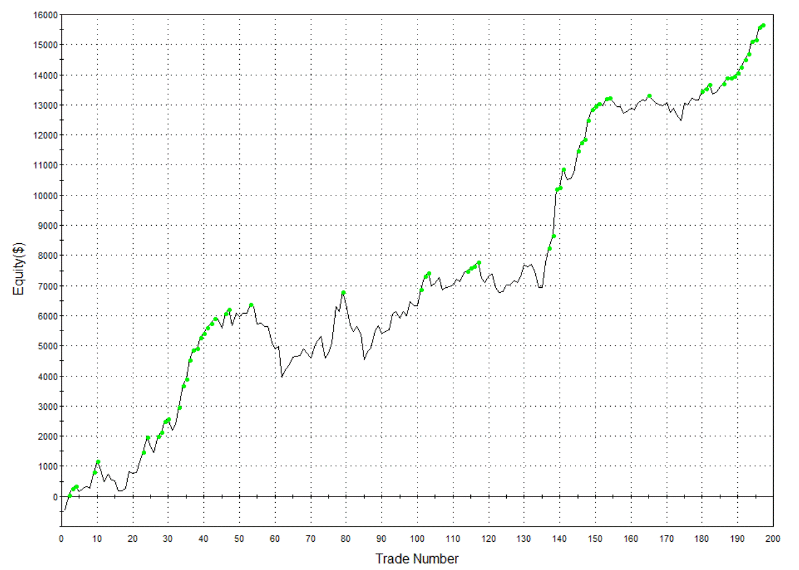

In forex trading, the GBP/JPY currency pair garners attention due to its distinct characteristics and the opportunities it presents to traders. This article investigates the correlation between GBP/JPY and its importance in the context of algorithmic trading strategies. Understanding correlations within forex trading is essential for managing risk and designing more efficient strategies, particularly in automated or algorithmic trading where these correlations can be exploited to anticipate market movements. We'll analyze the nature of GBP/JPY, identify its typical patterns, and examine how its correlation with other pairs like USD/JPY can influence trading decisions.

The goal is to provide comprehensive insights into utilizing GBP/JPY correlations to develop algorithmic trading strategies, ultimately enhancing trading outcomes for improved profitability. Whether you are an experienced trader or new to forex, acquiring knowledge of GBP/JPY dynamics is vital for successful trading operations. By exploring these dynamics, traders can better align their strategies with market realities, optimizing their approach to trading and potentially increasing their returns.



## Table of Contents

## Understanding GBP/JPY and Its Significance

GBP/JPY, the forex pair representing the exchange rate between the British Pound (GBP) and the Japanese Yen (JPY), holds a unique place in the forex market due to its distinctive volatility features. Despite being classified as a minor currency pair, GBP/JPY is frequently termed "The Beast" because of its historically large and unpredictable price swings. These characteristics can present significant profit-making opportunities for traders who have developed strategies capable of effectively leveraging such volatility.

The pair’s volatility is fueled by various economic factors, including the economic strength of the UK and Japan. Given Japan's position as one of the world's largest economies, the exchange rate serves as an indicator of global economic health and investor sentiment. The GBP/JPY exchange rate is sensitive to economic announcements, political events, and shifts in monetary policies in both countries. These sensitivities make trading in GBP/JPY both challenging and potentially rewarding.

For traders engaged in high-frequency and algorithmic trading, GBP/JPY is particularly attractive. The pair’s tendency for rapid movements enables algorithmic trading systems to capitalize on short-term price changes. Sophisticated trading strategies can be developed to exploit its behavioral patterns, thereby enabling traders to achieve higher levels of precision in trade execution. The allure of GBP/JPY lies in its capacity to yield substantial returns for those who understand its dynamics and can manage the inherent risks.

In summary, GBP/JPY stands out in the forex market not just for its volatility and profit potential, but also for its role as a gauge of economic sentiment between major global economic players. This makes it a center of attention for traders seeking to optimize their strategies through high-frequency and algorithmic trading.

## Correlation between GBP/JPY and Other Currency Pairs

In [forex](/wiki/forex-system) trading, correlation serves as a quantitative measure of how two currency pairs move in relation to one another. Understanding these correlations is vital for traders seeking to optimize their strategies and minimize risks. Specifically, for the GBP/JPY currency pair, examining its correlation with other pairs, such as USD/JPY, is crucial for formulating effective trading strategies.

A positive correlation between two currency pairs implies that they tend to move in the same direction. Conversely, a negative correlation indicates that the pairs move in opposite directions. For example, GBP/JPY and USD/JPY often display periods of high positive correlation, sometimes exceeding 90%. This significant correlation means that movements in USD/JPY can heavily influence GBP/JPY's fluctuations, providing traders with predictive insights.

To illustrate, consider a scenario where USD/JPY is experiencing a strong upward trend due to favorable economic data from the United States. A trader observing a high positive correlation between USD/JPY and GBP/JPY may anticipate a similar upward movement in GBP/JPY, thereby making informed trading decisions. This understanding aids in managing dual positions effectively, reducing the risk of overexposure when high correlations are detected.

Traders can leverage these correlations by incorporating the following Python code to calculate the correlation coefficient between two currency pairs:

```python
import pandas as pd
import numpy as np

# Sample data for currency pair prices
gbp_jpy_prices = pd.Series([150.85, 151.60, 152.00, 151.30, 150.50])
usd_jpy_prices = pd.Series([110.10, 110.75, 111.00, 110.25, 109.85])

# Calculate correlation coefficient
correlation_coefficient = gbp_jpy_prices.corr(usd_jpy_prices)
print(f"Correlation Coefficient: {correlation_coefficient:.2f}")
```

This code snippet demonstrates how to use historical price data to calculate the correlation coefficient, providing a numeric measure of the statistical relationship between GBP/JPY and USD/JPY.

By critically analyzing and applying correlation data, forex traders can enhance their understanding of market dynamics, allowing for better prediction of price movements and improved management of trading portfolios.

## Algorithmic Trading Strategies Leveraging GBP/JPY Correlation

Algorithmic trading strategies can greatly benefit from understanding GBP/JPY correlations, utilizing predefined rules and statistical models. Correlation analysis, which measures the degree to which currency pairs like GBP/JPY and others move relative to each other, is key to enhancing both predictive accuracy and risk management in trading algorithms. A correlation coefficient, ranging from -1 to 1, indicates the strength and direction of this relationship, with 1 implying a perfect positive correlation, -1 a perfect negative correlation, and 0 no correlation.

Incorporating such analysis enables traders to strategically optimize entry and [exit](/wiki/exit-strategy) points, as well as improve hedging operations. For instance, if GBP/JPY strongly positively correlates with USD/JPY, one might predict the duo's unified upward or downward movement, allowing for synchronized trading actions across pairs. Conversely, a negative correlation might be used to hedge positions against adverse moves, reducing overall risk exposure.

Furthermore, integrating [machine learning](/wiki/machine-learning) models can augment these algorithmic strategies by dynamically tracking and analyzing correlation patterns. Such models can adapt trading decisions based on evolving market data, thus enhancing the algorithmic response to shifting conditions. Using Python, a simple machine learning pipeline might involve data collection, feature extraction (correlation metrics), model training (e.g., using neural networks), and real-time prediction deployment.

For example, consider a Python-based framework using the Pandas library for handling forex data and Scikit-learn for building predictive models:

```python
import pandas as pd
from sklearn.model_selection import train_test_split
from sklearn.linear_model import LinearRegression

# Load historical currency pair data
data = pd.read_csv('forex_data.csv')

# Calculate rolling correlation between GBP/JPY and USD/JPY over a 30-day window
data['correlation'] = data['GBP/JPY'].rolling(window=30).corr(data['USD/JPY'])

# Define features and target
X = data[['correlation']]
y = data['GBP/JPY'].shift(-1)

# Split into training and testing sets
X_train, X_test, y_train, y_test = train_test_split(X, y, test_size=0.2, random_state=42)

# Train a linear regression model
model = LinearRegression()
model.fit(X_train, y_train)

# Predict future values
predictions = model.predict(X_test)
```

These predictive strategies, leveraging correlation insights, enable traders to better navigate market dynamics, thereby improving trading outcomes and profitability in the [algorithmic trading](/wiki/algorithmic-trading) landscape.

## Challenges in Trading GBP/JPY Correlations

Trading GBP/JPY correlations offers distinct opportunities but also comes with challenges, particularly under volatile market conditions. Correlations between currency pairs are inherently dynamic; they shift due to global economic news, geopolitical events, and changes in market sentiment. This variability poses a challenge for traders who rely on historical correlation data, as it may not always accurately predict future movements.

Algorithmic models must be designed to dynamically adapt to these shifts. To achieve this, traders should incorporate advanced data analysis capabilities that utilize real-time data integration. This can be implemented through sophisticated systems that can quickly process vast amounts of data and recalibrate models in response to new market information. For instance, Python libraries such as NumPy and pandas can be employed to handle and analyze large datasets efficiently. Machine learning models can also be integrated to identify patterns and predict changes in correlations.

The complexity of managing and analyzing multiple currency correlations concurrently further adds to these challenges. This requires robust computational resources and sophisticated algorithmic designs. For instance, a multi-threaded environment can be used to run simultaneous analyses on different currency pairs, ensuring that data processing is done efficiently. Moreover, implementing a distributed computing framework can enhance the speed and scalability of correlation analyses.

Advanced statistical techniques, such as time-series analysis and multivariate regression models, are beneficial for capturing the nuances of these correlations. Traders must also consider the lag effects and cross-currency interdependencies that can influence GBP/JPY movements. By using real-time streaming data and complex event processing systems, traders can better anticipate shifts in correlations and adjust their strategies accordingly.

Ultimately, the successful management of GBP/JPY correlations in trading hinges on the ability to rapidly process and respond to a complex and ever-changing data landscape. This demands an integration of state-of-the-art computational technologies and in-depth market analysis to navigate the multifaceted world of forex trading effectively.

## Best Practices for Effective Algo Trading Involving GBP/JPY

Developing effective algorithmic trading strategies for the GBP/JPY currency pair necessitates meticulous [backtesting](/wiki/backtesting) to validate their reliability and performance. Backtesting involves simulating a strategy on historical data to evaluate its effectiveness before applying it to live markets. This step is crucial to identify potential pitfalls and refine the strategy to better respond to volatile market conditions.

Consistent monitoring of market conditions is vital as GBP/JPY correlations with other pairs, like USD/JPY, can fluctuate. Traders should adjust their strategies in response to these correlation changes to maintain alignment with current market dynamics. For instance, employing rolling correlation analysis can be beneficial. This approach involves calculating correlations over a rolling window of time to capture shifts in correlations. In Python, this can be implemented using the `pandas` library as follows:

```python
import pandas as pd

# Assuming 'gbpjpy_data' and 'usdjpy_data' are Series of historical closing prices
correlation_window = 30  # 30 days rolling window
rolling_correlation = gbpjpy_data.rolling(window=correlation_window).corr(usdjpy_data)
```

Deploying risk management tools such as stop-loss orders and leverage controls is crucial, especially during high [volatility](/wiki/volatility-trading-strategies) phases. Stop-loss orders automatically close a position when the market moves against it by a predetermined amount, thus limiting potential losses. Leverage control helps in managing the risk associated with the high volatility characterizing GBP/JPY.

Staying informed about global economic events and policy changes in both the UK and Japan is essential as these can significantly impact GBP/JPY movements and correlations. Economic indicators, such as [interest rate](/wiki/interest-rate-trading-strategies) announcements or economic growth data from these countries, should be closely monitored. Implementing event-driven strategies that adjust positions based on anticipated economic reports can enhance a trading strategy's adaptability.

In summary, a rigorous approach involving comprehensive backtesting, adaptive correlation analysis, robust risk management, and an informed trading practice ensures the development of effective algo trading strategies for GBP/JPY. This holistic method caters to the dynamic forex landscape, allowing traders to optimize their trading outcomes effectively.

## Conclusion

Understanding and leveraging the correlation between GBP/JPY and other currency pairs in algorithmic trading can significantly enhance a trader's predictive accuracy and trading efficiency. With their inherent volatility and unique movement dynamics, currency pairs like GBP/JPY offer opportunities for higher returns. However, capitalizing on these opportunities necessitates the implementation of prudent risk management measures and adaptive strategies to address the evolving nature of correlations.

As technology continues to advance, traders can increasingly rely on sophisticated tools to integrate correlation analysis into their forex trading strategies. Such integration is especially valuable for optimizing market positions with the GBP/JPY pair. The strategic use of algorithms allows traders to adjust quickly to shifts in market sentiment, geopolitical developments, and economic policy changes in both the UK and Japan, which are critical factors influencing the movements of GBP/JPY.

To maximize the benefits of algorithmic trading strategies involving GBP/JPY, it is crucial for traders to maintain awareness of market changes and respond accordingly. This involves continuously monitoring correlation patterns and recalibrating strategies to remain aligned with current market dynamics. By doing so, traders not only enhance their potential for achieving higher returns but also navigate the intricacies of the forex market more effectively.

Through the integration of robust algorithmic models and real-time data analysis, traders can better manage risks and improve decision-making processes. By being well-informed and technologically equipped, traders stand a better chance of leveraging the complex interactions within the forex market to secure advantageous positions and maintain long-term profitability.

## References & Further Reading

[1]: Bergstra, J., Bardenet, R., Bengio, Y., & Kégl, B. (2011). ["Algorithms for Hyper-Parameter Optimization."](https://papers.nips.cc/paper/4443-algorithms-for-hyper-parameter-optimization) Advances in Neural Information Processing Systems 24.

[2]: ["Advances in Financial Machine Learning"](https://www.amazon.com/Advances-Financial-Machine-Learning-Marcos/dp/1119482089) by Marcos Lopez de Prado

[3]: ["Evidence-Based Technical Analysis: Applying the Scientific Method and Statistical Inference to Trading Signals"](https://www.amazon.com/Evidence-Based-Technical-Analysis-Scientific-Statistical/dp/0470008741) by David Aronson

[4]: ["Machine Learning for Algorithmic Trading"](https://github.com/stefan-jansen/machine-learning-for-trading) by Stefan Jansen

[5]: ["Quantitative Trading: How to Build Your Own Algorithmic Trading Business"](https://books.google.com/books/about/Quantitative_Trading.html?id=j70yEAAAQBAJ) by Ernest P. Chan