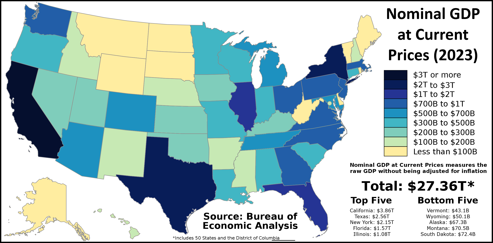

## Table of Contents

## What is GDP and why is it important?

GDP stands for Gross Domestic Product. It is the total value of all goods and services produced in a country during a specific time, usually a year. GDP helps us understand how well a country's economy is doing. If the GDP is growing, it usually means the economy is doing well and people are producing and buying more things.

GDP is important because it gives us a big picture of the economy. Governments and businesses use GDP to make decisions. For example, if GDP is growing, the government might feel confident to spend more money on things like schools and hospitals. Businesses might decide to invest more because they think people will have more money to spend. On the other hand, if GDP is shrinking, it might mean the economy is not doing well, and people might be buying less. This can help everyone understand what is happening and plan for the future.

## How is GDP calculated for U.S. states?

GDP for U.S. states is calculated by adding up the total value of all goods and services produced within each state over a year. This includes things like cars made in factories, food grown on farms, and services like haircuts or doctor visits. The U.S. Bureau of Economic Analysis (BEA) collects this information from businesses, governments, and other sources to figure out each state's GDP.

Just like the national GDP, state GDP helps us understand how well each state's economy is doing. If a state's GDP is growing, it means the economy is getting stronger and people are producing and buying more. This information is useful for state governments and businesses to make decisions. For example, a growing GDP might encourage a state to invest more in schools or roads, while a shrinking GDP might lead to cutbacks or changes in policy to boost the economy.

## Which U.S. state has the highest GDP?

California has the highest GDP of all the U.S. states. It makes more money from things like movies, technology, and farming than any other state. Big cities like Los Angeles and San Francisco help California's economy grow a lot.

California's GDP is important because it shows how strong its economy is. People and businesses in California make and buy a lot of things, which helps the whole state. Knowing this helps the state government decide how to spend money on things like schools and roads.

## Which U.S. state has the lowest GDP?

Vermont has the lowest GDP of all the U.S. states. It is a small state with fewer people and businesses, so it makes less money overall. Vermont is known for things like farming, tourism, and making maple syrup, but these don't add up to as much money as bigger states.

Even though Vermont's GDP is the smallest, it's still important to know this. It helps the state government understand how much money they have to spend on things like schools and roads. It also shows that even a small state can have a strong economy in its own way, focusing on what it does best.

## How does GDP per capita vary across U.S. states?

GDP per capita is the total GDP of a state divided by the number of people living there. It shows how much money each person would get if the state's GDP was shared equally among everyone. Across the U.S., GDP per capita varies a lot because some states have bigger economies and fewer people, while others have smaller economies and more people. For example, states like Massachusetts and New York have high GDP per capita because they have strong economies with lots of businesses and high-paying jobs. On the other hand, states like Mississippi and West Virginia have lower GDP per capita because their economies are smaller and they might not have as many high-paying jobs.

This variation in GDP per capita can tell us a lot about the standard of living in different states. States with higher GDP per capita usually have more money to spend on things like education, healthcare, and infrastructure, which can make life better for people living there. For example, a state with a high GDP per capita might have better schools and hospitals. In contrast, states with lower GDP per capita might struggle to provide the same level of services, which can affect the quality of life for their residents. Understanding these differences helps both the state governments and the people living there to make better decisions and plan for the future.

## What are the main industries contributing to the GDP of the top three states?

California, Texas, and New York are the top three states with the highest GDP in the U.S. In California, the main industries that help its GDP grow are technology, entertainment, and agriculture. Big tech companies like Apple and Google are based there, and Hollywood makes a lot of movies and TV shows. California also grows a lot of fruits, nuts, and vegetables, which adds to its economy.

In Texas, the oil and gas industry is a big part of its GDP. Texas has a lot of oil and natural gas, and many companies work to get it out of the ground and sell it. Besides oil, Texas also has a strong economy in things like farming, with lots of cattle and cotton, and manufacturing, where they make things like cars and electronics.

New York's GDP is helped a lot by finance and real estate. Wall Street in New York City is famous for its banks and stock market, which make a lot of money. Real estate is also big because New York City has many expensive buildings and homes. Tourism is another important industry, with people coming to see places like Times Square and the Statue of Liberty.

## How has the GDP of U.S. states changed over the past decade?

Over the past decade, the GDP of U.S. states has grown overall, but some states have grown faster than others. States like California, Texas, and New York have seen big increases in their GDP because they have strong industries like technology, oil and gas, and finance. These states have a lot of businesses and jobs that help their economies grow. Other states, like Florida and Washington, have also done well because of things like tourism and technology. Even though most states have seen their GDP go up, the growth has not been the same everywhere.

Some states have not grown as much over the past ten years. For example, states like West Virginia and Wyoming, which depend a lot on coal and other natural resources, have seen slower growth because these industries have not been doing as well. Also, states in the Midwest, like Michigan and Ohio, have had ups and downs because they rely on manufacturing, which can change a lot with the economy. Even though some states have grown more slowly, all states have been affected by big events like the COVID-19 pandemic, which caused a lot of changes in GDP across the country.

## What factors influence the GDP growth in different U.S. states?

Different things can make the GDP of U.S. states grow. One big [factor](/wiki/factor-investing) is the kind of businesses and industries in the state. States with strong industries like technology, finance, or oil and gas tend to have higher GDP growth. For example, California grows a lot because of tech companies like Apple and Google, while Texas does well because of oil. Another factor is how many people live in the state and if more people are moving there. More people mean more workers and more customers, which can help the economy grow. Also, how much the government spends on things like schools, roads, and hospitals can affect GDP growth. If the government invests a lot, it can help the economy get bigger.

Another important thing that influences GDP growth is how well the state can attract new businesses and keep the ones it already has. States that offer good tax breaks or other benefits can bring in more companies, which helps the economy. Natural disasters and big events like the COVID-19 pandemic can also change GDP growth a lot. For example, states that were hit hard by the pandemic saw their GDP go down because businesses had to close and people couldn't work. Overall, many different things can make a state's GDP go up or down, and it's different for each state based on what's happening there.

## How do state policies affect GDP?

State policies can have a big effect on a state's GDP. When states make good rules and spend money wisely, it can help the economy grow. For example, if a state gives tax breaks to businesses, more companies might move there. This can create more jobs and make the GDP go up. Also, if the state spends money on things like schools and roads, it can help the economy because better schools can lead to a smarter workforce, and good roads make it easier for businesses to get their products to customers.

On the other hand, bad policies can hurt a state's GDP. If a state raises taxes too much, businesses might leave or not want to come there, which can slow down the economy. If the state doesn't spend enough money on important things like education and health care, it can make life harder for people and businesses, which can also hurt the GDP. So, state policies are really important because they can either help the economy grow or make it smaller.

## Can you compare the GDP growth rates of coastal versus inland U.S. states?

Coastal U.S. states often have higher GDP growth rates than inland states. This is because many big cities are on the coast, like New York City, Los Angeles, and Miami. These cities have lots of businesses, like tech companies, banks, and tourism, which help the economy grow. Also, ports on the coast make it easier for states to trade with other countries, bringing in more money. For example, California and New York, both coastal states, have strong economies because of their big cities and ports.

Inland states, on the other hand, usually grow more slowly. They might not have as many big cities or as much trade with other countries. States like Kansas and Nebraska focus more on farming and might not have as many high-paying jobs as coastal states. However, some inland states, like Texas, do well because of industries like oil and gas. Overall, coastal states tend to have faster GDP growth because of their cities and trade, while inland states can grow more slowly but still have important industries that help their economies.

## What role does federal funding play in the GDP of U.S. states?

Federal funding is really important for the GDP of U.S. states. It's money that the big government in Washington, D.C. gives to the states to help them pay for things like roads, schools, and hospitals. When states get this money, they can spend it on projects that create jobs and help the economy grow. For example, if a state uses federal money to build a new highway, that can make it easier for businesses to move their goods around, which can help the state's GDP go up.

Different states get different amounts of federal money, and this can affect how their economies do. States with a lot of people or big problems might get more money because they need more help. This can make a big difference in how fast their GDP grows. For example, a state that gets a lot of federal money to fix up its schools can have a better-educated workforce, which can attract more businesses and help the economy. So, federal funding is a big deal for states and can really help their GDP grow.

## How do economic forecasts predict future GDP trends for U.S. states?

Economic forecasts help us guess what will happen to the GDP of U.S. states in the future. They use a lot of information, like how many people are working, how much money people are spending, and what businesses are doing. Experts look at all this data and use special math to make predictions. For example, if a state is building a lot of new factories, the forecast might say that the state's GDP will grow because more things will be made and sold.

Sometimes, big events like new laws or natural disasters can change these forecasts. If a state gets a new law that helps businesses, the forecast might be more positive because more companies might move there and create jobs. But if a state has a big hurricane, the forecast might say the GDP will go down because businesses might have to close and people might not be able to work. So, economic forecasts are important because they help states plan for the future and make good decisions.

## References & Further Reading

[1]: Bureau of Economic Analysis. ["GDP by State."](https://www.bea.gov/data/gdp/gdp-state)

[2]: Lopez de Prado, M. (2018). ["Advances in Financial Machine Learning."](https://www.amazon.com/Advances-Financial-Machine-Learning-Marcos/dp/1119482089) Wiley.

[3]: Chan, E. P. (2009). ["Quantitative Trading: How to Build Your Own Algorithmic Trading Business."](https://github.com/ftvision/quant_trading_echan_book) Wiley.

[4]: Hull, J. (2018). ["Options, Futures, and Other Derivatives."](https://www.pearson.com/nl/en_NL/higher-education/subject-catalogue/finance/Options-Futures-and-Other-Derivatives-Hull.html) Pearson.

[5]: Fabozzi, F. J., Focardi, S. M., & Kolm, P. N. (2010). ["Quantitative Equity Investing: Techniques and Strategies."](https://www.semanticscholar.org/paper/Quantitative-Equity-Investing%3A-Techniques-and-Fabozzi-Focardi/1c49a2a53919f7e65cb96f16691b8ff726fd3cd7) Wiley.