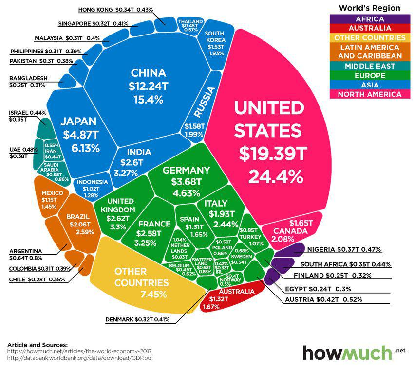

The United States boasts the largest economy globally, measured by Gross Domestic Product (GDP), a testament to its vast and diverse economic activities. While its landmass and population may not be the largest, the country's GDP, which quantifies the total market value of all finished goods and services produced over a specified period, reflects its economic vitality. This metric is crucial for evaluating economic health at both the national and state levels.

Each U.S. state plays a distinctive role in contributing to the national GDP, shaped by factors such as population size, workforce capabilities, and industrial composition. States like California, Texas, and New York exemplify significant GDP contributors due to their robust economies and diverse industry presence, ranging from technology and entertainment to energy and finance. Analyzing GDP distribution state-wise provides insights into not only economic health but also potential investment areas.



In recent years, algorithmic trading has emerged as a transformative force in financial markets, influencing the dynamics of state economies. Algorithmic trading uses sophisticated algorithms and data analysis to automate and optimize trading decisions. It brings speed and efficiency to trading processes, identifying trends and predicting market movements with precision. This innovation is particularly impactful in states with vibrant financial markets, where it shapes economic activities and investment flows.

Understanding the interplay between state economies, GDP, and algorithmic trading reveals regional economic strengths and prospective investment opportunities. By examining these elements, this article aims to offer insights into how they converge to shape the economic landscape of the United States. The discussion will cover state-wise GDP distribution, factors influencing GDP, and the rising influence of algorithmic trading on state economies. Through this exploration, we aim to provide a comprehensive view of the evolving economic dynamics at play.

## Table of Contents

## Understanding GDP and Its Impact on State Economies

GDP, or Gross Domestic Product, represents the total market value of all finished goods and services produced within a specific region over a designated period. It serves as a comprehensive measure of an area’s economic activity and performance, and is frequently used to compare the economic health of different geographic regions. When considering the United States, each state contributes differently to the national GDP, influenced by a multitude of factors including population size, workforce composition, and industrial diversity.

The contribution of a state to the national GDP is heavily dependent on the size of its population and the availability of a skilled workforce. States with larger populations, such as California, Texas, and New York, naturally tend to have higher GDPs owing to their substantial workforces that drive higher production and consumption levels. In 2022, California was responsible for approximately 15% of the U.S. GDP, largely attributed to its large population and diverse economy that includes technology, entertainment, and agriculture sectors. Texas follows with a significant contribution due to its dominant energy sector and growing technology industry.

Industrial diversification plays a critical role in the variation of GDP contributions among states. States with economies that are reliant on multiple industries generally portray more stable and sustainable economic growth. For instance, New York's GDP is bolstered by its robust financial services sector, while also supported by healthcare, technology, and media industries. Such diversity reduces dependency on a single sector and mitigates risk associated with sector-specific downturns.

Understanding the distribution of GDP among U.S. states offers valuable insights into regional economic health and highlights potential areas for investment. States with rapidly growing sectors or significant industrial diversity may present attractive opportunities for investors seeking to capitalize on economic trends. Additionally, GDP data assists policymakers in identifying economic strengths and weaknesses across states, allowing for more targeted and effective economic development strategies. Overall, analyzing GDP distribution not only maps out the current economic landscape but also guides strategic decision-making for future economic planning and investment.

## Algorithmic Trading: Revolutionizing Investment Strategies

Algorithmic trading, commonly referred to as algo trading, is a technique that employs advanced algorithms to automate trading processes, aiming to execute orders with increased speed and efficiency compared to manual trading. This practice has fundamentally transformed investment strategies by incorporating high-frequency data analysis to identify financial trends and forecast market fluctuations, thereby enhancing decision-making processes for traders and financial institutions.

The core of [algorithmic trading](/wiki/algorithmic-trading) lies in its ability to leverage large datasets and perform complex computations at speeds unattainable by human traders. Through the use of sophisticated statistical models, algorithms can detect patterns and generate trading signals based on historical data, real-time market information, and even [machine learning](/wiki/machine-learning) inputs. This automation minimizes human intervention, reducing the impact of emotional biases on trading decisions.

Algorithmic trading has become a significant force in shaping state economies by affecting market dynamics and capital movements. States with robust financial sectors, such as New York and California, have observed notable advancements due to the integration of algo trading in regional markets. These states are home to major stock exchanges and financial institutions, offering fertile ground for algorithmic innovations and implementations.

The influx of algorithmic trading contributes to increased market [liquidity](/wiki/liquidity-risk-premium) and tighter bid-ask spreads, which can bolster overall trading activity and stability within state economies. In New York, for instance, the implementation of algorithmic systems in trading floors contributes to a more efficient capital market, attracting a myriad of investments and economic opportunities.

Furthermore, California's technology-oriented environment has facilitated the evolution of algorithmic trading through advances in computational capabilities and data processing technologies. This has resulted in a symbiotic relationship where algorithmic trading not only benefits from California's tech ecosystem but also drives further innovation within the state's financial markets.

As a result, the role of algorithmic trading extends beyond mere automation, serving as a catalyst for economic shifts and technological development within key financial states. By continuously refining these algorithms, enhancing data analysis techniques, and adapting to changing market needs, algorithmic trading remains a vital component of modern investment strategies, directly impacting the economic landscape of influential states.

## The Interplay Between GDP and Algorithmic Trading

High GDP states such as California, New York, and Texas are ripe for thriving algorithmic trading activities due to their robust financial markets and extensive investment opportunities. These states possess advanced financial infrastructures and diverse economic landscapes that attract significant trading volumes. Algorithmic trading thrives on market [volatility](/wiki/volatility-trading-strategies) and efficiencies, which are more pronounced in these economically vibrant regions. This trading method involves using algorithms to automate trading processes, allowing for rapid execution of trades with minimal human intervention.

Algorithmic trading enhances market activities by exploiting price discrepancies and small movements in stock prices to generate profits. For instance, strategies like statistical [arbitrage](/wiki/arbitrage) identify patterns in market data, allowing traders to capitalize on temporary inefficiencies. This constant interaction with the market can amplify economic activity by optimizing liquidity and facilitating efficient capital allocation.

The innovative nature of algorithmic trading provides increased trading [volume](/wiki/volume-trading-strategy) and liquidity, which can significantly influence a region's GDP. The positive feedback loop generated by heightened liquidity and trading volume enhances market depth, enabling more transactions to occur without dramatically impacting asset prices. Market depth refers to the market's ability to sustain relatively large orders without major shifts in price, which is crucial for stabilizing the economy and encouraging ongoing investment.

Python, a popular language for implementing algorithmic trading strategies, can illustrate these concepts. Here is a simple example of a mean reversion strategy using Python:

```python
import numpy as np
import pandas as pd

# Generate synthetic stock prices
np.random.seed(42)
stock_prices = np.random.normal(loc=100, scale=1, size=1000)

# Calculate moving averages
def moving_average(prices, window):
    return pd.Series(prices).rolling(window=window).mean()

# Define mean reversion strategy
def mean_reversion_strategy(prices, window):
    ma = moving_average(prices, window)
    signals = np.where(prices < ma, 1, -1)  # Buy when price is below MA, sell when above
    return signals

# Generate trading signals
signals = mean_reversion_strategy(stock_prices, window=20)

# Analyze performance
def strategy_performance(prices, signals):
    returns = np.diff(prices) / prices[:-1]  # Daily returns
    strategy_returns = signals[:-1] * returns  # Strategy returns (ignoring transaction costs)
    return np.cumprod(1 + strategy_returns) - 1

performance = strategy_performance(stock_prices, signals)
print(f"Final strategy performance: {performance[-1]:.2%}")
```

This code simulates a simple mean reversion strategy where a trading signal is generated based on moving averages—a fundamental concept in algorithmic trading. The performance of such a strategy can reflect the potential to generate returns in high GDP states with efficient markets.

In summary, the correlation between algorithmic trading and GDP is symbiotic, where high GDP fosters rich ground for algo trading, which in turn enhances economic activities via improved market efficiencies. This interaction underscores the pivotal role algorithmic trading plays in the economic fabric of states with substantial financial markets.

## Challenges and Opportunities in Integrating Algorithmic Trading

Algorithmic trading presents numerous prospects for economic expansion, yet it also poses significant challenges. A primary concern is the potential for market manipulation, which occurs when entities use algorithmic systems to create artificial demand or supply pressures, thereby misleading other market participants. This manipulation can distort asset prices and undermine investor confidence. Additionally, algo trading can exacerbate market volatility. The algorithms are designed to react to market signals and can lead to sudden, large-scale buying or selling, contributing to rapid price fluctuations. Such volatility can destabilize financial systems and impact economic stability.

Regulatory frameworks are crucial to mitigating these risks. Policies must ensure that algorithms are transparent and fair, preventing manipulation and protecting market integrity. The Securities and Exchange Commission (SEC) and other regulatory bodies continuously work to establish guidelines that foster a stable trading environment. These regulations include setting minimum liquidity requirements, implementing circuit breakers to curb rapid market movements, and mandating the disclosure of trading algorithms to ensure accountability.

The advancement of technology, however, opens new avenues for smaller state economies. As computational power and data analytics become more accessible, smaller markets can leverage algorithmic trading to enhance their economic competitiveness. By adopting advanced trading strategies, these states can attract investments and boost liquidity. Moreover, emerging technologies such as machine learning and [artificial intelligence](/wiki/ai-artificial-intelligence) offer sophisticated methods to analyze market data and optimize trading strategies. Python, a popular programming language, provides libraries like NumPy and pandas that facilitate data analysis and algorithm development:

```python
import numpy as np
import pandas as pd

# Sample code to simulate a basic trading signal using moving averages
def compute_moving_averages(prices, short_window=40, long_window=100):
    signals = pd.DataFrame(index=prices.index)
    signals['price'] = prices
    signals['short_mavg'] = prices.rolling(window=short_window, min_periods=1).mean()
    signals['long_mavg'] = prices.rolling(window=long_window, min_periods=1).mean()
    signals['signal'] = 0
    signals['signal'][short_window:] = np.where(signals['short_mavg'][short_window:] 
                                                > signals['long_mavg'][short_window:], 1.0, 0.0)
    signals['positions'] = signals['signal'].diff()
    return signals

# Example usage
price_data = pd.Series([/* Load your price data here */])
trade_signals = compute_moving_averages(price_data)
```

By harnessing such innovations, smaller states can improve their market efficiency and attract a broader array of financial activities, fostering more balanced economic growth relative to larger states. Thus, while challenges remain in integrating algorithmic trading, the opportunities for broader economic participation are significant. The alignment of regulatory oversight with technological advancements can unlock potential across diverse economic landscapes.

## Conclusion

The correlation between state GDP and algorithmic trading illustrates the evolving landscape of regional economies in the United States. High GDP states, such as California, New York, and Texas, currently lead in leveraging algorithmic trading. These states benefit from advanced financial markets, robust technological infrastructure, and substantial investment opportunities, making them attractive environments for algo trading activities. The integration of algorithmic trading in these regions has bolstered economic activities by enhancing market efficiencies and liquidity. Consequently, this has further amplified their already significant contribution to the national GDP.

Despite the current dominance of high GDP states, emerging technologies present an opportunity for other states to gain ground. As advancements in technology continue, barriers to entry for algorithmic trading are lowering, enabling smaller or less economically dominant states to participate more actively. Improvements in data accessibility, computational power, and algorithm design are making it feasible for these states to adopt algorithmic trading strategies, thus fostering economic growth and diversification. 

Understanding these dynamics is crucial for investors and policymakers aiming to drive sustainable economic growth across the United States. By recognizing the potential of algorithmic trading and tailoring their strategies to harness its capabilities, they can stimulate development in various regions. This, in turn, can lead to a more balanced economic landscape, offering equitable growth opportunities for states irrespective of their current GDP standings. Consequently, strategic investments and informed policy decisions can pave the way for enhanced economic resilience and prosperity across the nation.

## References & Further Reading

[1]: Bureau of Economic Analysis. ["GDP by State."](https://www.bea.gov/data/gdp/gdp-state)

[2]: Lopez de Prado, M. (2018). ["Advances in Financial Machine Learning."](https://www.amazon.com/Advances-Financial-Machine-Learning-Marcos/dp/1119482089) Wiley.

[3]: Chan, E. P. (2009). ["Quantitative Trading: How to Build Your Own Algorithmic Trading Business."](https://github.com/ftvision/quant_trading_echan_book) Wiley.

[4]: Hull, J. (2018). ["Options, Futures, and Other Derivatives."](https://www.pearson.com/nl/en_NL/higher-education/subject-catalogue/finance/Options-Futures-and-Other-Derivatives-Hull.html) Pearson.

[5]: Fabozzi, F. J., Focardi, S. M., & Kolm, P. N. (2010). ["Quantitative Equity Investing: Techniques and Strategies."](https://www.semanticscholar.org/paper/Quantitative-Equity-Investing%3A-Techniques-and-Fabozzi-Focardi/1c49a2a53919f7e65cb96f16691b8ff726fd3cd7) Wiley.