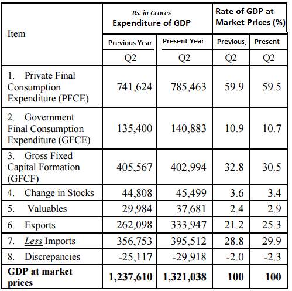

## Table of Contents

## What is GDP and why is it important for India?

GDP, or Gross Domestic Product, is the total value of all goods and services produced within a country's borders in a specific time period, usually a year. It is like a big report card that shows how well a country's economy is doing. For India, knowing the GDP helps the government and people understand if the country is growing, staying the same, or shrinking. It is a key number that helps everyone see if the economy is healthy or if it needs help.

GDP is important for India because it helps the government make plans and decisions. If the GDP is growing, it means more people might have jobs and more money to spend. This can help the government decide to invest in things like schools, hospitals, and roads. On the other hand, if the GDP is not growing or is going down, the government might need to find ways to help the economy, like creating new jobs or helping businesses. So, GDP is a very important tool for making sure India's economy stays strong and healthy.

## How is GDP calculated in India?

In India, GDP is calculated using two main methods: the income method and the expenditure method. The income method adds up all the income earned by people and businesses in the country, including wages, profits, and taxes minus subsidies. This gives a total of how much money is made within India. The expenditure method, on the other hand, adds up all the spending in the country. This includes what people spend on goods and services, what the government spends, what businesses invest, and the difference between what the country exports and imports.

Both methods should give the same total GDP, but in practice, there can be small differences. The Indian government uses these methods to come up with the final GDP number. They collect data from different sources like surveys, tax records, and company reports to make sure their calculations are as accurate as possible. This way, they can keep track of how the economy is doing and make decisions to help it grow.

## What are the different methods used to calculate GDP in India?

In India, GDP is calculated using two main methods: the income method and the expenditure method. The income method adds up all the money earned by people and businesses in the country. This includes wages, profits, and taxes minus any subsidies. It's like adding up everyone's paychecks and the money businesses make to see how much income is generated in India.

The expenditure method looks at all the spending that happens in the country. This includes what people spend on things like food and clothes, what the government spends on services like schools and roads, what businesses invest in new projects, and the difference between what India sells to other countries (exports) and what it buys from them (imports). By adding up all this spending, we get another way to measure the total value of goods and services produced in India.

Both methods should give the same GDP number, but sometimes there are small differences. The Indian government uses data from surveys, tax records, and company reports to make these calculations as accurate as possible. This helps them understand the health of the economy and make plans to help it grow.

## What is the difference between nominal GDP and real GDP in the context of India?

Nominal GDP and real GDP are two ways to measure the total value of goods and services produced in India, but they look at it differently. Nominal GDP is the total value of everything produced in a year, using the prices from that same year. So, if prices go up because of inflation, the nominal GDP will also go up, even if the actual amount of goods and services hasn't changed. It's like saying you have more money, but it's because things cost more, not because you're producing more.

Real GDP, on the other hand, tries to show the true growth of the economy by taking away the effect of inflation. It uses prices from a base year to calculate the value of goods and services. This way, if you see an increase in real GDP, it means that more goods and services are actually being produced, not just that prices have gone up. For India, looking at real GDP helps the government and people understand if the economy is really growing or if it's just inflation making the numbers look bigger.

## How often is GDP data released in India and by which organization?

In India, the GDP data is released every three months, or quarterly. This means you can see new GDP numbers four times a year. The organization that releases this data is called the Ministry of Statistics and Programme Implementation, or MOSPI for short. They are part of the Indian government and are in charge of collecting and sharing all sorts of important numbers about the country.

MOSPI releases the first estimate of the GDP for a quarter about six weeks after the quarter ends. This is called the "provisional estimate." Later, they might update these numbers to make them more accurate. These updates can happen a few times, and the final numbers are usually released about two years after the year ends. This helps everyone in India understand how the economy is doing and if it's getting better or worse.

## What are the key sectors contributing to India's GDP?

The key sectors that contribute to India's GDP are agriculture, industry, and services. Agriculture is very important because many people in India work in farming. They grow crops like wheat, rice, and cotton, and raise animals for milk and meat. This sector helps feed the country and also earns money from selling products to other countries. Industry includes things like making cars, clothes, and electronics. It also includes mining for things like coal and oil. These activities help create jobs and make products that people need every day.

The services sector is the biggest part of India's GDP. It includes things like banking, where people save and borrow money, and information technology, where people create software and apps. Tourism is also part of this sector, as people visit India to see its history and culture. The services sector helps a lot because it provides jobs that require different skills and helps connect people and businesses around the world. Together, these three sectors - agriculture, industry, and services - make up India's economy and help it grow.

## How has the method of calculating GDP in India evolved over the years?

The way India calculates its GDP has changed a lot over the years to make it more accurate and match global standards. In the beginning, India used a simple method called the "Net Output Method," which looked at the value of goods and services minus the cost of inputs. But as the economy grew and became more complex, this method wasn't enough. So, in 1999, India switched to a new system called the "System of National Accounts" (SNA), which is used by many countries around the world. This system helped India to measure GDP in a way that was more detailed and included more parts of the economy.

Over time, India made more changes to keep up with how the economy was changing. In 2015, the government updated the base year used for calculating GDP from 2004-05 to 2011-12. This was important because using a more recent base year gives a better picture of the current economy. Also, they started using the "Gross Value Added" (GVA) method, which looks at the value added by each sector before taxes and subsidies. This made the GDP numbers more accurate and helped show how different parts of the economy were doing. These changes have helped India keep track of its economy in a way that is more detailed and up-to-date.

## What are the challenges faced in accurately measuring India's GDP?

Measuring India's GDP accurately can be tough because the country is so big and diverse. There are many different kinds of jobs and businesses, from farming in villages to big companies in cities. It's hard to keep track of all this activity, especially when some people work in jobs that aren't easy to count, like street vendors or small farmers. Also, a lot of people in India don't keep good records of their money, which makes it harder to get the right numbers. Sometimes, the data that is collected might not be complete or up-to-date, which can lead to mistakes in the GDP numbers.

Another challenge is that the economy is always changing. New businesses start, old ones close, and people switch jobs. This means the way we measure GDP needs to change too. For example, when the government updated the base year for GDP calculations from 2004-05 to 2011-12, it was to make sure the numbers reflected the current economy better. But even with these updates, it's hard to keep up with all the changes happening in the economy. Plus, things like inflation can make the numbers tricky to understand, so it's important to look at both nominal and real GDP to get a clear picture.

## How does India's GDP growth rate compare to other major economies?

India's GDP growth rate is often compared to other big economies like the United States, China, and Japan. In recent years, India has been one of the fastest-growing major economies in the world. For example, in 2022, India's GDP growth rate was around 7%, which is higher than many other countries. China, another fast-growing economy, had a growth rate of about 3% in the same year. The United States and Japan had growth rates of around 2% and 1% respectively. This shows that India is doing well compared to these other big economies.

However, India's growth rate can change a lot from year to year. Things like global economic conditions, government policies, and natural events like pandemics can affect how fast the economy grows. For example, during the COVID-19 pandemic, India's economy, like many others, slowed down a lot. But it bounced back quickly compared to some other countries. Overall, India's economy is seen as having a lot of potential for growth, especially as more people get jobs and businesses keep growing.

## What impact do revisions in GDP data have on economic policy in India?

When the GDP data for India gets changed or updated, it can affect the decisions the government makes about the economy. If the new numbers show that the economy is growing faster than they thought, the government might decide to spend more money on things like building roads or schools. They might also think that they don't need to help the economy as much because it's doing well on its own. On the other hand, if the new numbers show that the economy is not doing as well as they thought, the government might decide to do more to help it grow. They could create new jobs or give money to businesses to help them.

These changes in GDP numbers can also affect what people think about the economy. If the new numbers make it look like the economy is doing better, people might feel more confident and spend more money. But if the numbers make it look like the economy is doing worse, people might worry and spend less. This can make a big difference because when people spend more, it helps the economy grow. So, the government has to be careful when they use the new GDP numbers to make decisions, because it can affect everyone in the country.

## How do state-level GDP calculations differ from national GDP calculations in India?

In India, calculating GDP at the state level is different from calculating it at the national level because each state has its own economy. At the national level, the GDP is the total value of all goods and services produced across the whole country. The government uses data from all states to come up with this number. They look at things like how much people earn, how much they spend, and what businesses are doing all over India. This gives a big picture of how the entire country's economy is doing.

At the state level, GDP is called Gross State Domestic Product (GSDP). Each state calculates its own GSDP by looking at the economic activities happening within its borders. They use the same methods as the national level, like the income method and the expenditure method, but they only focus on what's happening in their state. This helps state governments understand how their local economy is doing and make plans to help it grow. So, while the national GDP gives an overall view of India's economy, the GSDP gives a more detailed look at each state's economy.

## What advanced statistical techniques are used to refine GDP estimates in India?

To make GDP estimates more accurate in India, experts use advanced statistical techniques like data smoothing and seasonal adjustment. Data smoothing helps to even out the ups and downs in the numbers so that the overall trend is easier to see. This is important because the economy can have big changes from one month to the next, and smoothing helps to show what's really happening over time. Seasonal adjustment is another technique that takes out the effects of things that happen every year, like holidays or farming seasons. This way, the GDP numbers show the true growth of the economy without being affected by these regular changes.

Another technique used is called econometric modeling. This involves using math and statistics to predict how different parts of the economy will affect the GDP. For example, experts might look at how changes in farming or manufacturing could change the overall GDP. They use past data to build these models and make them as accurate as possible. By using these advanced techniques, the government can get a clearer picture of how the economy is doing and make better decisions to help it grow.

## What is GDP and why is it important?

Gross Domestic Product (GDP) is a critical measure representing the economic health and productivity of a country. It is defined as the total monetary value of all goods and services produced within a nation's borders over a specific period, typically annually or quarterly. GDP serves as a comprehensive scorecard of a country's economic performance and is integral to economic planning and policy-making.

GDP is calculated in three primary ways: the production approach, the income approach, and the expenditure approach. Each of these methods aims to encapsulate the total economic activity within a country from different perspectives.

1. **Production Approach**: This methodology calculates GDP by summing up the value-added at each stage of production. It considers the output of industries and subtracts the value of inputs to arrive at the net value produced.

2. **Income Approach**: GDP is seen through the lens of earnings generated by production. It aggregates wages, interest, rent, and profits to reflect how income is distributed within the economy.

3. **Expenditure Approach**: The most common method, this approach calculates GDP by summing consumption, investment, government spending, and net exports (exports minus imports). This is often represented as:
$$
   \text{GDP} = C + I + G + (X - M)

$$

   where $C$ is consumption, $I$ is investment, $G$ is government spending, $X$ is exports, and $M$ is imports.

### Reflection of Economic Performance

GDP is a pivotal indicator of economic performance as it quantifies the size and health of an economy. A growing GDP suggests increasing economic activity and prosperity, signaling that businesses are producing more, consumers are spending more, and overall employment is likely rising. Conversely, a declining GDP may indicate economic stagnation or recession, reflecting reduced output and consumption, and potentially rising unemployment.

In addition to economic size, GDP growth rate is a vital metric used to measure economic [momentum](/wiki/momentum) over time. Policymakers often monitor both nominal GDP, which measures economic output using current prices, and real GDP, which is adjusted for inflation to allow comparisons over different time periods.

### Relevance in Policy-Making and International Comparisons

GDP holds significant relevance in policymaking, providing a basis for economic decision-making and fiscal policy. Governments and central banks analyze GDP trends to adjust monetary policy, interest rates, and budget allocations to either stimulate or cool down economic activity.

On the international stage, GDP facilitates comparisons between countries, offering insights into relative economic strengths and developmental stages. It helps international organizations like the World Bank and International Monetary Fund (IMF) to structure financial aid, assess sustainability, and promote economic cooperation among nations.

Furthermore, GDP per capita, which divides the GDP by the population, is a standard measure for comparing living standards or economic productivity of countries. While GDP is a vital indicator, it has limitations such as not accounting for income inequality, environmental degradation, or the informal economy, which can also influence the comprehensive understanding of economic well-being.

In conclusion, GDP remains a fundamental metric for gauging the economic success of a nation, influencing both domestic and international economic strategies. Its measurement and interpretation play a significant role in understanding and shaping economic policy and growth.

## What are the methods of calculating India's GDP?

Gross Domestic Product (GDP) is a crucial indicator used to gauge the economic performance of a country. In India, GDP is calculated using several methods, each providing unique insights into different aspects of the economy. Here, we explore the primary methods employed to calculate India's GDP: the [factor](/wiki/factor-investing) cost method and the expenditure method. Additionally, we discuss the distinction between nominal GDP and real GDP.

### Factor Cost Method

The factor cost method, historically significant in India's GDP calculations, focuses on the value of goods and services at factor cost, meaning it values output based on the production costs incurred by the factors of production. These factors include land, labor, capital, and entrepreneurship. 

Under this method, GDP is computed by summing the gross value added (GVA) across different sectors such as agriculture, manufacturing, and services, subtracting subsidies, and adding taxes. The formula is given as:

$$
\text{GDP at Factor Cost} = \text{GVA} + \text{Taxes} - \text{Subsidies}
$$

This method allows for the assessment of sector-specific contributions, offering insights into their performance and significance within the broader economy.

### Expenditure Method

The expenditure method evaluates GDP by adding up expenditures made in an economy over a certain period. This approach emphasizes aggregate demand and identifies key components driving economic activity. The components considered are:

- **Household Consumption (C):** Regular expenditures by households on goods and services.
- **Investment (I):** Business investments in capital goods and inventory, and household investments in housing.
- **Government Spending (G):** Expenditure by government bodies on goods and services, including infrastructure and public services.
- **Net Exports (NX):** The difference between the country's exports and imports, calculated as exports minus imports.

The expenditure method formula is:

$$
\text{GDP} = C + I + G + (X - M)
$$

where $X$ represents total exports, and $M$ denotes total imports. This approach provides an indicator of demand-side economic performance, highlighting consumption and investment trends in the economy.

### Nominal GDP vs. Real GDP

Understanding the difference between nominal GDP and real GDP is essential for analyzing economic data accurately. Nominal GDP measures the market value of all finished goods and services produced within a country at current prices without adjusting for inflation. It reflects the economic value in terms of current market conditions.

In contrast, real GDP accounts for changes in price levels, providing a more accurate reflection of an economy's growth in constant prices. This adjustment for inflation is achieved by using a price index, usually the GDP deflator:

$$
\text{Real GDP} = \frac{\text{Nominal GDP}}{\text{GDP Deflator}}
$$

Real GDP offers a clearer picture of economic performance over time, facilitating comparisons across different periods by controlling for inflationary effects.

In conclusion, these methods and distinctions are fundamental for comprehensive GDP evaluation in India, providing policymakers and economists with the necessary tools to understand the economy's current state and future trajectory.

## References & Further Reading

[1]: ("GDP: A Brief but Affectionate History") by Diane Coyle  
Explore the history and critical importance of GDP measurement across the globe.

[2]: ("The World Bank's World Development Indicators")  
This open database contains a wealth of information on GDP [statistics](/wiki/bayesian-statistics) and methodologies used worldwide, including India.

[3]: ("India's GDP Measurement Reforms: Opportunities and Challenges") from the Indian Journal of Applied Economics  

[4]: ("Algorithmic Trading and the Impact on Financial Markets") by the CFA Institute Research Foundation  
A comprehensive look into how [algorithmic trading](/wiki/algorithmic-trading) reshapes financial markets dynamics.

[5]: ("The Role of Algorithmic Trading in India's Financial Market") from the Journal of Quantitative Finance  

[6]: ("Measuring India’s GDP Growth: Before and After the New Series") from the Centre for Policy Research  

[7]: ("The Impacts of Algorithmic and High-frequency Trading on Market Quality") by Albert J. Menkveld in the Annual Review of Financial Economics  

[8]: ("High-frequency Trading and Market Performance") in Financial Analysts Journal  
A detailed academic paper examining the effects of high-frequency and algorithmic trading on market performance and efficiency.

[9]: ("India's Services Sector: Performance and Policy Issues") by Raghbendra Jha in the Economic and Political Weekly  

[10]: ("Data Collection Challenges in the Informal Sector") from the National Sample Survey Organization (NSSO) Reports, India