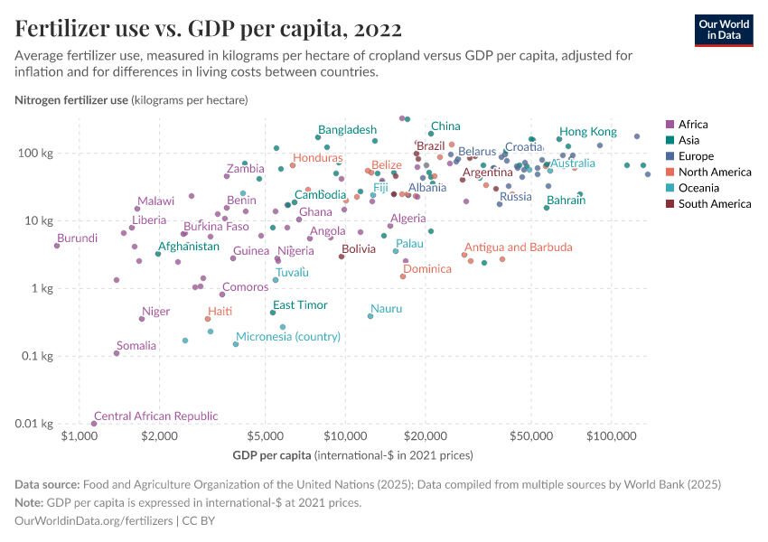

## Table of Contents

## What is GDP per capita?

GDP per capita is a way to measure how much money a country makes, divided by the number of people living there. It tells us the average amount of money each person would get if all the money made in the country was shared equally among everyone. This number helps us understand if a country is rich or poor compared to others.

This measure is useful because it gives a quick idea of the economic well-being of a country's people. However, it doesn't show how the money is actually shared among people. Some people might have a lot more money than others, so even if the GDP per capita is high, not everyone might be doing well. It's just one piece of information to help us understand a country's economy.

## How is GDP per capita calculated?

GDP per capita is calculated by taking the total Gross Domestic Product (GDP) of a country and dividing it by the total number of people living in that country. GDP is the total value of all goods and services produced within a country's borders in a specific time period, usually a year. So, if a country's GDP is $1 trillion and there are 10 million people living there, the GDP per capita would be $100,000 per person.

This calculation gives us an average amount of money each person would have if the GDP was divided equally among everyone. It's a simple way to compare the economic performance of different countries or to see how a country's economy is doing over time. However, it's important to remember that this number doesn't show how money is actually distributed among people. Some might have much more or much less than the average.

## Why is GDP per capita important?

GDP per capita is important because it gives us a quick way to see how well a country's economy is doing for each person living there. By dividing the total money made in a country by the number of people, we get an average that helps us compare countries. If one country has a higher GDP per capita than another, it usually means that people in the first country might have more money to spend on things they need or want.

However, it's also important to know that GDP per capita doesn't tell the whole story. It's just an average, so it doesn't show if some people have a lot more money than others. In some places, a few people might be very rich while many others are poor, but the GDP per capita might still look good. So, while it's a useful number for quick comparisons, we need to look at other information too to really understand how well everyone in a country is doing.

## How does GDP per capita differ from GDP?

GDP, or Gross Domestic Product, is the total value of all goods and services produced within a country's borders in a year. It tells us how much money the whole country makes by adding up everything from cars and computers to haircuts and hotel stays. GDP is important because it shows how big a country's economy is.

GDP per capita, on the other hand, takes that total GDP and divides it by the number of people living in the country. This gives us an average amount of money each person would have if the GDP was shared equally among everyone. GDP per capita is useful because it helps us understand how much money each person might have, making it easier to compare the economic well-being of different countries or see how a country's economy is doing over time.

## Can GDP per capita be used to compare the economic performance of different countries?

Yes, GDP per capita can be used to compare the economic performance of different countries. It gives us an idea of how much money each person would have if all the money made in a country was shared equally. This makes it easier to see which countries might be doing better economically. For example, if Country A has a higher GDP per capita than Country B, it usually means that people in Country A might have more money to spend on things they need or want.

However, using GDP per capita to compare countries has its limits. It's just an average, so it doesn't show how money is actually shared among people. In some countries, a few people might be very rich while many others are poor, but the GDP per capita might still look good. So, while it's a helpful number for quick comparisons, we need to look at other information too, like how equal the money is shared, to really understand how well everyone in a country is doing.

## What are the limitations of using GDP per capita as a measure of economic well-being?

GDP per capita is a useful number because it tells us how much money each person would have if all the money made in a country was shared equally. It helps us compare how well different countries are doing economically. But it has some big problems when we use it to understand how well people are really doing.

One big problem is that GDP per capita is just an average. It doesn't show how money is actually shared among people. In some countries, a few people might be very rich while many others are poor, but the GDP per capita might still look good. This means that even if a country has a high GDP per capita, not everyone might be doing well. Also, GDP per capita doesn't count things like how happy people are, how healthy they are, or how much free time they have. These things are important for well-being but don't show up in the GDP numbers.

So, while GDP per capita is a helpful number for quick comparisons, it's not enough to really understand how well everyone in a country is doing. We need to look at other information too, like how equal the money is shared, how good the schools and hospitals are, and how safe and happy people feel. Only then can we get a full picture of a country's economic well-being.

## How does GDP per capita correlate with other indicators of development, such as the Human Development Index?

GDP per capita is often used to measure how well a country's economy is doing, but it's not the only way to understand how developed a country is. The Human Development Index (HDI) is another important measure that looks at more than just money. HDI includes things like how long people live, how much education they get, and how much money they have. While GDP per capita tells us about the average money each person would have if it was shared equally, HDI gives us a broader picture of how well people are doing in different parts of their lives.

There is a connection between GDP per capita and HDI, but it's not perfect. Usually, countries with higher GDP per capita also have higher HDI scores because more money can mean better healthcare, education, and living standards. But sometimes, a country might have a high GDP per capita but a lower HDI if the money isn't shared well or if other important things like health and education are not as good. So, while GDP per capita is a useful number, looking at HDI helps us see a fuller picture of a country's development and how well its people are doing in different areas of life.

## What are the trends in GDP per capita across different regions of the world?

GDP per capita varies a lot across different regions of the world. In North America and Western Europe, countries like the United States, Canada, Germany, and France usually have high GDP per capita. This means that people in these countries, on average, have more money to spend on things they need or want. In Asia, countries like Japan and South Korea also have high GDP per capita, but there's a big difference within the region. For example, countries like China and India are growing fast, but their GDP per capita is still lower than in richer countries.

In contrast, many countries in Africa and parts of South Asia have much lower GDP per capita. This means that people in these regions, on average, have less money. Countries like Burundi, Central African Republic, and Malawi have some of the lowest GDP per capita in the world. In Latin America, there's a mix. Countries like Chile and Uruguay have higher GDP per capita, while others like Haiti and Bolivia have lower numbers. Over time, we see that some regions are catching up, with countries in Asia and parts of Latin America growing faster than others, but big differences still remain.

## How do adjustments for purchasing power parity affect GDP per capita comparisons?

When we compare GDP per capita across different countries, we often use something called purchasing power parity (PPP) to make the numbers more fair. PPP takes into account how much things cost in different places. For example, a burger might cost $5 in the United States but only $2 in India. If we just look at GDP per capita without PPP, it might seem like people in the U.S. have more money, but with PPP, we see that the money goes further in India because things are cheaper there. So, using PPP helps us understand how much people can actually buy with their money in different countries.

Adjusting for PPP can change how we see the economic well-being of different countries. Without PPP, countries with lower costs of living might look poorer than they really are. But when we use PPP, we might find that people in these countries can actually afford more than we thought. For example, China's GDP per capita might look lower than that of the U.S. without PPP, but after adjusting for PPP, the difference might not be as big because things are cheaper in China. This makes PPP a useful tool for getting a more accurate picture of how well people are doing around the world.

## What role does GDP per capita play in economic policy making?

GDP per capita is a key number that helps people who make economic policies. It tells them how much money each person would have if all the money made in the country was shared equally. This helps them see if the country is doing well and if people are getting richer or poorer over time. When they see that GDP per capita is going up, they might think their policies are working. If it's going down, they might need to change things to help the economy grow.

But, GDP per capita is just one piece of the puzzle. People who make economic policies also need to look at other things, like how the money is shared among people. If only a few people are getting richer while many others stay poor, they might need different policies to make things more fair. They also look at things like how healthy people are, how good the schools are, and how happy people feel. All these things together help them make better decisions to improve life for everyone in the country.

## How have changes in GDP per capita over time reflected economic growth or decline in specific countries?

Changes in GDP per capita over time can show us if a country's economy is growing or shrinking. For example, in the United States, GDP per capita has generally gone up over the last few decades. This means that, on average, people in the U.S. have been getting richer. The country has seen growth in industries like technology and finance, which has helped increase the total money made in the country. When GDP per capita goes up, it often means more jobs, higher wages, and better living standards for people.

In contrast, some countries have seen their GDP per capita go down, which can show economic problems. For instance, Venezuela has had a big drop in GDP per capita in recent years. This happened because of political problems, falling oil prices, and other issues that made the economy shrink. When GDP per capita goes down, it can mean fewer jobs, lower wages, and harder times for people. So, looking at changes in GDP per capita over time helps us understand the ups and downs of a country's economy and how well its people are doing.

## What advanced statistical methods can be used to analyze the impact of GDP per capita on economic and social outcomes?

To understand how GDP per capita affects things like how healthy people are, how much education they get, and how happy they feel, we can use some advanced math tools. One of these tools is called regression analysis. This method helps us see if changes in GDP per capita can explain changes in other things. For example, we might use regression to see if countries with higher GDP per capita have people who live longer. We can also use something called panel data analysis, which looks at data from many countries over time. This helps us see how changes in GDP per capita affect different countries in different ways.

Another useful tool is called time series analysis. This method looks at how GDP per capita changes over time in one country and how those changes might affect other things. For example, we might use time series analysis to see if a rise in GDP per capita leads to better schools or less crime. We can also use something called structural equation modeling, which helps us see how GDP per capita might affect many different things at the same time. This can show us how GDP per capita might lead to better health, which then leads to more education, and so on. These advanced methods help us get a clearer picture of how money affects people's lives.

## What is GDP Per Capita and how can it be understood?

GDP per capita is a vital economic indicator that provides insights into a country's economic health and the standard of living of its citizens. It is calculated as the gross domestic product (GDP) of a country divided by its population. Mathematically, it is expressed as:

$$
\text{GDP per capita} = \frac{\text{GDP}}{\text{Population}}
$$

This metric offers a snapshot of average economic output per person and is frequently used to compare the economic performance and prosperity of different countries. Ranking countries by GDP per capita allows for an assessment of their relative economic statuses on a global scale.

The significance of GDP per capita lies in its ability to encapsulate the economic productivity and growth of a nation, offering a per capita measure that can indicate the general well-being and economic dynamism of its society. High GDP per capita typically suggests that a country's economy is thriving, and its citizens likely enjoy a higher standard of living, whereas a lower GDP per capita can signify economic challenges and potential areas for development.

Several factors influence GDP per capita, including economic policies, industrial growth, and innovation. Economic policies set by governments, such as fiscal policies, taxation, and incentives for investment, can directly impact economic growth by influencing consumption and investment behaviors. Well-implemented policies can foster a conducive environment for businesses and industries, thereby boosting GDP.

Industrial growth, driven by sectors such as manufacturing, services, and technology, further propels GDP by increasing productivity and creating employment opportunities. Innovation plays a crucial role in economic advancement by introducing new technologies and solutions that improve efficiency and create new market opportunities.

These elements collectively contribute to variations in GDP per capita across different countries and over time. A comprehensive understanding of GDP per capita, its calculation, and the underlying factors affecting it is essential for policymakers, businesses, and investors aiming to make informed decisions in the global economic landscape.

## References & Further Reading

[1]: DeLong, J. Bradford, "Estimating World GDP, One Million B.C. – Present," Berkeley Economic History Laboratory, 1998, available at [University of California, Berkeley Research Papers](https://delong.typepad.com/print/20061012_LRWGDP.pdf).

[2]: World Bank, "World Development Indicators," The World Bank, 2021, accessible via [World Bank Open Data](https://databank.worldbank.org/reports.aspx?source=2&series=NV.IND.TOTL.ZS).

[3]: Barro, Robert J., and Xavier Sala-i-Martin, "Economic Growth," 2nd Edition, The MIT Press, 2004.

[4]: ["Algorithmic Trading and DMA: An Introduction to Direct Access Trading Strategies"](https://archive.org/details/algorithmictradi0000john), by Barry Johnson.

[5]: Fama, Eugene F., and Kenneth R. French, "The Capital Asset Pricing Model: Theory and Evidence," Journal of Economic Perspectives, Vol. 18, No. 3 (Summer, 2004), pp. 25-46.

[6]: Katz, Jeff, and McCormick, Donna L., "The Encyclopedia of Trading Strategies," McGraw-Hill Education.

[7]: Mankiw, N. Gregory, "Principles of Economics," 9th Edition, Cengage Learning.