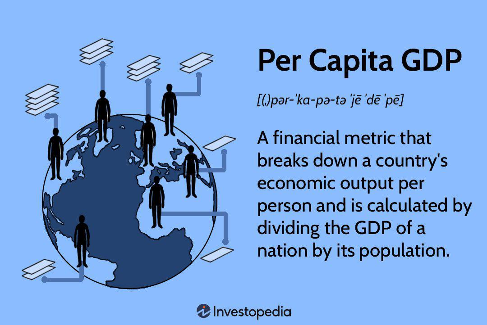

Understanding the nuances of economic indicators is crucial for investors, policymakers, and businesses navigating the ever-evolving global economy. Among these indicators, Gross Domestic Product (GDP) per capita stands out as a key metric for gauging a country's economic health and providing insight into the standard of living. GDP per capita is calculated by dividing the total GDP of a country by its population, offering a per-person average that reflects economic productivity and prosperity. This metric is indispensable for comparative economic analyses between nations, highlighting disparities and identifying potential areas for improvement.

The landscape of economic analysis has experienced transformative advancements with the rise of algorithmic trading. This method leverages computer programs to analyze vast datasets of economic indicators faster and more efficiently than traditional approaches. Algorithmic trading platforms synthesize indicators like GDP per capita to inform investors' decisions, automate transactions, and predict market trends. The integration of such complex data into trading algorithms enhances the precision and timing of trades, contributing to more robust financial strategies.



This article will explore how country rankings based on GDP per capita profoundly impact economic forecasting and trading strategies. These rankings serve as a benchmark for assessing international economic standings, influencing global investment decisions, and shaping policies. The analysis includes the role of economic indicators in enhancing algorithmic trading platforms and their significant influence on global financial markets. By understanding these dynamics, stakeholders can better anticipate economic shifts and harness trading technologies to improve economic outcomes.

## Table of Contents

## Understanding GDP Per Capita

GDP per capita is a vital economic indicator that provides insights into a country's economic health and the standard of living of its citizens. It is calculated as the gross domestic product (GDP) of a country divided by its population. Mathematically, it is expressed as:

$$
\text{GDP per capita} = \frac{\text{GDP}}{\text{Population}}
$$

This metric offers a snapshot of average economic output per person and is frequently used to compare the economic performance and prosperity of different countries. Ranking countries by GDP per capita allows for an assessment of their relative economic statuses on a global scale.

The significance of GDP per capita lies in its ability to encapsulate the economic productivity and growth of a nation, offering a per capita measure that can indicate the general well-being and economic dynamism of its society. High GDP per capita typically suggests that a country's economy is thriving, and its citizens likely enjoy a higher standard of living, whereas a lower GDP per capita can signify economic challenges and potential areas for development.

Several factors influence GDP per capita, including economic policies, industrial growth, and innovation. Economic policies set by governments, such as fiscal policies, taxation, and incentives for investment, can directly impact economic growth by influencing consumption and investment behaviors. Well-implemented policies can foster a conducive environment for businesses and industries, thereby boosting GDP.

Industrial growth, driven by sectors such as manufacturing, services, and technology, further propels GDP by increasing productivity and creating employment opportunities. Innovation plays a crucial role in economic advancement by introducing new technologies and solutions that improve efficiency and create new market opportunities.

These elements collectively contribute to variations in GDP per capita across different countries and over time. A comprehensive understanding of GDP per capita, its calculation, and the underlying factors affecting it is essential for policymakers, businesses, and investors aiming to make informed decisions in the global economic landscape.

## Country Rankings and Their Importance

Country rankings based on GDP per capita serve as crucial tools for evaluating global economic standings. By providing a measure of the average economic output per individual, these rankings facilitate the identification of countries with robust economies as well as those facing challenges. Such classifications significantly influence global investment flows and policy-making decisions, as stakeholders consider the economic health and potential of different regions.

Fluctuations in these rankings can often signal broader economic trends and geopolitical shifts. For instance, a rise in GDP per capita may reflect successful economic reforms or increased productivity, whereas a decline might indicate economic instability or external shocks. Recent shifts in rankings have highlighted the dynamic nature of global economics, with several emerging markets gaining ground due to rapid growth and technological advancements, while traditionally dominant countries may face stagnation or slower growth rates.

The implications of changes in country rankings are vast. An increase in a country's GDP per capita ranking can enhance investor confidence, potentially leading to increased foreign direct investment and improved credit ratings. Conversely, a drop in rankings might trigger caution among investors and policymakers, prompting reassessment of economic strategies.

Despite its importance, GDP per capita is not without criticisms. As a singular metric, it often fails to account for income inequality, non-market transactions, and environmental factors affecting the standard of living. Relying solely on GDP per capita for economic assessments can therefore result in an incomplete picture. Critics argue for a more comprehensive approach, incorporating indices that consider health, education, and environmental sustainability alongside economic output.

In summary, while GDP per capita remains a vital indicator for country rankings and their implications on global economic standings, it should be used in conjunction with other metrics for a more nuanced understanding of economic health and potential.

## Integration of Economic Indicators in Algo Trading

Algorithmic trading, or algo trading, involves the use of computer algorithms to automate trading decisions and execute trades at optimal times, often at speeds beyond human capability. Central to these strategies is the reliance on economic indicators that provide real-time data to inform trading decisions. Among these indicators, GDP per capita is utilized to gauge a country's economic health and reflects both domestic economic performance and potential shifts in currency value or investment appeal. By integrating such economic benchmarks, algo trading systems can more effectively navigate the complexities of global markets.

GDP per capita, as an expression of a nation's economic output divided by its population, serves as a proxy for a country's overall economic wellbeing. High GDP per capita typically indicates a prosperous economy, which can lead to stronger currency values, influenced by increased consumer spending and investment. Algo trading strategies often incorporate GDP data to assess country rankings, which in turn guides buy/sell decisions, particularly in foreign exchange and commodity markets.

One way GDP per capita data is integrated into algo trading is through the development of predictive models. These models analyze historical GDP per capita trends alongside other economic indicators—such as inflation rates, employment [statistics](/wiki/bayesian-statistics), and trade balances—to predict future market conditions. Consider a simplified Python example where a [machine learning](/wiki/machine-learning) model is trained to predict currency price movements based on GDP per capita data:

```python
import pandas as pd
from sklearn.model_selection import train_test_split
from sklearn.ensemble import RandomForestClassifier
from sklearn.metrics import accuracy_score

# Load GDP per capita and currency price movement data
data = pd.read_csv('economic_data.csv')
X = data[['gdp_per_capita', 'inflation_rate']]
y = data['currency_movement']

# Split data into training and testing sets
X_train, X_test, y_train, y_test = train_test_split(X, y, test_size=0.2, random_state=42)

# Initialize and train the Random Forest model
model = RandomForestClassifier()
model.fit(X_train, y_train)

# Make predictions and evaluate model accuracy
predictions = model.predict(X_test)
accuracy = accuracy_score(y_test, predictions)
print(f'Model Accuracy: {accuracy * 100:.2f}%')
```

This example highlights how economic indicators, specifically GDP per capita, are utilized to train machine learning models that form the backbone of algo trading strategies. Once trained, these models enable algorithms to adapt in real-time to shifting economic signals, making informed trading decisions without human intervention.

Algo traders capitalize on GDP-linked fluctuations by leveraging automated rules to execute trades as soon as data indicates favorable conditions. For instance, a rise in a nation's GDP per capita may prompt an algo to increase holdings in that country's currency or vice versa.

Several case studies illustrate the effectiveness of using economic indicators like GDP per capita in algo trading. For example, algorithms that successfully predicted post-recession recovery trends by focusing on GDP metrics often outperformed traditional trading approaches. Furthermore, these strategies have been instrumental in navigating volatile markets, where rapid data assessment and execution lead to better risk management and return on investment.

In summary, the integration of economic indicators such as GDP per capita into algo trading systems allows for a more nuanced and data-driven approach to investment. By continuously processing and reacting to economic data, these algorithms provide a distinct advantage in capturing market opportunities and mitigating risks.

## Impact of Country Rankings on Global Financial Markets

Country rankings based on GDP per capita exert significant influence on the global financial markets. These rankings serve as a barometer for investors and financial analysts in assessing economic stability and potential growth, essentially guiding their investment decisions and risk assessments. 

### Influence on Stock Prices and Currency Valuations

Countries with high GDP per capita rankings are often seen as economically stable and prosperous, thereby attracting foreign investments. Stock markets in these countries tend to be more robust, as investors perceive lower risks associated with their economic health. Additionally, strong GDP per capita rankings can lead to an appreciation of a country's currency, as they reflect thriving economic conditions and potential for sustainable growth. Conversely, countries with lower rankings may experience capital flight and currency depreciation, as investors seek more stable investment climates.

### Examples of Market Reactions to Ranking Shifts

Historical data reveal that shifts in GDP per capita rankings can trigger substantial movements in financial markets. For instance, during financial crises when certain countries see a steep decline in GDP per capita, their stock markets often experience concomitant declines due to diminished investor confidence. Furthermore, changes in rankings can impact sovereign credit ratings, influencing the cost of borrowing for countries. 

### Implications for Emerging Markets

Emerging markets are particularly sensitive to shifts in GDP per capita rankings. These countries are often characterized by relatively higher [volatility](/wiki/volatility-trading-strategies), and changes in their economic standings can result in significant investment influx or exodus. An improvement in ranking can signal progress in development, attracting foreign direct investment, enhancing market [liquidity](/wiki/liquidity-risk-premium), and stabilizing currencies. Conversely, a downturn can lead to heightened market volatility, capital withdrawal, and potential economic instability.

### Future Trends and Potential Disruptions

Looking ahead, geopolitical developments, global trade dynamics, and technological advancements are poised to further influence country rankings and consequently, financial markets. The rise of economic powers and shifts in global economic hubs could cause abrupt changes in rankings, creating both opportunities and risks for investors. There is also increasing recognition of the role of sustainable development factors in shaping future GDP per capita rankings, necessitating integration of environmental, social, and governance ([ESG](/wiki/esg-investing)) criteria into financial analyses. 

In conclusion, as the landscape of global finance continues to evolve, country rankings remain a critical component in guiding investment strategies and understanding economic trends across the world.

## Future of Economic Indicators in the Age of AI and Big Data

As [artificial intelligence](/wiki/ai-artificial-intelligence) (AI) and big data technologies continue to advance, the analysis and utilization of economic indicators, such as GDP per capita, are undergoing significant transformation. These advancements are increasing the depth and accuracy of economic forecasting and providing a more nuanced understanding of country rankings and their implications.

AI technologies, bolstered by machine learning algorithms, have the capability to process vast quantities of data at previously unattainable speeds. This enhanced data processing allows for more accurate tracking and prediction of economic trends. For instance, machine learning models can incorporate diverse data sets — ranging from economic reports to real-time market data — to forecast GDP growth rates with improved precision. Predictive analytics further augment these capabilities by identifying complex patterns and correlations in economic data that may be invisible to traditional analytical methods.

In the context of [algorithmic trading](/wiki/algorithmic-trading), AI innovations are poised to significantly improve trading efficiency and decision-making processes. Algorithmic trading systems can leverage AI to analyze economic indicators, including GDP per capita, to optimize trading strategies. For example, algorithms can be trained to execute trades based on predictive models that anticipate changes in GDP per capita rankings. This capability allows traders to respond more swiftly to market shifts, ensuring optimal buy and sell decisions in currency and commodity markets. 

Nevertheless, the increased reliance on AI in the economics sphere presents several challenges and ethical considerations. One primary concern is the potential for algorithmic bias, which may arise from biased input data or model design. Ensuring fairness and transparency in AI-driven economic analyses is crucial to maintaining trust in these technologies. Additionally, there is a need to safeguard against the misuse of AI, which could lead to market manipulation or systemic risks within financial systems.

Emerging technologies, including blockchain and the Internet of Things (IoT), also hold promise for reshaping future economic policies and global markets. Blockchain technology’s ability to provide transparent and immutable records can enhance data integrity and trust in economic reporting. Meanwhile, IoT devices contribute to a richer data ecosystem, offering real-time insights into economic activities, from production levels to consumer behaviors. 

Overall, the fusion of AI, big data, and emerging technologies is transforming the landscape of economic analysis, offering new opportunities for innovation while also introducing challenges that need careful management. As these technologies evolve, they are expected to play a pivotal role in shaping future economic policies and the global financial landscape.

## Conclusion

GDP per capita serves as a crucial economic indicator that resonates with investors, policymakers, and businesses alike. It provides a tangible measure of economic health and the prosperity of a nation, influencing critical decisions in global financial markets. Despite its significance, country rankings based on GDP per capita offer only part of the picture. They are useful for comparing economic status and guiding investment decisions, yet they also bear inherent limitations. External factors such as wealth distribution, non-monetary aspects of well-being, and environmental sustainability are not captured in GDP per capita, offering an incomplete view of a nation's true economic condition.

Algorithmic trading has dramatically transformed the landscape of financial markets by utilizing economic indicators like GDP per capita. The automation of trade executions through sophisticated algorithms has increased the speed and efficiency of market responses, thereby capitalizing on fluctuations in these economic indicators. Algorithms are now integral components of financial systems, driving decisions based on real-time data and complex predictive models.

The further integration of AI and big data technologies promises continued evolution in the use of economic indicators. AI's potential to analyze vast datasets with precision holds the prospect of significantly enhancing the accuracy and reliability of economic forecasts. However, this also introduces complexities, including the ethical considerations of AI-driven decision-making and the challenges of data privacy and security. As AI-driven models become more prevalent, the need to balance technological advancements with ethical practices will be imperative.

Staying informed about the continually evolving dynamics of GDP per capita and its role in relationship to advanced trading technologies is essential for stakeholders aiming to navigate the ever-shifting global economic environment. By understanding these economic indicators and their applications in modern finance, businesses and investors can better prepare for and respond to the opportunities and challenges that arise within this dynamic landscape.

## References & Further Reading

[1]: DeLong, J. Bradford, "Estimating World GDP, One Million B.C. – Present," Berkeley Economic History Laboratory, 1998, available at [University of California, Berkeley Research Papers](https://delong.typepad.com/print/20061012_LRWGDP.pdf).

[2]: World Bank, "World Development Indicators," The World Bank, 2021, accessible via [World Bank Open Data](https://databank.worldbank.org/reports.aspx?source=2&series=NV.IND.TOTL.ZS).

[3]: Barro, Robert J., and Xavier Sala-i-Martin, "Economic Growth," 2nd Edition, The MIT Press, 2004.

[4]: ["Algorithmic Trading and DMA: An Introduction to Direct Access Trading Strategies"](https://archive.org/details/algorithmictradi0000john), by Barry Johnson.

[5]: Fama, Eugene F., and Kenneth R. French, "The Capital Asset Pricing Model: Theory and Evidence," Journal of Economic Perspectives, Vol. 18, No. 3 (Summer, 2004), pp. 25-46.

[6]: Katz, Jeff, and McCormick, Donna L., "The Encyclopedia of Trading Strategies," McGraw-Hill Education.

[7]: Mankiw, N. Gregory, "Principles of Economics," 9th Edition, Cengage Learning.