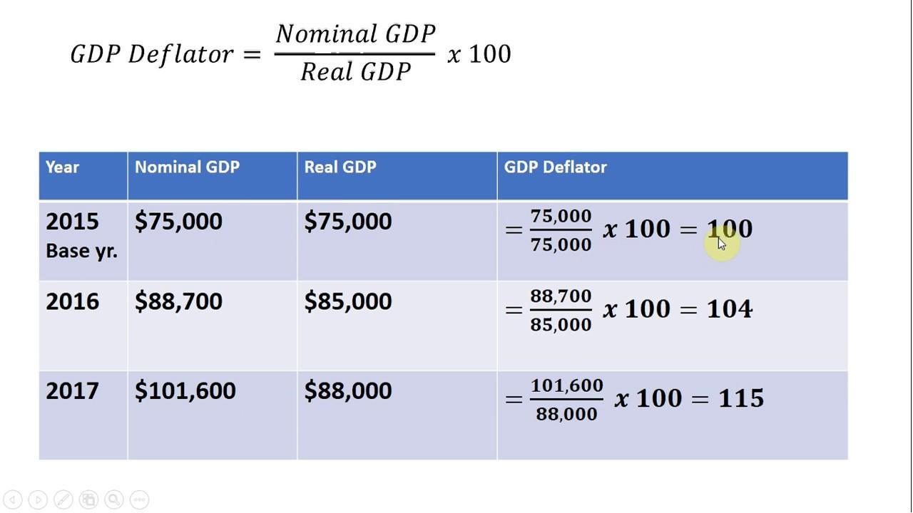

Understanding the complexities of economic indicators is vital for anyone involved in finance or economics. Economic indicators, such as inflation measures, provide critical insights that influence decision-making processes for policymakers, investors, and traders alike. Among these indicators, the GDP Price Deflator stands out as a comprehensive tool for measuring inflation across a broad spectrum of goods and services.

The GDP Price Deflator is instrumental in painting an accurate picture of an economy's overall price changes, as it captures the variations in prices for all domestically produced goods and services. Unlike other indicators, such as the Consumer Price Index (CPI), which focuses narrowly on the purchasing patterns of urban consumers, the GDP Price Deflator offers a more expansive overview, accounting for changes in production and consumption patterns over time. This article examines the intricacies of the GDP Price Deflator, exploring its calculation, interpretation, and applications in modern economies.



The relevance of the GDP Price Deflator extends beyond theoretical economic analysis; it plays a pivotal role in practical applications, including algorithmic trading. In the context of algorithmic trading, where economic indicators are crucial for developing sophisticated trading strategies, the GDP Price Deflator helps traders formulate predictions and adjust their strategies based on the general price level changes within an economy. By integrating this economic indicator into their trading algorithms, traders can potentially enhance the accuracy and effectiveness of their decision-making processes.

By the end of this article, you will have a comprehensive understanding of how the GDP Price Deflator operates and why it is crucial for analyzing economic performance. This insight is invaluable not only for economists and policymakers but also for traders seeking to leverage economic data to optimize their strategies. The GDP Price Deflator is more than a measure of inflation; it is an essential component of modern economic analysis that has significant implications for economic policymaking and financial market operations.

## Table of Contents

## Understanding the GDP Price Deflator

The GDP Price Deflator is an essential economic metric used to gauge the average change in prices across all final goods and services produced within a nation over a specific period. Unlike the Consumer Price Index (CPI), which is limited to a fixed basket of consumer goods and services, the GDP Price Deflator encompasses a comprehensive range of products, thus offering a more extensive view of inflation and deflationary trends in an economy.

The calculation of the GDP Price Deflator begins with the values of Nominal GDP and Real GDP. Nominal GDP reflects the value of all goods and services produced based on current prices, while Real GDP measures the value using constant prices from a base year. The formula to calculate the GDP Price Deflator is expressed as follows:

$$
\text{GDP Price Deflator} = \left(\frac{\text{Nominal GDP}}{\text{Real GDP}}\right) \times 100
$$

This formula indicates how the general price level in an economy has evolved since the base year. A GDP Price Deflator greater than 100 signifies that the average price levels have increased, or inflation has occurred since the base year. Conversely, a value less than 100 implies a deflationary trend, indicating that prices have fallen.

The GDP Price Deflator's significance lies in its ability to provide a more inclusive view of price changes due to its ability to account for all domestically produced goods and services. This attribute makes it a crucial tool in economic studies, aiding analysts and policymakers in differentiating between changes in GDP attributed to price shifts and genuine variations in the [volume](/wiki/volume-trading-strategy) of production.

An important aspect of the GDP Price Deflator is its adaptability; the basket of goods and services can change as the economy evolves, whereas the CPI is limited to a fixed set of items, leading to the potential for discrepancies between the two measures. Consequently, the GDP Price Deflator is often preferred when making broad economic assessments, particularly when determining the real growth of an economy and when having a more holistic perspective on price changes is desired.

## How the GDP Price Deflator Measures Inflation

The GDP Price Deflator is a comprehensive metric used to measure inflation by reflecting changes in the price levels of all finished goods and services within an economy. By examining both nominal and real GDP, the GDP Price Deflator provides a nuanced view of economic growth, attributing growth to either increases in production or hikes in price levels. 

To understand how the GDP Price Deflator measures inflation, it is essential to grasp its calculation method. The formula is expressed as:

$$
\text{GDP Deflator} = \left( \frac{\text{Nominal GDP}}{\text{Real GDP}} \right) \times 100
$$

In this formula:
- **Nominal GDP** is the total market value of all final goods and services produced in an economy, unadjusted for inflation, during a specific period.
- **Real GDP** adjusts for changes in price level, providing a more accurate representation of an economy's size and the value of its output.

The GDP Deflator enables economists to discern how much of the growth in nominal GDP results from actual increases in production output rather than inflation. Since Real GDP accounts for price changes by using constant base-year prices, dividing Nominal GDP by Real GDP gives a ratio that isolates the effect of inflation.

Understanding the GDP Price Deflator is crucial for adjusting economic metrics for inflation. In practice, it allows policymakers and analysts to differentiate between genuine growth in the economy versus growth driven purely by inflationary pressures. For instance, if the GDP deflator indicates a high rate of inflation, it can suggest that the growth seen in the Nominal GDP is largely due to price increases rather than an increase in the output of goods and services.

Using the GDP Deflator provides several advantages. Unlike indices such as the Consumer Price Index (CPI), which focus on a fixed basket of goods, the GDP Deflator encompasses all domestically produced goods and services, providing a broader gauge of inflation. Moreover, since the GDP Deflator does not rely on a fixed basket, but rather on current production, it adapts to changes in the economy's structure and can capture shifts in consumption patterns and the introduction of new goods and services.

This attribute makes the GDP Price Deflator a versatile and comprehensive tool for understanding inflation, essential for making informed economic decisions.

## Comparing GDP Deflator with Consumer Price Index (CPI)

The GDP Deflator and the Consumer Price Index (CPI) are both pivotal in measuring inflation, yet they serve distinct roles and are constructed differently. Understanding these differences is crucial for their appropriate application in economic analysis.

The GDP Deflator measures changes in the prices of all new, domestically produced goods and services in an economy. It is calculated as the ratio of nominal GDP to real GDP, multiplied by 100:

$$
\text{GDP Deflator} = \left( \frac{\text{Nominal GDP}}{\text{Real GDP}} \right) \times 100
$$

This formula reflects how much of an economy's growth is due to changes in the price level rather than changes in the volume of goods and services. Importantly, the GDP Deflator covers the entire spectrum of goods and services produced domestically, including investment goods, government services, and exports, but excludes imports since they are not part of domestic production.

Contrastingly, the CPI measures the average change in prices paid by consumers for a basket of goods and services over time. It is typically based on a fixed basket that represents consumption patterns of households, focusing on specific categories such as food, housing, clothing, transportation, and medical services. The formula for CPI is:

$$
\text{CPI} = \left( \frac{\text{Cost of Basket in Current Year}}{\text{Cost of Basket in Base Year}} \right) \times 100
$$

The CPI is a fixed-weight index, meaning it doesn't consider changes in consumption patterns as prices change. In this respect, the GDP Deflator is more flexible, as it adjusts for shifts in consumption by including only those goods and services produced within the economy.

The distinct compositions and scopes of these inflation measures dictate their different uses. The GDP Deflator is particularly useful for capturing changes over a wide economic scale since it encompasses a broader set of goods and services. It is often employed in policy-making and economic forecasting, enabling a comprehensive view of price level changes. The CPI, with its consumer-oriented focus, is more applicable in adjusting social security payments, salaries, and other contracts that must take consumer inflation into account.

In summary, while both the GDP Deflator and CPI are indispensable tools for understanding inflation, they offer different perspectives suitable for various types of economic analysis and policy application. The GDP Deflator provides a holistic view of price changes across the economy, whereas the CPI is centered on consumer expenses and is more reflective of immediate impacts on households.

## The Role of GDP Price Deflator in Economic Policy

The GDP Price Deflator serves as an essential instrument in economic policy-making. It allows governments and central banks to assess and respond to changes in the price level, crucially informing both fiscal and monetary strategies. By providing a comprehensive measure of inflation across all goods and services within an economy, the GDP Deflator enables policymakers to distinguish between nominal economic growth, which includes both price changes and actual volume changes, and real growth, which isolates the latter.

### Fiscal Policy Adjustments

Governments often rely on the GDP Deflator to calibrate fiscal policy. By understanding changes in the GDP Price Deflator, policymakers can adjust government spending and taxation levels to stabilize the economy. For instance, during periods of rising inflation indicated by an increasing GDP Deflator, a government might decide to reduce public spending or increase taxes to curb inflationary pressures. Conversely, during deflationary periods or when the GDP Deflator suggests falling prices, governments may boost spending or cut taxes to stimulate economic activity.

### Monetary Policy and Interest Rates

Central banks often use the GDP Price Deflator as a guide for setting interest rates. The primary objective of many central banks is to maintain price stability, which entails managing inflation. The GDP Deflator provides insights into broad inflation trends, complementing other measures like the Consumer Price Index (CPI). When the GDP Deflator indicates excessive inflation, central banks may increase interest rates to control spending and borrowing, thereby cooling off the economy. Alternatively, if the deflator suggests deflation, reducing interest rates might encourage borrowing and spending, aiming to spur economic growth.

### Adjusting Contracts and Economic Forecasts

The GDP Deflator is also instrumental in the adjustment of long-term contracts and economic forecasts. Inflation indexing in contracts, such as wage agreements or rental contracts, often requires a reliable measure of inflation. Utilizing the GDP Deflator helps ensure that these adjustments accurately reflect the economy-wide changes in price levels. Moreover, economic forecasts and budgetary projections by governments incorporate the GDP Deflator to predict future economic conditions and plan accordingly.

### Conclusion

In summary, the GDP Price Deflator's application extends beyond academic and theoretical analysis, serving as a critical tool in the formulation of economic policies. Its ability to measure inflation across a wide array of market goods and services provides valuable insights for policymakers looking to maintain economic stability and foster growth. Understanding the GDP Deflator's role in policy adjustments underscores its significance in the strategic planning and decision-making processes of both government entities and central banking institutions.

## Implications for Algorithmic Trading

Algorithmic trading relies heavily on timely and accurate economic indicators to craft strategies and predict market movements. The GDP Price Deflator, as a broad measure of price changes for all final goods and services within an economy, serves as a pivotal component in these trading algorithms. 

Unlike the Consumer Price Index, which captures consumer-focused inflation, the GDP Price Deflator accounts for a wide array of economic sectors. This allows algorithmic traders to gain a comprehensive understanding of inflationary pressures that affect different asset classes. For instance, an increase in the GDP Price Deflator could signal rising costs across the economy, prompting traders to adjust their positions in equities or commodities accordingly.

### Utilizing the GDP Price Deflator

Algorithmic traders integrate the GDP Price Deflator into their models to inform both strategic and tactical decisions. By assessing the deviation between nominal GDP (total market value at current prices) and real GDP (market value at constant prices), traders can calculate the GDP Price Deflator as follows:

$$
\text{GDP Price Deflator} = \left( \frac{\text{Nominal GDP}}{\text{Real GDP}} \right) \times 100
$$

This relationship allows traders to adjust nominal figures for inflation and evaluate the true growth in economic activities. A significant discrepancy between nominal and real GDP might prompt traders to revise their predictive models or rebalance their portfolios.

### Real-Time Economic Data Integration

Real-time integration of economic data such as the GDP Price Deflator presents a substantial advantage for [algorithmic trading](/wiki/algorithmic-trading). The process involves using APIs to stream updated deflator values directly into trading algorithms. This ensures that algorithms operate on the most recent data, enhancing their responsiveness to market conditions.

Here’s a basic example of how Python could be used to integrate real-time updates:

```python
import requests

def fetch_gdp_deflator(api_url):
    response = requests.get(api_url)
    data = response.json()
    gdp_deflator = data['gdp_deflator']
    return gdp_deflator

gdp_deflator_value = fetch_gdp_deflator("https://example.com/api/economic-data")
```

By utilizing such methods, traders can continuously refine their models, ensuring they adjust to new economic data as soon as it becomes available.

### Potential for Strategy Adaptation

The GDP Price Deflator is particularly useful for constructing strategies that require a macroeconomic perspective. Its broad scope makes it ideal for strategies that are sensitive to policy shifts or sectoral inflationary trends. Algorithmic traders can anticipate [interest rate](/wiki/interest-rate-trading-strategies) changes, for example, by assessing trends in the GDP Price Deflator, thus positioning themselves well ahead of formal announcements by central banks.

In conclusion, the integration of the GDP Price Deflator into algorithmic trading systems allows traders to make informed decisions based on comprehensive and up-to-date inflation metrics. This integration is crucial for maintaining a competitive advantage in an ever-changing economic landscape.

## Conclusion

The GDP Price Deflator serves as an essential indicator for capturing inflationary trends across an entire economy. Unlike price indices that may focus narrowly on specific baskets of goods, the GDP Price Deflator considers the full spectrum of goods and services produced domestically, offering a more comprehensive measure of inflation. It is calculated by dividing nominal GDP by real GDP and multiplying the result by 100, which allows analysts to discern how much of the GDP's nominal increase is due to real growth as opposed to inflation.

$$
\text{GDP Price Deflator} = \left( \frac{\text{Nominal GDP}}{\text{Real GDP}} \right) \times 100
$$

This broad measure is particularly advantageous for economic analysts seeking to understand the underlying factors affecting an economy's growth. By differentiating between real economic growth and inflationary pressures, the GDP Price Deflator provides crucial insights that can guide economic policy and financial decision-making.

For economists, this metric aids in the creation of models and projections that [factor](/wiki/factor-investing) in true economic growth, stripped of inflationary distortion. Policymakers utilize it to assess the effectiveness of fiscal and monetary policies, adjusting them to maintain economic stability. In terms of central banking, changes in the GDP Price Deflator can inform interest rate decisions, influencing borrowing costs and consumer spending.

Traders, particularly those engaged in algorithmic trading, incorporate this data to recalibrate algorithms that forecast market movements. Real-time integration of GDP Price Deflator data can enhance the precision of trading strategies, providing an edge in financial markets by anticipating macroeconomic trends.

In sum, the GDP Price Deflator is not just an academic measure but a practical tool aiding diverse stakeholders in navigating economic complexities. Its comprehensive nature makes it indispensable for accurately interpreting economic conditions and making informed policy and investment decisions.

## References & Further Reading

[1]: ["Understanding the GDP Price Deflator"](https://www.investopedia.com/terms/g/gdppricedeflator.asp) - U.S. Bureau of Economic Analysis

[2]: Mankiw, N. G. (2014). ["Principles of Macroeconomics"](https://www.amazon.com/Principles-Macroeconomics-N-Gregory-Mankiw/dp/1285165918). Cengage Learning. 

[3]: Samuelson, P. A., & Nordhaus, W. D. (2009). ["Economics"](https://archive.org/details/economics0000samu). McGraw-Hill Education.

[4]: ["Economic Indicators for Professionals: Understand arithmetic, history, and political economy"](https://www.amazon.com/Economic-Indicators-Professionals-Statistics-Perspective/dp/1138559245) by Charles W. Upton

[5]: ["Advances in Financial Machine Learning"](https://www.amazon.com/Advances-Financial-Machine-Learning-Marcos/dp/1119482089) by Marcos Lopez de Prado

[6]: ["Quantitative Trading: How to Build Your Own Algorithmic Trading Business"](https://www.amazon.com/Quantitative-Trading-Build-Algorithmic-Business/dp/1119800064) by Ernest P. Chan