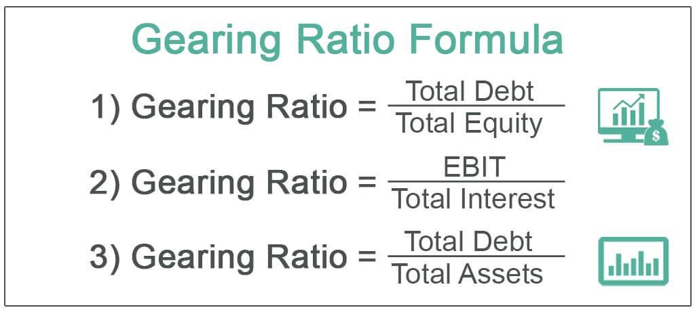

In today's dynamic financial environment, understanding key financial metrics is essential for both individual and institutional investors. These metrics serve as important tools for assessing financial health, performance, and risk within investment strategies. Among these metrics, the gearing ratio and leverage are fundamental, playing pivotal roles in financial analysis and trading strategy development.

The gearing ratio, which measures a company's financial leverage through its debt-to-equity ratio, provides insight into the balance of debt and equity financing. A high gearing ratio indicates a greater reliance on borrowed funds, raising the stakes during economic downturns, whereas a low gearing ratio reflects conservative financial practices, potentially limiting growth opportunities.

Leverage involves the strategic use of borrowed capital to amplify potential returns on investments. While leverage can enhance profitability, it also increases exposure to risk, necessitating careful management and analysis. In trading contexts, especially in algorithmic trading, leverage is harnessed to execute rapid and complex strategies aimed at optimizing returns.

Algorithmic trading, which employs computer programs to make trades based on predefined criteria, relies heavily on financial metrics like gearing ratio and leverage to refine and enhance trading strategies. These metrics, alongside others such as the Sharpe Ratio and Maximum Drawdown, form the backbone of algorithm-driven decision-making processes, helping traders manage risk and enhance strategy performance.

As traders and investors navigate the intricacies of financial markets, mastering these financial metrics is crucial. An informed understanding of gearing ratios and leverage enables the development of robust investment strategies and the responsible management of financial risks and opportunities. Engaging with these concepts not only aids in strategic decision-making but also ensures competitiveness in the ever-evolving financial landscape.

## Table of Contents

## Understanding Key Financial Metrics

Financial metrics are essential indicators used to evaluate a company's financial health and operational efficiency. Among these metrics, the gearing ratio stands out as a crucial measure of financial leverage. It is calculated using the debt-to-equity ratio, which is expressed as:

$$
\text{Gearing Ratio} = \frac{\text{Total Debt}}{\text{Total Equity}}
$$

This ratio provides insight into the degree to which a company is funding its operations through debt versus wholly owned funds. A high gearing ratio indicates that a company is heavily reliant on borrowed funds, which can increase its financial risk, especially during economic downturns. Conversely, a low gearing ratio suggests that a company is utilizing more of its own equity to finance its activities, potentially limiting its growth opportunities but offering a safer cushion against financial [volatility](/wiki/volatility-trading-strategies).

Leverage, in a broader sense, refers to the use of various financial instruments or borrowed capital—such as debt—to increase the potential return of an investment. By leveraging, a company can enhance its returns on investment, though this comes with increased risk. The careful analysis of leverage is crucial because while it can amplify returns, it can also magnify losses if the venture does not perform as expected.

The significance of these financial metrics lies in their ability to assess a company’s stability and growth potential. Companies with optimal gearing ratios and well-managed leverage are often better positioned for sustainable growth and can attract investors who are mindful of risk and return balance. Conversely, companies with excessively high leverage might pose higher risks, which could deter potential investors.

In summary, understanding and utilizing financial metrics like the gearing ratio and leverage is key for evaluating a company's financial strategy. These metrics not only help in assessing the current financial health of a company but also in predicting future performance, enabling both individual and institutional investors to make informed decisions.

## The Role of Gearing Ratio in Financial Analysis

The gearing ratio is a vital tool in financial analysis, offering insights into the proportional relationship between a company's debt and equity. This metric is crucial in assessing financial stability, as it reflects how a company funds its operations and growth. The formula for the gearing ratio is typically expressed as:

$$
\text{Gearing Ratio} = \frac{\text{Total Debt}}{\text{Total Equity}} \times 100
$$

A high gearing ratio indicates significant reliance on borrowed funds. This dependence may lead to increased financial risk, especially during economic downturns. Companies with high gearing ratios are more vulnerable to fluctuations in interest rates, which can escalate borrowing costs and impact profitability. For instance, if a company has a gearing ratio of 75%, it means that 75% of its capital structure is financed through debt, signifying a high level of financial commitment to external lenders.

On the contrary, a low gearing ratio suggests a conservative approach to financing, with a greater reliance on equity. Although this can limit growth opportunities due to the potential underutilization of debt financing benefits, it generally enhances financial stability. A company with a lower gearing ratio may be better positioned to weather economic volatility, as it faces reduced pressure from debt obligations.

Investors use gearing ratios to inform investment decisions by evaluating the financial health and risk profile of companies. A company with a stable gearing ratio might be seen as a safer investment, particularly for risk-averse investors. For those seeking growth opportunities, a company with a higher gearing ratio may be attractive, provided the associated risks are justifiable by the potential for higher returns.

In conclusion, understanding the gearing ratio is essential for analyzing a company's financial structure and enabling informed investment decisions. By assessing this ratio, investors can gauge a company's risk exposure and its approach to balancing debt and equity, thus shaping strategic investment considerations.

## Leverage in Financial Operations

Leverage plays a pivotal role in financial operations, acting as a multiplier for both gains and losses. By utilizing borrowed capital, companies and investors can amplify their potential returns on investment. This strategic use of leverage can lead to improved financial outcomes, especially in trading, where the ability to quickly seize opportunities can confer a significant competitive advantage. 

### Strategic Use of Leverage

In trading, leverage allows investors to increase their market exposure beyond their actual investment capital. For instance, with a leverage ratio of 10:1, an investor can control a position worth $100,000 with just $10,000 of their own money. This amplification of financial capacity can significantly boost profitability when markets move favorably. However, the risks are equally magnified if the market turns against the position.

Various industries apply leverage differently. In real estate, for example, developers often use high levels of debt to finance construction projects, betting on the final property's greater value and revenue potential to cover the initial outlay and generate profit. Similarly, in private equity, firms leverage borrowed funds to acquire companies, targeting operational improvements and strategic changes that will increase the acquired company's value.

### Risks and Mitigation Strategies

While leverage can enhance returns, it also introduces significant risk. The most evident risk is financial distress or insolvency during economic downturns, as obligations on debt must be met regardless of income fluctuations. High leverage can lead to volatile earnings, increased financial strain, and, in worst cases, bankruptcy.

To mitigate these risks, financial and risk management strategies are essential. One common approach is to maintain a balance between debt and equity - ensuring that leverage does not surpass a level that would jeopardize financial stability. Setting strict stop-loss limits on trading positions can also prevent excessive losses, and diversifying investments can spread risk.

Another approach involves stress testing leveraged investments against adverse market conditions, thus preparing strategies for potential downturns. A prudent management practice is maintaining a [liquidity](/wiki/liquidity-risk-premium) buffer to cover debt obligations during periods of reduced cash flow.

In conclusion, while leverage is a powerful tool for financial enhancement, it requires careful and strategic application to balance potential profits against inherent risks. Robust risk management practices are vital to harnessing the benefits of leverage without exposing investors and companies to undue risk.

## Algorithmic Trading and Financial Metrics

Algorithmic trading involves leveraging computer algorithms to automate and execute trades in financial markets based on predefined criteria. This approach enables traders to respond quickly to market conditions and capitalize on opportunities with precision and speed. Central to the efficacy of [algorithmic trading](/wiki/algorithmic-trading) are financial metrics such as the gearing ratio and leverage, which are critical for developing and optimizing trading strategies.

Financial metrics play a pivotal role in evaluating the performance and risk associated with algorithmic trading strategies. Among these, the Sharpe Ratio and Maximum Drawdown stand out as essential tools for traders.

The Sharpe Ratio, defined as  
$$

\text{Sharpe Ratio} = \frac{E[R_p] - R_f}{\sigma_p} 
\]  
where $E[R_p]$ is the expected return of the portfolio, $R_f$ is the risk-free rate, and $\sigma_p$ is the standard deviation of the portfolio's excess return, provides a measure of risk-adjusted returns. This metric helps traders assess how well the return of an investment compensates for the risk taken, making it invaluable for comparing the attractiveness of different trading strategies.

Maximum Drawdown (MDD), another critical metric, quantifies the largest loss from a peak to a trough before a new peak is achieved. It is calculated as:  
$$

\text{MDD} = \frac{\text{Trough Value} - \text{Peak Value}}{\text{Peak Value}} 
\]  
This metric is crucial for understanding the worst-case scenario and the robustness of a trading strategy over time, helping traders to evaluate potential risks.

Incorporating financial metrics like gearing ratio and leverage in algorithmic trading allows for more informed decision-making. The gearing ratio aids in assessing a company's financial structure, which can influence a stock's volatility and, consequently, the risk level of an algorithmic strategy. Meanwhile, leverage magnifies the exposure and potential returns, but also enhances risk, necessitating careful management.

Developing an optimized trading algorithm requires integrating these financial metrics to balance risk and reward appropriately. For instance, high leverage might increase returns in favorable conditions, but it also escalates risk exposure if market movements are adverse. Thus, metrics like the Sharpe Ratio and Maximum Drawdown assist traders in refining strategies to maximize profitability while controlling for risk.

Overall, algorithmic trading's success substantially relies on integrating robust financial metrics, which enhance decision-making and optimize trading strategies, aligning them with desired risk-return profiles.

## Pros and Cons of Using Leverage in Algo Trading

Leveraging algorithms in trading offers distinct advantages, foremost of which is the capacity to execute complex strategies with speed and precision, thereby potentially increasing profits. This capability allows traders to quickly respond to market changes and capitalize on short-lived opportunities that might be missed in manual trading scenarios. For instance, algorithmic trading can optimize timing and sizing of trades, implement [arbitrage](/wiki/arbitrage) strategies, or even execute high-frequency trades that exploit minor price discrepancies between markets.

However, the use of leverage in algorithmic trading can amplify both gains and losses, introducing significant risk and increasing volatility. Relying heavily on borrowed capital amplifies the impact of price movements, which can lead to substantial losses if the market moves unfavorably. This is because leverage effectively magnifies the exposure beyond the original investment, thus increasing the potential for abrupt financial distress during adverse market conditions.

To mitigate these risks, traders often implement rigorous risk management practices within their trading algorithms. One approach involves setting predefined limits on the level of leverage used in strategies, ensuring it aligns with the trader's risk tolerance. For example, many algo traders employ stop-loss orders, which automatically liquidate positions at a certain loss threshold to prevent further downside. Additionally, diversification across multiple assets or strategies can help spread risk, reducing the impact of a single adverse event.

Another crucial strategy involves constant monitoring and adjustment of algorithm parameters based on changing market conditions. By employing adaptive algorithms that use real-time data to reassess risk and adjust leverage levels dynamically, traders can manage exposure more effectively. Implementing [backtesting](/wiki/backtesting) and stress testing prior to deployment can also help in identifying potential pitfalls and adjusting the strategy accordingly to withstand market fluctuations.

Successful algo traders often use metrics such as the Sharpe Ratio to balance returns against risk, ensuring that increased leverage isn't compromising the overall risk profile of the strategy. A higher Sharpe Ratio indicates better risk-adjusted returns, which can guide traders in optimizing their leverage use.

In conclusion, while leveraging in algorithmic trading opens pathways to enhanced returns, it necessitates a balanced approach that incorporates comprehensive risk management strategies. Employing technology and quantitative metrics for monitoring and adjustment can enable traders to harness the benefits of leverage while mitigating its inherent risks.

## Conclusion

In conclusion, comprehending and effectively utilizing financial metrics such as the gearing ratio and leverage are foundational to successful investment strategies. These metrics serve as essential tools for assessing a company's financial architecture and the potential risks and returns of investment decisions.

Algorithmic trading offers a highly systematic approach to maximizing the benefits these financial metrics provide. By incorporating them into algorithmic models, traders can automate decision-making processes that adapt to real-time data, allowing for more precise and timely execution of trades. For instance, algorithms can dynamically adjust portfolios based on current gearing ratios, optimizing risk exposure according to market conditions.

A crucial aspect of successful trading lies in understanding and managing financial leverage responsibly. Leverage can amplify both gains and losses, making it vital for traders to judiciously balance potential returns with associated risks. A comprehensive risk management strategy can mitigate the negative impacts of high leverage, using tools such as stop-loss orders and position sizing to protect against volatile market swings.

The financial landscape is continually evolving, driven by technological advances and shifting market dynamics. For traders and investors, ongoing education and adaptation to these changes are paramount. By acquiring and updating their knowledge of financial metrics and leveraging algorithmic solutions, market participants can maintain a competitive edge. The commitment to mastering these concepts not only enhances current trading strategies but also fosters long-term success in an increasingly complex market environment.

## References & Further Reading

[1]: Bergstra, J., Bardenet, R., Bengio, Y., & Kégl, B. (2011). ["Algorithms for Hyper-Parameter Optimization."](https://dl.acm.org/doi/10.5555/2986459.2986743) Advances in Neural Information Processing Systems 24.

[2]: ["Advances in Financial Machine Learning"](https://www.amazon.com/Advances-Financial-Machine-Learning-Marcos/dp/1119482089) by Marcos Lopez de Prado

[3]: ["Evidence-Based Technical Analysis: Applying the Scientific Method and Statistical Inference to Trading Signals"](https://www.amazon.com/Evidence-Based-Technical-Analysis-Scientific-Statistical/dp/0470008741) by David Aronson

[4]: ["Machine Learning for Algorithmic Trading"](https://github.com/PacktPublishing/Machine-Learning-for-Algorithmic-Trading-Second-Edition) by Stefan Jansen

[5]: ["Quantitative Trading: How to Build Your Own Algorithmic Trading Business"](https://books.google.com/books/about/Quantitative_Trading.html?id=j70yEAAAQBAJ) by Ernest P. Chan