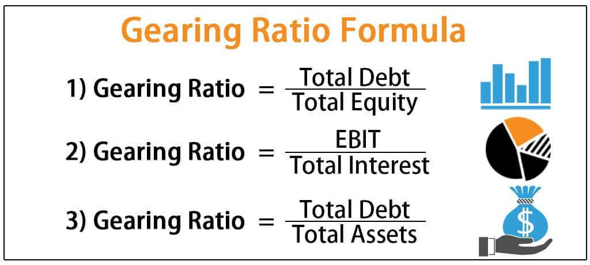

Financial ratios are critical tools used by analysts and investors to assess a company's financial health. They offer quantifiable metrics that provide insights into various dimensions of a company's operations, including its profitability, liquidity, efficiency, and leverage. By distilling complex financial statements into comprehensible numbers, financial ratios facilitate a deeper understanding of a firm's performance and risk profile, enabling more informed decision-making.

Among the various financial ratios, gearing ratios stand out for their role in evaluating a company's financial leverage. Gearing ratios, such as the Debt-to-Equity Ratio and Interest Coverage Ratio, measure the extent to which a company utilizes borrowed funds versus shareholders' equity to finance its operations. These ratios provide insight into the financial structure of an organization, highlighting the balance between debt and equity. Financial leverage, as assessed through gearing ratios, is pivotal in understanding the risk-return dynamics faced by a company, especially during volatile market conditions.



In recent years, the financial industry has experienced a significant transformation with the rise of automated trading, also known as algorithmic trading or algo trading. This mechanism uses computer algorithms to execute trading orders at high speeds and volumes, often leveraging complex mathematical models and strategies. Algo trading has increasingly gained prominence due to its ability to enhance trading efficiency, reduce costs, and capture fleeting market opportunities.

This article explores how gearing ratios can be integrated into algo trading strategies to enhance decision-making capabilities. By understanding and calculating key gearing ratios, traders can incorporate financial leverage indicators into algorithms that guide trading actions. The use of these ratios can potentially refine trading signals, leading to more effective automated trading strategies.

The goal of this article is multifaceted: it aims to elucidate the calculation methods for gearing ratios and demonstrate their applicability in algorithmic trading. By doing so, the article seeks to enrich the knowledge of those interested in leveraging financial analysis within the increasingly data-driven environment of modern financial markets.

## Table of Contents

## Understanding Financial Ratios

Financial ratios are essential tools in financial analysis, providing quantitative insights into various facets of a company's financial performance. These ratios, derived from a company’s financial statements, are used to evaluate profitability, liquidity, efficiency, and leverage.

**Profitability Ratios** measure a company's ability to generate profit relative to its revenue, assets, or equity. Common profitability ratios include the Net Profit Margin, Return on Assets (ROA), and Return on Equity (ROE). For example, ROE is calculated as:

$$
\text{ROE} = \frac{\text{Net Income}}{\text{Shareholder's Equity}}
$$

These ratios help investors assess how well a company is using its resources to generate earnings.

**Liquidity Ratios** assess a company's ability to meet short-term obligations. The Current Ratio and Quick Ratio are frequently used metrics. The Current Ratio is calculated as:

$$
\text{Current Ratio} = \frac{\text{Current Assets}}{\text{Current Liabilities}}
$$

A higher [liquidity](/wiki/liquidity-risk-premium) ratio suggests that a company can comfortably cover its short-term debts, which is crucial for avoiding financial distress.

**Efficiency Ratios** analyze how effectively a company utilizes its assets and liabilities to generate sales and maximize profitability. Important efficiency ratios include Asset Turnover Ratio and Inventory Turnover Ratio. The Asset Turnover Ratio can be calculated as:

$$
\text{Asset Turnover Ratio} = \frac{\text{Net Sales}}{\text{Average Total Assets}}
$$

These ratios enable analysts to understand a firm's operational efficiency and asset management.

**Leverage Ratios** evaluate the extent of a company's financial leverage, reflecting the balance between equity and debt and its implications for financial risk. Common leverage ratios such as the Debt-to-Equity Ratio and Interest Coverage Ratio are used to assess the sustainability of a company's capital structure. The Debt-to-Equity Ratio is computed by:

$$
\text{Debt-to-Equity Ratio} = \frac{\text{Total Debt}}{\text{Shareholder's Equity}}
$$

Investors and analysts rely on these financial ratios for decision-making as they provide a comprehensive view of a company’s financial health. Ratios facilitate comparison over time and across firms, helping identify strengths and potential risk areas. By highlighting key financial trends and potential red flags, ratios support strategic investments and financial planning.

## What are Gearing Ratios?

Gearing ratios are a specialized category of financial ratios that serve as a critical tool for evaluating a company's financial structure. These ratios are primarily concerned with assessing the degree of a company's financial leverage, which is the extent to which a company utilizes borrowed funds to finance its operations and growth. Understanding the financial leverage of a company is crucial in risk and return analysis as it helps stakeholders gauge the potential risks involved with the company's debt levels in relation to its equity.

The Debt-to-Equity Ratio and the Interest Coverage Ratio are among the most commonly used gearing ratios. The Debt-to-Equity Ratio measures the proportion of a company's total liabilities to its shareholder equity. This ratio is crucial for investors and analysts as it provides insights into the balance between debt financing and equity financing. The formula for the Debt-to-Equity Ratio is:

$$
\text{Debt-to-Equity Ratio} = \frac{\text{Total Liabilities}}{\text{Shareholders' Equity}}
$$

A higher Debt-to-Equity Ratio implies a higher degree of financial leverage, which may indicate increased financial risk, especially in volatile markets or economic downturns.

On the other hand, the Interest Coverage Ratio assesses a company's ability to meet its interest obligations on outstanding debt. It is calculated by dividing a company's earnings before interest and taxes (EBIT) by its interest expenses. This ratio provides insights into how comfortably a company can pay interest on its outstanding debt with its operating income. The formula for the Interest Coverage Ratio is:

$$
\text{Interest Coverage Ratio} = \frac{\text{EBIT}}{\text{Interest Expenses}}
$$

A higher Interest Coverage Ratio suggests that a company is more capable of meeting its interest obligations, reflecting lower financial risk.

In summary, gearing ratios are pivotal for stakeholders as they reflect the implications of a company's capital structure on its financial stability and risk profile. By evaluating these ratios, analysts can gain insights into a company's financial strategy and its capacity to withstand financial pressures while seeking growth opportunities.

## Calculation Methods for Gearing Ratios

Gearing ratios are critical in evaluating a company's financial leverage, providing insights into the balance between equity and debt. Understanding how to compute these ratios can significantly enrich financial analysis, aiding both traditional and [algorithmic trading](/wiki/algorithmic-trading) strategies. This section details the calculation methods for key gearing ratios, demonstrated through examples and interpretations. 

### Debt-to-Equity Ratio

The Debt-to-Equity (D/E) Ratio is a fundamental gearing ratio, indicating the relative proportion of a company's debt to its shareholder equity. It quantifies financial leverage and the risk associated with a higher reliance on debt.

**Formula:**
$$
\text{Debt-to-Equity Ratio} = \frac{\text{Total Debt}}{\text{Total Equity}}
$$

**Example:**
Consider a company with a total debt of \$2,000,000 and total equity of \$5,000,000. 

$$
\text{D/E Ratio} = \frac{2,000,000}{5,000,000} = 0.4
$$

This implies the company uses \$0.4 of debt for every dollar of equity, indicating conservative leverage. 

### Interest Coverage Ratio

The Interest Coverage Ratio measures a company's ability to meet interest payments from its operational earnings. It's essential for understanding the sustainability of a company’s debt load.

**Formula:**
$$
\text{Interest Coverage Ratio} = \frac{\text{Earnings Before Interest and Taxes (EBIT)}}{\text{Interest Expenses}}
$$

**Example:**
Suppose a company has an EBIT of \$1,500,000 and interest expenses amounting to \$300,000.

$$
\text{Interest Coverage Ratio} = \frac{1,500,000}{300,000} = 5
$$

A ratio of 5 suggests the company earns five times its interest obligations, reflecting a strong capability to service its debt.

### Equity Ratio

The Equity Ratio focuses on the proportion of assets financed by shareholders' equity, reflecting financial stability.

**Formula:**
$$
\text{Equity Ratio} = \frac{\text{Total Equity}}{\text{Total Assets}}
$$

**Example:**
Consider a company with total equity of \$3,000,000 and total assets of \$7,000,000.

$$
\text{Equity Ratio} = \frac{3,000,000}{7,000,000} \approx 0.43
$$

This means 43% of the company's assets are financed by equity, suggesting a moderate reliance on equity financing.

### Considerations in Interpretation

When interpreting gearing ratios, it is crucial to contextualize them within the industry norms, as acceptable levels of financial leverage can vary significantly across sectors. Additionally, temporal trends in these ratios can signal shifts in corporate strategy or financial health. For example, a rising D/E Ratio could indicate increasing risk if not matched by rising profits or operational efficiencies.

Ultimately, these ratios, while insightful, should be complemented with qualitative analysis and other financial metrics to provide a holistic view of a company's financial stability and potential for growth.

 to Algorithmic Trading

Algorithmic trading, often referred to as algo trading, is a method of executing orders using automated and pre-programmed trading instructions accounting for variables such as time, price, and [volume](/wiki/volume-trading-strategy). This approach leverages computational power to rapidly analyze market data and execute trades more efficiently than traditional methods. Over the past decades, algo trading has gained significant prominence in modern financial markets due to its ability to manage large volumes of trades with precision and speed.

One of the primary efficiencies of algo trading is its capacity to minimize human intervention, reducing the risk of manual errors. This systematic approach enables traders and investors to capitalize on market opportunities by identifying patterns and executing trades in milliseconds. Such rapidity is impossible to achieve manually, making algo trading particularly advantageous in highly liquid markets where timing is crucial.

Algo trading provides traders with opportunities to utilize complex mathematical models and algorithms unavailable to traditional trading methods. These models can process vast amounts of market data in real-time, allowing traders to refine their strategies and optimize their transactions. Additionally, variables such as market [volatility](/wiki/volatility-trading-strategies) and price correlations can be programmed into algorithms, enabling dynamic and adaptive trading strategies that respond to changing market conditions.

Common types of algorithms used in trading include:

1. **Trend-Following Algorithms**: These strategies aim to capitalize on market trends by identifying and following trends in stock prices, commodities, or forex markets. They often use moving averages to signal trades when a trend is detected.

2. **Arbitrage Algorithms**: Arbitrage strategies exploit price discrepancies between different markets or instruments. Algo trading efficiently identifies these opportunities by quickly comparing prices and executing trades to profit from the differences.

3. **Market Making Algorithms**: These algorithms provide liquidity by continuously quoting buy and sell prices for a security and profiting from the spread. They require precise timing and execution to remain profitable.

4. **Mean Reversion Algorithms**: Based on the statistical premise that prices will revert to their historical mean, these algorithms identify securities that have deviated from their mean value and execute trades anticipating a return to the average.

5. **High-Frequency Trading (HFT) Algorithms**: HFT strategies initiate thousands of trades per second, capitalizing on minute price changes. This type of algorithm requires substantial infrastructure and regulatory scrutiny.

Incorporating these types of algorithms, algo trading continues to reshape the landscape of financial markets, enabling more sophisticated trading strategies and contributing to market efficiency. The growth of algorithmic trading underscores the importance of technology and quantitative analysis in devising effective trading operations, benefiting investors through potentially enhanced returns and reduced transaction costs.

## Incorporating Gearing Ratios into Algo Trading

Incorporating gearing ratios into algorithmic trading strategies allows traders to harness financial leverage indicators to enhance trading signals and optimize decision-making processes. Gearing ratios, which assess a company's financial leverage, can be pivotal in understanding a firm's risk and return profile. Algorithmic trading, which relies on predefined rules and quantitative data to execute trades, can benefit significantly from integrating these ratios to maximize efficiency and profitability.

**Integration Techniques**

1. **Data Feed Incorporation**: Algorithmic trading systems can be configured to continuously ingest and process real-time or periodic financial data, including gearing ratios. This data can be obtained from financial statements or platforms providing comprehensive financial metrics. For instance, debt-to-equity ratios can be compared across multiple companies to assess relative financial health and risk exposure.

2. **Signal Generation**: Gearing ratios can be employed as part of a broader set of indicators to generate trading signals. For example, a high debt-to-equity ratio might signal excessive leverage, potentially indicating a sell signal when combined with other technical indicators pointing towards overvaluation. Conversely, a low ratio could suggest a buy opportunity when the market underestimates a firm's resilience through lower financial leverage.

3. **Risk Management**: Financial leverage indicators such as gearing ratios are vital for assessing risk. Algorithms can integrate these ratios to adjust portfolio allocations dynamically. For instance, if the aggregate gearing ratios of holdings exceed a certain threshold, the algorithm might reduce exposure to highly leveraged firms to mitigate systemic risk.

4. **Backtesting Strategies**: Historical gearing ratio data can be used to backtest algorithmic strategies. By understanding how price movements correlate with past leverage levels, traders can refine predictive models. For example, code snippets in Python might look like:

```python
import pandas as pd

# Assume 'financial_data' is a DataFrame containing historical gearing ratios and stock prices
def calculate_correlation(financial_data):
    correlation = financial_data['Gearing_Ratio'].corr(financial_data['Stock_Price'])
    return correlation

financial_data = pd.read_csv('financial_data.csv')
correlation_result = calculate_correlation(financial_data)
print(f"Gearing Ratio and Stock Price Correlation: {correlation_result}")
```

**Examples of Application**

Traders might adopt a strategy where stocks with low interest coverage ratios, indicating potential difficulties in meeting interest obligations, are flagged for review when trading trends do not support business fundamentals. Additionally, by integrating moving averages of gearing ratios, systems may anticipate impending leverage adjustments, thus positioning trades in anticipation of debt restructurings or equity raises.

**Impact on Trading Strategy**

Integrating gearing ratios offers valuable insights into a company’s financial strategy, revealing how leverage affects profitability and volatility. When algorithmic systems consider these factors, they reflect a deeper analysis of financial health beyond price trends. This multi-dimensional analysis can lead to a more robust trading system, improving returns while mitigating risks associated with leverage volatility.

In conclusion, by integrating gearing ratios into trading algorithms, investors and traders can enhance their decision-making processes. This blend of financial analysis and automated trading allows for more dynamic and informed trading strategies that accommodate financial health indicators, ultimately improving investment outcomes.

## Benefits and Challenges

Utilizing gearing ratios within algorithmic trading frameworks offers several advantages. These financial metrics provide insights into a company's financial leverage, helping algorithmic models assess risk and make informed trading decisions. By incorporating gearing ratios, algorithms can identify companies with varying levels of debt and equity, potentially revealing investment opportunities or risks associated with financial leverage.

One key advantage of using gearing ratios is the ability to quantify a company's financial stability. Ratios like the Debt-to-Equity Ratio and Interest Coverage Ratio highlight a company's reliance on debt versus equity financing and its ability to cover interest obligations, respectively. For algorithmic trading systems, such insights can enhance decision-making by signaling buy, sell, or hold actions based on a company's leverage profile. High gearing ratios may indicate higher risk during economic downturns, while low gearing might suggest stability or under-leveraged growth potential.

However, integrating gearing ratios into algorithmic trading also presents challenges. Data accuracy is paramount, as discrepancies can lead to miscalculations and faulty trading signals. Algorithms must be designed to source reliable financial data, with continuous updates to reflect the latest market conditions. Interpretation challenges also arise due to the dynamic nature of financial markets. A company's optimal leverage may vary over time, influenced by industry trends and macroeconomic factors, necessitating adaptive algorithms that can recalibrate trading strategies in response to evolving market dynamics.

Moreover, algorithmic strategies solely based on financial ratios might lack the depth required for successful trading. It is crucial to combine financial analysis with technical indicators to foster a holistic approach. Technical indicators can provide additional layers of information, such as trend strength and market [momentum](/wiki/momentum), complementing financial ratio analysis. This integrated strategy can enhance the robustness of trading algorithms, improving their capacity to generate superior risk-adjusted returns.

To illustrate this integration, consider a Python snippet combining gearing ratios with a moving average crossover strategy:

```python
import pandas as pd

def calculate_debt_to_equity_ratio(debt, equity):
    return debt / equity

def moving_average_crossover(prices, short_window, long_window):
    signals = pd.DataFrame(index=prices.index)
    signals['price'] = prices
    signals['short_mavg'] = prices.rolling(window=short_window, min_periods=1, center=False).mean()
    signals['long_mavg'] = prices.rolling(window=long_window, min_periods=1, center=False).mean()
    signals['signal'] = 0.0
    signals['signal'][short_window:] = np.where(signals['short_mavg'][short_window:] > signals['long_mavg'][short_window:], 1.0, 0.0)
    signals['positions'] = signals['signal'].diff()

    return signals

# Example usage:
debt = 500000
equity = 200000
debt_to_equity = calculate_debt_to_equity_ratio(debt, equity)

# Assuming 'price_data' is a pandas Series containing historical price data
signals = moving_average_crossover(price_data, short_window=40, long_window=100)

# Adjusting trading logic based on debt-to-equity ratio
if debt_to_equity > 2:  # High leveraging
    # Adjust strategy for higher risk
    signals['adjusted_signal'] = signals['signal'] * 0.5
else:
    signals['adjusted_signal'] = signals['signal']
```

In summary, leveraging gearing ratios within algorithmic trading offers valuable insights for assessing financial leverage. While challenges exist, particularly in data accuracy and interpretation, blending these ratios with technical indicators can significantly enhance the efficacy of algorithmic trading strategies.

## Case Studies and Real-World Applications

To demonstrate the practical application of gearing ratios in algorithmic trading, it is instructive to examine real-world case studies where these ratios have been effectively integrated into trading algorithms, impacting investment decisions and outcomes significantly.

### Case Study 1: Debt-to-Equity Ratio in Risk Management

A prominent [hedge fund](/wiki/hedge-fund-trading-strategies) employed the Debt-to-Equity (D/E) ratio as a key variable in its risk assessment model for trading equities. This strategy was predicated on the hypothesis that companies with a lower D/E ratio, indicating more conservative leverage, tend to have a steadier performance and are less vulnerable to economic downturns. By incorporating this ratio into its algorithm, the fund could dynamically adjust its exposure to stocks based on prevailing market conditions.

**Outcome and Lessons Learned:**

The algorithm consistently increased exposure to lower D/E ratio stocks during volatile market conditions, which subsequently resulted in lower portfolio drawdowns compared to benchmarks. This application illustrated the importance of incorporating financial health indicators into trading strategies, underscoring the value of risk management focused on financial leverage.

### Case Study 2: Interest Coverage Ratio in Fixed Income Trading

An investment firm specializing in fixed income products integrated the Interest Coverage Ratio (ICR) into its bond selection algorithm. The ICR, which measures a company's ability to pay interest on its outstanding debt, was used to assess the creditworthiness of bond issuers. Companies with higher ICR values were deemed less risky and thus more attractive, particularly in an environment of rising interest rates.

**Outcome and Lessons Learned:**

The algorithm favorably selected bonds from issuers with robust ICRs, resulting in a portfolio with enhanced credit quality and reduced default risk. This case highlighted the utility of gearing ratios not just in equity markets, but also in fixed income trading, where credit assessment is paramount. The success of this strategy emphasized the importance of integrating fundamental indicators into credit risk assessment frameworks.

### Case Study 3: Combined Gearing Ratios in Equity Strategy

A [quantitative trading](/wiki/quantitative-trading) firm created a composite gearing ratio metric by combining the D/E ratio and ICR to assess overall leverage and risk. This metric was used to identify equities with optimal financial structures—low relative debt but sufficient earnings to service their obligations. The composite indicator directed the firm's algorithmic trading strategy to focus on such equities.

**Outcome and Lessons Learned:**

The strategy outperformed traditional benchmark indices, particularly in correcting markets, where companies with sound financial structure tended to perform better. This case underscored the efficacy of using composite indicators that offer a holistic view of financial health. It also demonstrated the role of comprehensive analysis in identifying robust trading opportunities.

### Insights Gained

These case studies reveal several key insights:

1. **Integration of Financial and Technical Analysis:** Incorporating gearing ratios into trading algorithms complements technical market indicators, providing a more rounded assessment of investment opportunities.

2. **Adaptability to Market Conditions:** Strategies using gearing ratios demonstrate adaptability, particularly important in volatile or rising interest rate environments.

3. **Potential for Risk Mitigation:** Utilizing gearing ratios enhances risk management, crucial for protecting against adverse economic conditions.

Incorporating gearing ratios into algorithmic trading can significantly enhance strategy performance by ensuring that financial health assessments are part of the decision-making process. Understanding these applications encourages broader utilization of financial ratios to refine trading algorithms and improve investment outcomes.

## Conclusion

In exploring the intersection of financial ratios and algorithmic trading, gearing ratios emerge as critical tools for both financial analysis and trading strategy development. By measuring a company's financial leverage, gearing ratios such as the Debt-to-Equity Ratio and Interest Coverage Ratio provide vital insights into the risk and return dynamics of a business. These ratios offer powerful indicators of a company's capacity to meet its financial obligations, projecting its financial stability and future performance.

Integrating gearing ratios into algorithmic trading frameworks presents substantial benefits. Automated trading, with its speed and efficiency, can be significantly enhanced by incorporating these ratios into trading algorithms, fundamentally informing trading signals and strategies. This integration enables traders to make more informed, data-driven decisions, optimizing their trading outcomes in increasingly complex financial markets.

However, the practical application of gearing ratios in algorithmic trading necessitates a nuanced understanding. Traders must be aware of potential challenges, including data accuracy and interpretation complexities. Therefore, it is crucial to balance financial analysis with technical indicators, ensuring a robust and comprehensive trading strategy.

In conclusion, understanding and applying gearing ratios enriches financial analysis and proves advantageous in developing sophisticated algorithmic trading strategies. By incorporating these ratios into their algorithms, traders can gain deeper insights and potentially enhance their investment returns. As you develop and refine your trading algorithms, consider gearing ratios an integral component of a thorough and informed approach to investment and risk management.

## Further Reading and Resources

### Further Reading and Resources

For those interested in deepening their understanding of financial ratios and algorithmic trading, a range of [books](/wiki/algo-trading-books), articles, and online resources are available:

1. **Books**:
   - *Financial Shenanigans: How to Detect Accounting Gimmicks & Fraud in Financial Reports* by Howard Schilit: This book provides insights into identifying misleading financial reporting practices and understanding financial ratios.
   - *Algorithmic Trading: Winning Strategies and Their Rationale* by Ernie Chan: An excellent resource for those looking to understand the basics and complexities of algorithmic trading.

2. **Articles**:
   - "The Basics of Algorithmic Trading: Concepts and Examples" on Investopedia is a useful primer on the concepts and examples of algorithmic trading.
   - "Understanding Financial Ratios" by the Corporate Finance Institute offers a comprehensive guide on various financial ratios and their applications in financial analysis.

3. **Online Resources**:
   - **Investopedia**: This platform provides articles and tutorials on a broad range of financial topics, including financial ratios and leverage.
   - **Khan Academy**: Offers free, high-quality educational resources on finance and investing topics, suitable for those looking to grasp foundational concepts.
   - **QuantInsti**: Specializes in algorithmic trading education, providing both free resources and professional courses.

4. **Further Exploration**:
   - Analyzing **case studies in algorithmic trading** to understand real-world applications and results. This can highlight both the potential and the pitfalls of applying financial analysis in trading strategies.
   - Exploring **advanced metrics** and their roles in financial analysis could help in the development of more sophisticated algorithms.

5. **Professional Networks and Forums**:
   - Engaging with communities such as **QuantConnect** and **EliteTrader** can offer opportunities for discussions with peers and experts in algorithmic trading.
   - Participation in forums like **Reddit’s r/algotrading** or **Stack Exchange's Quantitative Finance** can provide platforms for questions, resource sharing, and further learning.

Encouraging active participation in these resources and networks can significantly enhance your knowledge and keep you updated on the latest trends and advancements in financial analysis and algorithmic trading.

## References & Further Reading

[1]: Schilit, H. (2018). ["Financial Shenanigans: How to Detect Accounting Gimmicks & Fraud in Financial Reports"](https://www.amazon.com/Financial-Shenanigans-Accounting-Gimmicks-Reports/dp/0071703071). McGraw-Hill Education.

[2]: Chan, E. (2013). ["Algorithmic Trading: Winning Strategies and Their Rationale"](https://github.com/ftvision/quant_trading_echan_book). Wiley.

[3]: Jansen, S. (2020). ["Machine Learning for Algorithmic Trading"]. Packt Publishing.

[4]: Pratt, S. P., & Grabowski, R. J. (2014). ["Cost of Capital: Applications and Examples"](https://books.google.com/books/about/Cost_of_Capital.html?id=h_cXAwAAQBAJ). Wiley.

[5]: Benninga, S. (2010). ["Financial Modeling"](https://mitpress.mit.edu/9780262046428/financial-modeling/). MIT Press.