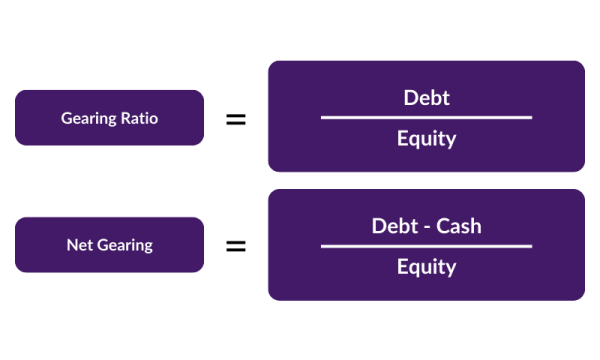

## Table of Contents

## What is a gear ratio and why is it important?

A gear ratio is a number that tells you how many times one gear turns compared to another gear. Imagine two gears next to each other. If one gear is bigger and has more teeth, it will turn slower but with more force. The smaller gear with fewer teeth will turn faster but with less force. The gear ratio is found by dividing the number of teeth on the bigger gear by the number of teeth on the smaller gear.

Gear ratios are important because they help us control speed and power in machines. For example, in a bicycle, a higher gear ratio (bigger front gear, smaller back gear) makes it harder to pedal but lets you go faster. A lower gear ratio (smaller front gear, bigger back gear) makes it easier to pedal but you won't go as fast. This is useful when you're going uphill or starting from a stop. In cars, gear ratios help the engine work efficiently at different speeds, making driving smoother and more powerful.

## How do you calculate the gear ratio between two gears?

To calculate the gear ratio between two gears, you need to count the number of teeth on each gear. Let's call the gear with more teeth the "driven gear" and the gear with fewer teeth the "driver gear." The gear ratio is found by dividing the number of teeth on the driven gear by the number of teeth on the driver gear. For example, if the driven gear has 40 teeth and the driver gear has 20 teeth, the gear ratio would be 40 divided by 20, which equals 2. This means the driven gear turns once for every two turns of the driver gear.

Understanding the gear ratio is important because it tells you how the speed and force are changed between the two gears. A gear ratio of 2 means the driven gear turns slower but with more force than the driver gear. If you want the driven gear to turn faster, you would use a gear ratio less than 1, like if the driven gear had 10 teeth and the driver gear had 20 teeth, giving a gear ratio of 0.5. This way, the driven gear would turn twice for every turn of the driver gear, but with less force.

## What are the different types of gear systems and their applications?

Gear systems come in different types, each with its own use. Spur gears are the simplest type. They have straight teeth and are used in things like washing machines and hand drills. They work well when the gears need to be at a right angle to each other. Helical gears have teeth that are cut at an angle, which makes them run more smoothly and quietly. They are used in cars and other machines where noise needs to be low. Bevel gears have teeth on a cone shape and are used to change the direction of the force by 90 degrees, like in a car's differential.

Another type is worm gears, which have a screw-like shape and are used to get a lot of force with a small turn. They are used in things like conveyor systems and lifts. Rack and pinion gears turn a spinning motion into a straight-line motion. They are used in steering systems of cars and in some types of machinery. Planetary gears, also called epicyclic gears, have a central gear called the sun gear, surrounded by planet gears, and an outer ring gear. They are used in automatic transmissions in cars and in some types of power tools because they can give a lot of different gear ratios in a small space.

Each type of gear system has its own special job. By choosing the right type of gear, engineers can make machines work better, be quieter, or use less space. Understanding the different types of gears helps in [picking](/wiki/asset-class-picking) the best one for a specific job.

## How does changing the gear ratio affect the performance of a vehicle?

Changing the gear ratio in a vehicle can make a big difference in how it performs. When you use a higher gear ratio, like a bigger gear in the front and a smaller one in the back, the vehicle can go faster. But it also means the engine has to work harder to move the car, so it might not be as good for going uphill or starting from a stop. This is because the wheels turn faster with each turn of the engine, but there's less force to push the car forward.

On the other hand, using a lower gear ratio, with a smaller gear in the front and a bigger one in the back, makes it easier for the engine to move the car. The wheels turn slower with each turn of the engine, but there's more force to push the car forward. This is great for going uphill or starting from a stop because it gives the car more power. But it also means the car won't go as fast on flat roads. So, changing the gear ratio helps drivers find the right balance between speed and power for different driving situations.

## What is the difference between a high gear ratio and a low gear ratio?

A high gear ratio means the driven gear (the one that gets the force) has more teeth than the driver gear (the one giving the force). In a car, this means the wheels turn a lot for each turn of the engine, so the car can go faster. But it's harder for the engine to move the car because it has to work harder. So, high gear ratios are good for going fast on flat roads but not so good for going uphill or starting from a stop.

A low gear ratio is the opposite. The driven gear has fewer teeth than the driver gear. This means the wheels turn less for each turn of the engine, but the engine can push the car with more force. So, low gear ratios make it easier for the car to go uphill or start moving from a stop. But the car won't go as fast on flat roads. This is why cars have different gears, so drivers can switch between high and low gear ratios depending on what they need.

## How do you select the appropriate gear ratio for a specific application?

Choosing the right gear ratio for a specific job depends on what you want the machine to do. If you need the machine to go fast, like a bike on a flat road, you would pick a high gear ratio. This means the wheels turn a lot for each turn of the pedals, so you can go faster. But it will be harder to pedal, especially uphill. On the other hand, if you need the machine to have a lot of power, like a bike going uphill or a car starting from a stop, you would choose a low gear ratio. This makes it easier to pedal or drive because the wheels turn less for each turn of the pedals or engine, but you won't go as fast.

To pick the right gear ratio, you also need to think about the size of the machine and how much space you have. For example, in a car, you might want a gear system that can change ratios easily, like an automatic transmission with planetary gears. This lets the car switch between high and low gear ratios smoothly. In a small tool, you might need a gear system that fits in a small space, so you might use a worm gear or a spur gear. By thinking about what the machine needs to do and how much space you have, you can choose the best gear ratio for the job.

## What are the common methods used to measure gear ratios in practice?

To measure gear ratios in practice, one common method is to count the number of teeth on the gears. You look at the bigger gear, called the driven gear, and the smaller gear, called the driver gear. You divide the number of teeth on the driven gear by the number of teeth on the driver gear. For example, if the driven gear has 40 teeth and the driver gear has 20 teeth, the gear ratio is 40 divided by 20, which equals 2. This tells you that the driven gear turns once for every two turns of the driver gear.

Another way to measure gear ratios is by using a tachometer, which measures how fast something is turning. You can put a tachometer on both the driven and driver gears to see how many times each one turns in a certain amount of time. Then, you divide the speed of the driven gear by the speed of the driver gear to find the gear ratio. This method is useful when you can't easily count the teeth on the gears, like in some machines where the gears are hard to see or reach.

## How do gear ratios impact the efficiency and lifespan of machinery?

Gear ratios can affect how well a machine works and how long it lasts. When you pick the right gear ratio, the machine can do its job better. For example, if you need a lot of power, like when lifting heavy things, a low gear ratio helps the machine use its power well. But if you need to go fast, like in a car on a highway, a high gear ratio makes the machine more efficient. Using the right gear ratio means the machine doesn't have to work too hard, which saves energy and makes it run smoothly.

But if you use the wrong gear ratio, it can make the machine less efficient and wear out faster. If the gear ratio is too high, the machine might have to work too hard to move, which can make parts get hot and wear out quickly. If the gear ratio is too low, the machine might not be able to go fast enough, which can also make it less efficient. So, choosing the right gear ratio is important to keep the machine working well and lasting a long time.

## What advanced techniques exist for optimizing gear ratios in complex systems?

To optimize gear ratios in complex systems, engineers often use computer simulations and modeling. They create a digital version of the machine and test different gear ratios to see how they affect the machine's performance. This helps them find the best gear ratio without having to build and test many different versions of the machine. They can also use special software that looks at how the gears work together and suggests the best gear ratios for different parts of the machine. This way, they can make sure the machine uses its power well and lasts a long time.

Another advanced technique is using adaptive gear systems. These systems can change their gear ratios while the machine is working, based on what the machine needs at that moment. For example, in a car with an automatic transmission, the gear ratio changes as you drive to make the car go faster or use less gas. This kind of system uses sensors and computers to keep track of how the machine is doing and adjust the gear ratios to make it work better. By using these advanced techniques, engineers can make machines that are more efficient and last longer.

## How do you account for gear backlash and its effect on gear ratio calculations?

Gear backlash is the small gap between the teeth of two gears that are touching each other. This gap lets the gears move a little bit before they start to push each other. When you calculate gear ratios, you usually don't include this gap because it's very small. But if you need to be very exact, you might need to think about how this gap can change the gear ratio a tiny bit. For example, if you turn the driver gear, the driven gear might not move right away because of the gap, so the actual gear ratio could be a little different from what you calculated.

In most cases, the effect of gear backlash on gear ratios is so small that it doesn't matter much. But in some machines, like precision instruments or robots, even a tiny change can make a big difference. To fix this, engineers might use special gears that have less backlash, or they might add a way to take up the slack, like a spring that keeps the gears pushed together. By doing this, they can make sure the gear ratio stays as close as possible to what they planned, and the machine works the way it should.

## What role do computer simulations play in determining optimal gear ratios?

Computer simulations help engineers find the best gear ratios for machines by letting them test different options without building the machine each time. They make a digital copy of the machine and change the gear ratios in the computer to see how the machine works with each change. This way, they can see which gear ratio makes the machine run the best, use the least energy, and last the longest. It saves a lot of time and money because they don't have to make and test lots of real machines.

These simulations also let engineers look at how the gears work together in the whole system. They can see how changing one gear ratio might affect other parts of the machine. This helps them make sure all the gears are working together well. By using computer simulations, engineers can find the perfect gear ratio for any machine, making it more efficient and durable.

## How can gear ratios be adjusted dynamically in modern machinery and vehicles?

In modern machinery and vehicles, gear ratios can be changed while they are working, thanks to smart technology. This is called dynamic gear adjustment. For example, in cars with automatic transmissions, there are sensors and computers that keep track of how fast the car is going, how hard the engine is working, and what the driver is doing. If the car needs more power to go uphill, the computer can change the gear ratio to a lower one, making it easier for the engine to push the car. If the car is on a flat road and needs to go faster, the computer can switch to a higher gear ratio, letting the car go faster without the engine working too hard.

This kind of technology is also used in other machines, like robots and industrial equipment. In robots, dynamic gear adjustment helps them move smoothly and do different tasks without stopping to change gears. For example, a robot might need a low gear ratio to lift something heavy and then switch to a high gear ratio to move quickly to the next task. In industrial machines, like conveyor systems, dynamic gear adjustment can help them work more efficiently by changing gear ratios based on what they are moving and how fast they need to go. This makes the machines more flexible and able to do their jobs better.

## What is the key to understanding financial ratios?

Financial ratios are essential tools in financial analysis, providing quantitative insights into various facets of a company's financial performance. These ratios, derived from a company’s financial statements, are used to evaluate profitability, liquidity, efficiency, and leverage.

**Profitability Ratios** measure a company's ability to generate profit relative to its revenue, assets, or equity. Common profitability ratios include the Net Profit Margin, Return on Assets (ROA), and Return on Equity (ROE). For example, ROE is calculated as:

$$
\text{ROE} = \frac{\text{Net Income}}{\text{Shareholder's Equity}}
$$

These ratios help investors assess how well a company is using its resources to generate earnings.

**Liquidity Ratios** assess a company's ability to meet short-term obligations. The Current Ratio and Quick Ratio are frequently used metrics. The Current Ratio is calculated as:

$$
\text{Current Ratio} = \frac{\text{Current Assets}}{\text{Current Liabilities}}
$$

A higher [liquidity](/wiki/liquidity-risk-premium) ratio suggests that a company can comfortably cover its short-term debts, which is crucial for avoiding financial distress.

**Efficiency Ratios** analyze how effectively a company utilizes its assets and liabilities to generate sales and maximize profitability. Important efficiency ratios include Asset Turnover Ratio and Inventory Turnover Ratio. The Asset Turnover Ratio can be calculated as:

$$
\text{Asset Turnover Ratio} = \frac{\text{Net Sales}}{\text{Average Total Assets}}
$$

These ratios enable analysts to understand a firm's operational efficiency and asset management.

**Leverage Ratios** evaluate the extent of a company's financial leverage, reflecting the balance between equity and debt and its implications for financial risk. Common leverage ratios such as the Debt-to-Equity Ratio and Interest Coverage Ratio are used to assess the sustainability of a company's capital structure. The Debt-to-Equity Ratio is computed by:

$$
\text{Debt-to-Equity Ratio} = \frac{\text{Total Debt}}{\text{Shareholder's Equity}}
$$

Investors and analysts rely on these financial ratios for decision-making as they provide a comprehensive view of a company’s financial health. Ratios facilitate comparison over time and across firms, helping identify strengths and potential risk areas. By highlighting key financial trends and potential red flags, ratios support strategic investments and financial planning.

## What are Gearing Ratios?

Gearing ratios are a specialized category of financial ratios that serve as a critical tool for evaluating a company's financial structure. These ratios are primarily concerned with assessing the degree of a company's financial leverage, which is the extent to which a company utilizes borrowed funds to finance its operations and growth. Understanding the financial leverage of a company is crucial in risk and return analysis as it helps stakeholders gauge the potential risks involved with the company's debt levels in relation to its equity.

The Debt-to-Equity Ratio and the Interest Coverage Ratio are among the most commonly used gearing ratios. The Debt-to-Equity Ratio measures the proportion of a company's total liabilities to its shareholder equity. This ratio is crucial for investors and analysts as it provides insights into the balance between debt financing and equity financing. The formula for the Debt-to-Equity Ratio is:

$$
\text{Debt-to-Equity Ratio} = \frac{\text{Total Liabilities}}{\text{Shareholders' Equity}}
$$

A higher Debt-to-Equity Ratio implies a higher degree of financial leverage, which may indicate increased financial risk, especially in volatile markets or economic downturns.

On the other hand, the Interest Coverage Ratio assesses a company's ability to meet its interest obligations on outstanding debt. It is calculated by dividing a company's earnings before interest and taxes (EBIT) by its interest expenses. This ratio provides insights into how comfortably a company can pay interest on its outstanding debt with its operating income. The formula for the Interest Coverage Ratio is:

$$
\text{Interest Coverage Ratio} = \frac{\text{EBIT}}{\text{Interest Expenses}}
$$

A higher Interest Coverage Ratio suggests that a company is more capable of meeting its interest obligations, reflecting lower financial risk.

In summary, gearing ratios are pivotal for stakeholders as they reflect the implications of a company's capital structure on its financial stability and risk profile. By evaluating these ratios, analysts can gain insights into a company's financial strategy and its capacity to withstand financial pressures while seeking growth opportunities.

## What are the Calculation Methods for Gearing Ratios?

Gearing ratios are critical in evaluating a company's financial leverage, providing insights into the balance between equity and debt. Understanding how to compute these ratios can significantly enrich financial analysis, aiding both traditional and [algorithmic trading](/wiki/algorithmic-trading) strategies. This section details the calculation methods for key gearing ratios, demonstrated through examples and interpretations. 

### Debt-to-Equity Ratio

The Debt-to-Equity (D/E) Ratio is a fundamental gearing ratio, indicating the relative proportion of a company's debt to its shareholder equity. It quantifies financial leverage and the risk associated with a higher reliance on debt.

**Formula:**
$$
\text{Debt-to-Equity Ratio} = \frac{\text{Total Debt}}{\text{Total Equity}}
$$

**Example:**
Consider a company with a total debt of \$2,000,000 and total equity of \$5,000,000. 

$$
\text{D/E Ratio} = \frac{2,000,000}{5,000,000} = 0.4
$$

This implies the company uses \$0.4 of debt for every dollar of equity, indicating conservative leverage. 

### Interest Coverage Ratio

The Interest Coverage Ratio measures a company's ability to meet interest payments from its operational earnings. It's essential for understanding the sustainability of a company’s debt load.

**Formula:**
$$
\text{Interest Coverage Ratio} = \frac{\text{Earnings Before Interest and Taxes (EBIT)}}{\text{Interest Expenses}}
$$

**Example:**
Suppose a company has an EBIT of \$1,500,000 and interest expenses amounting to \$300,000.

$$
\text{Interest Coverage Ratio} = \frac{1,500,000}{300,000} = 5
$$

A ratio of 5 suggests the company earns five times its interest obligations, reflecting a strong capability to service its debt.

### Equity Ratio

The Equity Ratio focuses on the proportion of assets financed by shareholders' equity, reflecting financial stability.

**Formula:**
$$
\text{Equity Ratio} = \frac{\text{Total Equity}}{\text{Total Assets}}
$$

**Example:**
Consider a company with total equity of \$3,000,000 and total assets of \$7,000,000.

$$
\text{Equity Ratio} = \frac{3,000,000}{7,000,000} \approx 0.43
$$

This means 43% of the company's assets are financed by equity, suggesting a moderate reliance on equity financing.

### Considerations in Interpretation

When interpreting gearing ratios, it is crucial to contextualize them within the industry norms, as acceptable levels of financial leverage can vary significantly across sectors. Additionally, temporal trends in these ratios can signal shifts in corporate strategy or financial health. For example, a rising D/E Ratio could indicate increasing risk if not matched by rising profits or operational efficiencies.

Ultimately, these ratios, while insightful, should be complemented with qualitative analysis and other financial metrics to provide a holistic view of a company's financial stability and potential for growth.

 to Algorithmic Trading

Algorithmic trading, often referred to as algo trading, is a method of executing orders using automated and pre-programmed trading instructions accounting for variables such as time, price, and [volume](/wiki/volume-trading-strategy). This approach leverages computational power to rapidly analyze market data and execute trades more efficiently than traditional methods. Over the past decades, algo trading has gained significant prominence in modern financial markets due to its ability to manage large volumes of trades with precision and speed.

One of the primary efficiencies of algo trading is its capacity to minimize human intervention, reducing the risk of manual errors. This systematic approach enables traders and investors to capitalize on market opportunities by identifying patterns and executing trades in milliseconds. Such rapidity is impossible to achieve manually, making algo trading particularly advantageous in highly liquid markets where timing is crucial.

Algo trading provides traders with opportunities to utilize complex mathematical models and algorithms unavailable to traditional trading methods. These models can process vast amounts of market data in real-time, allowing traders to refine their strategies and optimize their transactions. Additionally, variables such as market [volatility](/wiki/volatility-trading-strategies) and price correlations can be programmed into algorithms, enabling dynamic and adaptive trading strategies that respond to changing market conditions.

Common types of algorithms used in trading include:

1. **Trend-Following Algorithms**: These strategies aim to capitalize on market trends by identifying and following trends in stock prices, commodities, or forex markets. They often use moving averages to signal trades when a trend is detected.

2. **Arbitrage Algorithms**: Arbitrage strategies exploit price discrepancies between different markets or instruments. Algo trading efficiently identifies these opportunities by quickly comparing prices and executing trades to profit from the differences.

3. **Market Making Algorithms**: These algorithms provide liquidity by continuously quoting buy and sell prices for a security and profiting from the spread. They require precise timing and execution to remain profitable.

4. **Mean Reversion Algorithms**: Based on the statistical premise that prices will revert to their historical mean, these algorithms identify securities that have deviated from their mean value and execute trades anticipating a return to the average.

5. **High-Frequency Trading (HFT) Algorithms**: HFT strategies initiate thousands of trades per second, capitalizing on minute price changes. This type of algorithm requires substantial infrastructure and regulatory scrutiny.

Incorporating these types of algorithms, algo trading continues to reshape the landscape of financial markets, enabling more sophisticated trading strategies and contributing to market efficiency. The growth of algorithmic trading underscores the importance of technology and quantitative analysis in devising effective trading operations, benefiting investors through potentially enhanced returns and reduced transaction costs.

## References & Further Reading

[1]: Schilit, H. (2018). ["Financial Shenanigans: How to Detect Accounting Gimmicks & Fraud in Financial Reports"](https://www.amazon.com/Financial-Shenanigans-Accounting-Gimmicks-Reports/dp/0071703071). McGraw-Hill Education.

[2]: Chan, E. (2013). ["Algorithmic Trading: Winning Strategies and Their Rationale"](https://github.com/ftvision/quant_trading_echan_book). Wiley.

[3]: Jansen, S. (2020). ["Machine Learning for Algorithmic Trading"]. Packt Publishing.

[4]: Pratt, S. P., & Grabowski, R. J. (2014). ["Cost of Capital: Applications and Examples"](https://books.google.com/books/about/Cost_of_Capital.html?id=h_cXAwAAQBAJ). Wiley.

[5]: Benninga, S. (2010). ["Financial Modeling"](https://mitpress.mit.edu/9780262046428/financial-modeling/). MIT Press.