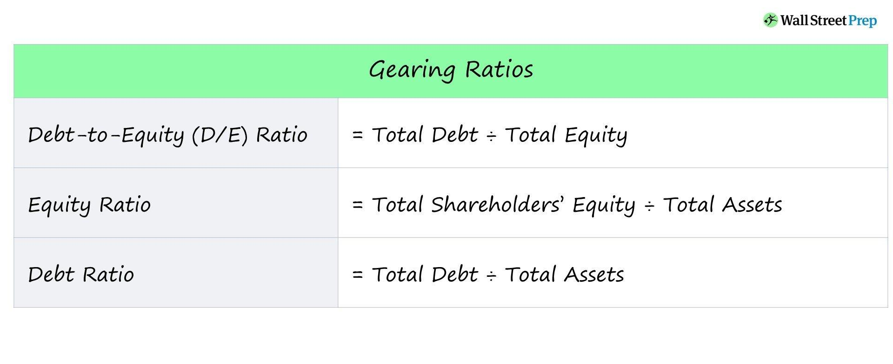

## Table of Contents

## What is a gearing ratio?

A gearing ratio is a way to measure how much a company is using borrowed money compared to its own money. It shows the balance between debt and equity in a company's financial structure. If a company has a high gearing ratio, it means it is using a lot of borrowed money, which can be risky because the company has to pay back the loans with interest.

On the other hand, a low gearing ratio means the company is using more of its own money and less borrowed money. This can be safer because there is less debt to pay back. Investors and lenders look at the gearing ratio to decide if a company is a good investment or if it is safe to lend money to it.

## Why are gearing ratios important in vehicles?

Gearing ratios in vehicles are important because they help the vehicle move at different speeds and handle different loads. The gears in a vehicle's transmission change the speed and power from the engine to the wheels. When you need to go fast, like on a highway, you use a higher gear ratio. This makes the wheels spin faster with less power, so you can drive smoothly at high speeds. When you need more power, like going up a hill or pulling a heavy load, you use a lower gear ratio. This makes the wheels spin slower but with more power, so the vehicle can handle the extra work.

Understanding and using the right gear ratio is key for good fuel efficiency and performance. If you use the wrong gear, the engine might work too hard or not hard enough, which can waste fuel and wear out the engine faster. By choosing the right gear for the situation, drivers can make their vehicles run better and last longer. This is why many vehicles have automatic transmissions that change gears for you, or manual transmissions where the driver has to pick the right gear.

## How do you calculate a basic gearing ratio?

To calculate a basic gearing ratio, you need to know how much debt and equity a company has. Debt is the money the company borrowed, like loans or bonds. Equity is the money the company owns, like money from selling stocks or profits kept in the business. The basic formula for the gearing ratio is: Debt divided by Equity. If a company has $100,000 in debt and $200,000 in equity, the gearing ratio would be $100,000 divided by $200,000, which equals 0.5 or 50%.

Sometimes, people use a slightly different formula where they add debt and equity together to get the total capital, and then divide the debt by this total. Using the same example, the total capital would be $100,000 (debt) plus $200,000 (equity), which equals $300,000. The gearing ratio then would be $100,000 (debt) divided by $300,000 (total capital), which equals about 0.33 or 33%. Both ways give you an idea of how much the company relies on borrowed money, but the numbers might be a bit different depending on which formula you use.

## What are the common types of gearing ratios used in different vehicles?

In vehicles, there are several types of gearing ratios that help the vehicle move and work in different ways. One common type is the final drive ratio, which is the gear ratio between the engine and the wheels. This ratio decides how fast the wheels turn compared to the engine. A higher final drive ratio means the wheels turn slower, which can give more power for pulling heavy loads or going uphill. A lower final drive ratio means the wheels turn faster, which is good for driving fast on highways.

Another type is the transmission gear ratio, which is used in both manual and automatic transmissions. These ratios change depending on which gear you are in. Lower gears, like first or second gear, have higher ratios to give more power for starting or going up hills. Higher gears, like fifth or sixth gear, have lower ratios for faster driving on flat roads. In automatic transmissions, the gears change automatically to match the speed and load, while in manual transmissions, the driver has to choose the right gear.

Some vehicles also use transfer case gearing ratios, which are found in four-wheel drive or all-wheel drive vehicles. These ratios can switch between high and low settings. High range is used for normal driving on roads, while low range gives more power for off-road driving or pulling heavy loads. By choosing the right gearing ratio, drivers can make their vehicle perform better in different situations.

## What is considered an ideal gearing ratio for a standard car?

The ideal gearing ratio for a standard car depends on what you want the car to do. For everyday driving on city streets and highways, a good balance is important. A car with a final drive ratio around 3.0 to 4.0 can work well. This means the wheels turn about 3 to 4 times for every one turn of the engine. This ratio gives enough power for starting and going up hills, but also lets the car go fast on flat roads without the engine working too hard.

The transmission gear ratios also play a big role. Most standard cars have 5 or 6 gears. The first gear has a high ratio, maybe around 3.5 to 4.5, to give lots of power for starting from a stop. The higher gears, like fifth or sixth, have lower ratios, around 0.7 to 1.0, to let the car go fast on highways. The ideal ratios make the car easy to drive in traffic, good on gas, and able to handle different road conditions without the engine working too hard.

## How does the gearing ratio affect vehicle performance and fuel efficiency?

The gearing ratio in a vehicle affects how fast it can go and how much power it has. When you have a higher gear ratio, like in first or second gear, the wheels turn slower but with more power. This is good for starting from a stop or going up hills. But if you use a high gear ratio on a flat road, the engine works too hard and might not go as fast as it could. On the other hand, a lower gear ratio, like in fifth or sixth gear, makes the wheels turn faster with less power. This is good for driving fast on highways, but if you use a low gear ratio when you need power, like going up a hill, the car might struggle.

The gearing ratio also affects how much gas the car uses. If you use the right gear for the situation, the engine doesn't have to work too hard, and that saves gas. For example, using a high gear on a flat road makes the engine run smoothly and use less gas. But if you use a low gear when you don't need the extra power, the engine works harder and uses more gas. So, [picking](/wiki/asset-class-picking) the right gear helps the car use less gas and go farther on a tank of gas. By understanding and using the right gearing ratio, you can make your car perform better and save money on gas.

## What are the differences between high and low gearing ratios?

High gearing ratios mean the wheels turn slower but with more power. This is good when you need a lot of power, like when you start driving or go up a hill. In a car, the first and second gears usually have high ratios. If you use a high gear ratio on a flat road, the engine might work too hard and not go as fast as it could. High gearing ratios are also used in vehicles that need to pull heavy things, like trucks or tractors, because they need a lot of power to move.

Low gearing ratios mean the wheels turn faster but with less power. This is good for driving fast on highways or flat roads. In a car, the fifth and sixth gears usually have low ratios. If you use a low gear ratio when you need power, like going up a hill, the car might struggle because it doesn't have enough power. Low gearing ratios help the car go faster and use less gas when driving on flat roads, but they are not good for pulling heavy things or going up steep hills.

## How can gearing ratios be adjusted or customized?

Gearing ratios can be adjusted or customized in a few ways. One way is by changing the final drive ratio, which is the gear between the engine and the wheels. You can do this by putting in a different gear set in the differential. This changes how fast the wheels turn compared to the engine. Another way is by changing the transmission gears. In a manual transmission, you can put in different gear sets to change the ratios. In an automatic transmission, you might need to change the whole transmission or use a special computer program to change the gear ratios.

Customizing gearing ratios can help a vehicle work better for what you need it to do. If you want more power for pulling heavy things or going up hills, you can use higher gear ratios. This makes the wheels turn slower but with more power. If you want to go faster on flat roads, you can use lower gear ratios. This makes the wheels turn faster but with less power. By picking the right gear ratios, you can make your vehicle perform better and use less gas for what you need it to do.

## What tools and methods are used to measure and test gearing ratios?

To measure and test gearing ratios, people use special tools like a gear ratio calculator or a tachometer. A gear ratio calculator is a simple tool that helps you figure out the ratio by knowing the number of teeth on the gears. You just put in the numbers, and it tells you the ratio. A tachometer is a tool that measures how fast the engine is turning. By comparing the engine speed to the speed of the wheels, you can figure out the gear ratio. These tools help make sure the gears are working right and the vehicle is performing well.

Another way to test gearing ratios is by using a dynamometer, which is a machine that measures how much power the engine makes. By running the vehicle on a dynamometer and changing gears, you can see how the power changes with different gear ratios. This helps you understand how the vehicle will perform in real life. Also, some modern vehicles have computer systems that can show the gear ratio on a screen. These systems use sensors to measure the speed of the engine and wheels, and then calculate the ratio. By using these tools and methods, you can make sure the gearing ratios are right for what you need the vehicle to do.

## How do professional mechanics determine the optimal gearing ratio for specific vehicle modifications?

Professional mechanics determine the optimal gearing ratio for specific vehicle modifications by first understanding what the vehicle will be used for. They think about if the vehicle needs more power for pulling heavy things or going up hills, or if it needs to go faster on flat roads. They look at the engine's power and how the vehicle is used to decide on the best gear ratios. They might use a gear ratio calculator to figure out the right numbers based on the engine and the vehicle's needs. They also think about the driver's preferences and what kind of performance they want.

To make sure the gearing ratio is right, mechanics use tools like a tachometer to measure the engine speed and a dynamometer to test the vehicle's power. They can run the vehicle on the dynamometer in different gears to see how it performs. This helps them see if the gearing ratio is giving the right balance of power and speed. They might also use the vehicle's computer system, if it has one, to check the gear ratio and make changes if needed. By using these tools and their knowledge, mechanics can find the best gearing ratio for the vehicle's modifications.

## What are the latest advancements in gearing technology and how do they impact gearing ratios?

The latest advancements in gearing technology include the use of dual-clutch transmissions (DCTs) and continuously variable transmissions (CVTs). Dual-clutch transmissions use two clutches to change gears faster and smoother than regular automatic transmissions. This means the car can pick the best gear ratio for any speed or load quickly. Continuously variable transmissions use a belt or chain to change the gear ratio smoothly, without fixed gears. This lets the engine always work at its best speed for the situation, which can save gas and make the car run better.

These new technologies change how gearing ratios work. With DCTs, the car can switch gears so fast that it feels like the car is always in the right gear. This makes driving smoother and can help the car use less gas. CVTs let the car have an endless number of gear ratios, so the engine can always run at the best speed for what you are doing. This can make the car more powerful and save even more gas. Both of these technologies help make cars work better and use less gas by picking the best gear ratio for any situation.

## How do gearing ratios in electric vehicles differ from those in traditional internal combustion engine vehicles?

Gearing ratios in electric vehicles (EVs) are different from those in traditional internal combustion engine (ICE) vehicles because electric motors work differently. Electric motors have a lot of power at low speeds and can keep that power even when they go faster. This means EVs don't need as many gears as ICE vehicles. Most EVs use a single-speed transmission or a simple two-speed gearbox. This makes the gearing simpler and can help the car use less energy because it doesn't need to change gears as much.

In contrast, ICE vehicles need more gears to match the engine's power to the wheels. They use multi-speed transmissions, like 5 or 6 gears, to make sure the engine works at the right speed for starting, going up hills, or driving fast on highways. The gearing ratios in ICE vehicles are more complex because the engine's power changes a lot with speed. By using the right gear, the driver can make the car work better and use less gas. But in EVs, the simpler gearing helps the car be more efficient and easier to drive.

## What is the key to understanding financial ratios?

Financial ratios serve as crucial indicators in evaluating a company's financial health and operational efficiency. These ratios provide quantifiable metrics, allowing investors and analysts to gain a deeper understanding of a firm’s performance and assess its risk profile. Among the various financial ratios, gearing ratios are particularly significant for assessing a company's financial leverage.

Gearing ratios, such as the debt-to-equity (D/E) ratio, play a pivotal role in determining the proportion of a company’s funding that is derived from debt compared to equity. This ratio is calculated using the formula:

$$
\text{Debt-to-Equity Ratio} = \frac{\text{Total Debt}}{\text{Shareholders' Equity}}
$$

This formula reflects the extent of a company's indebtedness in relation to its equity base. A high gearing ratio typically indicates that a company is heavily reliant on borrowed funds, suggesting potential financial risk, especially under adverse economic conditions. Conversely, a low gearing ratio implies a conservative capital structure, prioritizing financial stability but potentially restricting growth opportunities.

Understanding gearing ratios is vital for investors and analysts as they reveal insights into a company's risk-return dynamics, an essential aspect during periods of market [volatility](/wiki/volatility-trading-strategies). By evaluating the balance between debt and equity, stakeholders can better assess the sustainability of a company’s financial strategy and make informed investment decisions.

## What are Gearing Ratios and Why are They Important?

Gearing ratios, also known as leverage ratios, play a vital role in assessing a company's capital structure. They gauge the balance between a firm's reliance on borrowed funds versus its own equity capital, offering insights into financial health and risk exposure. Understanding these ratios is essential for investors, analysts, and corporate management, as they reflect a firm's financial strategy and ability to sustain operations during economic fluctuations.

One of the most commonly used gearing ratios is the debt-to-equity (D/E) ratio. The D/E ratio is calculated by dividing the total debt of a company by its shareholders' equity:

$$
\text{Debt-to-Equity Ratio} = \frac{\text{Total Debt}}{\text{Shareholders' Equity}}
$$

This ratio provides a straightforward measure of how much the company is financed through debt compared to equity. A high D/E ratio signifies a greater reliance on borrowed funds, which can indicate increased financial risk, especially if the company has difficulties generating consistent cash flows. Such financial risk becomes particularly pronounced during economic downturns, as companies with high debt obligations may struggle to meet their liabilities, potentially leading to financial distress or insolvency.

On the other hand, a low D/E ratio generally implies a more conservative approach to financing, with a heavier reliance on shareholder equity. This can enhance a company's financial stability and reduce its vulnerability to market fluctuations, as it has fewer obligatory interest payments to creditors. However, this conservative approach might limit growth opportunities due to the restricted capital available for expansion and investment.

Therefore, the significance of gearing ratios extends beyond mere numerical calculation; they provide a contextual evaluation of a firm's strategic approach to balance risk and growth. By effectively interpreting these ratios, stakeholders can make informed decisions regarding investments, risk management, and organizational financial planning.

## References & Further Reading

For more on financial ratios, consider reading "Principles of Corporate Finance" by Brealey, Myers, and Allen. This book provides a comprehensive understanding of financial principles, including the intricacies of financial ratios crucial for evaluating a company's financial health and operational efficiency.

To deepen your knowledge of [algorithmic trading](/wiki/algorithmic-trading), "Algorithmic Trading: Winning Strategies and Their Rationale" by Ernie Chan is an excellent resource. The book explores various algorithmic trading strategies, providing both theoretical frameworks and practical insights that are essential for implementing successful trading systems.

Online platforms like Investopedia and QuantInsti offer a wealth of information and courses on financial analysis and algo trading. Investopedia provides easy-to-understand guides and tutorials for beginners and advanced traders alike, while QuantInsti offers specialized courses and resources tailored to algorithmic trading enthusiasts.

Professional forums such as QuantConnect and EliteTrader serve as invaluable platforms for exchanging knowledge, strategies, and experiences among algorithmic traders. QuantConnect provides a community-driven platform for algorithm development and [backtesting](/wiki/backtesting), whereas EliteTrader offers a broad space for discussions on trading strategies and market insights.

Engaging with these resources will equip you with the essential tools and knowledge to navigate and succeed in the complex world of financial markets and algorithmic trading.

