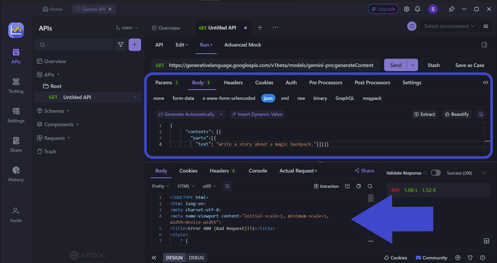

Algorithmic trading has significantly reshaped the financial markets, spurred by technological advancements and the quest for enhanced trading efficiency. This approach leverages computer algorithms to execute trades at speeds and frequencies beyond human capabilities, capitalizing on market opportunities that would be otherwise unreachable. Against this backdrop, traders and developers continuously seek out robust platforms that can streamline and optimize their trading strategies.

One such platform is Gemini, a leading cryptocurrency exchange that provides a sophisticated suite of Application Programming Interfaces (APIs) tailored to meet the needs of algorithmic traders. These APIs offer extensive access to market data, allowing for seamless order placement and access to other essential functionalities required in algorithmic trading. Gemini's APIs are designed to enable users to automate, backtest, and optimize their trading strategies efficiently.



This article focuses on exploring the different Gemini APIs that are available for algorithmic trading, examining their features, and demonstrating how they can be effectively leveraged to elevate trading tactics. For newcomers interested in experimenting with algorithmic trading or seasoned traders eager to fine-tune their strategies, a thorough understanding of Gemini's API capabilities is vital to maintaining a competitive edge in today’s fast-paced trading environments.

Understanding and utilizing these tools can lead to a significant enhancement in trading outcomes, providing traders with the speed and precision needed to navigate the dynamic world of cryptocurrency trading. By exploring the functionalities of Gemini APIs, traders can unlock new levels of efficiency and insight, positioning themselves for success in the rapidly evolving landscape of financial markets.

## Table of Contents

## Overview of Gemini Exchange

Gemini is a regulated cryptocurrency exchange established in 2015 by Cameron and Tyler Winklevoss. It operates under strict regulatory compliance, primarily within the framework provided by New York State's Department of Financial Services. This regulation ensures that Gemini upholds high standards of security and transparency, making it a trustworthy platform for both retail and institutional investors.

Security is a cornerstone of Gemini's operations. The exchange uses industry-leading measures to protect users' funds and private information. These include robust encryption techniques, two-factor authentication (2FA), and cold storage for digital assets, where the majority of cryptocurrencies are stored offline to mitigate hacking risks. Additionally, all assets held in its reserves are subject to frequent independent audits, ensuring that customer funds are fully backed.

Gemini offers a range of products and services tailored to the needs of sophisticated traders and developers. Its comprehensive API infrastructure provides various functionalities suitable for automating and enhancing trading strategies. This includes access to REST, WebSocket, and FIX APIs, which facilitate efficient order placement, account management, and market data retrieval. These tools are particularly valuable for algorithmic or high-frequency traders who require seamless and reliable access to market data and trading capabilities.

Regulatory compliance is another key advantage of Gemini. Its adherence to financial regulations assures users of the exchange's integrity and operational soundness. This compliance extends to its robust anti-money laundering (AML) and know your customer (KYC) protocols, which help prevent fraudulent activities on the platform. This level of regulatory oversight makes Gemini a preferred choice for algorithmic traders who operate with significant capital and demand a stable and secure trading environment.

Overall, Gemini's emphasis on security, regulatory compliance, and advanced trading tools makes it a competitive option for traders and developers seeking a secure and reliable exchange for [cryptocurrency](/wiki/cryptocurrency) trading.

## Understanding Gemini APIs

Gemini provides a comprehensive suite of APIs designed to facilitate the creation of custom trading solutions. These include the REST API, WebSocket API, and FIX API, each serving distinct purposes to meet the varied needs of traders and developers.

The **REST API** is a versatile resource, offering endpoints that allow access to market data, creation and management of orders, as well as account administration. This API is particularly suitable for those who need a broad range of functionalities consolidated into a single interface. It serves requests to access historical price data, place and cancel trades, and fetch account information. For example, using Python, one can easily place an order using the `requests` library as shown below:

```python
import requests

api_key = 'your_api_key'
api_secret = 'your_api_secret'
base_url = 'https://api.gemini.com'
order_endpoint = '/v1/order/new'

order_payload = {
    'request': order_endpoint,
    'nonce': 123456,
    'symbol': 'btcusd',
    'amount': '0.01',
    'price': '50000',
    'side': 'buy',
    'type': 'exchange limit'
}

response = requests.post(base_url + order_endpoint, json=order_payload, auth=(api_key, api_secret))
print(response.json())
```

For traders requiring real-time data and order updates, the **WebSocket API** is vital. It enables the reception of live market data and provides immediate updates on order statuses, which is crucial for executing time-sensitive trading strategies. Unlike the REST API, the WebSocket API establishes a persistent connection that allows data to be pushed from the server to the client, improving latency for real-time applications. This is particularly important when market conditions change rapidly, requiring instant reactions by trading algorithms.

The **FIX API** is predominantly used by institutional traders who engage in high-frequency trading operations. Known for its speed and efficiency, the FIX API allows transactions to be processed with minimal latency, providing increased transaction speed and reliability. This protocol is internationally recognized and widely used across financial markets, offering standardized communication for order handling and execution. Traders leveraging the FIX API can benefit from its capacity to handle a high [volume](/wiki/volume-trading-strategy) of transactions with precision and low delay.

In conclusion, Gemini's APIs—a REST API for comprehensive access, a WebSocket API for real-time communications, and a FIX API for institutional-grade transactions—equip developers and traders with robust tools to incorporate into their [algorithmic trading](/wiki/algorithmic-trading) systems. These APIs are designed to enhance the efficiency and responsiveness of trading strategies in the competitive arena of cryptocurrency markets.

## Benefits of Using Gemini APIs in Algo Trading

Using Gemini APIs in algorithmic trading offers several substantial benefits, facilitating improved performance and efficiency for traders and developers alike.

One of the primary advantages is the ability to achieve seamless integration with various trading platforms. The versatile nature of Gemini's APIs allows for customized trading strategies that fit the specific needs and preferences of the user. Traders can leverage this flexibility to develop and deploy trading algorithms tailored to their unique objectives.

Employing Gemini's robust API infrastructure enables the automation of trading strategies, thus minimizing human error and ensuring consistent execution. Automation allows for 24/7 trading operations without the need for direct human intervention, significantly increasing the potential for profit generation. 

Another significant benefit is the access to both real-time and historical market data. This access is crucial for [backtesting](/wiki/backtesting) trading strategies, allowing traders to evaluate the effectiveness of their algorithms against historical data. By identifying strengths and weaknesses within these strategies, traders can optimize their performance and reduce associated risks. The use of statistical measures and performance metrics derived from this data further aids in refining algorithmic strategies.

Gemini's emphasis on security features and regulatory compliance enhances the trustworthiness of using the platform’s APIs for large volumes of trades. Security measures such as encryption and multi-[factor](/wiki/factor-investing) authentication ensure that trading activities are safeguarded against unauthorized access and cyber threats. Furthermore, adhering to regulatory standards ensures that traders operate within legal frameworks, reducing the risk of compliance violations.

In summary, Gemini APIs provide a comprehensive solution for algorithmic traders, offering integration, automation, data access, and security. These features collectively contribute to improved trading outcomes and strategic advancements in the ever-evolving landscape of cryptocurrency trading.

## How to Get Started with Gemini APIs

To get started with Gemini APIs, traders must first establish an account on the Gemini exchange and proceed to generate API keys. These keys are critical as they grant access to the functionalities provided by the Gemini API suite, enabling integration with various trading systems and applications.

**Step 1: Account Creation and API Key Generation**

The initial step involves creating an account on the Gemini platform. Once registered, users can navigate to the API settings in their account dashboard to create new API keys. These keys serve two primary functions: public API operations, which allow for retrieving market data, and private operations, which require authentication to manage orders and account details.

**Step 2: Familiarization with API Documentation**

Comprehensive understanding of Gemini's API documentation is crucial for seamless integration and utilization of the available features. The documentation provides an extensive array of guides and code examples, detailing how to access endpoints, manage order types, and handle account information. It is advisable for users to thoroughly explore these resources to gain insights into potential functionalities and limitations. Familiarity with REST and WebSocket API usage is especially important for implementing trading strategies effectively.

**Step 3: Utilizing Compatible Libraries and Frameworks**

Developers should consider leveraging libraries or frameworks that are compatible with Gemini's APIs to streamline the development process. Such libraries abstract much of the complexity involved in API interactions and can significantly reduce the time and effort required to set up trading algorithms. For instance, Python developers can use `python-gemini` or similar libraries that facilitate easier API requests and responses handling. A simple example to connect to the Gemini API using Python might look like this:

```python
import requests

# Replace with your actual API key and secret
api_key = 'your_api_key'
api_secret = 'your_api_secret'

# Example of making a request to the Gemini REST API
url = 'https://api.gemini.com/v1/pubticker/btcusd'
response = requests.get(url)

if response.status_code == 200:
    data = response.json()
    print("Current BTC/USD price:", data['last'])
else:
    print("Failed to retrieve data:", response.status_code)
```

Using these tools not only expedites the implementation process but also improves algorithm efficiency by minimizing potential errors in data handling and API communication.

In summary, successfully getting started with Gemini APIs involves account setup, deep understanding of the API documentation, and the strategic use of compatible libraries and frameworks. These steps will enable traders to build robust and efficient trading systems tailored to their specific algorithmic strategies.

## Challenges and Considerations

While Gemini APIs offer robust tools for algorithmic trading, there are several challenges and considerations that traders must navigate to maximize their effectiveness. One of the primary challenges is managing API rate limits. These limits are put in place to prevent server overload and ensure fair usage amongst all users. If a trading strategy exceeds these limits, it can lead to missed trading opportunities and may affect the efficiency of trade execution. Traders can mitigate this issue by optimizing their algorithms to make fewer API calls or by strategically timing calls during periods of lower market activity.

Network reliability is another critical factor when utilizing Gemini APIs. Reliable internet connectivity is crucial since any disruption can lead to gaps in data collection and execution delays, directly impacting trading performance. Traders can reduce the risk of network-related issues by implementing redundant internet connections and using reliable cloud service providers that ensure higher uptime and reduced latency.

Before deploying trading strategies live, they should be rigorously tested in simulated environments. This testing allows traders to understand how their strategies perform under various market conditions and helps to identify potential risks and vulnerabilities. Using historical market data available through Gemini APIs, traders can backtest their strategies to optimize performance, which involves adjusting algorithmic parameters based on past data to improve future results.

Regulatory implications are of particular concern, especially for traders handling significant volumes or institutional capital. Ensuring compliance with financial regulations is not only a legal requirement but also a protective measure against potential losses and legal consequences. Traders must stay informed about the current regulatory framework governing cryptocurrency trading and implement necessary compliance measures in their trading systems. This includes robust record-keeping, reporting, and ensuring that their algorithms comply with financial regulations concerning market manipulation and other illicit activities.

Overall, while Gemini APIs provide powerful capabilities for algo trading, effective use requires careful attention to these challenges and thorough preparation to ensure successful trading outcomes.

## Conclusion

Gemini APIs provide a dynamic and secure environment for algo traders aiming to enhance their trading strategies. By utilizing these APIs, traders can significantly boost their trading efficiency, harness comprehensive market data, and execute strategies with heightened precision and speed. The ability to access real-time data and engage with the market through automated strategies presents substantial opportunities for growth and success in the cryptocurrency trading sector.

As algorithmic trading evolves, it is crucial for traders to stay well-informed and adaptable to emerging technologies. This adaptability ensures a sustained competitive edge. Gemini's robust API infrastructure fosters this adaptability by offering seamless integration and advanced functionalities tailored for both novice and professional traders.

Incorporating Gemini APIs into one's trading strategies is not merely about staying current but about pioneering advancements in crypto trading. The journey to success in this fast-paced environment starts with leveraging these powerful tools, opening pathways to optimized performance and significant returns. By embarking on this journey with Gemini APIs, traders have the potential to establish a strong and successful presence in the cryptocurrency market.

## References & Further Reading

[1]: ["Advances in Financial Machine Learning"](https://www.amazon.com/Advances-Financial-Machine-Learning-Marcos/dp/1119482089) by Marcos Lopez de Prado

[2]: Bergstra, J., Bardenet, R., Bengio, Y., & Kégl, B. (2011). ["Algorithms for Hyper-Parameter Optimization."](https://dl.acm.org/doi/10.5555/2986459.2986743) Advances in Neural Information Processing Systems 24.

[3]: ["Evidence-Based Technical Analysis: Applying the Scientific Method and Statistical Inference to Trading Signals"](https://www.amazon.com/Evidence-Based-Technical-Analysis-Scientific-Statistical/dp/0470008741) by David Aronson

[4]: ["Machine Learning for Algorithmic Trading"](https://github.com/stefan-jansen/machine-learning-for-trading) by Stefan Jansen

[5]: ["Quantitative Trading: How to Build Your Own Algorithmic Trading Business"](https://books.google.com/books/about/Quantitative_Trading.html?id=j70yEAAAQBAJ) by Ernest P. Chan

[6]: ["Gemini Exchange API Documentation"](https://ai.google.dev/gemini-api/docs) - Official documentation for Gemini's APIs, providing comprehensive guides and examples for integration and usage.

[7]: Gomber, P., Arndt, B., Lutat, M., & Uhle, T. (2011). ["High-Frequency Trading."](https://papers.ssrn.com/sol3/papers.cfm?abstract_id=1858626) SSRN Electronic Journal.