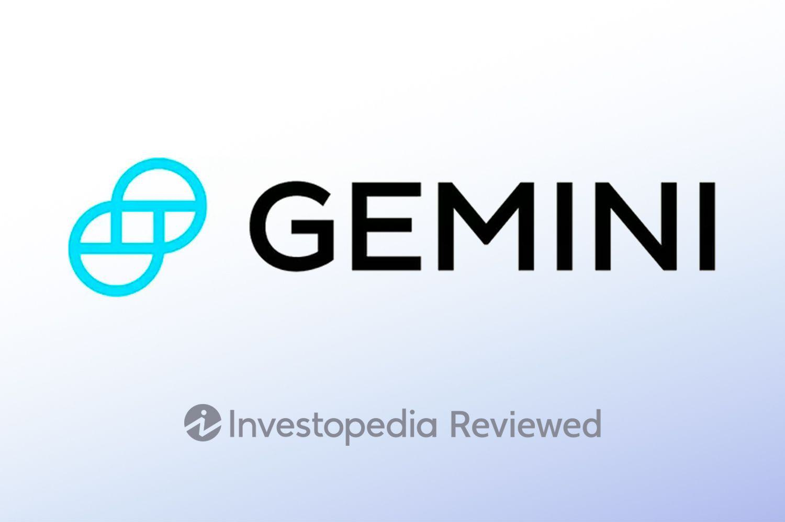

The digital revolution in finance has brought forth a variety of innovative methods for conducting transactions, with digital wallets gaining significant traction among consumers and businesses alike. These tools not only streamline payment processes but also enhance security measures, which are critical in today's digital environment. Among various digital wallets, the Gemini Wallet emerges as a prominent solution, particularly in the realm of cryptocurrency management. This article provides an analysis of the Gemini Wallet, emphasizing its role in the landscape of cryptocurrency wallets and its integration with algorithmic trading.

Gemini Wallet has established itself as a noteworthy option for individuals and organizations looking to manage digital assets securely. The platform, associated with the well-known Gemini cryptocurrency exchange, offers a broad array of features tailored to meet the needs of its users. Key aspects of this wallet include its robust security protocols, user-friendly interface, and comprehensive support for a wide range of digital currencies.

Understanding whether Gemini Wallet is suitable for your needs requires evaluating its features, benefits, and potential limitations. As we assess the wallet's capabilities, this article will focus on its security measures, ease of use, and the level of support for algorithmic trading—a sophisticated trading strategy that leverages algorithms to automate and enhance the trading process.

In conclusion, cryptocurrency wallets like Gemini play a crucial role for investors seeking to securely store, manage, and trade their digital assets. By exploring the attributes of the Gemini Wallet, we aim to provide insights that will assist both novice and seasoned investors in making informed decisions regarding their digital asset management strategies.

## Table of Contents

## What is a Digital Wallet?

A digital wallet is a sophisticated financial tool that securely stores users' payment information and consolidates various forms of payment within a single platform. By enabling seamless transactions and incorporating robust security measures, digital wallets have become imperative in managing digital currencies. At their core, digital wallets serve as electronic counterparts to traditional wallets, offering a convenient way to manage both fiat money and cryptocurrencies.

The ease of transactions facilitated by digital wallets stems from their ability to streamline payment processes. Users can quickly and efficiently execute transactions without the need to repeatedly input payment details. This efficiency is critical in the fast-paced digital economy, where time equals money and the speed of transactions can greatly influence market opportunities.

Enhanced security features are another vital aspect of digital wallets, protecting sensitive financial information from unauthorized access. Advanced encryption techniques, multi-[factor](/wiki/factor-investing) authentication, and biometric verification methods are commonly employed to safeguard users' data. These security protocols are particularly crucial in the context of digital currencies, where the irreversible nature of transactions heightens the importance of protecting wallet integrity.

Beyond conventional currencies, digital wallets have expanded to accommodate a broad array of assets, including cryptocurrencies. This multifunctionality aligns with the growing consumer demand for versatile financial tools that can manage diverse asset types. By supporting a variety of assets, digital wallets can serve as comprehensive financial hubs that facilitate both everyday payments and strategic investment management.

Understanding the fundamental concept of digital wallets is essential when evaluating the distinctive features and benefits offered by different platforms, such as Gemini. Each platform's unique combination of usability, asset support, and security measures can significantly influence user experience and satisfaction, thereby making informed assessments crucial for selecting the most suitable digital wallet solution.

## Overview of Gemini Wallet

Gemini is a prominent [cryptocurrency](/wiki/cryptocurrency) exchange and wallet service known for its secure and user-friendly platform. Established by Cameron and Tyler Winklevoss, Gemini provides solutions for buying, selling, and storing digital assets, appealing to a broad spectrum of cryptocurrency users. The platform supports an extensive range of cryptocurrencies, offering flexibility and adaptability for users to manage their portfolios effectively. The Gemini Wallet stands out due to its commitment to security, incorporating features like insurance on digital assets to protect against theft and hacking, which ensures peace of mind for users. Furthermore, Gemini strictly adheres to financial regulations, further solidifying its position as a reputable entity in the cryptocurrency sector. The platform's emphasis on compliance enhances user trust and underscores its dedication to maintaining a secure trading environment. Overall, Gemini's integration of advanced security measures and regulatory compliance positions it as a credible choice for both novice and experienced cryptocurrency enthusiasts.

## Features of Gemini Wallet

Gemini Wallet is recognized for its extensive cryptocurrency support, facilitating the trade and storage of numerous digital coins. This broad offering enables users to manage diverse portfolios, a crucial feature for those actively participating in the cryptocurrency market. The wallet provides a user-friendly interface that caters to both novice and advanced cryptocurrency traders. This intuitive design ensures that users, regardless of their experience level, can navigate the platform effectively and execute transactions with ease.

Security is a paramount consideration in cryptocurrency management, and Gemini Wallet incorporates advanced security protocols to safeguard user assets. The platform employs two-factor authentication (2FA) to enhance account protection, reducing the risk of unauthorized access. Additionally, Gemini provides FDIC insurance on cash balances stored within the wallet, offering an extra layer of protection for users' fiat currency holdings.

For seasoned investors seeking sophisticated trading tools, the ActiveTrader platform within Gemini serves as a potent resource. This platform offers advanced trading functionalities, including features suited for [algorithmic trading](/wiki/algorithmic-trading), enabling traders to execute complex strategies efficiently. The combination of extensive coin support, user-friendly design, robust security measures, and powerful trading tools makes Gemini Wallet an attractive option for a broad spectrum of cryptocurrency enthusiasts.

## Advantages of Using Gemini Wallet

Gemini Wallet boasts several advantages that make it a preferred choice for cryptocurrency enthusiasts and traders. One of its standout features is comprehensive regulatory compliance, ensuring adherence to financial regulations across all U.S. states. This compliance is a notable asset, fostering trust and reliability among users concerned about the legal aspects of cryptocurrency trading and storage.

Another significant advantage of Gemini Wallet is the seamless integration of trading and storage solutions within a single platform. Users can effortlessly buy, sell, and store a variety of digital assets without the need for multiple accounts or separate services. This integration streamlines the process of managing cryptocurrencies, enhancing user experience by eliminating unnecessary complexity.

Security is paramount in the world of digital finance, and Gemini Wallet excels in providing robust measures to safeguard users' assets. The platform employs advanced security protocols, including two-factor authentication, data encryption, and secure storage solutions. Additionally, Gemini offers insurance on digital assets, providing an extra layer of protection against potential breaches or losses.

Gemini is also known for its promotions and incentives, which add tangible value to its users. New entrants can benefit from sign-up bonuses and rewards, providing an appealing advantage for those looking to maximize their initial investments. This strategic approach not only attracts new users but also encourages continued engagement with the platform.

These features collectively position Gemini Wallet as a reliable and innovative solution for both novice and experienced cryptocurrency traders, offering a blend of security, compliance, and user-centric benefits conducive to efficient digital asset management.

## The Role of Algorithmic Trading

Algorithmic trading is a sophisticated approach to executing trades using pre-programmed instructions, accounting for variables such as timing, price, and [volume](/wiki/volume-trading-strategy). By employing algorithms, traders can efficiently manage large volumes of trades at speeds impossible for human traders to achieve. This method leverages advanced mathematical and statistical models to forecast market trends, optimize trading strategies, and minimize human errors.

Within the Gemini Wallet, users benefit from functionalities that support automated trading. This feature is particularly advantageous for those who adopt algorithmic trading strategies, as it allows for seamless execution without the need for constant human intervention. By integrating these functionalities, Gemini ensures that its platform caters to both novice users and seasoned traders seeking efficiency and precision in their trades.

The Gemini ActiveTrader platform is designed with algorithmic traders in mind, offering a customizable interface and a suite of advanced tools. The platform provides high-level functionalities, such as real-time data feeds, robust analytics, and comprehensive charting tools, which are essential for executing complex trading strategies. Its adaptability allows users to tailor their trading environment to match their specific algorithmic strategies, ensuring that they can react swiftly to market movements and optimize their transactions effectively.

In summary, for traders interested in algorithmic approaches, Gemini Wallet and its ActiveTrader platform offer the necessary infrastructure to enhance trading efficiency and effectiveness. By providing customizable tools and automated trading support, Gemini helps users harness the power of algorithmic trading, thus facilitating a more streamlined and effective trading process.

## Potential Drawbacks of Gemini Wallet

Gemini Wallet, while robust in its features and security protocols, presents certain challenges that prospective users should consider. A notable concern is its fee structure, which, in comparison to some competitors, tends to impose higher costs, particularly for users engaging in smaller trades. This can be attributed to transaction fees that, though justified by the security and compliance measures offered by Gemini, may not be as economical for small investors or those executing frequent, low-volume transactions.

Moreover, the wallet's staking options are somewhat limited. In the growing cryptocurrency landscape, staking offers users a way to earn passive income by participating in the network through holding specific cryptocurrencies. Gemini's relatively narrow staking capabilities could deter users aiming to maximize potential returns from their digital assets in this manner. This constraint could be a significant consideration for individuals looking to leverage staking as a strategy for portfolio growth.

Lastly, while Gemini supports a commendable array of cryptocurrencies, other platforms may offer a broader variety. This potentially restrictive range of available digital assets could limit users' ability to diversify their holdings to the same extent as other cryptocurrency exchanges or wallets might allow. For traders and investors focused on accessing a wide assortment of emerging or niche cryptocurrencies, this limitation might prompt them to explore alternative options with a more extensive selection.

## Conclusion

Gemini Wallet presents itself as a reliable and secure option for those looking to manage and trade cryptocurrencies. Its comprehensive features, such as extensive cryptocurrency support and cutting-edge security protocols, make it suitable for both casual investors and serious traders. This is particularly advantageous for users interested in algorithmic trading, as the platform's ActiveTrader interface provides robust tools that enhance the trading experience.

While Gemini Wallet has limitations, including a potentially higher fee structure compared to some competitors and limited staking options, the benefits it offers often outweigh these drawbacks for users seeking a secure and efficient digital wallet solution. The platform's strong regulatory compliance and seamless integration of trading and storage solutions contribute to its appeal.

Prospective users are encouraged to evaluate Gemini Wallet's features in the context of their personal needs and trading goals. By doing so, they can determine if its offerings align with their requirements for managing digital assets and participating in the dynamic cryptocurrency market.

## References & Further Reading

[1]: ["Mastering Bitcoin: Unlocking Digital Cryptocurrencies"](https://books.google.com/books/about/Mastering_Bitcoin.html?id=IXmrBQAAQBAJ) by Andreas M. Antonopoulos

[2]: Nakamoto, S. (2008). ["Bitcoin: A Peer-to-Peer Electronic Cash System."](https://nakamotoinstitute.org/library/bitcoin/)

[3]: ["Cryptocurrency: How Bitcoin and Digital Money are Challenging the Global Economic Order"](https://dl.acm.org/doi/10.5555/2717097) by Paul Vigna and Michael J. Casey

[4]: "Gemini Exchange Review". [Investopedia](https://www.investopedia.com/gemini-review-5216840)

[5]: Winton, A., "Cryptocurrency and Blockchain Technology." [Journal of Economic Perspectives](https://jfin-swufe.springeropen.com/articles/10.1186/s40854-023-00537-8)