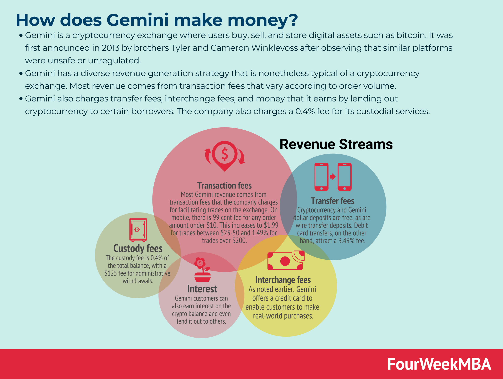

## Table of Contents

## What is Gemini Exchange?

Gemini Exchange is a place where people can buy, sell, and trade cryptocurrencies like Bitcoin and Ethereum. It was started by the Winklevoss brothers, who are well-known in the tech world. Gemini is known for being safe and following the rules. It is used by people all over the world and is one of the more trusted places to trade cryptocurrencies.

The exchange offers different ways to trade, like simple buying and selling or more advanced trading options. It also has features to help keep your money safe, like two-factor authentication and cold storage for cryptocurrencies. Gemini works hard to make sure that it follows the laws in the places where it operates, which helps people trust it more.

## Who founded Gemini Exchange and when was it established?

Gemini Exchange was founded by the Winklevoss brothers, Tyler and Cameron. They are famous for their involvement in the early days of Facebook and have since become big names in the world of cryptocurrencies. The Winklevoss twins wanted to create a safe and trustworthy place for people to trade digital currencies.

The exchange was established in 2014. Since then, Gemini has grown to become a well-known platform where people from all over the world can buy, sell, and trade cryptocurrencies like Bitcoin and Ethereum. It focuses on security and following the rules, which helps people feel more confident when using the exchange.

## What are the basic steps to start trading on Gemini?

To start trading on Gemini, first you need to sign up for an account. Go to the Gemini website and click on the sign-up button. You will need to provide some personal information like your name, email address, and phone number. After you sign up, you will need to verify your identity. This usually means uploading a photo of your ID, like a driver's license or passport, and maybe a proof of address, like a utility bill. This step is important to keep the platform safe and follow the rules.

Once your account is set up and verified, you can add money to your Gemini account. You can do this by linking your bank account or using a credit/debit card to deposit money. After your money is in your account, you can start trading. Go to the trading section of the website, choose the [cryptocurrency](/wiki/cryptocurrency) you want to buy or sell, like Bitcoin or Ethereum, and place your order. You can choose to buy at the current market price or set a specific price you want to pay. Once your order is filled, the cryptocurrency will be in your Gemini wallet, ready for you to use or trade more.

## What types of cryptocurrencies can be traded on Gemini?

Gemini Exchange lets you trade many different cryptocurrencies. Some of the most popular ones you can trade there are Bitcoin and Ethereum. These are the big names in the crypto world and are widely used. Besides these, Gemini also offers other cryptocurrencies like Litecoin, Bitcoin Cash, and Zcash. This gives you a good variety to choose from when you want to trade.

In addition to these, Gemini keeps adding new cryptocurrencies to its platform. This means you can find newer or less common cryptocurrencies like Chainlink, Basic Attention Token, and even more. By offering a wide range of cryptocurrencies, Gemini makes sure that traders have plenty of options to explore and invest in. This variety can help you build a diverse crypto portfolio.

## How does Gemini ensure the security of user funds and data?

Gemini takes security very seriously to keep your money and information safe. They use something called two-[factor](/wiki/factor-investing) authentication, which means you need more than just a password to log in. This makes it much harder for someone else to get into your account. They also keep most of the cryptocurrencies in what's called cold storage. This means the digital money is kept offline, away from hackers who might try to steal it online. Plus, Gemini uses strong encryption to protect your data when it's being sent over the internet.

Another way Gemini keeps things safe is by following strict rules and getting checked by outside experts. They have to follow the laws in the places where they work, which helps make sure they're doing things right. They also get their security checked by other companies to make sure it's as good as it can be. This is called getting audited, and it helps make sure that Gemini is always working to keep your money and data safe.

## What are the fees associated with trading on Gemini?

When you trade on Gemini, you will have to pay some fees. The fees depend on how you trade. If you use the simple way to buy and sell, called Gemini's web or mobile app, you will pay a fee that is a percentage of what you buy or sell. This fee can be between 0.5% to 3.49%, depending on how you pay. If you use a bank transfer, the fee is lower than if you use a credit or debit card. Also, if you trade a lot, you might get a lower fee.

For more advanced trading on Gemini's ActiveTrader platform, the fees are different. Here, you pay what's called a maker-taker fee. Makers add to the market by placing orders that are not immediately filled, and they pay a lower fee. Takers take from the market by filling existing orders, and they pay a higher fee. The maker fee starts at 0.25% and can go down to 0% if you trade a lot. The taker fee starts at 0.35% and can also go down if you trade more. So, the more you trade, the less you might have to pay in fees.

## Can you explain the difference between Gemini ActiveTrader and the standard Gemini platform?

Gemini ActiveTrader and the standard Gemini platform are two different ways to trade cryptocurrencies on Gemini. The standard Gemini platform is easier to use and is good for people who are new to trading. It lets you buy and sell cryptocurrencies like Bitcoin and Ethereum with just a few clicks. You can use the website or the mobile app, and you pay a fee that depends on how you pay, like using a bank transfer or a credit card. This platform is great if you want to keep things simple and don't need a lot of fancy trading tools.

Gemini ActiveTrader, on the other hand, is for people who want more control and are more experienced with trading. It's like a more advanced version of the standard platform. On ActiveTrader, you can use something called a maker-taker fee system. Makers add to the market by placing orders that are not filled right away, and they pay a lower fee. Takers take from the market by filling existing orders, and they pay a higher fee. The fees can be lower if you trade a lot. ActiveTrader also has more tools and charts to help you make better trading decisions. So, if you like to trade a lot and want more features, ActiveTrader might be better for you.

## What advanced trading features does Gemini offer?

Gemini's ActiveTrader platform offers several advanced trading features that are great for experienced traders. One big feature is the ability to use limit orders, which let you set a specific price at which you want to buy or sell a cryptocurrency. This can help you get a better price than just buying or selling at the current market price. Another feature is the [order book](/wiki/order-book-trading-strategies), which shows you all the current buy and sell orders for a cryptocurrency. This can help you see what other traders are doing and make smarter trading decisions. ActiveTrader also has advanced charting tools that let you look at price trends and patterns over time, which can help you predict where prices might go next.

In addition to these, ActiveTrader offers features like stop orders, which let you set a price at which your order will automatically be triggered if the market reaches that price. This can help you limit your losses or lock in profits. You can also use the platform's advanced order types, like iceberg orders, which let you hide part of your order so other traders can't see the full size of what you're buying or selling. These features, along with the ability to trade on margin, which means borrowing money to trade more than you have, make ActiveTrader a powerful tool for traders who want to use more advanced strategies.

## How does Gemini comply with regulatory requirements?

Gemini works hard to follow the rules set by the places where it operates. They are very careful about this because they want to make sure they are doing everything right. One way they do this is by getting licenses from different places. For example, Gemini has a license from the New York State Department of Financial Services, which is called a BitLicense. This shows that they meet the strict rules set by New York. They also follow the rules in other countries where they work, like the UK and Canada, to make sure they are doing things the right way everywhere.

Another way Gemini makes sure they follow the rules is by getting checked by outside experts. This is called an audit. These experts look at Gemini's security, their way of keeping customer money safe, and how they follow the law. By doing this, Gemini shows that they are serious about being honest and safe. They also report to the right government groups and follow anti-money laundering laws, which helps stop bad people from using the exchange for illegal things. All of this helps people trust Gemini more and feel safe using their services.

## What is Gemini Earn and how does it work?

Gemini Earn is a way for people to earn interest on their cryptocurrencies. If you have cryptocurrencies like Bitcoin or Ethereum and you don't want to sell them but want to make some money from them, you can use Gemini Earn. You lend your cryptocurrencies to Gemini, and in return, they pay you interest. The interest you earn depends on which cryptocurrency you lend and how long you lend it for. It's like putting your money in a savings account, but instead of dollars, you're using cryptocurrencies.

To start using Gemini Earn, you need to have a Gemini account and some cryptocurrencies in your wallet. You choose which cryptocurrencies you want to lend and how much. Then, Gemini takes care of the rest. They use your cryptocurrencies to lend to other people or institutions, and you get paid interest regularly. This way, your cryptocurrencies can grow over time without you having to do anything else. It's a simple way to make your crypto work for you.

## How does Gemini's API support institutional trading?

Gemini's API is a tool that helps big companies and professional traders buy and sell cryptocurrencies easily. It lets them connect their own computer systems to Gemini's trading platform. This way, they can trade a lot of cryptocurrencies quickly and automatically. The API gives them access to real-time data, so they can see what's happening in the market right away. It also lets them place different kinds of orders, like limit orders and stop orders, which can help them trade smarter.

The API is also very safe. Gemini makes sure that only the right people can use it by using strong security measures. This is important because big companies handle a lot of money, and they need to know their trades are secure. The API also follows the rules set by different countries, so institutions can use it without worrying about breaking the law. This makes it easier for big companies to trade on Gemini and helps them trust the platform more.

## What are some of the unique offerings or innovations introduced by Gemini in the crypto exchange market?

Gemini has introduced some special features that set it apart from other crypto exchanges. One of these is Gemini Earn, which lets people earn interest on their cryptocurrencies. Instead of just holding onto their digital money, users can lend it to Gemini and get paid interest regularly. This is a simple way for people to make their crypto work for them without having to sell it. Another unique offering is Gemini Custody, a service designed for big companies and institutions to safely store their large amounts of cryptocurrencies. It uses strong security measures to keep the digital money safe, which is important for big investors.

Gemini also has Gemini ActiveTrader, which is a more advanced trading platform for experienced traders. It offers features like advanced order types and real-time market data, which help traders make smarter decisions. This platform is great for people who trade a lot and want more control over their trades. Additionally, Gemini has been working on making it easier for people to use cryptocurrencies in everyday life. They've introduced Gemini Pay, which lets users pay with cryptocurrencies at places that accept them. This helps bridge the gap between digital money and regular money, making it more practical for everyday use.

## References & Further Reading

[1]: Bergstra, J., Bardenet, R., Bengio, Y., & Kégl, B. (2011). ["Algorithms for Hyper-Parameter Optimization."](https://papers.nips.cc/paper/4443-algorithms-for-hyper-parameter-optimization) Advances in Neural Information Processing Systems 24.

[2]: ["Advances in Financial Machine Learning"](https://www.amazon.com/Advances-Financial-Machine-Learning-Marcos/dp/1119482089) by Marcos Lopez de Prado

[3]: ["Evidence-Based Technical Analysis: Applying the Scientific Method and Statistical Inference to Trading Signals"](https://www.amazon.com/Evidence-Based-Technical-Analysis-Scientific-Statistical/dp/0470008741) by David Aronson

[4]: ["Machine Learning for Algorithmic Trading"](https://github.com/stefan-jansen/machine-learning-for-trading) by Stefan Jansen

[5]: ["Quantitative Trading: How to Build Your Own Algorithmic Trading Business"](https://www.amazon.com/Quantitative-Trading-Build-Algorithmic-Business/dp/1119800064) by Ernest P. Chan