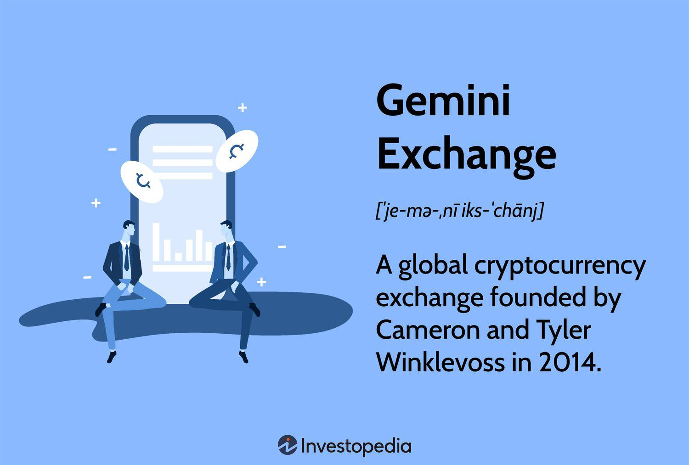

In recent years, cryptocurrency trading has significantly altered the financial landscape, providing unique opportunities for investors to engage with digital assets. This burgeoning market has seen the emergence of various exchanges that offer robust platforms tailored to both novice and experienced traders. Among these, Gemini Exchange stands out as a major player, known for its strong emphasis on security and regulatory compliance.

Founded in 2014 by Cameron and Tyler Winklevoss, Gemini brings together the essential elements of a modern trading platform and fiduciary custodial services. This dual approach enables the exchange to cater not just to casual traders but also to institutional investors who prioritize asset security and regulatory assurance. By offering insurance for its digital assets and adhering to stringent compliance standards, Gemini positions itself as a reliable choice in the cryptocurrency arena.

This article aims to provide a comprehensive understanding of cryptocurrency trading dynamics on Gemini Exchange. It will highlight the various financial services offered by the platform and discuss the significance of algorithmic trading, a technique that uses pre-set algorithms for trading to enhance efficiency and precision. This method has become increasingly popular as traders seek to maximize their market engagement with minimal human intervention.

Investors will find guidance on leveraging Gemini's capabilities to execute trades efficiently while ensuring the highest level of asset security. We will explore the unique offerings available on Gemini Exchange and examine the influence of algorithmic trading on the broader cryptocurrency markets.

## Table of Contents

## The Rise of Cryptocurrency Trading

Cryptocurrency trading has swiftly transitioned into a mainstream financial activity, largely driven by the prominence of digital coins such as Bitcoin and Ethereum as viable investment options. The decentralized nature of the cryptocurrency market presents distinct benefits, notably transparency and accessibility, which challenge the traditional financial systems. The utilization of blockchain technology in cryptocurrency trading ensures that transactions are securely recorded on a public ledger, thus enhancing transparency. Furthermore, the peer-to-peer nature of these digital currencies eliminates intermediaries, reducing transaction costs and fostering broader accessibility.

Despite these advantages, the [cryptocurrency](/wiki/cryptocurrency) market is notorious for its high [volatility](/wiki/volatility-trading-strategies) and associated risks. Price fluctuations can be abrupt and severe, making market predictions challenging. For instance, Bitcoin has experienced several boom-and-bust cycles, witnessing dramatic price increases followed by significant downward adjustments. This volatility necessitates that traders employ robust risk management strategies and select reliable platforms to mitigate potential losses. Reliable exchanges provide security protocols, user-friendly interfaces, and sufficient [liquidity](/wiki/liquidity-risk-premium), which are crucial for efficient trading operations.

Gemini Exchange has established itself as a reliable platform, offering a secure environment for cryptocurrency trading. Founded by the Winklevoss twins in 2014, Gemini is known for its strong regulatory compliance and commitment to user security. It provides a solid infrastructure for trading, supported by comprehensive security measures including two-[factor](/wiki/factor-investing) authentication and advanced encryption standards. These security features make it an attractive choice for both novice and experienced traders seeking a reliable platform to conduct their transactions.

Understanding the dynamics of the cryptocurrency market is essential for traders aspiring to capitalize on its potential. Key market indicators, such as trading volumes, market capitalization, and liquidity levels, provide critical insights into market conditions and future trends. Additionally, staying informed about regulatory developments, technological advancements, and macroeconomic factors can further enhance a trader's ability to navigate the cryptocurrency landscape successfully.

Thus, the rise of cryptocurrency trading highlights the need for ongoing education and strategic decision-making. As the market continues to evolve, traders must remain abreast of new trends and tools that can aid them in maximizing their investment opportunities. Those willing to embrace this dynamic market with a well-informed approach are poised to harness the potential benefits that cryptocurrency trading offers.

## Exploring Gemini Exchange: Features and Services

Gemini Exchange has distinguished itself as an all-encompassing cryptocurrency trading platform that extends beyond mere buying and selling of digital assets. As an integrated financial service provider, Gemini offers a multitude of products tailored to various trading needs. One of the standout features of Gemini Exchange is its custodial service, which provides robust security measures for digital assets. With an insurance coverage of $200 million for assets held in custody, Gemini offers a level of protection that is unparalleled in the industry. This significant coverage assures users of the safety of their investments, setting Gemini apart from its competitors.

For advanced traders, Gemini offers the Active Trader Platform, which is equipped with a suite of powerful tools to facilitate complex trading operations. This platform includes advanced charting features, multiple order types, and high-speed trade execution capabilities, enabling traders to analyze the market efficiently and execute their strategies with precision. The Active Trader Platform is designed to meet the needs of seasoned traders who require more sophisticated tools to manage their portfolios.

Gemini supports a wide range of cryptocurrencies, including prominent ones such as Bitcoin and Ethereum. Notably, it holds the distinction of being the first licensed exchange for trading Ether and Zcash in the United States, highlighting its commitment to regulatory compliance and market innovation. This diversity in supported digital currencies caters to the varied interests and investment strategies of its user base.

Security is further enhanced through Gemini's collaboration with Nasdaq, one of the world's leading securities exchanges, and other partners. This partnership employs cutting-edge technology to monitor market activities and detect fraudulent behavior. By incorporating Nasdaq's SMARTS Market Surveillance, Gemini ensures a secure trading environment, reinforcing trust among its users.

Overall, Gemini Exchange provides a secure, comprehensive, and technologically advanced platform that meets the needs of both novice and experienced traders.

## The Role of Algorithmic Trading in Cryptocurrency Markets

Algorithmic trading, or algo trading, utilizes pre-programmed algorithms to automatically execute trades based on predetermined variables, primarily price and [volume](/wiki/volume-trading-strategy). This trading method enhances the efficiency of executing trades by increasing speed and accuracy. By operating without the influence of human emotion, algo trading achieves a higher level of precision, mitigating the risk of impulsive decisions which can affect trading outcomes.

Gemini Exchange offers functionality for [algorithmic trading](/wiki/algorithmic-trading), allowing users to automate their trading strategies effectively. This capability is particularly beneficial for managing multiple accounts simultaneously, optimizing trading decisions across diverse asset portfolios. The automation provided by algorithmic trading ensures that trades are executed at the most favorable conditions quickly, using complex algorithms that analyze large sets of data in real time to identify market opportunities.

Despite its advantages, algo trading involves intricate challenges, including over-optimization and technological dependencies. Over-optimization occurs when algorithms are overly tailored to historical data, leading to poor performance in live markets. Additionally, technological dependencies present a risk, as the success of algorithmic strategies is contingent on seamless algorithm function, meaning any technical failure can result in significant financial loss.

Professional traders and institutional investors frequently employ algorithmic trading due to its unparalleled ability to exploit real-time market opportunities. This approach allows the simultaneous execution of trades across multiple markets and time zones, capitalizing on price discrepancies and short-lived trends with utmost efficiency.

Given these dynamics, it is clear that while algo trading can vastly enhance trading operations, its implementation requires sophisticated technological infrastructure and a thorough understanding of algorithm design to navigate potential pitfalls effectively.

## Comparing Gemini Exchange with Other Platforms

When comparing Gemini Exchange with other prominent cryptocurrency platforms such as Coinbase and Binance, several factors must be considered to assess which platform best suits a trader's needs. Each exchange has distinct features, making it essential to evaluate them based on user interface, supported cryptocurrencies, fees, and customer support.

Firstly, the user interface is a crucial component in determining user experience. Gemini offers a clean and intuitive interface, appealing especially to newcomers in the cryptocurrency space. Coinbase also provides an accessible interface, popular among beginners for its simplicity and ease of use. On the other hand, Binance, though more complex, caters to experienced traders with its extensive range of tools and options for technical analysis.

In terms of the range of supported cryptocurrencies, Binance is unmatched, supporting hundreds of different cryptocurrencies including numerous altcoins. This extensive offering attracts traders interested in diverse investment opportunities. Coinbase supports a wide range, though not as extensive as Binance, while Gemini's selection is more limited, focusing on major cryptocurrencies like Bitcoin and Ethereum.

Fee structures are another important consideration. Binance is often favored for its low trading fees, which can be further reduced using Binance Coin (BNB) for transaction fees. In contrast, Gemini typically has higher fees, but these are justified by its enhanced security measures and strong regulatory compliance, factors that trust-conscious users might prioritize. Coinbase's fees are relatively high, especially for smaller transactions, which can deter cost-sensitive traders.

Customer support is vital for an exchange's reliability and user satisfaction. Gemini is known for its responsive support team, which can be a decisive factor for users who need quick assistance with their accounts. Similarly, Coinbase invests significantly in customer service, providing a range of options for support. Binance's support is robust but may not be as accessible, given its vast international user base, which sometimes leads to delays.

Gemini consistently emphasizes regulatory compliance and security, boasting a strong reputation in these areas. Its commitment to providing a secure trading environment, combined with regulatory adherence, often gives it a competitive edge in terms of user trust. However, traders focused on accessing a broader array of cryptocurrencies or minimizing trading fees may opt for Binance or Coinbase, based on their specific trading strategies.

Ultimately, understanding both the strengths and limitations of each platform enables traders to make informed decisions that align with their individual trading objectives. Each platform offers a unique combination of features, and selecting the right exchange depends on balancing personal priorities like security, cost, variety, and functionality.

## The Future of Algo Trading and Financial Services on Gemini

With technology continuously advancing, the future of algorithmic trading on platforms like Gemini looks promising. Algorithmic trading, which involves automated trading strategies based on predefined criteria, stands to gain significantly from advancements in [artificial intelligence](/wiki/ai-artificial-intelligence) (AI) and [machine learning](/wiki/machine-learning) (ML). These technologies are expected to enhance trading algorithms, making them more adaptive, insightful, and capable of executing strategies with improved precision. AI and ML can help in developing models that better predict market movements, optimize trading decisions, and manage risks effectively.

Gemini has been proactive in forging partnerships with technological and financial institutions, which may lead to the development of more innovative financial services for its users. Such collaborations have the potential to drive seamless integration of cutting-edge technologies, thereby offering users a competitive edge in algorithmic trading and other financial operations.

The expansion of API functionalities will empower traders to build more sophisticated trading strategies and leverage big data analytics to their advantage. Gemini's API plays a crucial role in allowing traders to access real-time market data, execute trades, and manage portfolios with greater flexibility and efficiency. As the demand for comprehensive data and analytical capabilities grows, enhancing API functionalities will be vital for catering to the needs of professional traders and institutional investors.

Gemini's dedication to maintaining a secure platform and implementing user-centered enhancements firmly establishes it as a leading exchange in the global cryptocurrency trading industry. The platform's strong focus on security measures helps mitigate risks associated with cryptocurrency trading, fostering trust among its users. By continuously investing in technological advancements and regulatory compliance, Gemini stays well-positioned to adapt to the dynamic cryptocurrency market and meet the evolving needs of its users.

In conclusion, the future of algorithmic trading and financial services on Gemini is likely to be shaped by ongoing technological developments and strategic partnerships. Traders and investors utilizing its platform can anticipate improvements in trading efficiency, strategy development, and risk management as Gemini continues to embrace innovation and uphold its commitment to security and user satisfaction.

## Conclusion

Gemini Exchange provides a robust suite of services tailored to the needs of both retail and institutional traders, prioritizing security and operational efficiency. This integration of algorithmic trading capabilities underscores the growing importance of technology-driven trading solutions within the cryptocurrency ecosystem. By enabling traders to implement sophisticated strategies, Gemini exemplifies the transformative impact of algorithmic trading on modern finance.

Regulatory compliance remains a cornerstone of Gemini's operational ethos, reflected in its innovative partnerships and adherence to strict financial standards. This commitment not only bolsters user trust but also positions Gemini as a key player in shaping the future trajectory of digital asset trading. For prospective cryptocurrency traders, appreciating the features offered by platforms like Gemini is essential to crafting informed and effective investment strategies.

As the cryptocurrency market continues to evolve, staying informed about technological advancements and regulatory changes will be crucial for traders aiming to seize opportunities within the digital asset domain. The ongoing development of trading technologies, such as machine learning and big data analytics, is likely to enhance the capabilities of platforms like Gemini, providing users with increasingly sophisticated tools for market engagement. Consequently, traders who maintain their knowledge of these trends stand to gain a competitive edge in capitalizing on the dynamic nature of digital assets.

## References & Further Reading

[1]: Bergstra, J., Bardenet, R., Bengio, Y., & Kégl, B. (2011). ["Algorithms for Hyper-Parameter Optimization."](https://papers.nips.cc/paper/4443-algorithms-for-hyper-parameter-optimization) Advances in Neural Information Processing Systems 24.

[2]: ["Advances in Financial Machine Learning"](https://www.amazon.com/Advances-Financial-Machine-Learning-Marcos/dp/1119482089) by Marcos Lopez de Prado

[3]: ["Evidence-Based Technical Analysis: Applying the Scientific Method and Statistical Inference to Trading Signals"](https://www.amazon.com/Evidence-Based-Technical-Analysis-Scientific-Statistical/dp/0470008741) by David Aronson

[4]: ["Machine Learning for Algorithmic Trading"](https://github.com/stefan-jansen/machine-learning-for-trading) by Stefan Jansen

[5]: ["Quantitative Trading: How to Build Your Own Algorithmic Trading Business"](https://www.amazon.com/Quantitative-Trading-Build-Algorithmic-Business/dp/1119800064) by Ernest P. Chan