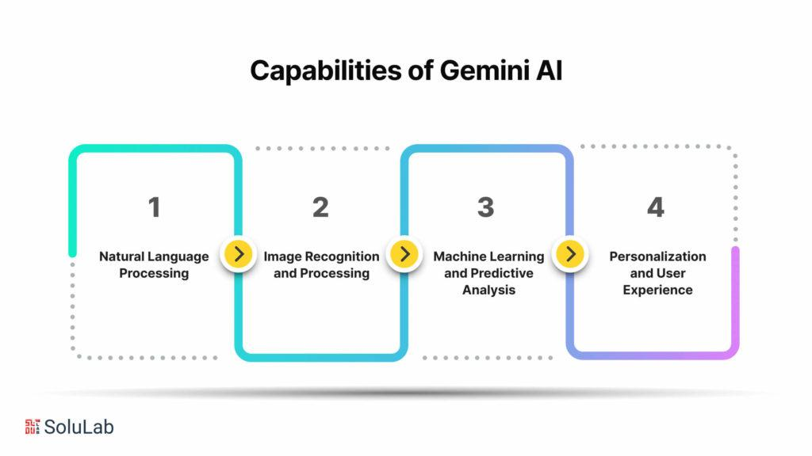

## Table of Contents

## What are Gemini Models in the context of machine learning?

Gemini Models are a type of machine learning model developed by Google. They are designed to handle a wide range of tasks, from understanding text to processing images and even generating new content. The idea behind Gemini Models is to create a single model that can do many different things well, instead of having separate models for each task. This makes them very versatile and useful in many different situations.

These models are built using a technique called deep learning, which involves training the model on large amounts of data. The more data the model sees, the better it gets at understanding and generating new information. Gemini Models are particularly good at understanding context and can perform tasks like answering questions, summarizing texts, and even creating new images based on what they've learned. This makes them a powerful tool in the world of artificial intelligence.

## How do Gemini Models differ from other machine learning models?

Gemini Models are unique because they are designed to handle many different types of tasks all at once. Most other machine learning models are made for specific jobs, like understanding text or recognizing images. But Gemini Models can do both of these things, and more. They use a special way of learning that lets them get better at lots of different things as they see more data. This makes them very flexible and useful in many situations where you might need different kinds of help.

Another big difference is that Gemini Models are built to understand context really well. This means they can make sense of information in a way that feels more like how a person would. For example, if you ask a Gemini Model a question, it can use what it knows about the world to give you a good answer. Other models might not be as good at this because they focus on one type of information at a time. So, Gemini Models can be more helpful and accurate in many real-world situations.

## What are the key components of a Gemini Model?

The key components of a Gemini Model include a large neural network that is trained on a wide variety of data. This neural network is made up of many layers, and each layer helps the model understand different parts of the information it sees. The model uses a technique called deep learning, which means it can learn from examples and get better over time. This is important because it allows the Gemini Model to handle many different tasks, like understanding text, recognizing images, and even creating new content.

Another important part of a Gemini Model is its ability to understand context. This means the model can use what it knows about the world to make sense of new information. For example, if you ask the model a question, it can use its knowledge to give you a good answer. This is different from other models that might only focus on one type of information at a time. The Gemini Model's ability to understand context makes it very useful in real-world situations where you need help with different kinds of tasks.

## Can you explain the basic architecture of a Gemini Model?

The basic architecture of a Gemini Model is like a big brain made of many layers. Each layer helps the model understand different parts of the information it sees. At the bottom, there are layers that look at the raw data, like words in a sentence or pixels in an image. As you go up the layers, the model starts to see bigger patterns and understand the context of the information. This is important because it allows the Gemini Model to handle many different tasks, like understanding text, recognizing images, and even creating new content.

The model uses a technique called deep learning, which means it can learn from examples and get better over time. This is done by adjusting the connections between the layers of the neural network. The more data the model sees, the better it gets at understanding and generating new information. This makes the Gemini Model very flexible and useful in many situations where you might need different kinds of help. The ability to understand context is a key part of the architecture, allowing the model to use what it knows about the world to make sense of new information and give good answers to questions.

## What types of problems are Gemini Models best suited to solve?

Gemini Models are best suited to solve problems that need a lot of different kinds of help. They are good at understanding text, recognizing images, and even creating new content. This makes them perfect for tasks like answering questions, summarizing texts, and making new images based on what they've learned. If you need a model that can do many things well, a Gemini Model is a great choice.

These models are also very good at understanding context. This means they can make sense of information in a way that feels more like how a person would. For example, if you ask a Gemini Model a question, it can use what it knows about the world to give you a good answer. This is helpful in real-world situations where you need a model that can understand and help with different kinds of tasks.

## How is training conducted for Gemini Models?

Training a Gemini Model involves showing it a lot of different kinds of data. This data can include text, images, and other types of information. The model looks at this data and tries to understand it. It does this by adjusting the connections between the layers of its neural network. The more data the model sees, the better it gets at understanding and generating new information. This process is called deep learning, and it helps the Gemini Model become good at many different tasks.

During training, the model is given examples and told what the right answers should be. It then tries to match these answers by changing how it processes the data. If the model makes a mistake, it learns from it and adjusts its connections to do better next time. This happens over and over again until the model is very good at understanding and creating new content. The goal is to make the Gemini Model smart enough to handle many different kinds of problems and give helpful answers.

## What are the common performance metrics used to evaluate Gemini Models?

When people want to see how good a Gemini Model is, they look at different things. One common thing they check is accuracy, which means how often the model gets the right answer. They also look at precision and recall, which tell us how well the model can find the right information without making mistakes. Another important thing is the F1 score, which is a mix of precision and recall. It's like a balance between being right and not missing important stuff. These metrics help people understand how well the Gemini Model can do different tasks, like understanding text or recognizing images.

Another way to measure how a Gemini Model is doing is by looking at how fast it can work. This is called latency, and it's important because people want quick answers. People also care about how much the model can handle at once, which is called throughput. If a model can do a lot of things quickly, it's very useful. Finally, there's something called perplexity, which is used a lot when the model is working with text. A lower perplexity means the model is better at understanding and making sentences that make sense. All these metrics together help people see how good a Gemini Model is at helping with different kinds of tasks.

## How can hyperparameters be optimized in Gemini Models?

To make a Gemini Model work better, you need to tweak its hyperparameters. These are like the settings that control how the model learns. One way to find the best settings is by using a method called grid search. This means you try out lots of different combinations of settings and see which one makes the model perform the best. Another way is random search, where you pick random settings and test them. Both methods can take a long time, but they help you find the right settings to make the model smarter.

Another way to optimize hyperparameters is by using a technique called Bayesian optimization. This method is smarter because it uses what it learns from earlier tries to guess which settings might work better next. It's like playing a game where you get better at choosing the right moves as you go along. Bayesian optimization can be faster than grid search or random search because it doesn't waste time on settings that won't help. By using these methods, you can make sure your Gemini Model is as good as it can be at understanding and solving different kinds of problems.

## What are some practical applications of Gemini Models in industry?

Gemini Models are used in many industries because they can do a lot of different things well. In healthcare, they help doctors by understanding medical records and answering questions about patient care. They can also look at medical images and help find problems that might be hard to see. In customer service, Gemini Models can talk to customers and help them with their questions. They can understand what people are saying and give helpful answers, making customer service faster and better.

In the world of business, Gemini Models are used to understand what customers want and need. They can look at what people are saying on social media and help companies make better products. They can also help with writing reports and making presentations by understanding and summarizing information quickly. This makes it easier for businesses to make smart decisions and keep their customers happy.

## Can you discuss any limitations or challenges faced when using Gemini Models?

One big challenge with Gemini Models is that they need a lot of data to learn well. If you don't have enough data, the model might not be able to understand things as well as it should. This can make it hard to use in places where data is hard to get. Another problem is that these models can be very slow and need a lot of computer power to work. This means they can be expensive to use, especially if you want them to do things quickly.

Another limitation is that Gemini Models can sometimes make mistakes. They might not understand the context of something correctly, which can lead to wrong answers or confusing results. This is a big problem in places like healthcare, where mistakes can be very serious. Also, because these models are so big and complicated, it can be hard to understand how they make their decisions. This is called the "black box" problem, and it can make people not trust the model's answers.

## How do Gemini Models integrate with other AI technologies?

Gemini Models can work well with other AI technologies to make them even better. For example, they can be used with natural language processing tools to understand and create text more accurately. This is helpful in things like chatbots, where the Gemini Model can understand what people are saying and give good answers. They can also be used with computer vision systems to recognize and understand images better. By working together, these technologies can do more than they could on their own.

Another way Gemini Models can integrate with other AI technologies is by working with machine learning algorithms that focus on specific tasks. For instance, a Gemini Model can help a recommendation system by understanding what people like and suggesting things they might enjoy. It can also work with predictive models to make better guesses about what might happen in the future. By combining the strengths of different AI technologies, Gemini Models can help solve complex problems and make life easier for people.

## What are the latest advancements in Gemini Model research?

The latest advancements in Gemini Model research are focusing on making these models even better at understanding and creating different types of information. One big step forward is improving how these models handle different languages. Researchers are working on making Gemini Models better at understanding and speaking many languages at once. This means the models can help people from different parts of the world more easily. Another area of progress is in making the models more efficient. This means they can work faster and use less computer power, which makes them cheaper and easier to use.

Another exciting advancement is in the area of multi-modal learning. This means the models can understand and create not just text, but also images, sounds, and even videos all at the same time. For example, a Gemini Model could look at a picture and write a story about it, or listen to a song and create a new image based on the music. This makes the models very versatile and useful in many different situations. Researchers are also working on making these models more transparent, so people can understand how the models make their decisions. This is important for building trust and making sure the models are used in a fair and responsible way.