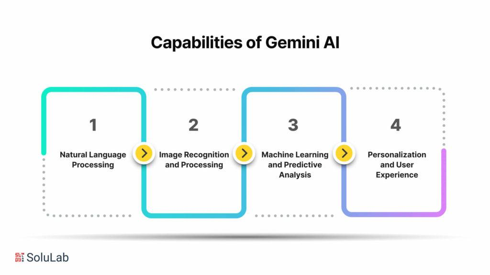

## Table of Contents

## What is Gemini in the context of machine learning?

Gemini is a type of machine learning model developed by Google. It's designed to understand and generate human-like text, similar to other language models like ChatGPT. Gemini is part of Google's efforts to advance artificial intelligence, making it better at tasks like answering questions, writing stories, or even helping with programming. The model is trained on a huge amount of text data, which allows it to learn patterns and generate responses that seem very natural.

One key feature of Gemini is its ability to handle different types of data, not just text. This means it can work with images, videos, and other forms of media, making it a versatile tool for various applications. For example, Gemini could help describe an image or answer questions about a video. This multi-modal capability is what sets Gemini apart from many other language models and makes it a powerful tool in the field of machine learning.

## Who developed the Gemini machine learning model?

The Gemini machine learning model was developed by Google. Google is a big company that makes a lot of things, including phones and search engines. They also work on making computers smarter, which is where Gemini comes in. Google's team of smart people who know a lot about computers and math worked together to create Gemini.

Gemini is special because it can understand and make different kinds of information, not just words. It can work with pictures, videos, and other stuff too. This makes Gemini very useful for many different jobs, like helping people understand what's in a picture or answering questions about a video. Google keeps working on Gemini to make it even better at understanding and helping people.

## What are the main applications of Gemini in machine learning?

Gemini, made by Google, is a smart computer program that can do many things to help people. One of the main ways Gemini is used is to understand and make text that sounds like it was written by a person. This means Gemini can answer questions, write stories, or even help with homework. For example, if you ask Gemini a question about history, it can give you a good answer that sounds like it came from a book.

Another big use for Gemini is working with different kinds of information, not just words. Gemini can look at pictures and videos and tell you what it sees or hears. This is helpful for things like describing what's in a picture or answering questions about a video. For instance, if you show Gemini a picture of a dog, it can tell you that it's a dog and maybe even what kind of dog it is. This makes Gemini a very useful tool for many different jobs, from helping people who can't see to making apps that understand the world around us.

## How does Gemini differ from other machine learning models like ChatGPT?

Gemini, made by Google, is a bit different from other smart computer programs like ChatGPT. One big difference is that Gemini can work with more than just words. It can understand and make sense of pictures, videos, and other types of information. This means Gemini can help you with things like describing what's in a picture or answering questions about a video. On the other hand, ChatGPT mostly works with text and is really good at understanding and making sentences that sound like a person wrote them.

Another way Gemini stands out is that it's part of Google's bigger plan to make computers smarter in lots of different ways. Google is always working on new things, and Gemini is one of the tools they use to do that. While ChatGPT is made by a different company called OpenAI, and it's mainly focused on making conversations better, Gemini is more about being able to handle many kinds of tasks. So, while both can help with writing or answering questions, Gemini has a wider range of what it can do.

## What are the key features of Gemini that make it unique?

Gemini, made by Google, is special because it can work with more than just words. It can understand and make sense of pictures, videos, and other types of information. This means Gemini can help you with things like describing what's in a picture or answering questions about a video. This ability to handle different kinds of data, not just text, makes Gemini very useful for many different jobs. For example, if you show Gemini a picture of a dog, it can tell you that it's a dog and maybe even what kind of dog it is.

Another thing that makes Gemini unique is that it's part of Google's bigger plan to make computers smarter in lots of different ways. Google is always working on new things, and Gemini is one of the tools they use to do that. This means Gemini is always being improved and can be used in many different areas, from helping people who can't see to making apps that understand the world around us. While other models like ChatGPT are good at making conversations, Gemini's ability to handle many types of tasks sets it apart.

## Can you explain the architecture of the Gemini model?

The Gemini model, made by Google, is like a big, smart computer program that can understand and make different kinds of information. It's built using something called a transformer architecture, which is a fancy way of saying it's really good at understanding and making sentences. Imagine a transformer as a big library where each book is a piece of information. Gemini uses this library to look at words, pictures, and videos, and then it figures out what they mean and how to put them together in a way that makes sense.

One cool thing about Gemini's architecture is that it can work with different types of data at the same time. This means it can look at a picture and read the words around it, and then tell you what it all means together. For example, if you show Gemini a picture of a dog and ask it what kind of dog it is, it can use the picture and any words you give it to figure out the answer. This makes Gemini very helpful for lots of different jobs, like helping people who can't see or making apps that understand the world around us.

## What kind of data does Gemini use for training?

Gemini, made by Google, uses a lot of different kinds of information to learn and get better at its job. This includes text from books, websites, and other places where people write things. It also looks at pictures and videos to understand what they show. By looking at all this stuff, Gemini learns how to understand and make sense of the world around us. It's like a student studying a big library of information to become really smart.

The data Gemini uses is very big and comes from many places. This helps Gemini know about a lot of different things, from history to science to everyday life. When Gemini sees a picture, it can learn what's in it, like a dog or a tree. When it reads text, it learns how people use words and what they mean. All this information helps Gemini answer questions, describe pictures, and even help with tasks like writing stories or helping people who can't see.

## How does Gemini handle issues of bias and fairness in its algorithms?

Gemini, made by Google, works hard to be fair and not show bias. Bias happens when a computer program learns from data that is not fair or equal. To stop this, the people who make Gemini look at the data it learns from very carefully. They try to make sure the data has a good mix of different kinds of information from different people. This way, Gemini can learn to understand and help everyone, not just some people.

Even with all this work, it's hard to make a computer program completely fair. Sometimes, the data might still have some bias in it, even if the people working on Gemini try their best to clean it up. So, the team keeps watching and checking Gemini to make sure it's being fair. They also listen to what people say about how Gemini works and use that to make it better. By doing all this, they hope to make Gemini as fair and helpful as possible for everyone.

## What are the performance metrics typically used to evaluate Gemini?

When people want to see how well Gemini is doing, they look at different numbers and tests. One important thing they check is how well Gemini understands and makes text. They use something called perplexity to measure this. Perplexity is a number that shows how surprised Gemini is by the text it sees. A lower perplexity means Gemini is better at understanding and making text that sounds right. They also check how well Gemini can answer questions correctly, which is called accuracy. If Gemini answers a lot of questions right, it gets a high accuracy score.

Another thing they look at is how well Gemini works with pictures and videos. They use something called mean average precision (mAP) to see how good Gemini is at finding and understanding things in pictures and videos. A higher mAP score means Gemini is better at this. They also check how fast Gemini can do its work, which is called latency. If Gemini can do things quickly, it has low latency, which is good. By looking at all these numbers, the people who make Gemini can see what it's good at and what it needs to work on.

## How can developers integrate Gemini into their existing machine learning pipelines?

Developers can integrate Gemini into their existing machine learning pipelines by using Google's provided APIs and SDKs. These tools make it easy to connect Gemini to other parts of a project. For example, if a developer has a system that already uses other machine learning models, they can add Gemini to help with tasks like understanding text, describing pictures, or answering questions about videos. They just need to follow the instructions in Google's documentation to set up the API keys and start sending data to Gemini.

Once Gemini is integrated, developers can use it to improve their applications. For instance, if they have an app that helps people find information, they can use Gemini to understand user questions better and provide more accurate answers. They can also use Gemini to add features like image recognition or video analysis, making their app more useful. By keeping an eye on how Gemini performs and using the performance metrics like perplexity, accuracy, and mean average precision (mAP), developers can make sure Gemini is working well and helping their project succeed.

## What are some real-world case studies where Gemini has been successfully implemented?

One real-world example where Gemini has been successfully implemented is in the field of education. A company developed an app that helps students with homework and studying. They used Gemini to make the app better at understanding and answering student questions. When a student asks a question, Gemini can give a clear and helpful answer. It can also help explain pictures or diagrams in textbooks, making learning easier and more fun. This has made the app very popular among students who need extra help with their studies.

Another case study involves a healthcare application where Gemini was used to improve patient care. A healthcare company created an app that helps doctors and nurses understand patient records better. Gemini was integrated into the app to read and summarize patient information quickly. This means doctors can get important details about a patient's history faster, which helps them make better decisions. The app also uses Gemini to describe medical images, like X-rays, helping doctors see problems more clearly. This has made the healthcare process smoother and more efficient for both patients and medical staff.

## What future developments are expected for Gemini in the field of machine learning?

In the future, Gemini is expected to get even better at understanding and working with different kinds of information. Google is always working on making their technology smarter, and Gemini is no different. They plan to make Gemini even better at understanding and making text, pictures, and videos. This means Gemini might be able to help with more complicated tasks, like understanding whole books or making detailed descriptions of videos. Google also wants to make Gemini faster and more accurate, so it can help people even more quickly and correctly.

Another big thing for Gemini's future is making it more fair and less biased. Google knows that it's important for a smart computer program like Gemini to be fair to everyone. They plan to keep looking at the data Gemini learns from and make sure it's as fair as possible. They also want to keep listening to what people say about how Gemini works and use that feedback to make it better. By doing all this, Google hopes to make Gemini a helpful tool for everyone, no matter who they are.