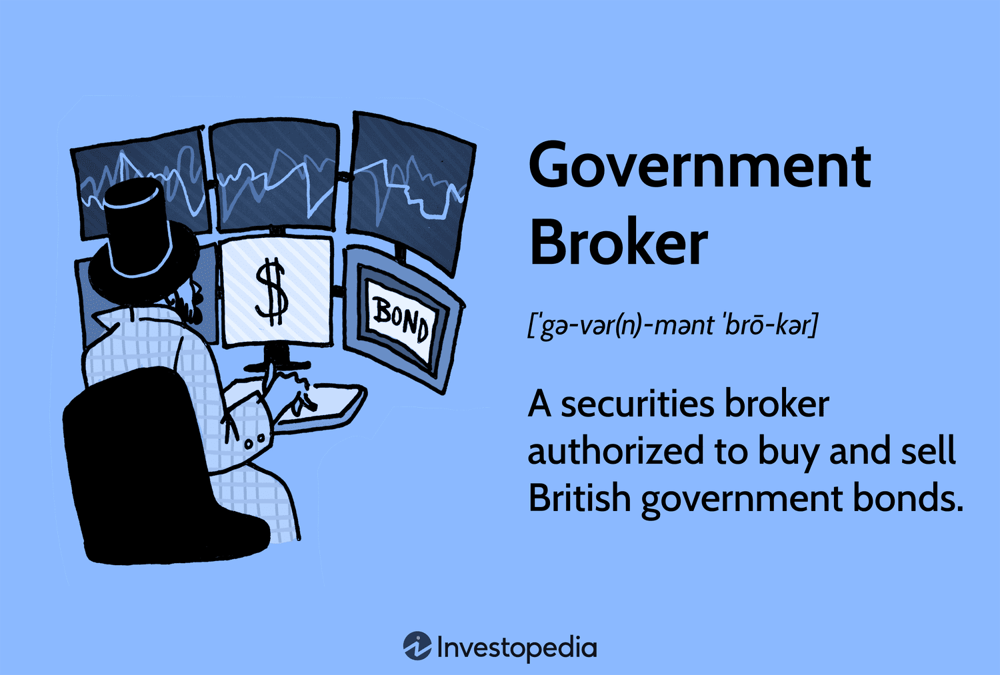

## Table of Contents

## What is GEMM and its role in the financial market?

GEMM stands for Gilt-edged Market Maker. These are special firms that help the government sell and buy back government bonds, which are called gilts. In the UK, the government needs to borrow money to fund various projects and programs. GEMMs make sure there are always people willing to buy these gilts, so the government can get the money it needs. They do this by always being ready to buy and sell gilts, which helps keep the market stable and active.

GEMMs play a big role in the financial market because they help keep the bond market running smoothly. When people and big investors want to buy or sell gilts, GEMMs are there to make sure they can do it easily. This is important because it helps set fair prices for the gilts and keeps the market from getting too wild. By doing this, GEMMs help the whole economy by making sure the government can borrow money in a stable way, which is good for everyone.

## How does GEMM function as a broker for the U.K. Government?

GEMMs act like special helpers for the U.K. Government in the bond market. They are chosen by the government to make sure there are always people ready to buy and sell government bonds, called gilts. When the government needs money, it sells these gilts. GEMMs make sure that when the government wants to sell these bonds, there are buyers ready to buy them. They do this by always being ready to buy and sell gilts themselves, which means they act like middlemen between the government and investors.

By doing this, GEMMs help keep the bond market stable and working well. They make sure that the prices of gilts stay fair and that people can easily buy or sell them whenever they want. This is important because it helps the government borrow money smoothly, which it needs to do things like building roads or schools. So, GEMMs are really important for keeping the economy running smoothly by helping the government manage its money needs.

## What types of financial instruments does GEMM deal with on behalf of the U.K. Government?

GEMMs mainly deal with gilts on behalf of the U.K. Government. Gilts are like special loans that people and big investors give to the government. The government uses these loans to pay for things like building schools, hospitals, and roads. When the government needs money, it sells these gilts, and GEMMs help make sure there are always people ready to buy them.

Besides gilts, GEMMs also deal with other types of bonds that the government might issue. These can include things like treasury bills, which are short-term loans that the government uses to manage its money more day-to-day. GEMMs make sure these bonds can be easily bought and sold, which helps keep the market stable and helps the government get the money it needs when it needs it.

## What are the criteria for becoming a GEMM?

To become a GEMM, a firm needs to meet certain standards set by the U.K. Debt Management Office (DMO). They need to have a strong financial position, which means they must have enough money and resources to handle the job. They also need to show they know a lot about the bond market and have good experience in trading gilts. The firm should have a good reputation and be trusted by other people in the market.

The DMO also looks at how well a firm can handle the risks that come with being a GEMM. This includes having good systems and rules to manage these risks. Firms need to prove they can keep the market running smoothly by always being ready to buy and sell gilts. They must also agree to follow all the rules and guidelines set by the DMO, which helps make sure the market stays fair and stable.

## How does GEMM interact with other financial institutions?

GEMMs work closely with other financial institutions like banks, investment firms, and pension funds. They buy and sell gilts from these institutions, making sure there's always a market for these government bonds. When a bank or an investment firm wants to buy gilts, they can go to a GEMM, who will sell them the bonds. On the other hand, if these institutions want to sell their gilts, GEMMs are there to buy them back. This helps keep the market active and makes it easier for everyone to trade gilts.

GEMMs also help other financial institutions by providing them with information about the bond market. They share details about prices and how the market is doing, which helps banks and investment firms make smart decisions. This information sharing is important because it helps keep the market transparent and fair. By working together, GEMMs and other financial institutions help make the whole financial system run smoothly.

## What is the process of trading through GEMM for government securities?

When someone wants to trade government securities like gilts, they go through a GEMM. If you want to buy gilts, you contact a GEMM and tell them how many you want. The GEMM then sells you the gilts from their own stock or finds them from other sellers. They make sure the price is fair by looking at what other gilts are selling for in the market. Once you agree on the price, the GEMM completes the trade, and you now own the gilts.

If you want to sell your gilts, you also go to a GEMM. You tell them how many gilts you want to sell, and they will buy them from you or find buyers for them. The GEMM makes sure the price you get is fair by checking the current market prices. Once you agree on the price, the GEMM completes the trade, and you get your money. This way, GEMMs help keep the market for government securities running smoothly and make it easy for people to buy and sell gilts.

## How does GEMM contribute to the liquidity of government securities?

GEMMs help make government securities like gilts easy to buy and sell by always being ready to trade them. They keep a lot of gilts in their stock, so when someone wants to buy or sell, they can do it quickly. This is important because it means people don't have to wait to trade, which makes the market work smoothly. By doing this, GEMMs make sure there are always buyers and sellers, which helps keep the prices of gilts fair and stable.

When the market is liquid, it's easier for the government to sell new gilts to get money for things like building schools or roads. If people know they can easily sell their gilts later, they're more likely to buy them in the first place. So, GEMMs help the government borrow money more easily by making sure the bond market stays active and easy to use. This helps the whole economy because it lets the government do important projects without too much trouble.

## What are the regulatory requirements that GEMM must adhere to?

GEMMs have to follow strict rules set by the U.K. Debt Management Office (DMO) to make sure they do their job right. They need to have enough money and resources to handle the job well. They also have to know a lot about the bond market and be good at trading gilts. The DMO checks if a firm has a good reputation and is trusted by other people in the market. GEMMs must also show they can manage risks well, with good systems and rules in place to keep everything safe and stable.

Besides having the right money and skills, GEMMs must always follow the DMO's rules and guidelines. This helps keep the market fair and stable. They need to be ready to buy and sell gilts all the time, so the market keeps running smoothly. GEMMs also have to report their trading activities to the DMO regularly, so the DMO can make sure everything is going well and that the market stays healthy.

## How does GEMM manage risks associated with trading government securities?

GEMMs manage risks by having strong systems and rules in place. They keep an eye on the market all the time to know what's happening with prices and how much people want to buy or sell gilts. This helps them guess what might happen next and be ready for it. They also use special tools and computers to check how much risk they are taking when they trade. This way, they can make smart choices about when to buy or sell gilts to keep things safe.

Another way GEMMs handle risks is by having enough money set aside. If something goes wrong, like prices changing a lot, they can use this money to cover any losses. They also spread out their risks by not putting all their money into one kind of gilt. Instead, they buy and sell different kinds of gilts, so if one type doesn't do well, the others might help balance things out. By doing all these things, GEMMs make sure they can keep trading gilts safely and help keep the market stable.

## What impact does GEMM have on the U.K. Government's borrowing costs?

GEMMs help keep the U.K. Government's borrowing costs low by making sure there are always people ready to buy and sell gilts. When the market for gilts is busy and easy to use, more people want to buy them. This means the government can sell gilts at good prices, which keeps their borrowing costs down. If the market was not busy, the government might have to offer higher interest rates to get people to buy gilts, which would make borrowing more expensive.

By being ready to buy and sell gilts all the time, GEMMs help keep the market stable. This stability makes people feel safe about buying gilts because they know they can sell them later if they need to. When people feel safe, they are more likely to buy gilts even if the interest rates are not very high. So, GEMMs help the government borrow money at lower costs, which is good for everyone because it means the government can spend money on important things like schools and hospitals without having to pay too much interest.

## How does GEMM's performance influence the broader financial market?

GEMMs help keep the whole financial market stable by making sure the market for government bonds, or gilts, works well. When GEMMs do a good job, it's easier for people and big investors to buy and sell gilts. This makes the market busy and keeps prices fair. When the gilt market is stable, it helps other parts of the financial market too. For example, banks and investment firms feel safer because they know they can always trade gilts if they need to. This can make them more willing to lend money and invest in other things, which is good for the economy.

If GEMMs don't do their job well, it can cause problems in the financial market. If they can't keep the gilt market stable, prices might go up and down a lot, which can make people nervous. When people are nervous, they might not want to buy gilts or other investments. This can make it harder for the government to borrow money and can slow down the whole economy. So, GEMMs are really important for keeping everything running smoothly and helping the financial market stay strong.

## What are the future challenges and opportunities for GEMM in the evolving financial landscape?

As the financial world keeps changing, GEMMs will face new challenges. One big challenge is keeping up with new technology. More trading is happening online and with computers, so GEMMs need to use these tools to stay fast and efficient. Another challenge is dealing with new rules and laws that might come up. Governments and financial groups might make new rules to make the market safer and fairer, and GEMMs will need to follow these rules while still doing their job well. Also, if the economy goes through tough times, GEMMs will need to work hard to keep the market for gilts stable and make sure people still want to buy them.

But there are also new opportunities for GEMMs. With better technology, they can reach more people and make trading easier and faster. This can help them do their job better and help the government borrow money more easily. Another opportunity is working with other countries. If GEMMs can help with trading government bonds in other places too, they can grow their business and help make the global financial market stronger. By using these new tools and chances, GEMMs can keep helping the U.K. Government and the whole economy stay strong and stable.

## References & Further Reading

[1]: ["Algorithmic Trading: Winning Strategies and Their Rationale"](https://books.google.com/books/about/Algorithmic_Trading.html?id=WAlFDwAAQBAJ) by Ernie Chan

[2]: ["High-Frequency Trading: A Practical Guide to Algorithmic Strategies and Trading Systems"](https://www.ahmetbeyefendi.com/wp-content/uploads/2020/07/High-Frequency-Trading-Irene-Aldridge.pdf) by Irene Aldridge

[3]: ["The Big Bang: A History of Deregulation"](https://en.wikipedia.org/wiki/Big_Bang_(financial_markets)) Financial Times

[4]: ["Financial Innovation and Asset Price Volatility"](https://www.jstor.org/stable/23245519) by John Y. Campbell and Luis M. Viceira, National Bureau of Economic Research

[5]: UK Debt Management Office, ["The Role of the DMO"](https://www.dmo.gov.uk/about/who-we-are/) 

[6]: ["Automated Trading Desk: The Use of Computer Programs in the Financial Markets"](https://www.investopedia.com/articles/trading/11/automated-trading-systems.asp) by Debra Burke and Susan H. Bagley, Coastal Carolina University

[7]: ["Gilt-Edged Securities"](https://www.investopedia.com/terms/g/gilt-edged-securities.asp) - UK Government's Office for National Statistics 

[8]: ["Advances in Financial Machine Learning"](https://www.amazon.com/Advances-Financial-Machine-Learning-Marcos/dp/1119482089) by Marcos Lopez de Prado