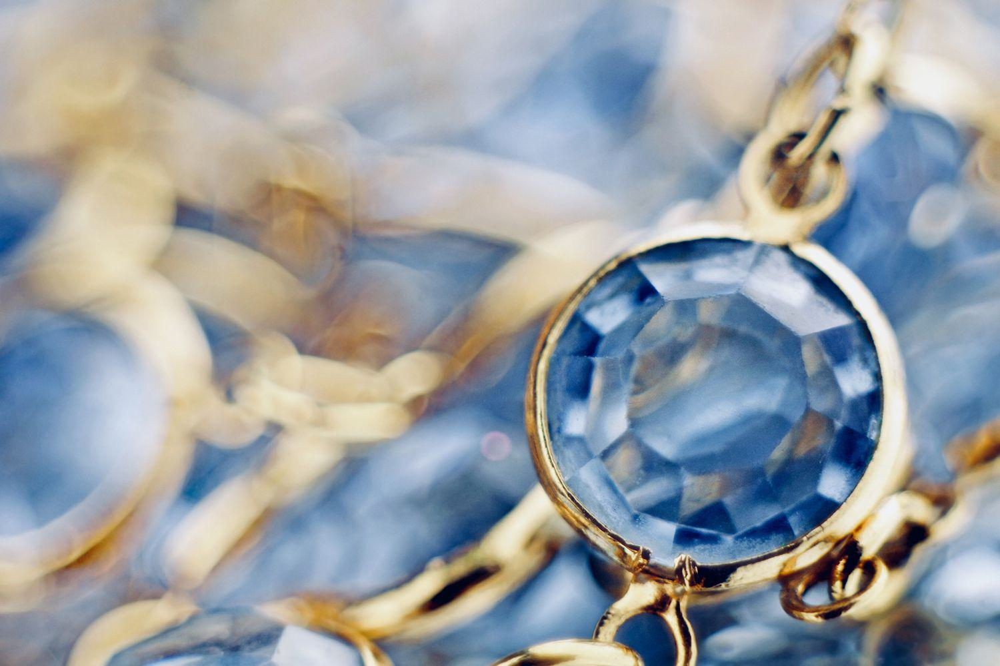

Investing in gemstones, a practice rooted in antiquity, has found newfound relevance in today's financial landscape. The integration of gemology with finance has opened unique pathways for portfolio diversification, offering a tangible asset class that diverges from traditional stock and bond markets. This convergence is further accentuated by technological innovations such as algorithmic trading, which are progressively redefining how gemstone investments are approached.

Gemstones serve as tangible assets that can hedge against inflation and currency fluctuations, making them an appealing alternative to conventional financial instruments. Unlike fiat currencies, which may lose value due to macroeconomic uncertainties, gemstones often retain or even appreciate in worth over time due to their intrinsic rarity and aesthetic appeal. This quality positions them as a resilient store of value, akin to precious metals like gold and silver.



The complex nature of gemstone investment necessitates a sophisticated understanding of valuation and strategic planning. Unlike equities or bonds, where market values are more transparently determined, gemstone pricing is influenced by a combination of the 4Cs—color, clarity, cut, and carat—as well as market demand and consumer preferences. Accurately assessing these factors is crucial for investors seeking to capitalize on gemstone assets.

Technological advancements are bridging the gap between conventional finance and gemstone trading. Algorithmic trading, for instance, utilizes software to analyze market data and execute trades, potentially revolutionizing the efficacy and speed with which investments in gemstones are conducted. This technology leverages historical price data and trend analysis, striving to predict future market movements more accurately.

In summary, gemstone investments present a sophisticated intersection of art and finance, requiring a nuanced understanding of gemology and market dynamics. As technological tools and market methodologies advance, the gemstone investment domain promises growth and transformation, underscoring the necessity for investors to stay informed and adaptable.

## Table of Contents

## Understanding Gemology and Its Importance

Gemology is the science focused on the study, identification, and valuation of gemstones. This discipline encompasses a wide range of scientific methods and techniques aimed at understanding the physical and optical properties of precious stones. Gemologists employ advanced tools such as spectrometers, microscopes, and refractometers to accurately determine the characteristics of gemstones. These tools enable professionals to assess attributes such as refractive index, specific gravity, and light absorption, which are critical in identifying and evaluating gemstones.

Professionals in the field of gemology include appraisers, jewelers, and scientists, each playing a distinct role in the gemstone market. Appraisers are responsible for determining the value of gemstones based on their quality and market demand. Jewelers use their expertise to craft and sell gemstone jewelry, while scientists conduct research to improve methods of gemstone analysis and authentication.

The correct identification of gemstones is paramount as it significantly influences their perceived value and investment potential. Accurate identification helps differentiate between natural stones and synthetic or treated alternatives, which can vary greatly in value. For instance, a natural untreated sapphire commands a higher market price compared to a treated sapphire of similar appearance. This underscores the importance of employing precise gemological techniques to ascertain authenticity and quality.

Educated investors depend on a thorough understanding of gemological principles to make informed purchasing decisions. Knowledge about factors such as a gemstone's origin, rarity, and any treatments it may have undergone can provide invaluable insights into its long-term value and desirability. Empowered with this information, investors are better equipped to distinguish high-quality investment-grade gemstones from less valuable options, thereby optimizing their investment strategies.

In summary, gemology serves as a foundational pillar for the gemstone market by providing the tools and knowledge necessary for accurate identification and valuation. This scientific approach aids jewelers and investors alike in navigating the complexities of the gemstone industry, ensuring that decisions are grounded in verifiable data rather than speculation.

## Gemstones as a Form of Investment

Gemstones have long fascinated investors with their potential to retain value and provide substantial returns, much like precious metals such as gold and silver. As alternative investments, gemstones offer a way to diversify portfolios beyond conventional asset classes like stocks and bonds. The allure of these tangible assets is partly due to their intrinsic beauty and the enduring market fascination with unique and rare stones.

One of the primary attractions of gemstone investment lies in their potential to appreciate in value over time. This potential is significantly influenced by factors such as market demand, rarity, and quality. High demand for specific types of gemstones, combined with their limited availability, often drives prices upward, making them an attractive option for investors seeking profitable ventures. Additionally, the quality of a gemstone, determined by criteria such as color, clarity, and cut, plays a crucial role in its investment appeal.

However, investing in gemstones is not without its challenges, notably in terms of [liquidity](/wiki/liquidity-risk-premium). Unlike stocks or bonds, which can be bought and sold relatively quickly, gemstones generally require specialized markets and buyers, potentially making them a less liquid investment. This illiquidity can pose risks, especially during times when investors need to swiftly convert assets into cash.

Another critical consideration in gemstone investment is professional appraisal. A precise evaluation conducted by certified gemologists is essential to establish a gemstone's value and investment grade. Appraisals ensure that investors are informed about the authenticity, condition, and market value of their gemstones, reducing the risk of overpayment or purchasing counterfeit stones. 

Overall, while gemstones can be a promising alternative investment with significant potential returns, they necessitate careful consideration of the factors influencing their value and liquidity. Professional appraisals and a thorough understanding of market dynamics are indispensable tools for investors looking to successfully navigate this niche sector.

## Valuing Gemstones for Investment Purposes

Gemstone valuation for investment purposes centers on the 4Cs—color, clarity, cut, and carat weight—each playing a pivotal role. 

**Color** ranks as a primary determinant of a gemstone's value, encompassing hue, tone, and saturation. Gemstones with vivid, pure colors tend to command higher prices. For instance, a deep blue sapphire or an emerald with a rich green hue is often more sought after by collectors and investors.

**Clarity** refers to the presence of inclusions or blemishes within a stone. Fewer imperfections usually signify a higher value. However, certain inclusions might be acceptable in some gems, like emeralds, where inclusions can be indicative of authenticity.

**Cut** affects a gemstone's brilliance and aesthetic appeal. A well-cut gemstone optimizes light reflection and enhances its overall visual presentation—crucial for catching investors’ attention. High-quality cut gemstones are more expensive due to the expertise and material wasted in the cutting process.

**Carat** measures weight. Larger stones are rare, thus generally more valuable, particularly if maintaining good color, clarity, and cut.

Market trends and consumer preferences also influence prices. For example, demand for certain hues might surge due to fashion trends, impacting the value of specific gemstones.

Valuation is inherently subjective; expert knowledge is invaluable. Certified gemologists, trained in assessing these factors, provide crucial appraisals that authenticate a gemstone's worth. Their evaluations help standardize market values, creating a semblance of order in a very diverse market.

The 4Cs, while fundamental, are not the sole determinants of a gemstone’s investment potential. Historical provenance, geographical origin, and certification by reputable institutes like the Gemological Institute of America (GIA) or the American Gem Society (AGS) can also enhance value. 

A nuanced understanding of these metrics helps investors mitigate risks. Investing without this insight increases exposure to potential overvaluation. Standards for what constitutes an "investment-grade" gemstone are not formally set, but familiarity with these principles aids in making informed decisions.

Consequently, those wishing to invest should consider these detailed assessment criteria, combined with current market trends, to wisely select gemstones that could yield substantial financial returns over time.

## Utilizing Algorithmic Trading in Gemstone Investments

Algorithmic trading, a practice once confined to traditional financial markets, is now finding application in the gemstone industry. This approach employs computer algorithms to make trading decisions based on vast datasets, allowing for rapid and informed transactions. By examining historical price data, supply-demand trends, and other relevant market indicators, algorithms can identify opportunities for investment in gemstone markets, which are historically characterized by their complexity and nuanced nature.

Algorithmic trading offers several advantages in the gemstone market. The ability to process large amounts of data quickly can enhance decision-making efficiency, enabling traders to capitalize on transient market opportunities. Additionally, algorithms can assist in predicting short-term price fluctuations by identifying patterns and correlating factors that may be imperceptible to human traders. This capacity for nuanced analysis can be particularly valuable in a market where gemstones vary widely in value based on their physical characteristics and market demand.

However, one of the primary challenges in implementing [algorithmic trading](/wiki/algorithmic-trading) for gemstones is the inherent uniqueness of each stone. Unlike stocks or commodities, which are standardized, gemstones are evaluated on a spectrum of quality indicators—such as color, clarity, cut, and carat weight—and often on subjective and aesthetic criteria. These factors make it difficult to predict prices solely based on historical or quantitative data. The algorithms must therefore be sophisticated enough to incorporate a wide range of qualitative assessments into their quantitative analyses.

Despite these challenges, the future of algorithmic trading in gemstone investments holds potential. As technology continues to evolve, algorithms could become more adept at accounting for the qualitative nuances of gemstones. Machine learning models, for example, could be trained to evaluate images of gemstones and predict their market performance based on visual attributes combined with historical sales data.

Python, a favored programming language for algorithmic trading due to its rich ecosystem of libraries, can be instrumental in developing these sophisticated models. Libraries such as Pandas and NumPy facilitate data manipulation, while TensorFlow and PyTorch support the creation of advanced neural networks for pattern recognition within datasets. Below is a simple example of how Python might be used to analyze historical price data:

```python
import pandas as pd
import numpy as np

# Load historical price data
data = pd.read_csv('gemstone_prices.csv')

# Basic algorithm to calculate moving average
window_size = 50
data['moving_average'] = data['price'].rolling(window=window_size).mean()

# Identify trading signals
buy_signals = data[data['price'] < data['moving_average']]
sell_signals = data[data['price'] > data['moving_average']]
```

This script calculates a moving average, which can be a baseline for more intricate models that incorporate additional variables such as market sentiment or macroeconomic indicators. As the industry advances and data quality improves, algorithmic trading is likely to play an increasingly significant role in gemstone investment strategies, offering new methodologies for achieving a competitive edge in this diverse market.

## Risks and Rewards of Investing in Gemstones

Investing in gemstones presents both unique risks and rewards, largely due to the absence of standardized valuation methods. Unlike stocks or bonds, where valuation follows more universally accepted principles, gemstones lack formalized criteria for determining their true market worth. This lack of standardization can lead to valuation discrepancies, posing significant challenges for investors.

Market [volatility](/wiki/volatility-trading-strategies) further complicates gemstone investment. Gemstone prices can experience considerable fluctuations due to factors such as geopolitical events, changes in consumer preference, and shifts in supply and demand dynamics. This volatility, coupled with the often limited liquidity of the gemstone market, means that converting gemstones into cash might not be straightforward. The liquidity issue can be particularly pronounced for rarer gemstones that attract fewer buyers.

Despite these challenges, incorporating gemstones into an investment portfolio can offer benefits, particularly in terms of diversification. Gemstones often move independently of traditional financial markets, providing a hedge against downturns in stocks and bonds. This non-correlation aspect can stabilize portfolio performance, offering a buffer during periods of financial market stress.

Investors willing to navigate the complex landscape of gemstone investment may also be rewarded with substantial returns. The allure of high returns is particularly attractive to seasoned investors who possess the necessary expertise to identify undervalued assets. Gemstones have historically appreciated in value over time, particularly those of exceptional quality and rarity. However, realizing these potential gains requires a thorough understanding of gemstone markets and trends.

To mitigate the inherent risks in gemstone investing, meticulous research and comprehensive market knowledge are crucial. Investors must acquaint themselves with the nuances of gem classification and valuation, often relying on certified gemologists for expert appraisals. Understanding market trends and consumer behavior further aids in making informed purchasing decisions.

Overall, while gemstone investment presents considerable risks, these can be managed through careful planning and expert consultation. Such strategies can unlock the potentially significant rewards associated with this unique asset class.

## Conclusion

Gemology and gemstone investments present a distinct blend of art and finance, offering a compelling avenue for those seeking to diversify their portfolios. With the right knowledge and strategic approach, significant returns can be achieved, making it an attractive option for discerning investors. The continual advancement of technology, particularly in areas like algorithmic trading, along with evolving market dynamics, is reshaping how investments in this sector are approached and managed.

However, the intricate nature of the gemstone market necessitates professional insight. Investors are advised to consult experts to effectively navigate the complexities associated with valuation and market fluctuations. This expertise is crucial in assessing the potential risks and rewards, ensuring investment decisions are informed and reflective of the individual's financial goals.

The timeless allure of gemstones, characterized by their rarity and beauty, maintains their appeal across various markets. These tangible assets provide a unique hedge against traditional financial instruments, offering an enduring value proposition. As the landscape of gemstone investments continues to evolve, those equipped with sound knowledge and professional advice are poised to capitalize on the opportunities within this timeless investment domain.

## References & Further Reading

[1]: Johnson, M., & Koivula, J. (1998). ["Gems and Gemology."](https://www.semanticscholar.org/paper/Gemstone-Enhancement-and-Its-Detection-in-the-1980s-Kammerling-Koivula/c72138120cbd30562c870da9f56fb4af04297bcf) Gemological Institute of America.

[2]: Federman, D. (2002). ["Modern Jeweler's Consumer Guide to Colored Gemstones."](https://link.springer.com/book/10.1007/978-1-4684-6488-7) Running Press Book Publishers.

[3]: Harlow, G. (2006). ["The Nature of Diamonds."](https://www.amazon.com/Nature-Diamonds-George-Harlow/dp/0521629357) Cambridge University Press.

[4]: ["Gemstones of the World"](https://www.amazon.com/Gemstones-World-Newly-Revised-Fifth/dp/1454909536) by Walter Schumann

[5]: Smith, C. P. (2015). ["The Color Science of Rubies and Sapphires."](https://www.gia.edu/doc/Rubies-and-Fancy-Color-Sapphires-from-Nepal.pdf) Journal of Gemmology.