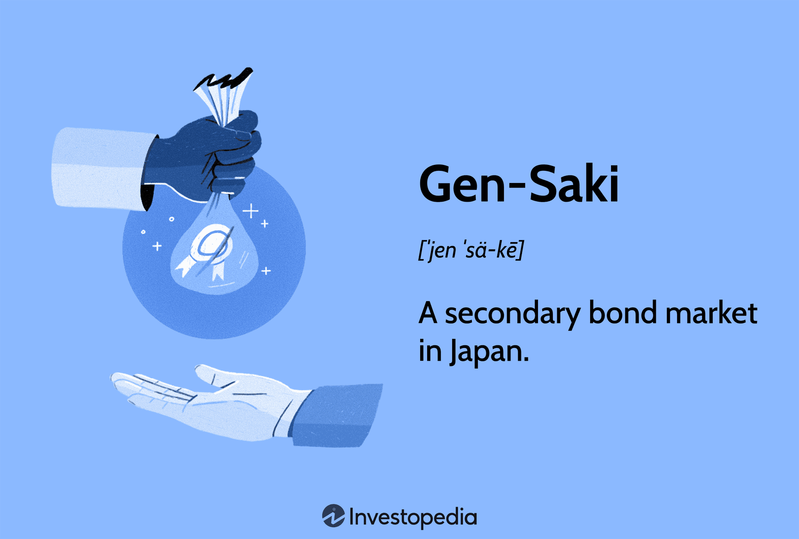

In today’s fast-paced financial markets, technology plays a pivotal role in shaping trading and investment strategies. Among the numerous advancements in financial technology, the application of Gen-Saki in algorithmic trading has emerged as a promising development. Gen-Saki, a form of secondary bond market operation originating in Japan, operates through transactions that bear resemblance to repurchase agreements seen in other global financial markets. This mechanism involves the buying or selling of bonds with an agreement to repurchase them at a specified future date, typically within a short period, often less than three months.

The influence of Gen-Saki on modern trading environments underscores a significant shift towards integrating technological solutions to meet the demands of high-frequency transactions and manage extensive market data. Algorithmic trading, which relies on the use of computer algorithms to execute trades at optimal speeds and prices, has been revolutionized by adopting technologies such as machine learning and artificial intelligence. These technologies facilitate rapid data analysis and decision-making, allowing for enhanced speed and efficiency in executing Gen-Saki transactions.



This article examines the mechanisms behind Gen-Saki technology, shedding light on how it operates within trading environments and the evolution of its structures. Furthermore, we explore the various applications of Gen-Saki in trading, illustrating through examples how this innovative approach is transforming the financial industry. By examining the intersection of traditional financial instruments and cutting-edge technology, we aim to provide insights into how Gen-Saki is shaping the future of algorithmic trading, making it more efficient and resilient in coping with market dynamics.

## Table of Contents

## Understanding Gen-Saki

Gen-Saki, also commonly referred to as the secondary bond market in Japan, functions on principles akin to those of repurchase agreements (repos) found in global financial markets. A repo typically involves the sale of a bond with an agreement to repurchase it at a predetermined price on a future date. The objective is often to provide short-term liquidity. Gen-Saki transactions are predominantly short-term agreements, usually spanning less than three months but seldom extending beyond a year.

Historically, the Gen-Saki market emerged to address the need for more flexible and liquid financial instruments in Japan's rapidly evolving economy during the latter half of the 20th century. Its introduction provided financial institutions with an effective means to manage liquidity and interest rate risks. Initially, these transactions were often negotiated bilaterally. However, with the advancing sophistication of Japan's financial landscape and the globalized nature of capital markets, the Gen-Saki market has integrated more standardized and automated practices, paving the way for algorithmic trading.

The modern structure of the Gen-Saki market is deeply entrenched within Japan's broader financial system, where it plays a critical role in facilitating low-risk [arbitrage](/wiki/arbitrage) and enabling efficient collateral management. Transactions are heavily reliant on a framework that ensures transparency and regulatory compliance, aligning with the stringent oversight customarily seen in Japan's financial markets.

Participants in the Gen-Saki market often include major financial actors such as domestic banks, insurance companies, pension funds, and foreign institutional investors. These participants engage in Gen-Saki transactions not just for short-term funding needs but also to optimize their investment strategies in response to market conditions.

The evolution of Gen-Saki highlights a significant transition from manual negotiation processes to automated systems capable of handling high-frequency trading. This evolution is bolstered by technological advancements that allow real-time data analysis and decision-making, thereby enhancing market efficiency and [liquidity](/wiki/liquidity-risk-premium). As part of Japan's financial infrastructure, Gen-Saki reflects the broader trends of innovation and modernization shaping global financial markets today.

## Technology and Gen-Saki in Algorithmic Trading

Advancements in technology have significantly modernized and expanded the scope of Gen-Saki transactions, particularly through the integration of [algorithmic trading](/wiki/algorithmic-trading) strategies. Algorithmic trading utilizes computer-based algorithms to automate the process of trading securities, including bonds in Gen-Saki transactions, to achieve higher efficiency, reduced costs, and more precise execution.

The incorporation of [machine learning](/wiki/machine-learning) and [artificial intelligence](/wiki/ai-artificial-intelligence) (AI) into algorithmic trading systems has been particularly transformative. These technologies enable trading platforms to process vast amounts of data with enhanced speed and accuracy, thereby optimizing Gen-Saki transactions. Machine learning models can analyze historical market data to forecast bond prices and [interest rate](/wiki/interest-rate-trading-strategies) movements, which allows for improved decision-making in executing Gen-Saki trades.

For instance, AI algorithms can be utilized to assess market conditions in real-time and adapt trading strategies accordingly. This dynamic adaptability is crucial for handling the complexities of the Gen-Saki market, where fluctuations can occur rapidly. By leveraging predictive analytics, trading systems can proactively manage risks and maximize returns.

Python, as a programming language, is commonly used to develop these algorithmic trading systems due to its rich ecosystem of libraries. Libraries like NumPy and pandas are employed for numerical computations and data manipulation, respectively. Here's a simple example of how Python can be used to automate Gen-Saki trading:

```python
import numpy as np
import pandas as pd

# Simulating bond price data
bond_prices = pd.Series([100, 102, 101, 105, 107, 110], name='Bond Prices')

# Simple moving average for trend analysis
window = 3
rolling_mean = bond_prices.rolling(window).mean()

# Signal generation
def generate_signals(prices, rolling_mean):
    signals = np.where(prices > rolling_mean, 'Buy', 'Sell')
    return signals

signals = generate_signals(bond_prices, rolling_mean)
print(signals)
```

The above code provides a basic framework for using moving averages to generate buy or sell signals, which could be expanded into a more sophisticated trading algorithm.

The ability of technology to facilitate real-time data analysis is essential in executing Gen-Saki trades effectively. High-frequency trading systems, powered by AI and machine learning, can execute Gen-Saki transactions in milliseconds, ensuring that traders capitalize on transient market opportunities. This immediacy allows for more agile management of trading portfolios, ultimately supporting the broader goals of enhanced profitability and risk management.

As a result, these technological enhancements are revolutionizing the operation of Gen-Saki transactions, making them faster, more reliable, and more profitable than traditional methods.

## Examples of Algorithmic Trading with Gen-Saki

There are three primary categories of Gen-Saki transactions that algorithmic trading can optimize: own-account, consignment, and direct transactions. 

Own-account transactions involve securities firms utilizing repurchase agreements as a financial mechanism to manage their funding needs. These transactions allow firms to efficiently adjust their liquidity positions by temporarily converting bonds into cash and vice versa, depending on their market strategies and liquidity requirements. Through algorithmic trading, these transactions can be executed with precision, using sophisticated algorithms to identify optimal market conditions, thereby enhancing profitability and minimizing the risk associated with funding operations.

Consignment transactions present an opportunity for bondholders to leverage the expertise of securities firms in conducting Gen-Saki transactions. These holders often engage securities firms to manage their bond portfolios and buffer against potential market risks. By employing algorithmic trading, securities firms can offer more robust solutions to bondholders, employing advanced algorithms to analyze market trends, predict market shifts, and execute transactions that optimize risk-adjusted returns. This capability can be particularly advantageous during volatile markets when rapid decision-making is critical to maintaining portfolio stability.

Direct transactions occur between financial institutions or corporate businesses and banks, primarily focusing on short-term liquidity needs and interest rate management. Algorithmic trading enhances these transactions by facilitating real-time data analysis and decision-making processes. Algorithms process vast amounts of market data to identify advantageous trading opportunities with improved accuracy, allowing institutions to secure favorable terms and reduce transaction costs. Additionally, the use of algorithms can streamline the operational workflow, ensuring expedited transaction processing and settlement, which is vital in maintaining competitive advantage in fast-paced financial markets.

Incorporating algorithmic trading into these categories of Gen-Saki transactions not only provides increased accuracy and speed but also helps in managing the complexities of the financial markets, thereby fostering more resilient and efficient trading systems.

## Impact of Generative AI on Trading Strategies

Generative AI models have become instrumental in transforming trading strategies by enhancing the accuracy of market predictions. These sophisticated models utilize extensive datasets, leveraging historical trading data, economic indicators, and real-time news to forecast market trends with unprecedented precision. By processing vast amounts of information, generative AI can identify patterns and correlations that might elude conventional statistical methods.

The core advantage of generative AI lies in its ability to simulate potential market scenarios and generate predictive insights. These models are particularly adept at working with complex datasets where traditional models might struggle. For example, a generative adversarial network (GAN) can be employed to generate synthetic financial data to train other machine learning models, increasing their robustness and accuracy.

In automating the trading process, generative AI models are integrated into algorithmic trading systems to execute trades based on their predictions. This capability enables traders to react swiftly to market changes, optimizing trading decisions and maximizing returns. The automation provided by generative AI leads to reduced human error and allows for a more disciplined trading approach.

Moreover, the evolution of AI in finance is setting new standards in risk management. By simulating various market conditions, generative AI helps in assessing potential risks and devising strategies to mitigate them. This proactive risk management ensures that financial institutions and traders can safeguard their investments against unforeseen market events.

The precision of trading algorithms powered by AI continues to improve, as ongoing advancements in machine learning techniques refine their predictive capabilities. As AI technologies advance, they promise to enhance the financial sector's ability to manage risk, improve decision-making processes, and ultimately achieve superior trading performance. 

Generative models, when combined with other AI advancements, are paving the way for a new era of algorithmic trading that is more efficient and insightful, ensuring traders can navigate complex financial landscapes with greater confidence.

## Challenges and Considerations

Integrating Gen-Saki with algorithmic trading presents a spectrum of challenges that must be carefully managed to ensure successful implementation. One significant hurdle involves data security. The use of sophisticated algorithms requires processing vast volumes of sensitive financial data, making the system vulnerable to cyber threats. Protecting this data from unauthorized access and ensuring its integrity is paramount. Employing robust encryption methods and implementing strict access controls are essential strategies for safeguarding sensitive information.

Market [volatility](/wiki/volatility-trading-strategies) is another consideration that cannot be overlooked. Algorithms relying on historical data to forecast market behavior may struggle during periods of extreme volatility or unexpected economic events. This creates a risk of executing trades that are not aligned with the current market conditions, potentially leading to significant financial losses. Developing adaptive algorithms that can adjust to real-time market changes is crucial for mitigating this risk.

Regulatory compliance also plays a critical role in the integration of Gen-Saki with algorithmic trading. Financial markets are subject to rigorous regulations designed to protect investors and maintain market integrity. Algorithms must be programmed to operate within these regulatory frameworks to avoid legal repercussions. This requires ongoing collaboration between technology developers, financial institutions, and regulatory bodies to ensure that trading activities are both innovative and compliant.

To fully harness the potential of Gen-Saki technology in algorithmic trading, a collaborative approach is imperative. Regulators, technology providers, and financial firms must work together to address these challenges effectively. Open dialogues and partnerships can facilitate the development of systems that not only enhance trading efficiency and profitability but also uphold the principles of security, adaptability, and compliance. This collective effort is vital for leveraging the capabilities of Gen-Saki technology while safeguarding the interests of all stakeholders involved.

## Conclusion

Incorporating Gen-Saki technology in trading strategies represents a substantial leap forward for the financial sector. By integrating algorithmic trading with Gen-Saki transactions, the market participants can achieve improved efficiency, resilience, and profitability in their trading systems. The use of advanced algorithms allows for swift execution of trades, minimizes human errors, and harnesses real-time data for better decision-making. This is particularly beneficial in the context of the short-term nature of Gen-Saki transactions, where timing and precision are critical.

Moreover, the continuous innovation in generative technology holds significant promise for the future of algorithmic trading. With advancements in artificial intelligence and machine learning, models become increasingly adept at analyzing vast datasets to predict market trends and respond dynamically to changes in market conditions. The precision offered by these technologies not only enhances risk management but also sets new benchmarks for trading algorithms' accuracy and efficiency.

As the financial industry embraces these technological advancements, the potential for more robust trading systems becomes evident. A well-implemented Gen-Saki strategy, supported by cutting-edge technology, stands to offer greater financial returns and a competitive edge in the market. The future of algo-trading, characterized by continuous technological evolution and responsible implementation, appears increasingly promising and aligned with industry goals of sustainability and profitability.

## References & Further Reading

[1]: Bergstra, J., Bardenet, R., Bengio, Y., & Kégl, B. (2011). ["Algorithms for Hyper-Parameter Optimization."](https://dl.acm.org/doi/10.5555/2986459.2986743) Advances in Neural Information Processing Systems 24.

[2]: ["Advances in Financial Machine Learning"](https://www.amazon.com/Advances-Financial-Machine-Learning-Marcos/dp/1119482089) by Marcos Lopez de Prado

[3]: ["Evidence-Based Technical Analysis: Applying the Scientific Method and Statistical Inference to Trading Signals"](https://www.amazon.com/Evidence-Based-Technical-Analysis-Scientific-Statistical/dp/0470008741) by David Aronson

[4]: ["Machine Learning for Algorithmic Trading"](https://github.com/stefan-jansen/machine-learning-for-trading) by Stefan Jansen

[5]: ["Quantitative Trading: How to Build Your Own Algorithmic Trading Business"](https://www.amazon.com/Quantitative-Trading-Build-Algorithmic-Business/dp/1119800064) by Ernest P. Chan