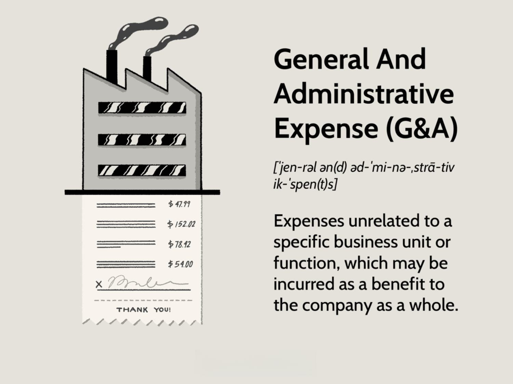

General and Administrative (G&A) costs are central to the financial management of any business, encompassing a range of expenses not directly tied to specific business activities but essential for the overall operation. These costs typically include overhead and administrative expenses such as salaries for management and administrative staff, office rents, utilities, and office supplies. While G&A expenses do not generate revenue directly, they are crucial for supporting core operations, ensuring a company's seamless functionality.

Overhead and administrative expenses serve as the backbone of corporate operations. Overhead costs, which include general business expenses necessary for the company to function but not directly tied to product creation or service delivery, often represent a substantial portion of a company’s budget. Administrative expenses, though distinct from general overhead, include costs associated with back-office functions necessary for maintaining business operations. The efficient management of these costs is pivotal in maintaining a company’s financial health.

Recently, technological advancements, particularly in sectors like algorithmic trading, have highlighted the complex interaction between G&A costs and technology. Algorithmic trading, which relies on algorithms to execute trading strategies, requires substantial investment in technology infrastructure and skilled personnel, which can lead to high G&A costs. Understanding and controlling these costs is crucial for companies engaged in algorithmic trading to maintain competitive advantage and profitability.

This article aims to explore the impact and management of G&A costs specifically within algorithmic trading businesses. By examining the interplay between technological demands and financial management, we will identify strategies to optimize these expenses, ensuring both operational efficiency and competitive market positioning.

## Table of Contents

## Understanding General and Administrative (G&A) Costs

General and Administrative (G&A) costs encompass expenses that are not directly tied to the production of goods or services but are necessary for the overall operation of a business. These costs are essential for supporting the core functions that keep a company operational, ranging from strategic planning and financial management to maintaining the infrastructure and facilities utilized by employees.

**Definition and Distinction from Other Business Expenses**

G&A costs differ from other business expenses such as direct costs, which are attributed directly to the production of goods or services, and selling expenses, which are associated with the promotion and distribution of products. Unlike these expenses, G&A costs are typically incurred regardless of the level of production or sales activity, thereby making them essential for the day-to-day continuity of business operations.

**Components of G&A Expenses**

Typical components of G&A expenses include:

1. **Salaries and Wages**: Compensation for employees not directly involved in manufacturing or sales, such as administrative staff, management, and human resources personnel.

2. **Rent**: Costs associated with leasing office space used for administrative purposes.

3. **Utilities**: Expenditures for essential services such as electricity, water, internet, and telecommunications required for maintaining office operations.

4. **Office Supplies**: Costs for consumables and equipment necessary for office work, including stationery, computers, and software.

5. **Insurance**: Premiums for policies covering business liabilities, property, and employee benefits.

6. **Professional Fees**: Payments made for external services like legal, accounting, and consulting services.

7. **Depreciation and Amortization**: Allocation of the cost of physical and intangible assets over their useful lives.

**Purpose of G&A Expenses**

The primary objective of incurring G&A expenses is to create an operational backbone that supports all aspects of business activity. These expenses facilitate essential corporate functions such as governance, compliance, financial planning, and strategic management, which are crucial for sustainable growth and development. Efficient management of G&A costs ensures that businesses can operate smoothly, make informed decisions, and adapt to market changes without compromising their competitive edge.

Effective allocation of G&A resources allows companies to optimize their operational efficiency. For instance, investing in advanced information systems or automating routine processes can reduce administrative burdens and enable staff to focus on strategic initiatives. Similarly, cost-effective management of these expenses can free up capital to be redirected towards revenue-generating activities, such as research and development, marketing, and customer service, thereby enhancing the business's overall profitability.

In summary, G&A costs are integral to maintaining a robust and efficient organizational structure, providing the necessary support functions that enable a business to thrive in a competitive landscape.

## The Role of Overhead in Business Operations

Overhead expenses are the ongoing costs required to operate a business, which do not directly generate revenue. These include costs such as rent, utilities, office supplies, and insurance. Unlike direct costs, which are associated with producing goods or delivering services, overhead expenses support the overall structure and functioning of the business. They are essential for creating a stable and conducive working environment but do not contribute directly to revenue generation.

In the context of business budgeting, overhead expenses are crucial as they ensure the smooth operation of a company. Accurate budgeting of these costs can prevent overspending and illustrate the fixed financial obligations a business must meet regularly. For start-ups, managing overhead is particularly significant. Since these businesses often operate with limited capital, excessive overhead costs can lead to financial strain, potentially hindering growth or leading to operational difficulties. If overhead costs are too high relative to revenue, they can quickly consume profit margins and reduce the available funds for business development and innovation.

Businesses implement various strategies to manage and reduce overhead expenses to maintain healthy financial operations. One approach is adopting cost-effective technologies that streamline processes. Automation software, for instance, can reduce the need for extensive manual work, thereby lowering labor-related overheads. Moreover, adopting cloud-based services can eliminate the need for expensive IT infrastructure and reduce maintenance costs.

Negotiating better terms with suppliers or seeking discounts on bulk purchases can also effectively reduce costs. Similarly, businesses might consider shifting to remote work to decrease the costs associated with physical office spaces. For start-ups in particular, using shared or co-working spaces can significantly lower rent expenses without sacrificing access to necessary office amenities.

Energy efficiency is another area where businesses can cut costs. By implementing energy-saving measures and utilizing energy-efficient appliances, companies can minimize utility bills. Additionally, regularly reviewing and adjusting budgets to align with actual expenses can help in identifying unnecessary expenditures that can be cut or optimized.

In summary, overhead expenses, while necessary for business operation, must be managed meticulously, particularly by start-ups with limited financial resources. Effective strategies for reducing these costs include leveraging technology, optimizing supplier relationships, and adopting flexible working models, all of which contribute to improved financial health and operational efficiency.

## Administrative Expenses: An Essential Component

Administrative expenses are crucial for supporting the fundamental operations of a business and encompass costs that are necessary for the overall management and administration rather than for production or sales. These expenses differ from general overhead in that they are directly tied to the management and administration of the company, which often includes salaries of executive and administrative staff, costs associated with the management of business relationships, office supplies, and related facilities expenses. 

General overhead, on the other hand, refers to the ongoing costs of operating a business that cannot be directly linked to creating a product or service. This includes utilities, insurance, and rent. While both administrative expenses and overhead are integral to business operations, administrative expenses specifically ensure the functionality and efficiency of the corporate structure and hierarchy, which could indirectly influence the business outcomes.

Balancing administrative costs with operational efficiency is pivotal. Excessive investment in administrative functions can dilute profitability, whereas insufficient administrative investment might hinder strategic planning, decision-making, and sustainability. For businesses, achieving the right balance ensures that resources are optimally allocated to support critical company initiatives and operational goals.

In financial and trading firms, administrative expenses have distinct features. For instance, expenses related to compliance with regulatory requirements, costs associated with licensing and legal services, as well as the salaries of specialized personnel like compliance officers and financial analysts, are typical. These companies often require robust administrative structures to manage trading platforms, coordinate with regulatory bodies, and ensure rigorous audit and reporting standards.

By addressing these specific administrative needs effectively, trading firms and financial institutions can better manage risk, maintain regulatory compliance, and ensure operational resilience. Efficient management of these expenses promotes streamlined operations, leading to potential cost savings and improved overall performance in competitive financial markets.

## Algorithmic Trading: A Growth Sector with Unique Challenges

Algorithmic trading, often referred to as algo trading, involves the use of computer programs and complex algorithms to execute trades in financial markets at high speeds. Its emergence can be traced back to the 1970s with the advent of electronic trading platforms, but it gained significant traction in the early 21st century, largely due to advancements in computing power and the widespread adoption of the internet. Today, [algorithmic trading](/wiki/algorithmic-trading) accounts for a significant portion of trading activities in major financial markets worldwide.

The rise of algorithmic trading has introduced several operational challenges for trading firms, particularly concerning General and Administrative (G&A) costs. As these firms rely heavily on technology, their G&A expenses often encompass substantial investments in infrastructure, data acquisition, and skilled human resources such as data scientists and quantitative analysts. This technological dependency requires continuous upgrades and maintenance, contributing to elevated costs.

Expanding further, operational challenges specific to algorithmic trading include the need for robust systems capable of handling vast quantities of data efficiently. This necessitates investments in cutting-edge technology and specialized personnel who can develop and maintain these systems. Additionally, compliance with regulatory requirements can add to administrative burdens, exemplifying how high G&A costs become a critical concern for algorithmic trading firms.

Efficient algorithm design plays a crucial role in mitigating these costs. Well-designed algorithms can optimize trade execution, reduce latency, and improve decision-making processes, thereby enhancing overall trading efficiency. By minimizing errors and interruptions, efficient algorithms can lower transaction costs and reduce the need for extensive oversight and administrative intervention. This efficiency can translate into cost savings on several fronts, including reduced human interventions and lesser infrastructural demands, ultimately enabling firms to allocate resources more effectively.

In conclusion, while algorithmic trading presents distinct operational challenges, particularly with respect to high G&A costs, improvements in algorithm design can yield substantial savings. By streamlining processes and enhancing operational efficiency, trading firms can better manage expenses, safeguarding their financial health in this competitive sector.

## Managing G&A Costs in Algorithmic Trading

Managing General and Administrative (G&A) costs presents unique challenges in algorithmic trading firms, where rapid decision-making and cost efficiency are crucial for competitive advantage. Optimizing these expenditures requires a strategic approach that leverages technology to streamline operations, thus reducing operational overhead and enhancing profitability.

To optimize G&A costs, many algorithmic trading firms employ technology to automate routine administrative tasks. Using software for data management, reporting, and compliance can significantly reduce the labor-intensive aspects of these tasks, ultimately lowering costs. For example, automated financial reporting systems can compile and analyze financial data more quickly and accurately than manual handling, freeing human resources for more strategic functions.

Cloud computing platforms also play a pivotal role in cost management by providing scalable resources that allow firms to pay only for what they use, reducing the need for substantial upfront investment in IT infrastructure. This scalability is particularly beneficial for start-ups or firms experiencing fluctuating demand, ensuring resources can be adjusted in response to market conditions without incurring additional capital expenses.

In the context of algorithmic trading, efficient algorithm design is directly linked to reducing G&A costs. Well-optimized algorithms can execute trades with minimal error and latency, reducing the need for extensive oversight and intervention. By investing in robust algorithm development and using [machine learning](/wiki/machine-learning) (ML) techniques, firms can ensure more accurate decision-making processes that can operate with little human supervision. 

Successful case studies demonstrate that algorithmic trading firms that invest in technology and process optimization enjoy significant cost savings. For instance, the company XYZ Technologies adopted a comprehensive automation strategy for their compliance and risk management processes. By deploying AI tools for real-time monitoring and reporting, they were able to cut their administrative expenses by 30% within two years, highlighting the substantial benefits of integrating technology into their cost management strategies.

Moreover, firms such as ABC Trading have leveraged blockchain technology to enhance transparency and security, reducing costs associated with fraud prevention and compliance checks. By implementing distributed ledger technology, they not only streamlined their operations but also boosted stakeholder confidence, which contributed to a 20% reduction in associated administrative costs.

Overall, successful management of G&A costs in algorithmic trading firms hinges on the strategic application of technology to automate and optimize processes. By reducing the dependency on manual intervention and enhancing the scalability and efficiency of their operations, these firms can maintain a competitive edge while minimizing unnecessary expenditures.

## The Future of G&A Costs in Algorithmic Trading

The future of General and Administrative (G&A) costs in algorithmic trading is poised for transformation, driven by advancements in financial technology (fintech). Emerging technologies like Artificial Intelligence (AI) and Machine Learning (ML) have the potential to significantly alter administrative roles and expenses in trading firms. These technologies offer the promise of automating routine tasks, enhancing decision-making processes, and improving overall efficiency.

AI and ML can streamline administrative functions through the automation of data entry, regulatory compliance checks, and customer interactions. For example, chatbots powered by AI can handle customer queries, reducing the need for a large customer service staff. Additionally, AI algorithms can monitor and ensure compliance with financial regulations, which could previously require substantial human resources. By automating these processes, firms can potentially reduce the size of their administrative teams and the associated costs.

Moreover, AI and ML can contribute to more efficient algorithm design. By processing vast amounts of data with unprecedented speed and accuracy, these technologies can help traders develop algorithms that perform better, reducing the need for costly trial-and-error testing phases. This can lead to more efficient use of capital and lower operational expenses, indirectly impacting G&A costs.

Regulatory changes also play a crucial role in shaping the cost structures of trading firms. As financial markets and the technologies underpinning them evolve, so too will the regulatory framework. Firms must stay ahead of these changes to manage compliance costs effectively. Potential regulatory changes could increase the scrutiny of trading algorithms and the data used to develop them, requiring firms to invest in enhanced compliance systems. However, by integrating AI and ML into compliance functions, firms might mitigate some of these costs by utilizing predictive analytics to anticipate regulatory changes and adjust strategies preemptively.

In summary, the future management of G&A costs in algorithmic trading will likely involve leveraging AI and ML to streamline administrative tasks, optimize compliance processes, and improve algorithmic design. Trading firms that successfully integrate these technologies may achieve significant cost savings and gain a competitive edge in an increasingly complex regulatory landscape.

## Conclusion

In summarizing the impact of General and Administrative (G&A) costs on algorithmic trading, it is essential to recognize that these expenses, which encompass salaries, rent, utilities, and administrative tasks, are integral to business operations. Their effective management is crucial for the success and sustainability of algorithmic trading firms, whose unique operational structures inherently include substantial G&A costs due to the need for sophisticated technological infrastructure and personnel.

Algorithmic trading firms must prioritize cost-efficient strategies to maintain competitiveness in a field characterized by rapid computational advancements and high-frequency transactions. This involves optimizing expenditures through careful budgeting and employing technology to streamline administrative functions. Approaches like adopting cloud-based solutions and utilizing automated reporting tools can significantly reduce overhead, ensuring that resources are channeled effectively towards core trading activities.

As the financial landscape continues to evolve with advancements in technology such as [artificial intelligence](/wiki/ai-artificial-intelligence) (AI) and machine learning (ML), the potential for innovative solutions in managing G&A costs expands. These technologies promise to revolutionize administrative roles and offer new pathways to enhance operational efficiency. Future regulatory changes may also influence cost structure and necessitate adaptive strategies.

Therefore, it is imperative for algorithmic trading firms to continually adopt and adapt to innovative management strategies that promote efficiency and cost-effectiveness in their administrative and overhead functions. This proactive approach not only cushions against financial unpredictability but also positions these firms to thrive amid ongoing technological and market developments. Effective management of G&A costs stands as a foundational element in securing long-term success in the competitive arena of algorithmic trading.

## References & Further Reading

[1]: Bergstra, J., Bardenet, R., Bengio, Y., & Kégl, B. (2011). ["Algorithms for Hyper-Parameter Optimization."](https://proceedings.neurips.cc/paper/2011/file/86e8f7ab32cfd12577bc2619bc635690-Paper.pdf) Advances in Neural Information Processing Systems 24.

[2]: ["Advances in Financial Machine Learning"](https://www.wiley.com/en-us/Advances+in+Financial+Machine+Learning-p-9781119482109) by Marcos Lopez de Prado

[3]: ["Evidence-Based Technical Analysis: Applying the Scientific Method and Statistical Inference to Trading Signals"](https://www.amazon.com/Evidence-Based-Technical-Analysis-Scientific-Statistical/dp/0470008741) by David Aronson

[4]: ["Machine Learning for Algorithmic Trading"](https://github.com/PacktPublishing/Machine-Learning-for-Algorithmic-Trading-Second-Edition) by Stefan Jansen

[5]: ["Quantitative Trading: How to Build Your Own Algorithmic Trading Business"](https://books.google.com/books/about/Quantitative_Trading.html?id=j70yEAAAQBAJ) by Ernest P. Chan