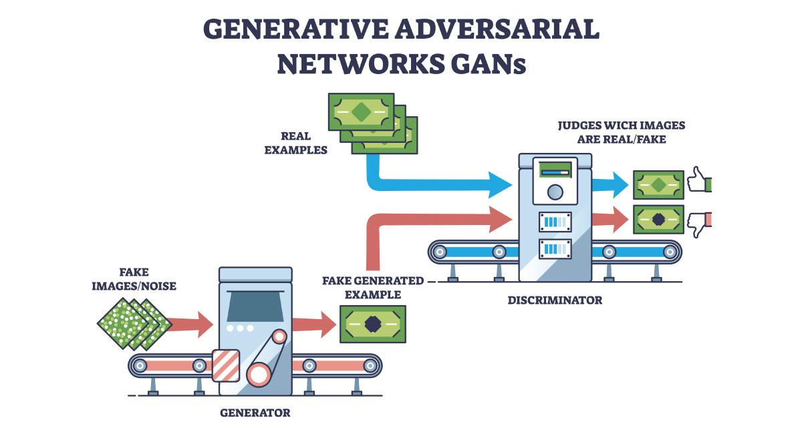

## Table of Contents

## What is a Generative Adversarial Network (GAN)?

A Generative Adversarial Network, or GAN, is a type of artificial intelligence model that can create new things like pictures, music, or text. It works by using two parts that compete against each other. One part, called the generator, tries to make new things that look real. The other part, called the discriminator, tries to tell if these new things are real or fake. They keep working together until the generator gets really good at making things that the discriminator can't tell are fake.

Think of it like an artist and a critic. The artist (generator) keeps making new paintings, trying to fool the critic (discriminator). The critic looks at the paintings and says if they are good or not. Over time, the artist learns to make better and better paintings because of the feedback from the critic. This back-and-forth helps the GAN get better at creating things that seem very real.

## Who invented GANs and when were they first introduced?

GANs were invented by a man named Ian Goodfellow. He came up with the idea while he was working at the University of Montreal in Canada. Ian Goodfellow and his team first introduced GANs to the world in 2014. They shared their new idea in a paper called "Generative Adversarial Networks."

Since then, GANs have become very popular in the world of artificial intelligence. People use them to make all sorts of things, from realistic pictures to new kinds of music. Ian Goodfellow's invention has helped many researchers and artists create things that were hard to imagine before.

## What are the two main components of a GAN?

The first main component of a GAN is called the generator. The generator is like an artist that creates new things, like pictures or music. It starts by making something random and then tries to make it look more and more real. The generator's job is to fool the other part of the GAN into thinking that what it made is real, not fake.

The second main component is the discriminator. The discriminator acts like a critic that looks at what the generator made and decides if it's real or fake. It compares the generator's creations to real examples it has seen before. Over time, the discriminator gets better at spotting fakes, which pushes the generator to make even better creations. Together, these two parts help the GAN create things that can be very hard to tell from the real thing.

## How does the training process work in a GAN?

The training process of a GAN is like a game between the generator and the discriminator. At the start, the generator makes something random, like a scribble. The discriminator looks at it and says, "That's fake!" Then, the generator tries again, making a new scribble but a bit better this time. The discriminator looks at this new scribble and still says it's fake, but maybe it's not as sure. This back-and-forth keeps going, with the generator trying to make better and better things, and the discriminator trying to get better at spotting fakes.

As they keep playing this game, both the generator and the discriminator learn from each other. The generator learns how to make things that look more real because the discriminator keeps telling it what doesn't work. The discriminator, on the other hand, learns to be better at spotting fakes because it keeps seeing new, improved tries from the generator. Over many rounds of this game, the generator gets really good at making things that are hard to tell from real ones, and the discriminator gets really good at telling real from fake. This is how a GAN gets trained to create things that look very real.

## What is the objective function of a GAN?

The objective function of a GAN is like the goal that the generator and discriminator are trying to reach. For the generator, the goal is to make things that the discriminator thinks are real. The generator wants to fool the discriminator as much as possible. On the other hand, the discriminator's goal is to tell the difference between real things and the fakes made by the generator. It wants to be right as much as possible.

This back-and-forth creates a kind of competition where both parts of the GAN are trying to do their best. The overall objective function of a GAN is to find a balance where the generator makes things that are almost impossible to tell from real, and the discriminator is just as good at spotting them. This balance helps the GAN create things that are very realistic and useful.

## What are some common applications of GANs?

GANs are used in many cool ways. One common use is making realistic pictures. Artists and designers use GANs to create new images that look like real photos. For example, they can make pictures of people who don't exist, or turn simple sketches into detailed images. This is helpful in making art, designing products, and even in movies where they need to create special effects.

Another use of GANs is in the world of fashion. They help design new clothes and styles. By showing a GAN lots of pictures of clothes, it can come up with new designs that look like they could be worn by real people. This saves time and helps fashion designers come up with fresh ideas quickly. It's like having a creative partner that never runs out of ideas.

GANs also help in making music and writing stories. They can learn from lots of songs or books and then create new ones that sound or read like the real thing. This is useful for musicians who want to try new sounds or for writers who need help coming up with new ideas. It's like having a tool that can help you be more creative in ways you might not have thought of before.

## What are the challenges faced when training GANs?

Training GANs can be tricky because the generator and discriminator need to work together just right. If the generator gets too good too fast, it can fool the discriminator all the time, and the discriminator won't learn anything new. On the other hand, if the discriminator is too good, it can always tell the generator's fakes apart, and the generator won't get any better. This balance is hard to find and can make training GANs take a long time.

Another challenge is something called mode collapse. This happens when the generator starts making the same kind of thing over and over again, instead of coming up with new and different things. It's like if the generator only made pictures of dogs and never tried making cats or birds. This makes the GAN less useful because it can't create a wide variety of things. Finding ways to stop mode collapse is a big challenge for people working with GANs.

## How can mode collapse be identified and prevented in GANs?

Mode collapse in GANs can be identified when the generator starts making the same kind of thing over and over again. For example, if you're trying to generate pictures of different animals, but the generator only makes pictures of cats, that's a sign of mode collapse. You can spot it by looking at the variety of outputs from the generator. If the images or other creations look too similar, even though you're asking for different things, then mode collapse might be happening.

To prevent mode collapse, you can try different tricks. One way is to change how the generator and discriminator work together. For example, you can use multiple generators or discriminators to make sure the generator has to come up with different kinds of outputs. Another way is to add something called a "diversity loss" to the training process. This tells the generator to make things that are different from each other, not just things that fool the discriminator. By using these methods, you can help the GAN create a wider variety of things and avoid mode collapse.

## What are some advanced architectures of GANs?

One advanced type of GAN is called a Deep Convolutional GAN, or DCGAN. DCGANs use something called convolutional neural networks, which are really good at understanding and creating pictures. They help the generator make more detailed and realistic images. In a DCGAN, the generator and discriminator work together in a special way that makes the whole process smoother and helps create better results. This type of GAN is popular because it can make very clear and sharp images that look a lot like real photos.

Another advanced GAN is the Conditional GAN, or CGAN. In a CGAN, you can tell the generator what kind of thing you want it to make. For example, if you want a picture of a dog, you can tell the generator to make a dog, and it will try to create one. This is different from a regular GAN where the generator just makes random things. CGANs are useful because they let you have more control over what the GAN creates, making them great for specific tasks like turning sketches into detailed images or generating images based on certain labels.

A third advanced architecture is the StyleGAN. StyleGANs are really good at making very realistic images of faces and other things. They work by controlling different styles or features of the image separately. For example, they can change the hairstyle, the age, or the expression of a face without changing the whole image. This makes StyleGANs very flexible and useful for creating high-quality, customizable images. They are often used in the entertainment industry to create realistic characters and special effects.

## How do conditional GANs differ from traditional GANs?

Conditional GANs, or CGANs, are different from traditional GANs because they let you tell the generator what to make. In a traditional GAN, the generator just makes random things without any specific instructions. But with a CGAN, you can give the generator a label or some other information, like "make a picture of a dog" or "create a scene with a sunset." This means you have more control over what the GAN creates, which can be really helpful for specific tasks.

For example, if you're using a CGAN to turn sketches into detailed images, you can tell the generator what the sketch is supposed to be, and it will try to make a detailed version of that. This is different from a traditional GAN, where the generator might turn your sketch into something completely different because it doesn't know what you want. By giving the generator instructions, CGANs can create more useful and targeted results, making them a powerful tool for many applications.

## What evaluation metrics are used to assess the performance of GANs?

When people want to see how well a GAN is doing, they use different ways to measure it. One common way is called the Inception Score, or IS. This score looks at how clear and varied the pictures the GAN makes are. If the pictures are both clear and different from each other, the Inception Score will be high. Another way is the Fréchet Inception Distance, or FID. This one compares the pictures the GAN makes to real pictures. If the GAN's pictures are a lot like real ones, the FID will be low, which is good.

Another important measure is the visual quality of the images. People often look at the pictures the GAN makes and see if they look real or not. They might ask other people to look at the pictures and guess if they are real or made by a computer. If a lot of people think the pictures are real, that's a good sign that the GAN is doing well. These ways of measuring help people understand how good a GAN is at making things that look real and are different from each other.

## What are the latest research trends and future directions for GANs?

The latest research in GANs is focusing on making them even better at creating things that look real. One big trend is improving how GANs can make pictures of people's faces that look just like real photos. Researchers are also working on making GANs faster and more stable to train. This means they want GANs to learn quicker and not run into problems like mode collapse as often. Another exciting area is using GANs to help with medical images, like making clearer pictures of the inside of the body to help doctors see things better.

Looking into the future, GANs might be used in even more creative ways. For example, they could help make new kinds of music or write stories that sound like they were written by real people. Researchers are also thinking about using GANs to help with things like making fake videos that are hard to tell from real ones, which could be used in movies or games. But they also want to make sure these powerful tools are used safely and responsibly. As GANs keep getting better, they could change how we create and understand all sorts of things, from art to science.

## What are Generative Adversarial Networks (GANs) and how do they work?

Generative Adversarial Networks (GANs) are a revolutionary class of [neural network](/wiki/neural-network)s recognized for their unique architecture that consists of two distinct but interconnected networks: a generator and a discriminator. This dual-network system engages in a continuous game of improvement, often described as a "zero-sum" game. The generator's sole aim is to create data that is indistinguishable from real data, aiming to fool the discriminator, whereas the discriminator seeks to accurately distinguish between real and synthetic data.

### Architecture and Function

The generator network accepts random noise input and transforms it into synthetic data. As it trains, it attempts to produce increasingly realistic outputs. The discriminator, in contrast, evaluates these outputs against actual data, providing feedback on the generator's success in mimicking true data patterns. As training progresses, the generator learns to produce samples that are increasingly difficult for the discriminator to distinguish from real data.

Mathematically, the GAN framework can be described through a minimax game, expressed by the value function $V(G, D)$, defined as follows:

$$
\min_G \max_D V(D, G) = \mathbb{E}_{x \sim p_{\text{data}}(x)}[\log D(x)] + \mathbb{E}_{z \sim p_z(z)}[\log(1 - D(G(z)))] 
$$

where $G$ is the generator, $D$ is the discriminator, $p_{\text{data}}(x)$ is the distribution of real data, and $p_z(z)$ is the prior distribution of the input noise variables.

### Generator and Discriminator Roles

The generator is essentially trying to learn the true data distribution, $p_{\text{data}}$, so that it can generate new data points from this distribution, which the discriminator will then have a hard time classifying as fake. The discriminator improves its classification ability as both networks iterate, constantly being refined for optimized accuracy.

### Adaptability of GANs for Unsupervised Learning

The adaptability of GANs extends significantly into unsupervised learning tasks, notably time series data generation, image generation, and more. In financial forecasting, GANs can generate plausible price series mimics like real market conditions without labeled datasets. These models are particularly adept at handling the complexities of non-linear relationships within the data, offering superior outputs compared to traditional models. 

Given their unique capacity to handle diverse data types and the sophisticated interaction between the generator and discriminator, GANs stand as a powerful tool in various applications beyond their original scope, making them a promising candidate for innovation in fields requiring data synthesis and enhancement.

## References & Further Reading

[1]: Goodfellow, I., Pouget-Abadie, J., Mirza, M., Xu, B., Warde-Farley, D., Ozair, S., ... & Bengio, Y. (2014). ["Generative Adversarial Nets"](https://papers.nips.cc/paper/5423-generative-adversarial-nets.pdf). Advances in Neural Information Processing Systems.

[2]: Zhang, S., Li, L., & Patuwo, B. E. (2020). Generative Adversarial Networks for Stock Market Prediction: A Survey and Evaluation. Journal of Computational Science, 45, 101239. DOI: 10.1016/j.jocs.2020.101239

[3]: Cao, J., Li, Z., & Li, J. (2018). Financial Time Series Forecasting Model Based on CEEMDAN and LSTM. Physica A: Statistical Mechanics and Its Applications, 519, 127-139. DOI: 10.1016/j.physa.2018.12.006

[4]: Lopez de Prado, M. (2018). ["Advances in Financial Machine Learning"](https://www.amazon.com/Advances-Financial-Machine-Learning-Marcos/dp/1119482089).

[5]: Liu, Y., Liu, B., & Li, L. (2020). Exploring the Use of GANs for Volatility Prediction in Financial Markets. Electronic Markets, 30(2), 231-241. DOI: 10.1007/s12525-020-00429-x

[6]: Jansen, S. (2020). ["Machine Learning for Algorithmic Trading"](https://www.amazon.com/Machine-Learning-Algorithmic-Trading-intelligence/dp/9918608013). 

[7]: Choi, H., & Lee, D. (2021). Integrating Macroeconomic Indicators with GANs for Enhanced Financial Forecasting. Computational Economics, 58(1), 215-230. DOI: 10.1007/s10614-020-10077-1