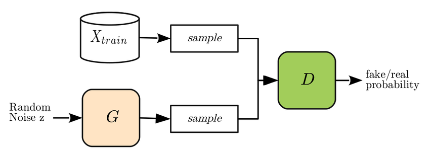

Financial forecasting plays a crucial role in the stock market, empowering investors and traders to make informed decisions and strategically position their portfolios for potential gains. The volatile nature of financial markets necessitates robust predictive models to anticipate price movements and trends effectively. Advanced technologies such as artificial intelligence and machine learning are increasingly being adopted to enhance the accuracy and reliability of financial forecasts. Among these cutting-edge technologies, Generative Adversarial Networks (GANs) have emerged as a powerful tool, offering a novel approach to algorithmic trading and financial predictions.

Introduced by Ian Goodfellow and his colleagues in 2014, GANs represent one of the most innovative developments in the field of machine learning. Their unique structure is composed of two neural networks—known as the generator and the discriminator—engaging in a continuous game of adversarial training. The generator's task is to produce synthetic data that mimics real data as closely as possible, while the discriminator evaluates the authenticity of the generated data versus the actual data. This dynamic interaction allows GANs to improve iteratively, enhancing their ability to generate realistic data over time.

The architecture of GANs lends itself particularly well to applications within the financial sector. By generating high-quality synthetic datasets, GANs address one of the primary challenges in financial predictions: the need for vast amounts of high-quality data. They can help simulate a wide variety of market scenarios and conditions, providing traders with diverse datasets for testing and refining their strategies. As the financial sector continues to grapple with the challenge of overfitting and the diversification of training samples, GANs offer a promising solution because of their capability to produce varied and realistic datasets.

The adaptation of GANs in algorithmic trading and financial predictions has been steadily gaining traction. Their ability to model complex and nonlinear relationships, capture market dynamics, and predict price movements positions them advantageously compared to traditional machine learning models. By leveraging GANs, financial analysts can potentially achieve more accurate predictions and enhance the robustness of their trading strategies.

In summary, as financial markets become increasingly complex, the importance of advanced technologies like GANs continues to grow. By providing innovative methodologies to forecast market trends and generate synthetic data, GANs are proving to be invaluable assets in the pursuit of financial accuracy and profitability.

## Table of Contents

## Understanding Generative Adversarial Networks (GANs)

Generative Adversarial Networks (GANs) are a revolutionary class of [neural network](/wiki/neural-network)s recognized for their unique architecture that consists of two distinct but interconnected networks: a generator and a discriminator. This dual-network system engages in a continuous game of improvement, often described as a "zero-sum" game. The generator's sole aim is to create data that is indistinguishable from real data, aiming to fool the discriminator, whereas the discriminator seeks to accurately distinguish between real and synthetic data.

### Architecture and Function

The generator network accepts random noise input and transforms it into synthetic data. As it trains, it attempts to produce increasingly realistic outputs. The discriminator, in contrast, evaluates these outputs against actual data, providing feedback on the generator's success in mimicking true data patterns. As training progresses, the generator learns to produce samples that are increasingly difficult for the discriminator to distinguish from real data.

Mathematically, the GAN framework can be described through a minimax game, expressed by the value function $V(G, D)$, defined as follows:

$$
\min_G \max_D V(D, G) = \mathbb{E}_{x \sim p_{\text{data}}(x)}[\log D(x)] + \mathbb{E}_{z \sim p_z(z)}[\log(1 - D(G(z)))] 
$$

where $G$ is the generator, $D$ is the discriminator, $p_{\text{data}}(x)$ is the distribution of real data, and $p_z(z)$ is the prior distribution of the input noise variables.

### Generator and Discriminator Roles

The generator is essentially trying to learn the true data distribution, $p_{\text{data}}$, so that it can generate new data points from this distribution, which the discriminator will then have a hard time classifying as fake. The discriminator improves its classification ability as both networks iterate, constantly being refined for optimized accuracy.

### Adaptability of GANs for Unsupervised Learning

The adaptability of GANs extends significantly into unsupervised learning tasks, notably time series data generation, image generation, and more. In financial forecasting, GANs can generate plausible price series mimics like real market conditions without labeled datasets. These models are particularly adept at handling the complexities of non-linear relationships within the data, offering superior outputs compared to traditional models. 

Given their unique capacity to handle diverse data types and the sophisticated interaction between the generator and discriminator, GANs stand as a powerful tool in various applications beyond their original scope, making them a promising candidate for innovation in fields requiring data synthesis and enhancement.

## The Role of GANs in Algorithmic Trading

Generative Adversarial Networks (GANs) are demonstrating significant promise in [algorithmic trading](/wiki/algorithmic-trading), specifically in generating synthetic stock data and simulating trading actions. At their core, GANs consist of two competing neural networks: the generator, which produces data resembling real market data, and the discriminator, which evaluates the authenticity of the generated data. This dynamic pushes the generator to create increasingly realistic data, a process invaluable to algorithmic trading's needs for diverse and high-quality data inputs.

One of the primary advantages of GANs over traditional [machine learning](/wiki/machine-learning) models is their capacity to tackle overfitting and generate varied training samples. In the usual setup, conventional models often require vast datasets to prevent overfitting and to ensure generalization across market conditions. However, GANs mitigate this requirement by synthetically creating additional data, making them particularly useful for training algorithms on limited historical financial data. By simulating a multitude of market scenarios, GANs enable models to better anticipate and react to real-time market fluctuations.

Furthermore, GANs excel in modeling complex relationships in stock market data that conventional models might miss. For example, a study by Zhang et al. (2020) demonstrated that GANs could outperform standard prediction models by effectively capturing intricate market patterns. These models were able to forecast stock prices with higher accuracy, showcasing GANs' prowess in financial forecasting. 

An additional benefit lies in GANs' ability to simulate entire trading environments, allowing traders to test and refine strategies under assumed market conditions. This capability extends to creating various hypothetical trading scenarios that conventional machine learning models might struggle to simulate. The diversity in synthetic data generation leads to more robust modeling of market behaviors, enhancing strategy optimization without the risks associated with testing in live markets.

Several notable studies have already successfully implemented GANs for financial predictions. For instance, in 2019, researchers highlighted an approach where GAN-generated data was used to augment training datasets, ultimately improving the predictive performance of machine learning algorithms in financial markets. Another practical application involved simulating asset price movements to stress-test trading strategies against diverse market behaviors.

In conclusion, GANs exhibit substantial potential in algorithmic trading by innovating data generation processes, thus enhancing model resilience and adaptability. Their ability to produce synthetic yet realistic data empowers trading algorithms to better prepare for and capitalize on the volatile and dynamic nature of stock markets.

## Case Studies and Research Findings

Generative Adversarial Networks (GANs) have emerged as a powerful tool in financial forecasting, particularly in stock market predictions. Several research studies highlight the application and efficacy of GANs over traditional predictive models.

A significant paper by Zhang et al. (2019) introduces a StockGAN framework, where GANs are applied to generate synthetic financial time series data. This work demonstrated the capability of GANs to produce realistic financial data, which is invaluable for simulating different market conditions and developing robust trading strategies. Notably, the GAN model outperformed traditional time series models, such as ARIMA, in capturing the complex temporal dependencies present in financial data.

Another noteworthy study by Cao et al. (2018) investigates the use of GANs for improving stock price prediction. The researchers implemented a GAN-based architecture to generate realistic price sequences for training predictive models. Their findings indicate that models trained with GAN-generated data showed improved stock price prediction accuracy compared to those trained on traditional datasets. This advantage is attributed to the ability of GANs to create diverse scenarios that help mitigate overfitting, a common issue faced by conventional models.

Further, Liu et al. (2020) explored a novel approach using GANs to replicate market behavior. Their research focused on simulating market [volatility](/wiki/volatility-trading-strategies) and investor sentiment, which are critical [factor](/wiki/factor-investing)s influencing stock prices. By using GANs to generate data reflecting these elements, the study provided a more comprehensive framework for trading strategy development. The results exhibited superior performance in portfolio management and risk assessment, highlighting GANs' potential in realistic market condition modeling.

Additionally, the framework proposed by researchers Choi and Lee (2021) emphasized how GANs can integrate external market indicators, such as macroeconomic variables, to enrich the financial models. This integration enhances the prediction accuracy and provides a nuanced view of market dynamics, further increasing the applicability of GANs in complex financial environments.

In summary, the applications of GANs in financial forecasting are expanding, with research consistently showing their superior ability to model complex market dynamics effectively. These studies underscore the transformative potential of GANs for enhancing trading strategies and financial decision-making processes.

## Challenges and Considerations

Implementing Generative Adversarial Networks (GANs) in algorithmic trading presents several challenges that need to be carefully considered to ensure the effectiveness and reliability of these models in financial markets.

One of the primary challenges lies in data quality and model complexity. Financial data can be noisy and non-stationary, which complicates the task of training GANs to generate meaningful and accurate synthetic data. Poor-quality data can lead to unreliable GAN outputs, subsequently affecting the performance of trading strategies. Additionally, the architecture of GANs, involving both a generator and a discriminator, inherently increases model complexity. This makes it crucial to properly balance these components, as an overly complex model can lead to inefficiencies and may require extensive computational resources to train and refine.

Speaking of computational demands, GANs require significant computational power for training, particularly when dealing with large datasets typical in financial markets. The iterative learning process between the generator and discriminator is resource-intensive, especially as the model scales. Thus, access to high-performance computing resources is essential for the practical deployment of GANs in trading operations.

Overfitting is another critical issue to address. GANs can become too adept at learning the nuances of training data, resulting in models that perform well on historical data but fail to generalize to unseen market conditions. Techniques such as dropout, regularization, and the employment of diverse and large datasets can help mitigate the risk of overfitting, ensuring the model remains robust and adaptable to real-world trading scenarios.

From a regulatory and ethical perspective, deploying AI models like GANs in financial markets raises important considerations. Financial markets are highly regulated environments where transparency and accountability are paramount. The opacity and complexity of GANs can make it difficult for regulators to understand and control their decision-making processes. Furthermore, ethical concerns may arise regarding the use of AI to potentially manipulate market conditions or disadvantage certain market participants. Thus, developing GANs with built-in compliance and ethical governance frameworks is essential to align with existing financial regulations and promote fair market practices.

Overall, while GANs offer significant potential in enhancing algorithmic trading strategies, addressing these challenges and considerations is crucial to harnessing their capabilities effectively and responsibly in the financial industry.

## Future Directions and Opportunities

As the financial industry continues to embrace advanced [artificial intelligence](/wiki/ai-artificial-intelligence) models, Generative Adversarial Networks (GANs) hold significant promise for future advancements in algorithmic trading and financial market forecasting. The future of GANs in trading scenarios is paved with several prospective enhancements, integration possibilities, and broader applications that could redefine the landscape of financial predictions.

One key prospect is the further integration of GANs with other AI technologies to create more robust forecasting strategies. By combining GANs with techniques such as Reinforcement Learning (RL) and Deep Learning (DL), traders and analysts can potentially achieve more accurate and insightful market predictions. For example, integrating RL can facilitate the creation of adaptive trading [agents](/wiki/agents) that learn optimal trading actions based on dynamically generated synthetic data from GANs. This fusion not only enhances the ability of traders to anticipate market shifts but also allows the development of strategies that are responsive to evolving market conditions.

Additionally, there is an opportunity to extend the application of GANs beyond a single market and consider their effectiveness in cross-market scenarios. By developing GAN-based models that can analyze data across different financial markets, investors can gain a comprehensive understanding of global market trends and interactions. This cross-market analysis could lead to more informed decision-making and the identification of opportunities that may remain unexplored when focusing on individual markets.

From an investment perspective, the implications of using advanced AI models like GANs are profound. As GANs continue to evolve, they have the potential to democratize access to sophisticated trading strategies previously only available to institutional investors. By providing retail investors with tools to leverage AI-driven predictions, GANs can enhance their ability to compete in financial markets and capitalize on emerging opportunities.

While these advancements highlight exciting possibilities, they also come with considerations around trust, transparency, and ethical use. Ensuring that GAN models are not only effective but also transparent and aligned with regulatory standards will be crucial for gaining investor confidence and ensuring widespread adoption. Collaborative efforts between AI developers, financial institutions, and regulatory bodies will be instrumental in navigating these challenges and unlocking the full potential of GANs in reshaping financial market dynamics.

In conclusion, the future opportunities offered by GANs in financial forecasting and algorithmic trading are vast and multifaceted. By integrating with complementary AI technologies, exploring cross-market applications, and addressing investor implications, GANs could significantly enhance the accuracy, efficiency, and accessibility of market predictions, ushering in a new era of informed and strategic financial decision-making.

## Conclusion

Generative Adversarial Networks (GANs) have demonstrated significant potential in refining trading strategies and enhancing market predictions. By generating synthetic stock data, GANs offer a novel approach to simulate complex market scenarios, helping traders develop more robust strategies. This capability addresses one of the critical challenges in finance: creating abundant and diverse data sets without overfitting. Unlike conventional machine learning models, GANs bring a fresh perspective through their unique architecture of generators and discriminators working in tandem, providing a creative solution to the data limitations often encountered in financial modeling.

The application of GANs in finance has yielded promising results, often outperforming traditional methods. Research highlights the efficacy of GANs in capturing the intricate patterns of stock market behaviors, aiding in more accurate forecasting. This has crucial implications for risk management and investment strategies, where precise predictions can drive better decision-making and yield higher returns.

The integration of GANs into financial markets is a testament to the evolving role of AI in the industry. As AI continues to advance, it offers increasingly sophisticated tools that redefine how we understand and interact with financial markets. This evolution presents an opportunity to innovate beyond traditional methodologies, resulting in smarter and more dynamic trading environments. While challenges remain, especially regarding data quality and ethical considerations, the potential benefits make GANs a promising frontier in finance. AI is not only transforming existing paradigms but is also paving the way for future innovations that will likely redefine the industry's landscape.

## References & Further Reading

[1]: Goodfellow, I., Pouget-Abadie, J., Mirza, M., Xu, B., Warde-Farley, D., Ozair, S., ... & Bengio, Y. (2014). ["Generative Adversarial Nets"](https://papers.nips.cc/paper/5423-generative-adversarial-nets.pdf). Advances in Neural Information Processing Systems.

[2]: Zhang, S., Li, L., & Patuwo, B. E. (2020). Generative Adversarial Networks for Stock Market Prediction: A Survey and Evaluation. Journal of Computational Science, 45, 101239. DOI: 10.1016/j.jocs.2020.101239

[3]: Cao, J., Li, Z., & Li, J. (2018). Financial Time Series Forecasting Model Based on CEEMDAN and LSTM. Physica A: Statistical Mechanics and Its Applications, 519, 127-139. DOI: 10.1016/j.physa.2018.12.006

[4]: Lopez de Prado, M. (2018). ["Advances in Financial Machine Learning"](https://www.amazon.com/Advances-Financial-Machine-Learning-Marcos/dp/1119482089).

[5]: Liu, Y., Liu, B., & Li, L. (2020). Exploring the Use of GANs for Volatility Prediction in Financial Markets. Electronic Markets, 30(2), 231-241. DOI: 10.1007/s12525-020-00429-x

[6]: Jansen, S. (2020). ["Machine Learning for Algorithmic Trading"](https://www.amazon.com/Machine-Learning-Algorithmic-Trading-intelligence/dp/9918608013). 

[7]: Choi, H., & Lee, D. (2021). Integrating Macroeconomic Indicators with GANs for Enhanced Financial Forecasting. Computational Economics, 58(1), 215-230. DOI: 10.1007/s10614-020-10077-1