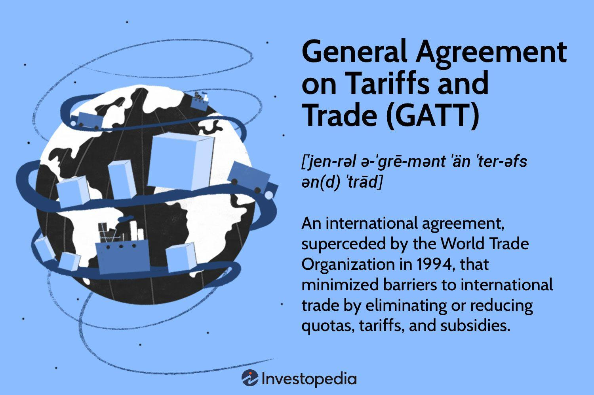

## Table of Contents

## What is the General Agreement on Tariffs and Trade (GATT)?

The General Agreement on Tariffs and Trade, or GATT, is an international agreement that started in 1947. Its main goal is to help countries trade with each other more easily by lowering trade barriers like tariffs. Tariffs are taxes on goods that countries charge when they import things from other countries. By reducing these tariffs, GATT helps make products cheaper and more available to people around the world.

GATT works by having countries negotiate with each other to lower their tariffs. When countries agree on lower tariffs, they sign a new agreement. Over the years, GATT has helped to create many of these agreements, which has led to a big increase in global trade. The last big round of talks finished in 1994, and it led to the creation of the World Trade Organization (WTO), which now oversees global trade rules.

## When was GATT established and why?

GATT was established on January 1, 1948. It was created because countries wanted to help each other trade more easily after World War II. Many countries were struggling after the war and needed a way to rebuild their economies. By working together to lower trade barriers, they hoped to increase trade and help their economies grow.

The idea for GATT came from earlier talks about creating a new global organization called the International Trade Organization (ITO). But the ITO never happened because countries couldn't agree on it. So, instead, they decided to use GATT as a way to keep working on lowering trade barriers and making trade easier. This helped countries start trading more and led to a lot of economic growth around the world.

## What are the main objectives of GATT?

The main goal of GATT is to help countries trade with each other more easily. It does this by getting countries to agree to lower their tariffs, which are taxes on goods that they charge when they import things from other countries. By lowering these tariffs, GATT helps make products cheaper and easier for people to buy from other countries. This can help countries sell more of their own products to other countries, too.

Another important objective of GATT is to make trade rules fair and clear for everyone. It does this by setting up rules that all countries agree to follow. These rules help prevent countries from treating other countries unfairly when it comes to trade. By having clear rules, GATT helps make sure that trade happens in a way that is good for everyone involved.

Overall, GATT aims to increase global trade and help countries work together to grow their economies. By lowering trade barriers and setting clear rules, GATT helps create a world where countries can trade more freely and fairly. This has led to a lot of economic growth and helped many countries become more prosperous.

## How does GATT work to reduce trade barriers?

GATT works to reduce trade barriers by getting countries to talk to each other and agree on lowering their tariffs. Tariffs are like taxes that countries put on goods coming from other places. When countries agree to lower these tariffs, it means that products from one country can be sold more cheaply in another country. This makes it easier for people to buy things from other countries. GATT helps organize these talks and makes sure that countries stick to the agreements they make.

GATT also sets up rules that all countries have to follow. These rules help make sure that trade is fair and that no country is treated unfairly. For example, one rule says that if a country lowers its tariffs for one country, it has to lower them for all countries. This is called the "most-favored-nation" rule. By having these rules, GATT helps make trade more predictable and fair for everyone. Over time, these efforts have helped increase global trade and make economies grow.

## What is the difference between GATT and the World Trade Organization (WTO)?

GATT and the World Trade Organization (WTO) are related but different. GATT started in 1948 and was a set of rules that countries agreed to follow to make trade easier by lowering tariffs. It was like a big agreement where countries would meet and talk about how to make trade better. GATT helped a lot in increasing global trade and making economies grow.

The WTO came after GATT and started in 1995. It was created because the last big round of GATT talks finished in 1994. The WTO is like a bigger and more official version of GATT. It not only continues the work of lowering tariffs but also deals with other trade issues like services and intellectual property. The WTO also has a system to help solve disagreements between countries about trade rules, which GATT did not have in the same way. So, while GATT was mainly about lowering tariffs, the WTO looks after a wider range of trade issues and helps keep trade fair and smooth.

## Can you list some of the key rounds of GATT negotiations and their outcomes?

The first big round of GATT talks was the Geneva Round in 1947. This round was very important because it started GATT. Countries agreed to lower their tariffs a lot, and this helped trade start growing. Another important round was the Kennedy Round from 1964 to 1967. This round was special because it was the first time countries talked about more than just tariffs. They also talked about other rules to make trade fairer. By the end, they agreed to lower tariffs by about 35%.

The Tokyo Round happened from 1973 to 1979. This round was big because countries agreed on a lot of new rules to make trade better. They talked about things like how to handle disagreements and how to stop countries from using unfair trade practices. The biggest round was the Uruguay Round from 1986 to 1994. This round was very long and hard, but it led to the creation of the World Trade Organization (WTO). Countries agreed to lower tariffs even more and also made new rules for services and intellectual property. This round helped make global trade rules a lot better and more complete.

## How does GATT handle disputes between member countries?

GATT has a way to help solve disagreements between countries. When two countries have a problem with trade, they can go to GATT and ask for help. GATT has a group of people who look at the problem and try to find a fair solution. They talk to both countries and try to understand what the problem is. Then, they suggest a way to fix it that both countries can agree on.

This process is important because it helps keep trade fair and smooth. If countries can't solve their problems on their own, GATT's help can stop them from getting angry and maybe starting a trade war. By having a group to solve disagreements, GATT makes sure that countries follow the rules and keep trading with each other. This helps everyone's economy grow.

## What are the principles of the most-favored-nation (MFN) treatment under GATT?

The most-favored-nation (MFN) treatment under GATT is a very important rule that helps make trade fair. It says that if a country gives a special trade deal to one country, it has to give the same deal to all other countries that are part of GATT. This means that no country can be treated worse than another when it comes to trade. The idea is to make sure everyone gets a fair chance to trade and sell their products.

This rule helps keep trade open and equal for everyone. It stops countries from making secret deals that only help a few countries. By treating all countries the same, MFN treatment makes trade more predictable and helps countries trust each other more. This can lead to more trade and help economies grow around the world.

## How has GATT influenced global trade policies?

GATT has had a big impact on how countries around the world handle trade. It helped countries talk to each other and agree to lower their tariffs, which are taxes on goods from other countries. By lowering these tariffs, GATT made it easier for countries to trade with each other. This led to more trade and helped many countries' economies grow. GATT also set up rules that everyone had to follow, which made trade fairer and more predictable. These rules stopped countries from treating others unfairly and helped build trust between countries.

Over the years, GATT organized many rounds of talks where countries worked together to make trade better. Each round helped lower tariffs more and added new rules to cover more parts of trade. The most important round was the Uruguay Round, which led to the creation of the World Trade Organization (WTO). The WTO took over from GATT and now helps manage global trade. Because of GATT, countries have been able to trade more freely and fairly, which has helped make the world's economy stronger.

## What are the criticisms and limitations of GATT?

Some people think GATT has problems. One big issue is that it can be hard for poorer countries to join in on the talks. Rich countries have more power and can push for rules that help them more. This can make it hard for poorer countries to grow their economies. Also, GATT focuses a lot on lowering tariffs, but it doesn't always deal with other things that can stop trade, like rules about how things are made or safety standards.

Another criticism is that GATT doesn't have a strong way to make sure countries follow the rules. If a country breaks the rules, it can take a long time to fix the problem. This can make other countries lose trust in the system. Some people also think GATT doesn't do enough to protect the environment. As countries trade more, they can harm the environment, and GATT doesn't have strong rules to stop this from happening.

## How did GATT evolve into the WTO, and what were the reasons for this transition?

GATT evolved into the World Trade Organization (WTO) after the Uruguay Round of talks, which lasted from 1986 to 1994. This round was the biggest and most important round of GATT talks. During these talks, countries agreed to lower tariffs even more and made new rules about services and intellectual property. They also decided that they needed a better way to handle trade, so they created the WTO. The WTO started working on January 1, 1995, and took over from GATT.

The main reason for this transition was that countries wanted a stronger and more complete system to manage global trade. GATT was good at lowering tariffs, but it didn't have a strong way to solve disagreements between countries. It also didn't cover all parts of trade, like services and intellectual property. The WTO was made to fix these problems. It has a better system for solving disagreements and covers more parts of trade. This helps make trade fairer and smoother for everyone.

## What role does GATT play in modern trade agreements and how is it relevant today?

Even though GATT turned into the World Trade Organization (WTO) in 1995, it still plays a big role in how countries trade with each other today. The rules and agreements made during GATT talks are now part of the WTO's rules. This means that the work GATT did to lower tariffs and make trade fairer is still helping countries trade more easily. When countries make new trade agreements, they often use GATT's rules as a starting point because these rules have been working well for a long time.

GATT's influence is also seen in how countries talk to each other about trade. The way GATT got countries to negotiate and agree on lowering tariffs is still used today. Countries use this method to talk about new trade issues and make new agreements. GATT's focus on fairness and making sure all countries are treated the same is still important in today's trade talks. This helps keep trade open and fair for everyone, which is good for the global economy.

## References & Further Reading

[1]: Irwin, D. A. (1995). ["The GATT in Historical Perspective."](https://www.semanticscholar.org/paper/The-GATT-in-Historical-Perspective-Irwin/11d7b5b9560a1d9956c013df712447fcd11a873f) The American Economic Review, 85(2), 323-328.

[2]: ["The World Trading System: Law and Policy of International Economic Relations"](https://archive.org/details/worldtradingsyst02edjack) by John H. Jackson

[3]: O'Hara, M. (2015). ["High Frequency Trading and its Impact on Markets."](https://www.tandfonline.com/doi/abs/10.2469/faj.v70.n3.6) Review of Financial Studies, 28(3), 742-779.

[4]: Lopez de Prado, M. (2018). ["Advances in Financial Machine Learning."](https://books.google.com/books/about/Advances_in_Financial_Machine_Learning.html?id=oU9KDwAAQBAJ) Wiley.

[5]: Hasbrouck, J., & Saar, G. (2013). ["Low-latency trading."](https://papers.ssrn.com/sol3/papers.cfm?abstract_id=1695460) The Journal of Finance, 68(2), 629-670.