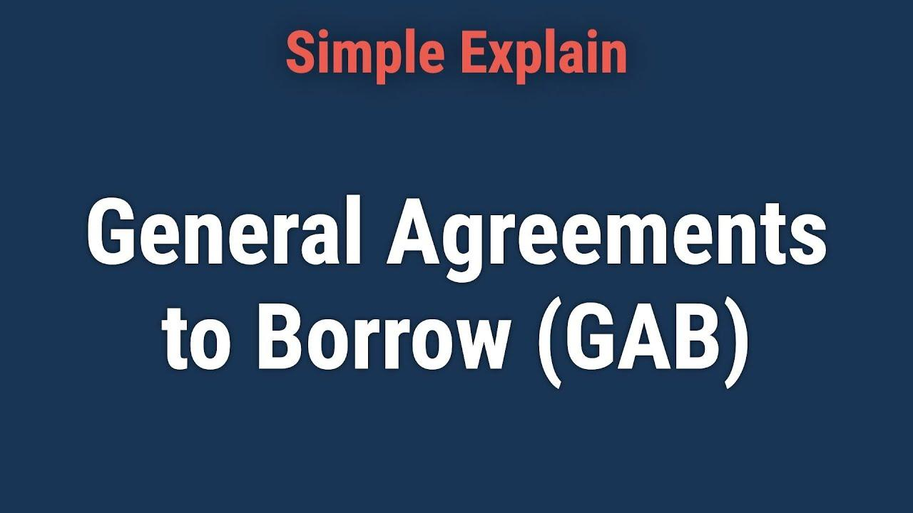

## Table of Contents

## What are General Agreements to Borrow (GAB)?

General Agreements to Borrow (GAB) are special agreements between countries and the International Monetary Fund (IMF). These agreements let countries lend money to the IMF when it needs extra funds to help other countries in financial trouble. The GAB was set up in 1962 to make sure the IMF has enough money to support its members during tough economic times.

The countries that are part of the GAB are mostly from Europe, North America, and Japan. When the IMF needs money, it can ask these countries for loans under the GAB. This helps the IMF to act quickly and provide financial assistance to countries facing economic crises. The GAB is important because it strengthens the IMF's ability to maintain global financial stability.

## Who are the parties typically involved in GABs?

The parties typically involved in General Agreements to Borrow (GABs) are a group of countries and the International Monetary Fund (IMF). The countries are mainly from Europe, North America, and Japan. These countries agree to lend money to the IMF when it needs extra funds.

The IMF uses the money from these countries to help other countries that are facing financial problems. This helps the IMF to act quickly and support countries in economic trouble. The GABs are important because they help the IMF keep the global economy stable.

## What is the primary purpose of General Agreements to Borrow?

The main reason for General Agreements to Borrow (GAB) is to help the International Monetary Fund (IMF) when it needs more money. The IMF uses this money to help countries that are having financial problems. The GAB lets certain countries lend money to the IMF so it can quickly give support to other countries in need.

The countries that are part of the GAB are mostly from Europe, North America, and Japan. They agree to give money to the IMF when it asks for it. This helps the IMF to keep the world's economy stable and support countries during tough times.

## How do GABs differ from other types of financial agreements?

General Agreements to Borrow (GABs) are special because they are agreements between the International Monetary Fund (IMF) and a specific group of countries. These countries agree to lend money to the IMF when it needs more funds to help other countries in financial trouble. Unlike regular loans or financial agreements, GABs are set up to be used quickly in emergencies. The countries involved are mainly from Europe, North America, and Japan, and they help the IMF to have enough money to support its members during tough economic times.

Other types of financial agreements might involve different parties, like banks or private investors, and might not be focused on emergency situations. For example, a regular loan might be between two countries or a country and a bank, and it might be used for specific projects or general budget support. GABs are unique because they are designed to help the IMF maintain global financial stability by providing a quick and reliable source of funds when needed.

## What are the historical origins of GABs?

The General Agreements to Borrow (GABs) started in 1962. Back then, the world needed a way to help countries that were having money problems. The International Monetary Fund (IMF) came up with the idea of GABs. It asked some countries to agree to lend money to the IMF when it needed extra cash. This way, the IMF could help other countries quickly.

The countries that agreed to be part of the GABs were mostly from Europe, North America, and Japan. They signed an agreement that said they would lend money to the IMF when it asked for it. This helped the IMF to have enough money to support its members during tough economic times. Over the years, the GABs have been important in keeping the world's economy stable.

## What are the key terms and conditions typically found in a GAB?

When countries agree to a General Agreement to Borrow (GAB), they promise to lend money to the International Monetary Fund (IMF) when it needs it. The main condition is that the IMF can ask for this money when it doesn't have enough to help other countries in financial trouble. The countries that lend the money are mostly from Europe, North America, and Japan. They agree to give the money quickly so the IMF can act fast to help countries in need.

Another important part of a GAB is that the countries lending the money can get it back with interest. This means they are not just giving the money away, but they will be paid back over time. The agreement also says how much each country will lend and how the IMF will use the money. This helps keep everything clear and fair for everyone involved.

## How are GABs structured and what are their common features?

General Agreements to Borrow (GABs) are special deals between the International Monetary Fund (IMF) and a group of countries. These countries agree to lend money to the IMF when it needs more funds to help other countries that are having money problems. The countries involved are mostly from Europe, North America, and Japan. The structure of a GAB is simple: when the IMF needs money, it asks these countries, and they quickly lend the money to the IMF. This helps the IMF to act fast and support countries in need.

A key feature of GABs is that they are designed for emergencies. They help the IMF to have enough money to support its members during tough economic times. Another important feature is that the countries lending the money can get it back with interest. This means they are not just giving the money away, but they will be paid back over time. The agreement also clearly states how much each country will lend and how the IMF will use the money, making sure everything is clear and fair for everyone involved.

## What role do GABs play in international financial stability?

General Agreements to Borrow (GABs) help keep the world's money system stable. They are deals between the International Monetary Fund (IMF) and some countries, mostly from Europe, North America, and Japan. These countries agree to lend money to the IMF when it needs extra funds. This is important because it helps the IMF to quickly help other countries that are having money problems. By having this extra money ready, the IMF can act fast to stop small money troubles from becoming big ones.

GABs are like a safety net for the world's economy. When a country is in financial trouble, the IMF can use the money from GABs to help them out. This stops the problem from spreading to other countries. The countries that lend money through GABs get it back with interest, so it's a fair deal for them too. Overall, GABs help make sure that the world's money system stays strong and stable, even when some countries face tough times.

## How have GABs been utilized in past financial crises?

General Agreements to Borrow (GABs) have been used by the International Monetary Fund (IMF) to help countries during big money problems. For example, during the 1970s, when the world faced a big economic crisis because of oil prices going up, the IMF used GABs to get more money. This helped the IMF give quick help to countries that were struggling with their money because of the high oil prices. The GABs made sure the IMF had enough money to support these countries and keep the world's money system from falling apart.

Another time GABs were important was during the 1990s, when many countries in Asia had big financial problems. The IMF used GABs to get more money to help these countries. By doing this, the IMF could give quick loans to countries like South Korea, Thailand, and Indonesia. This helped stop the money problems from spreading to other parts of the world. The GABs were a big help in making sure the IMF had enough money to act fast and keep the world's economy stable during these tough times.

## What are the benefits and risks associated with entering into GABs?

The main benefit of entering into General Agreements to Borrow (GABs) is that they help the International Monetary Fund (IMF) have enough money to help countries in financial trouble. This means the IMF can act quickly to support countries that are struggling, which can stop small problems from becoming bigger ones. Countries that lend money through GABs also get it back with interest, so it's a fair deal for them. This helps keep the world's money system stable and makes sure the IMF can do its job well.

However, there are also risks involved with GABs. One big risk is that the countries lending money might not get it back if the IMF can't pay them back. This could happen if too many countries need help at the same time and the IMF runs out of money. Another risk is that the countries lending money might not want to help if they think the IMF is not using the money wisely. This could make it harder for the IMF to get the money it needs to help other countries. So, while GABs can be very helpful, they also come with some risks that need to be carefully managed.

## How does the activation process of a GAB work, and what triggers it?

The activation process of a General Agreement to Borrow (GAB) starts when the International Monetary Fund (IMF) needs more money to help countries that are in financial trouble. The IMF looks at its own money and sees if it's enough. If it's not, the IMF can ask the countries that are part of the GAB for extra money. These countries are mostly from Europe, North America, and Japan. The IMF sends a request to these countries, and they agree to lend the money quickly so the IMF can help the countries in need.

The GAB is triggered when there's a big financial problem that the IMF can't handle with its regular money. This could happen during a big economic crisis, like when oil prices go up a lot or when many countries in one part of the world have money troubles at the same time. The IMF uses the GAB to get the extra money it needs to act fast and stop the financial problems from getting worse. This helps keep the world's money system stable and supports countries that are struggling.

## What future trends or potential reforms are being discussed regarding GABs?

People are talking about some changes to General Agreements to Borrow (GABs) to make them work better. One idea is to include more countries in the GABs, not just the ones from Europe, North America, and Japan. This could mean that more countries could help the International Monetary Fund (IMF) when it needs money. Another idea is to make the process of getting money from GABs even faster. This would help the IMF to act quickly when there's a big financial problem.

Another trend is thinking about how to use new technology to manage GABs better. Some people suggest using digital tools to make it easier for the IMF to ask for money and for countries to send it. This could make everything more efficient and help the IMF respond faster to financial crises. Overall, these changes could make GABs a stronger tool for keeping the world's money system stable.

## References & Further Reading

[1]: Goldstein, M., & Papadia, F. (1984). ["The General Arrangements to Borrow—Why and Whither?"](https://bookanalysis.com/1984/theory-and-practice-of-oligarchical-collectivism/). IMF Economic Review.

[2]: Bordo, M. D., & Schwartz, A. J. (2000). ["Measuring Real Economic Effects of Bailouts: Historical Perspectives on How Countries in Financial Distress Have Fared with Public Resources Provided Them by the IMF and Other International Institutions."](https://pmc.ncbi.nlm.nih.gov/articles/PMC1314913/) National Bureau of Economic Research Working Paper.

[3]: Battellino, R. (2007). ["Current Issues in the Global Financial System."](https://www.bis.org/review/r070928f.pdf) Reserve Bank of Australia Bulletin.

[4]: Aldridge, I. (2013). ["High-Frequency Trading: A Practical Guide to Algorithmic Strategies and Trading Systems."](https://www.ahmetbeyefendi.com/wp-content/uploads/2020/07/High-Frequency-Trading-Irene-Aldridge.pdf) Wiley.

[5]: Lewis, M. (2015). ["Flash Boys: A Wall Street Revolt."](https://en.wikipedia.org/wiki/Flash_Boys) W. W. Norton & Company.