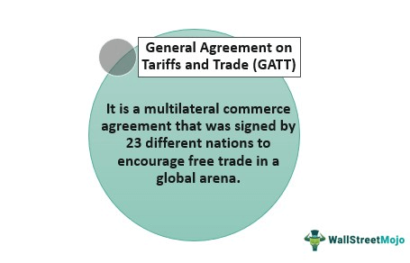

The complexity of global financial systems has underscored the importance of international finance mechanisms, with the General Agreements to Borrow (GAB) prominently illustrating this interconnectedness. Established by the International Monetary Fund (IMF) in 1962, the GAB served as a pivotal structure, allowing the IMF to harness resources from major economies to provide urgent financial support to countries in economic distress. The GAB's role ensured that nations could stabilize their economies, reflecting the collaborative nature of international financial systems designed to mitigate the impact of economic crises.

The integration of algorithmic trading into financial markets has further transformed international finance by enhancing the speed and precision of trade executions. This integration affects how funds are allocated and managed within structures like the GAB, offering improved risk management and efficiency. Algorithmic trading relies on complex computer algorithms to make trading decisions at speeds and volumes impossible for human traders to achieve. This innovation not only optimizes liquidity management but also aligns with the objectives of mechanisms like the GAB, which aim to prevent financial contagion and maintain global economic stability.

Understanding the interaction between algorithmic trading and programs such as the GAB provides valuable insights into the shifting dynamics of international finance. It illuminates how digital advancements are being incorporated into traditional financial structures to augment their functionality and resilience. As these elements converge, they shape an evolving financial landscape that prioritizes stability, adaptability, and cooperation among nations. This evolution underscores the continued significance of international finance mechanisms and technological advancements in fostering a robust global economy.

## Table of Contents

## Understanding the General Agreements to Borrow (GAB)

The General Agreements to Borrow (GAB) was established in 1962 by the International Monetary Fund (IMF) as a critical mechanism to enhance the Fund's ability to provide liquidity during times of economic stress. Initiated with the collaboration of ten major economies, known as the Group of Ten (G10), the GAB was designed to strengthen the financial stability of the global economy by enabling the IMF to borrow funds from participating member countries. This access provided a financial safety net for nations facing balance of payments crises, supplementing the IMF's existing resources.

At its core, the GAB aimed to mitigate the effects of global financial instability by providing additional liquidity. This was particularly vital during periods of heightened economic uncertainty when the need for swift financial intervention became apparent. The agreements ensured that the IMF could access a predetermined amount of supplementary resources, thus enhancing its capacity to respond to financial emergencies. The structure of the GAB allowed for efficient mobilization of funds, ensuring that the IMF could act decisively in supporting member countries requiring immediate financial assistance.

Despite its foundational role in bolstering international financial stability, the GAB was phased out by the end of 2018. It was succeeded by the New Arrangements to Borrow (NAB), reflecting a shift in the global financial landscape and the evolving needs for broader resource mobilization. The transition to the NAB was driven by several factors, including the necessity for a more flexible and comprehensive framework that could accommodate a larger number of participant countries and a more significant pool of financial resources.

This evolution from GAB to NAB highlights the continuous adaptation of international financial mechanisms to meet the challenges posed by a rapidly changing economic environment. By broadening the scope and scale of available resources, the NAB aims to ensure that the IMF maintains its role as a central stabilizing force in global finance, capable of addressing the complexities of modern economic crises effectively.

## The Role of GAB in International Finance

The General Agreements to Borrow (GAB) significantly contributed to international finance by enhancing the financial sovereignty of participating countries. By providing a strategic [liquidity](/wiki/liquidity-risk-premium) reserve, the GAB enabled nations to stabilize their economies without being subjected to potentially stringent external conditions often imposed by individual lenders or financial institutions. This ability to access necessary funds during times of economic distress allowed countries to implement domestic policies conducive to economic recovery, thereby safeguarding their financial autonomy.

A critical element of the GAB was its role in mitigating the risk of financial contagion. Financial contagion occurs when economic distress or a financial crisis in one country spreads to others, facilitated by globalized financial systems. The GAB's provision of liquidity acted as a buffer against such risks, allowing affected countries to shore up their financial systems before economic troubles could proliferate across borders. This provision thus contributed to maintaining global financial stability, as it reduced the likelihood of cascading failures within interconnected economies.

Furthermore, analyzing the impact of the GAB provides valuable insights into international cooperation during financial crises. The mechanism fostered a collaborative environment among participating nations, demonstrating a commitment to collective financial stability. By pooling resources and providing mutual support, the GAB exemplified how coordinated multilateral efforts can effectively preempt and manage financial disruptions. These collaborative frameworks set a precedent for subsequent international financial arrangements, underscoring the importance of diplomatic and financial alliances in managing cross-border economic challenges.

## Pros and Cons of the General Agreements to Borrow

The General Agreements to Borrow (GAB) had several advantages as a mechanism within international finance. Firstly, it provided a quick liquidity boost to countries in financial need. This capability was crucial during periods of economic instability, as it allowed nations to stabilize their economies efficiently. The immediacy of access to funds under the GAB prevented the spill-over of financial instability, reducing the risk of broader economic contagion.

However, the GAB was not without its drawbacks. One of the criticisms directed towards the program was its potential to encourage poor policy decisions. With the assurance of financial backing, countries might have been less incentivized to implement necessary but difficult economic reforms, relying instead on external financial support. Additionally, the benefits of the GAB were perceived to be skewed in favor of developed nations, as they were more likely to have the necessary agreements and quotas in place to access these funds expediently. This created a disparity where developing countries might not have received the same level of support or timely access to resources.

The examination of these pros and cons highlights the nuanced effectiveness of the GAB. While it provided a critical safety net during financial crises, its design and operational execution revealed challenges in equitable access and incentivizing sound economic policies. Thus, while the GAB represented international cooperation at its core, it also underscored the complexities inherent in global financial governance frameworks.

## Transition from GAB to NAB

The transition from the General Agreements to Borrow (GAB) to the New Arrangements to Borrow (NAB) signifies a pivotal shift in international financial governance. The NAB was introduced as an effort to address the limitations of the GAB, largely by expanding both the membership and the lending capacity. While the GAB was primarily limited to the Group of Ten (G10) major economies, the NAB encompasses a broader array of member countries, thus enhancing the International Monetary Fund's (IMF) ability to provide financial stability support during global crises.

The NAB allowed for an increase in the amount of resources available to the IMF, hence increasing its capability to assist member countries experiencing balance of payments problems. With more participating countries, the NAB substantially increases the pool of financial resources that the IMF can call upon. This expansion is critical during periods of severe financial stress, when the demand for IMF resources can rapidly exceed the contributions available through the regular quota-based system.

A notable advantage of the NAB over the GAB includes its ability to quickly mobilize resources when the global financial stability is threatened. Such an arrangement is crucial for preventing systemic disruptions that may arise from severe liquidity shortages. The NAB's inclusive membership acts as a testament to the collective effort by a wider range of countries to maintain international financial stability, thereby reducing systemic risks.

The evolution from GAB to NAB demonstrates an adaptive approach in international financial governance, geared towards accommodating the dynamic nature of global economic interactions and crises. This transition underscores the importance of international cooperation and coordinated policy measures in addressing the complexities of modern financial systems.

In summary, the shift to NAB marks a significant strategic improvement over the GAB, offering a more robust framework for the IMF to ensure global economic stability. This transition embodies the ongoing innovation within international financial mechanisms, reinforcing the role of the IMF as a central pillar in the global economic safety net.

## Algorithmic Trading and International Finance

Algorithmic trading has emerged as a pivotal force within international finance, offering significant advancements in trade execution speed and overall market efficiency. This automated trading strategy employs complex algorithms to execute trades at speeds and volumes that are beyond human capability. By doing so, it increases liquidity and reduces transaction costs, thereby enhancing market efficiency worldwide.

The impact of [algorithmic trading](/wiki/algorithmic-trading) on financial mechanisms like the General Agreements to Borrow (GAB) and the New Arrangements to Borrow (NAB) is profound. Firstly, these algorithms provide improved risk management capabilities. They analyze vast datasets at unprecedented speeds, predicting market trends and potential economic crises. These predictive capabilities allow institutions to better manage and anticipate risks associated with volatile global markets.

Moreover, algorithmic trading facilitates predictive analysis, enabling financial agencies to make informed decisions about liquidity provisions under programs like GAB and NAB. By integrating real-time data analytics, these institutions can adjust their strategies swiftly in response to global economic signals. This adaptability is crucial for maintaining financial stability and preventing contagion effects during crises.

In the context of international finance, understanding the synergy between algorithmic trading and existing financial mechanisms is essential for developing future strategies. As these technologies evolve, their integration with global financial programs will likely increase, offering improved precision in monitoring economic conditions and deploying liquidity strategically.

In summary, algorithmic trading not only transforms individual market actions but also has broad implications for international financial structures, offering enhanced tools for risk management and strategic planning. As such, fostering this synergy will be critical in shaping resilient and efficient global financial systems.

## Conclusion

The General Agreements to Borrow (GAB) played a pivotal role in stabilizing international finance by ensuring that nations could access necessary liquidity during times of economic distress. This strategic reserve allowed countries to maintain economic sovereignty, mitigate the risk of financial contagion, and foster international cooperation during crises. GAB facilitated the International Monetary Fund's (IMF) ability to support countries without imposing stringent external conditions, thereby contributing to overall global financial stability.

In contemporary times, algorithmic trading has emerged as a significant force in financial markets, profoundly affecting trade execution, risk management, and predictive analytics. By utilizing advanced algorithms, financial institutions can execute trades at unprecedented speeds, optimize transaction costs, and enhance market strategies. The impact of algorithmic trading on international finance mechanisms like the GAB, and its successor, the New Arrangements to Borrow (NAB), is increasingly evident. These innovations enable better risk assessment and more dynamic responses to financial [volatility](/wiki/volatility-trading-strategies), enhancing the efficiency and robustness of international financial systems.

As the global financial landscape continues to evolve, mechanisms such as the NAB signify substantial progress in achieving economic stability. By expanding member participation and increasing fund capabilities, the NAB addresses limitations of past agreements like the GAB, illustrating adaptive financial governance. These advancements are crucial for managing contemporary economic challenges, ensuring that international cooperation remains a cornerstone of financial stability. Thus, the ongoing development of financial mechanisms signifies a continual commitment to fostering resilient and adaptive economic systems on a global scale.

## References & Further Reading

[1]: Goldstein, M., & Papadia, F. (1984). ["The General Arrangements to Borrow—Why and Whither?"](https://bookanalysis.com/1984/theory-and-practice-of-oligarchical-collectivism/). IMF Economic Review.

[2]: Bordo, M. D., & Schwartz, A. J. (2000). ["Measuring Real Economic Effects of Bailouts: Historical Perspectives on How Countries in Financial Distress Have Fared with Public Resources Provided Them by the IMF and Other International Institutions."](https://pmc.ncbi.nlm.nih.gov/articles/PMC1314913/) National Bureau of Economic Research Working Paper.

[3]: Battellino, R. (2007). ["Current Issues in the Global Financial System."](https://www.bis.org/review/r070928f.pdf) Reserve Bank of Australia Bulletin.

[4]: Aldridge, I. (2013). ["High-Frequency Trading: A Practical Guide to Algorithmic Strategies and Trading Systems."](https://www.ahmetbeyefendi.com/wp-content/uploads/2020/07/High-Frequency-Trading-Irene-Aldridge.pdf) Wiley.

[5]: Lewis, M. (2015). ["Flash Boys: A Wall Street Revolt."](https://en.wikipedia.org/wiki/Flash_Boys) W. W. Norton & Company.