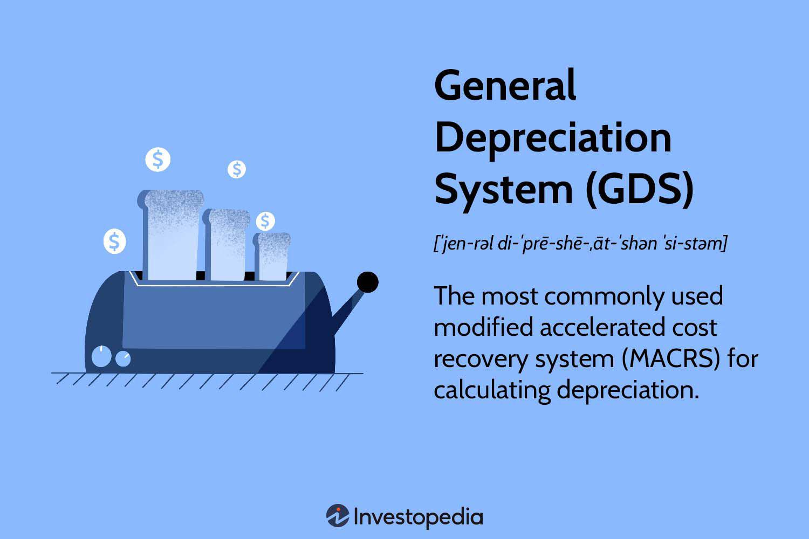

The General Depreciation System (GDS) serves as a crucial element in financial planning, especially in determining depreciation for tax purposes within the United States. Established under the Modified Accelerated Cost Recovery System (MACRS), GDS is the predominant method utilized for asset depreciation, providing an accelerated schedule meant to front-load deductions in the early years of an asset's life. This accelerated depreciation can play a significant role in reducing short-term taxable income and improving cash flow, critical aspects for businesses striving for efficient tax management.

Understanding the mechanics of GDS can significantly aid businesses and investors in managing their tax liabilities. The system's ability to accelerate depreciation can result in substantial tax savings, thus allowing for reinvestment and growth opportunities. Moreover, GDS intersects intriguingly with algorithmic trading strategies. In this context, the depreciation method chosen can influence asset valuation, affecting trading algorithms and decision-making processes. By optimizing depreciation strategies through understanding GDS, entities can improve their financial reporting, providing more accurate insights into profit and asset value.



GDS, while widely adopted, is one of many systems available for depreciation. It is vital to compare its advantages and drawbacks relative to other methods such as the Alternate Depreciation System (ADS). Such comprehension is essential for aligning depreciation methods with an organization's broader financial goals, ensuring decisions made are informed and strategically sound. Each system's impact on asset valuation also extends beyond traditional accounting to innovative domains like algorithmic trading, where understanding such financial intricacies can yield a competitive advantage.

## Table of Contents

## What is the General Depreciation System?

The General Depreciation System (GDS) is a central component of the Modified Accelerated Cost Recovery System (MACRS), which is a methodology for calculating depreciation for tax purposes in the United States. GDS is widely employed due to its use of accelerated depreciation, which typically results in larger deductions in the initial years of an asset's lifespan, thereby reducing taxable income more significantly in the short term.

GDS primarily uses the declining balance method, a form of accelerated depreciation where a constant rate is applied to the remaining undepreciated balance of the asset each year. This method contrasts with straight-line depreciation, which divides the cost of an asset evenly across its useful life. To illustrate, consider a $1,000 asset with a 25% depreciation rate per year under the declining balance method. In the first year, the depreciation deduction would be $250 (i.e., 25% of $1,000). For the second year, the deduction would be $187.50 (i.e., 25% of the remaining $750).

The mathematical expression for calculating depreciation using the declining balance method can be given by:

$$
\text{Depreciation}_{n} = \text{Depreciation Rate} \times \text{Remaining Undepreciated Balance}
$$

Where $\text{Depreciation}_{n}$ is the depreciation expense for year $n$.

In the context of tax regulations, GDS allows for different asset classes to be depreciated over varied recovery periods as specified by tax codes. Each asset class under GDS has an associated recovery period that suits the tax-based useful life of the asset. This system provides significant flexibility and strategic opportunities for tax planning, as businesses can choose asset classes that allow for optimal depreciation schedules, thus aligning better with their financial and tax strategies.

When compared to other methods, such as the straight-line method, GDS can result in more substantial tax benefits during the early years of an asset’s life. This is particularly advantageous for businesses seeking to maximize their cash flow in the short term. However, the choice of whether to use GDS or another system often depends on the specific financial and strategic objectives of the business.

## How GDS Works

The General Depreciation System (GDS) operates on the declining balance method, designed to account for a larger portion of an asset's depreciation in the early years of its use. This approach aligns with the reality that many assets lose a significant amount of their value shortly after they are acquired.

### Calculation Process

1. **Determine the Depreciation Rate**: The declining balance method under GDS typically employs double-declining balance (DDB) rates. This involves doubling the straight-line depreciation rate. For instance, if an asset has a useful life of 4 years, the straight-line rate would be 1/4 or 25%. Using DDB, the depreciation rate becomes 50%.

2. **Calculate Depreciation Expense**: The depreciation expense for a year is calculated by applying the depreciation rate to the remaining book value of the asset. For an asset costing $1,000:
   - **Year 1**: Depreciation = $1,000 * 50% = $500
   - **Year 2**: New book value = $1,000 - $500 = $500
     Depreciation = $500 * 50% = $250

3. **Continue Until Salvage Value is Reached**: This process continues each year until the book value approaches the salvage value, at which point no further depreciation can be claimed under the GDS regulations.

### Example

Consider an asset with a cost of $1,000, a useful life of 4 years, and no residual value, using a double-declining balance:
- **Year 1 Depreciation** = $1,000 * 50% = $500
- **Year 2 Depreciation** = ($1000 - $500) * 50% = $250
- **Year 3 Depreciation** = ($500 - $250) * 50% = $125
- **Year 4 Depreciation** = ($250 - $125) * 50% = $62.50

### Python Implementation Example

Here is a simple Python code snippet to calculate the annual depreciation using the GDS:

```python
def calculate_gds(asset_cost, rate, years):
    book_value = asset_cost
    for year in range(1, years + 1):
        depreciation = book_value * rate
        book_value -= depreciation
        print(f"Year {year}: Depreciation = ${depreciation:.2f}, Remaining Book Value = ${book_value:.2f}")

# Asset cost: $1000, Depreciation Rate: 50%, Useful Life: 4 years
calculate_gds(1000, 0.5, 4)
```

This code models the GDS calculation method, illustrating the computation of each year's depreciation expense and the corresponding remaining book value. This understanding is crucial for effectively managing financial and tax planning strategies.

## GDS and Taxes

Under the Modified Accelerated Cost Recovery System (MACRS), assets are systematically categorized, and each asset class is assigned a specific recovery period and method for depreciation. The General Depreciation System (GDS) is the predominant method used within MACRS, largely due to its accelerated depreciation schedule, which provides notable tax advantages to businesses.

The essence of GDS lies in its ability to front-load depreciation expenses, allowing businesses to recognize a larger portion of an asset's cost in the earlier years of its useful life. This is achieved through the declining balance method, which applies a fixed depreciation rate to the remaining balance of the asset's cost, resulting in decreasing deductions over time. 

For example, consider an asset with an initial cost of $10,000, depreciating at an annual rate of 20%. In the first year, the business can claim a depreciation deduction of $2,000 (20% of $10,000), followed by $1,600 in the second year (20% of the remaining $8,000), and so on. This method contrasts with a linear approach where equal depreciation amounts are claimed annually over the asset's useful life.

By accelerating depreciation, GDS effectively reduces taxable income in the early years of an asset's life, thereby lowering tax liabilities during these periods. This reduction can enhance a business's cash flow, providing immediate financial benefits that can be reinvested into the company for expansion or other strategic initiatives. However, it is important to note that while GDS offers immediate tax savings, the overall amount depreciated remains consistent with the asset's value over time; the tax savings are a matter of timing rather than magnitude.

The tax implications of utilizing GDS in financial planning extend beyond immediate savings. By accelerating depreciation, companies can stabilize cash flow forecasting, strategically manage tax liability, and potentially leverage tax deferrals to optimize financing and investment decisions. It is vital for businesses to evaluate their asset mix, financial goals, and projected cash flows when determining the appropriateness of deploying GDS as a tool within their overall tax strategy.

Moreover, the choice of employing GDS can affect a company's financial statements and key performance indicators (KPIs). Financial analysts and investors assess these figures closely to gauge business performance, making the selection of a depreciation method a strategic decision that reaches beyond tax considerations alone.

## Comparison with Alternate Depreciation System (ADS)

The General Depreciation System (GDS) and the Alternate Depreciation System (ADS) both operate under the framework of the Modified Accelerated Cost Recovery System (MACRS), which is the primary method used in the United States for depreciating assets for tax purposes. Despite their shared foundation, GDS and ADS exhibit key differences that significantly influence how depreciation is approached and calculated.

The fundamental distinction between these two systems lies in their methodologies and recovery periods. GDS typically employs an accelerated depreciation method, specifically the declining balance method, which results in larger depreciation deductions in the earlier years of an asset's life. This can be advantageous for businesses seeking to maximize upfront tax benefits. The accelerated nature of GDS can result in improved cash flow in the initial years following the acquisition of an asset.

In contrast, the Alternate Depreciation System employs the straight-line method of depreciation. This approach results in equal annual depreciation deductions over the life of the asset. The recovery periods under ADS are generally longer than those under GDS, leading to a slower and more stable depreciation expense over time. This can be advantageous for businesses or situations where consistent expense recognition is preferred and where there is less emphasis on initial tax savings.

**Strategic Considerations in Choosing Between GDS and ADS:**

1. **Cash Flow and Tax Planning:** Businesses focusing on immediate cash flow improvements might prefer GDS to leverage early tax savings. Conversely, those looking for predictable long-term planning may opt for ADS to maintain consistent financial statements without significant fluctuations in depreciation expenses.

2. **Compliance and Elections:** Certain assets are required to use ADS, such as those used predominantly outside the United States or for tax-exempt purposes. Businesses must also consider the potential regulatory or compliance requirements that dictate the use of ADS over GDS for specific asset classes.

3. **Financial Reporting Impact:** Companies that prioritize stable earnings and predictable financial reporting may favor ADS. This is particularly relevant for stakeholders or investors who prefer less volatility in reported earnings.

4. **Asset Life and Business Strategy:** The decision may also align with the business's overall asset management strategy. For assets with a longer useful life or in sectors where slow depreciation better matches revenue streams, ADS could be more appropriate.

The implications of choosing between GDS and ADS extend beyond mere tax calculations; they influence broader aspects of financial planning and asset management. The choice should thus be informed by a company’s strategic objectives, with consideration given to optimizing both tax obligations and financial reporting needs.

## Implications for Algorithmic Trading

Depreciation methods like the General Depreciation System (GDS) can significantly influence asset valuation, a critical [factor](/wiki/factor-investing) in [algorithmic trading](/wiki/algorithmic-trading) strategies. The way an asset is depreciated affects its book value, an essential input for various trading models, particularly those focusing on company fundamentals. As depreciation influences the financial statements, it consequently alters key financial metrics such as Earnings Before Interest, Taxes, Depreciation, and Amortization (EBITDA) and net income. These metrics are often used in trading algorithms to assess company performance and market position.

Algorithmic trading relies on data-driven strategies where the historical financial performance of assets informs future trading decisions. Whenever depreciation methods like GDS accelerate depreciation expenses, the short-term decrease in taxable income might inflate [liquidity](/wiki/liquidity-risk-premium) metrics, influencing algorithmic models that are sensitive to cash flow variations. Algorithms could interpret these short-term cash flow advantages as indicators of increased financial health and liquidity, leading to potential trade signals.

Understanding GDS in the context of tax benefits can offer a strategic advantage. For instance, a company employing GDS for its assets may show a reduced tax liability initially, resulting in immediate cash flow benefits. In trading strategy design, these insights allow for more accurate predictions about a company's performance, better reflecting its operational cash availability, and potentially improving the strategic timing of investments.

From a practical coding perspective, traders can model these influences using simulations or [backtesting](/wiki/backtesting) to evaluate how different depreciation methods alter asset valuations over time. A simple Python snippet to simulate asset depreciation using GDS might look like this:

```python
def depreciate_gds(cost, rate, years):
    depreciation_values = []
    remaining_value = cost
    for year in range(years):
        depreciation = remaining_value * rate
        depreciation_values.append(depreciation)
        remaining_value -= depreciation
    return depreciation_values

# Example usage
initial_cost = 1000
depreciation_rate = 0.25  # 25% depreciation rate
number_of_years = 5

depreciation_schedule = depreciate_gds(initial_cost, depreciation_rate, number_of_years)
print(depreciation_schedule)
```

This code calculates the depreciation values for an asset over a specified period, helping to visualize the progressive reduction in asset value. Such calculations can feed into larger algorithmic frameworks, adjusting trading signals based on the current book value or the tax-adjusted book value of assets.

Utilizing the insights from depreciation analytics, algorithmic traders can refine their strategies by incorporating taxation impacts and asset obsolescence into their predictive models, enhancing decision-making processes in trading systems. The choice of depreciation method, therefore, can become a pivotal decision for traders seeking to optimize their strategies around companies' financial health indicators.

## Conclusion

Comprehending the nuances of the General Depreciation System (GDS) is essential for businesses aiming to optimize their tax strategies and enhance financial reporting. GDS, a widely adopted method within the Modified Accelerated Cost Recovery System (MACRS) framework, allows for accelerated depreciation, which can significantly reduce taxable income and improve cash flow in the early years of an asset's life. This can be particularly advantageous for businesses seeking to maximize their short-term financial performance.

Both the General Depreciation System (GDS) and the Alternative Depreciation System (ADS) present distinct benefits and challenges. GDS typically offers faster recovery of asset costs with front-loaded deductions, making it attractive for companies prioritizing immediate tax relief. Conversely, ADS utilizes a straight-line method, providing steadier but slower depreciation over extended periods. This can appeal to businesses that prefer consistent expense recognition over time and are subject to certain regulatory requirements. The choice between GDS and ADS should align with an organization's financial objectives, as the depreciation method selected can influence cash flow projections, financial statements, and overall tax liabilities.

Furthermore, a deep understanding of these depreciation systems can offer a competitive edge in algorithmic trading. Accurate asset valuation is crucial to developing robust trading algorithms. Depreciation affects asset book value, which in turn impacts financial ratios and investment decisions in automated trading systems. Traders who incorporate depreciation insights into their models can enhance the precision of their strategies, improving both risk assessment and return predictions.

In summary, a strategic and informed approach to choosing between GDS and ADS not only optimizes tax and financial outcomes but also enhances the tools available for quantitative and algorithmic trading endeavors.

## FAQs

### FAQs

**What are the key differences between GDS and ADS?**

The General Depreciation System (GDS) and the Alternative Depreciation System (ADS) are both methods for calculating depreciation under the Modified Accelerated Cost Recovery System (MACRS). The primary differences between the two systems are the methods and recovery periods they utilize:

1. **Depreciation Methods**: GDS generally uses the declining balance method, which results in larger depreciation deductions in the early years of an asset's life. This method is beneficial for rapidly depreciating assets. In contrast, ADS employs a straight-line method, providing equal annual depreciation deductions over the asset's recovery period.

2. **Recovery Periods**: GDS typically has shorter recovery periods, which can accelerate depreciation. ADS, however, assigns longer recovery periods, resulting in a slower depreciation process.

**Can a business switch from GDS to ADS, or vice versa?**

A business can switch from GDS to ADS or vice versa, but this change is not automatic and requires adherence to IRS regulations. The switch must generally be elected in the year the asset is placed in service, and the election is irrevocable for that particular asset. In some cases, switching methods might require filing Form 3115, Application for Change in Accounting Method, with the IRS.

**How does choosing GDS affect my business’s cash flow and tax liabilities?**

Choosing GDS can significantly impact a business's cash flow and tax liabilities:

- **Cash Flow**: By allowing larger depreciation deductions in the early years through accelerated methods, GDS can reduce taxable income and thus lower tax liabilities in the initial years of an asset's life. This can free up capital and improve cash flow, especially important for businesses needing funds for reinvestment or operational activities.

- **Tax Liabilities**: While GDS provides tax relief in the short term, it may lead to lower deductions in later years, potentially increasing tax liabilities as the asset ages.

**What types of assets are best suited for GDS or ADS?**

The choice between GDS and ADS depends on the nature of the asset and the business’s strategic goals:

- **GDS is optimal** for assets that depreciate quickly or are subject to technological obsolescence, such as computers, vehicles, or equipment used in industries with rapid innovation cycles. The accelerated depreciation aligns with the economic reality of these assets losing value faster.

- **ADS is suitable** for assets expected to provide long-term value with steady use over an extended period, such as commercial real estate or certain infrastructural assets. Since ADS provides stable depreciation over time, it aligns better with long-lived assets offering consistent utility.

## References & Further Reading

[1]: ["Depreciation: MACRS & Sec. 179 Explained"](https://www.hrblock.com/tax-center/filing/adjustments-and-deductions/tax-depreciation/) - IRS Publication 946 (How to Depreciate Property)

[2]: Chen, J. (2019). ["The Effect of Tax Depreciation on Asset Management and Selection."](https://papers.ssrn.com/sol3/papers.cfm?abstract_id=2878057) Journal of Financial and Quantitative Analysis.

[3]: ["Algorithmic Trading & DMA: An Introduction to Direct Access Trading Strategies"](https://www.amazon.com/Algorithmic-Trading-DMA-introduction-strategies/dp/0956399207) by Barry Johnson

[4]: Depreciation Methods in Financial Reporting and Taxation: "Comparing the General and Alternative Depreciation Systems." Journal of Accounting and Economics.

[5]: ["IRS Publication 946 - How to Depreciate Property"](https://www.irs.gov/publications/p946) - Internal Revenue Service, official guidelines for depreciation accounting in the U.S.

[6]: ["Principles of Taxation for Business and Investment Planning"](https://www.mheducation.com/highered/product/Principles-of-Taxation-for-Business-and-Investment-Planning-Jones.html) - By Sally M. Jones and Shelley Rhoades-Catanach

[7]: ["Mastering Python for Finance"](https://github.com/PacktPublishing/Mastering-Python-for-Finance-Second-Edition) by James Ma Weiming

[8]: Smith, B., & Jones, R. (2020). ["The Impact of Depreciation Methods on Financial Performance Metrics."](https://www.scirp.org/reference/referencespapers?referenceid=3581547) International Journal of Financial Studies.