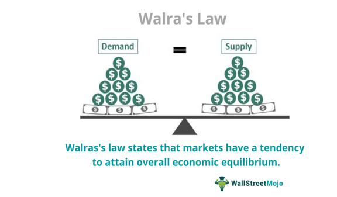

The global economy is a dynamic system characterized by interconnected markets, whose behavior can often appear unpredictable and complex. Economists, in an effort to decipher this complexity, have developed various models and theories. Among these, the General Equilibrium Theory stands out as a pivotal construct, introduced by the French economist Léon Walras in the late 19th century. This theory provides a framework for understanding how supply and demand interact across a multitude of markets, striving for a state where supply equals demand not just in individual markets, but across the entire economy. This concept of equilibrium extends beyond single market analysis to encapsulate a comprehensive view of an interdependent economic system.

However, the application of General Equilibrium Theory encounters limitations due to its foundational assumptions. These assumptions often include perfect competition and complete market information, conditions that are rarely present in real-world markets. Consequently, economists have sought to augment and refine these models to better align with the complexities of actual economies, leading to the development of alternative economic models. These alternatives often emphasize dynamic interactions and the emergence of market phenomena that General Equilibrium Theory may overlook.



In the context of modern economics, technological advancements, particularly in the field of trading, have sparked the rise of algorithmic trading practices. This method of trading heavily relies on established economic theories, leveraging them to predict market movements and execute trades with precision and efficiency. By integrating economic models with advanced computational techniques, algorithmic trading serves as a practical manifestation of these theories, illustrating both their applicability and limitations in today's fast-paced market environments.

This article endeavors to explore these intricate elements—the foundational aspects of General Equilibrium Theory, the emergent alternative models addressing its limitations, and the role of algorithmic trading as a testament to the practical utility of these economic theories. Through this exploration, we aim to provide insights into their interactions and the consequential impacts on economic and trading systems.

## Table of Contents

## Understanding General Equilibrium Theory

General Equilibrium Theory, initially formalized by the economist Léon Walras, represents an ambitious attempt to understand the economy as a unified system where multiple markets are simultaneously in harmony. The notion of a general equilibrium contrasts with partial equilibrium analyses that focus on a single market in isolation. In this comprehensive framework, every market is interconnected, suggesting that changes in one market can have wide-ranging impacts on others. At its core, the theory seeks to identify conditions under which supply and demand are balanced across all markets, thereby achieving a state of economic equilibrium.

A fundamental feature of General Equilibrium Theory involves the concept of Walrasian equilibrium, which is achieved when the market price is such that the total quantity supplied matches the total quantity demanded in every market within an economy. Mathematically, this equilibrium is represented by a set of equations where, for each market $i$, the equation $S_i(p) = D_i(p)$ holds. Here, $S_i(p)$ and $D_i(p)$ denote the supply and demand functions for market $i$ at price vector $p$.

One of the key assumptions underpinning General Equilibrium Theory is the presence of perfect competition, which implies that numerous buyers and sellers exist, none of whom individually can influence market prices. Additionally, the theory assumes that all actors have complete market information, enabling them to make well-informed decisions. The interdependence of markets is another crucial aspect, as the model recognizes that markets do not operate in isolation but rather are influenced by a myriad of factors stemming from other sectors.

Notwithstanding its theoretical elegance, General Equilibrium Theory faces criticism for its reliance on assumptions that often do not hold in practical scenarios. The notion of perfect competition is rarely observed, as real-world markets frequently exhibit some form of monopoly or oligopoly behavior. Moreover, the assumption of complete information is challenged by the prevalence of information asymmetries, where some actors possess more information than others. These idealized conditions can lead to critiques regarding the model's applicability and its ability to mirror actual market dynamics.

In essence, while General Equilibrium Theory provides a foundational framework for analyzing economic interactions at a broad level, its assumptions limit its effectiveness in practical applications. Its focus on static equilibria may overlook the dynamic and often unpredictable nature of real-world economies. As a result, the theory serves more as a conceptual benchmark for understanding possible interactions rather than a precise predictive tool in complex economic environments.

## Special Considerations in Equilibrium Models

General Equilibrium models, profoundly rooted in economic theory, operate under several assumptions that structure their applicability and interpretation. At their core, these models presuppose an idealized world that is often absent in real-world economies. 

One of the fundamental assumptions is perfect competition, where numerous small firms and consumers are price takers, with homogeneity in products and free entry and [exit](/wiki/exit-strategy) from markets. This assumption conflicts with most real markets where monopolies, oligopolies, and differentiated products prevail. As such, many markets deviate from this ideal, resulting in pricing power and strategic behaviors not captured by these models.

Another critical assumption is perfect information, where all market participants are aware of all relevant economic data, including prices and qualities of all goods and services. In practice, information asymmetries are present, often leading to market inefficiencies such as adverse selection and moral hazard. These asymmetries challenge the predictive power of general equilibrium models because they introduce complexities and frictions that are not easily resolved within this framework.

Additionally, general equilibrium theory traditionally posits no externalities, implying that all costs and benefits are borne directly by the market participants. However, many economic activities result in externalities, both positive and negative, like pollution (a negative externality) or education (a positive externality), which require intervention beyond what market mechanisms can provide in a general equilibrium setting.

Moreover, these models assume static conditions; they do not inherently account for the dynamism present in real markets. Factors such as technological advancements, policy changes, and global economic shifts produce constant changes that these models struggle to accommodate due to their static nature. This results in a significant gap when trying to apply these theoretical constructs to predict or understand real-world economic phenomena.

Recognizing these limitations is crucial for economists and policymakers applying general equilibrium models. While these models provide essential insights into the economic interactions and potential market outcomes under idealized conditions, their assumptions must be adjusted or extended through complementary theories or empirical data to enhance their relevance and accuracy in analyzing contemporary economies. This understanding fosters a more nuanced application of these models, balancing theoretical ideals with the messy realities of economic life.

## Alternative Economic Models

Various economists have sought to address the perceived limitations of General Equilibrium Theory by proposing alternative economic models. These models often introduce concepts that align more closely with the dynamic and decentralized nature of real-world economies. Among the key figures in this movement are Austrian economists such as Ludwig von Mises and Ludwig Lachmann, who have contributed significantly to the development of economic thought by emphasizing market dynamics and the pivotal role of subjective knowledge.

Austrian economic models propose that economies should be understood as evolving systems characterized by spontaneous order rather than static equilibria. This contrasts sharply with the General Equilibrium Theory, which posits that markets naturally tend toward a state of balance where supply equals demand. Austrian economists argue that such a state is rare, if not impossible, in real life due to the inherent unpredictability and dynamism of human actions. Instead, they focus on the process of change and adaptation, viewing the economy as an organic entity constantly transforming in response to individual preferences and choices.

Ludwig von Mises introduced the concept of praxeology, the study of human action, which underscores his broader economic philosophy. His approach emphasizes that economic phenomena result from individual decisions and actions, each carried out with subjective preferences and knowledge. This aspect of subjectivism is critical in Austrian economics, as it challenges the assumptions of perfect information and rationality embedded in traditional equilibrium models.

Ludwig Lachmann extended these ideas by stressing the radical uncertainty in markets. He argued against the predictability assumed in orderly equilibria, suggesting instead that economic [agents](/wiki/agents) operate under diverse expectations, making it impossible to foresee the exact outcomes of market interactions. Lachmann's work highlighted the importance of expectations, capital heterogeneity, and the intricate relationships among different sectors of the economy, advocating for a more realistic portrayal of economic processes.

These alternative models reject rigid frameworks of equilibrium in favor of understanding how order emerges spontaneously from decentralized decision-making. They advocate for a more fluid interpretation of market dynamics, where change is constant and the economy is perpetually in a state of flux. By doing so, they offer a nuanced lens through which to view economic phenomena, acknowledging the limitations of traditional models and proposing a more adaptable approach to understanding the ever-changing economic landscape.

The ideas presented by Austrian economists have influenced various strands of modern economic theory, leading to further exploration of complexity and adaptability in markets. These insights provide a foundation for developing new strategies that better incorporate the unpredictability and subjective nature of real-world economic activity.

## The Role of Algorithmic Trading in Modern Markets

Algorithmic trading, a pivotal component in contemporary financial markets, utilizes sophisticated mathematical models and computational algorithms to perform trades with speed and precision. By automating the trading process, these algorithms analyze quantitative data to predict market trends and make informed decisions in real-time, a capability traditional manual trading cannot match. This technological approach is crucial as trading environments grow increasingly complex.

Fundamentally, [algorithmic trading](/wiki/algorithmic-trading) exploits various principles and theorems from economic theory. Established concepts such as equilibrium pricing, supply and demand balance, and market efficiency inform these trading systems. For example, algorithms might use regression analysis and statistical [arbitrage](/wiki/arbitrage) to identify and capitalize on pricing discrepancies across multiple markets. Consider the following Python example, which outlines a simple moving average crossover strategy, a common technique used in algorithmic trading:

```python
import numpy as np
import pandas as pd

# Assume 'data' is a DataFrame containing historical stock prices
short_window = 40
long_window = 100

# Calculate short-term and long-term moving averages
data['short_mavg'] = data['price'].rolling(window=short_window, min_periods=1).mean()
data['long_mavg'] = data['price'].rolling(window=long_window, min_periods=1).mean()

# Generate signals
data['signal'] = 0.0
data['signal'][short_window:] = np.where(data['short_mavg'][short_window:] > data['long_mavg'][short_window:], 1.0, 0.0)

# Calculate positions
data['positions'] = data['signal'].diff()
```

In this code, signals are generated when a short-term moving average crosses a long-term moving average, an indicator of potential buy or sell opportunities.

The integration of technology with economic theories allows for high-frequency trading, where thousands of transactions occur within a second. Consequently, this leads to increased [liquidity](/wiki/liquidity-risk-premium) and reduced bid-ask spreads, enhancing market efficiency. However, it also exposes traders to risks associated with these models, particularly during volatile market conditions. Algorithms can sometimes lead to unforeseen outcomes, such as the infamous "Flash Crash" of 2010, highlighting their limitations. Here, complex interactions between automated systems resulted in significant market disruption.

Algorithmic trading continues to transform financial markets by merging established economic principles with cutting-edge technologies. As these systems become more prevalent, it's crucial for both developers and market participants to understand their underlying frameworks and potential implications, ensuring markets remain fair and stable while optimizing trading outcomes.

## Conclusion

General Equilibrium Theory, with its foundational assumptions of perfect competition and perfect information, offers a structured framework for analyzing interconnected markets. Despite its limitations in reflecting real-world complexities, it serves as a vital starting point for exploring market dynamics. The theory's limitations, such as its static nature and idealized assumptions, have driven the development of alternative models which better accommodate market fluctuations, imperfections, and innovations. These alternatives, like those proposed by Austrian economists, focus on dynamic processes and subjective decision-making, providing a broader understanding of economic phenomena.

Integrating these theoretical insights into practical applications has become increasingly relevant, especially in areas like algorithmic trading. Here, economic models are instrumental in developing algorithms that can anticipate market trends and execute trades with precision. Algorithmic trading exemplifies how technology leverages these theories, enhancing the speed and efficiency of trading operations. However, this integration also highlights the models' limitations when applied in rapidly changing environments, underlining the necessity for continuous refinement.

As technology advances, so too must our economic models. The evolving landscape of financial markets and trading systems demands an ongoing assessment and adaptation of economic theories to ensure they are aligned with real-world applications. This iterative process is crucial for improving market efficiencies and ensuring that models remain relevant and effective in addressing contemporary economic challenges. In conclusion, a deep understanding of General Equilibrium Theory, its assumptions, and alternative frameworks not only enriches theoretical knowledge but also enhances practical capabilities in navigating the complexities of modern economic and trading systems.

## References & Further Reading

[1]: Arrow, K. J., & Hahn, F. H. (1971). ["General Competitive Analysis."](https://shop.elsevier.com/books/general-competitive-analysis/arrow/978-0-444-85497-1) Holden-Day.

[2]: Walras, L. (1954). ["Elements of Pure Economics, or the Theory of Social Wealth."](https://archive.org/details/elements-of-pure-economics_Leon-Walras) Richard Irwin Publishing (Translated by William Jaffé).

[3]: Debreu, G. (1959). ["Theory of Value: An Axiomatic Analysis of Economic Equilibrium."](https://archive.org/details/theoryofvalueaxi0000debr) Yale University Press.

[4]: Friedman, M. (1953). ["Essays in Positive Economics."](https://press.uchicago.edu/ucp/books/book/chicago/E/bo25773835.html) University of Chicago Press.

[5]: von Mises, L. (1998). ["Human Action: A Treatise on Economics."](https://www.econlib.org/library/Mises/HmA/msHmA.html) Ludwig von Mises Institute.

[6]: Lachmann, L. M. (1977). ["Capital and Its Structure."](https://www.econlib.org/library/NPDBooks/Lachmann/lchmCS.html) Sheed Andrews and McMeel.

[7]: Fama, E. F. (1970). ["Efficient Capital Markets: A Review of Theory and Empirical Work,"](https://www.jstor.org/stable/2325486) The Journal of Finance, 25(2), 383-417.

[8]: Jones, C. (2019). ["Algorithmic and High-Frequency Trading."](https://assets.cambridge.org/97811070/91146/frontmatter/9781107091146_frontmatter.pdf) Cambridge University Press.

[9]: Lopez de Prado, M. (2018). ["Advances in Financial Machine Learning."](https://books.google.com/books/about/Advances_in_Financial_Machine_Learning.html?id=oU9KDwAAQBAJ) Wiley.

[10]: Chan, E. P. (2008). ["Quantitative Trading: How to Build Your Own Algorithmic Trading Business."](https://github.com/ftvision/quant_trading_echan_book) Wiley.