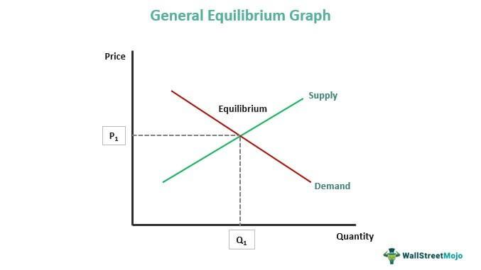

## Table of Contents

## What is General Equilibrium Theory?

General Equilibrium Theory is an economic concept that looks at how different parts of an economy work together. It tries to understand how prices, goods, and services balance out across the whole economy, not just in one market. Imagine you have a big puzzle, and each piece represents a market like food, housing, or labor. General Equilibrium Theory is like figuring out how all these puzzle pieces fit together so that everything is in balance.

In this theory, the idea is that all markets are connected. If the price of one thing changes, it can affect other prices and markets too. For example, if the price of wheat goes up, it might make bread more expensive, which could then affect how much people spend on other things. Economists use math and models to study these connections and predict how changes in one part of the economy might ripple through to others. This helps them understand how to keep the economy stable and growing.

## Who are the key economists associated with the development of General Equilibrium Theory?

The main economists who helped develop General Equilibrium Theory are Leon Walras and Kenneth Arrow. Leon Walras, a French economist, is often called the father of this theory. In the late 1800s, he came up with the idea of general equilibrium, where he thought about how all markets in an economy could be in balance at the same time. He used math to show how prices could adjust until supply and demand were equal across all markets.

Later on, in the 20th century, Kenneth Arrow, an American economist, worked with Gerard Debreu to make Walras's ideas more solid. They used advanced math to prove that under certain conditions, a general equilibrium could actually exist. Their work showed that if everyone in the economy acted rationally and had all the information they needed, the economy could reach a point where everything was balanced. Arrow and Debreu's contributions helped make General Equilibrium Theory a key part of modern economics.

## How does General Equilibrium Theory differ from Partial Equilibrium Analysis?

General Equilibrium Theory and Partial Equilibrium Analysis are two ways economists study markets, but they look at things differently. General Equilibrium Theory looks at the whole economy as one big puzzle. It tries to understand how all the different markets, like food, housing, and labor, fit together. If something changes in one market, like the price of wheat going up, this theory helps us see how it might affect other markets, like making bread more expensive. It's like looking at a whole picture to see how all the pieces work together.

On the other hand, Partial Equilibrium Analysis focuses on just one market at a time. It looks at how supply and demand work in that specific market without worrying too much about what's happening in other parts of the economy. For example, it might look at how the price of apples changes when there's a big harvest, but it won't consider how that might affect other markets like apple juice or apple pies. This approach is simpler and can give quick answers, but it might miss the bigger picture of how markets are connected.

In short, General Equilibrium Theory gives a more complete view of the economy because it considers how all markets interact, while Partial Equilibrium Analysis is easier to use but only looks at one market at a time. Both methods are useful, but they serve different purposes depending on what economists want to understand.

## What are the main assumptions of General Equilibrium Theory?

General Equilibrium Theory relies on some key assumptions to work. One big assumption is that everyone in the economy is a rational decision-maker. This means people always make choices that they think will make them better off, using all the information they have. Another assumption is that there are lots of buyers and sellers in each market, so no single person can control prices. This is called perfect competition. The theory also assumes that all goods and services can be traded freely, and there are no barriers like taxes or regulations that stop people from buying and selling what they want.

Another important assumption is that markets always clear, which means the amount of goods people want to buy equals the amount sellers want to sell at the current price. This leads to the idea that prices can adjust freely until everything is in balance. General Equilibrium Theory also assumes that everyone has complete information about prices and goods. This means no one is in the dark about what's going on in the market. These assumptions help economists build models to study how the whole economy works together, but they also mean the theory might not perfectly match the real world, where things are often more complicated.

## Can you explain the concept of Walrasian equilibrium?

Walrasian equilibrium is a key idea in General Equilibrium Theory. It's named after Leon Walras, who came up with it. The idea is that in an economy, there's a set of prices where all markets are in balance at the same time. This means that the amount of goods people want to buy equals the amount sellers want to sell in every market. It's like finding the perfect price for everything so that everyone is happy with what they're buying and selling.

To reach this equilibrium, prices can change until supply and demand match in all markets. Imagine you're trying to find the right price for apples, bread, and labor all at once. If the price of apples is too high, people might buy less, and sellers might have too many apples. So, the price needs to go down until the number of apples people want to buy matches the number sellers want to sell. The same goes for all other goods and services. When this happens for every market, you've reached a Walrasian equilibrium, where the whole economy is in balance.

## What are the limitations and criticisms of General Equilibrium Theory?

General Equilibrium Theory has some big limitations and people have criticized it a lot. One big problem is that it makes a lot of assumptions that don't match the real world. For example, it assumes everyone has perfect information about prices and goods, and that markets always clear, meaning supply always equals demand. In real life, people often don't know everything, and markets can have too much or too little of something. Another issue is that the theory assumes perfect competition, where no single buyer or seller can control prices. But in reality, big companies can affect prices a lot. These assumptions make the theory simpler to study, but they also make it less useful for understanding how the real economy works.

Another criticism is that General Equilibrium Theory can be too complicated and hard to use. It needs a lot of math and detailed models to work, which can be tough to set up and solve. This complexity means it's not always easy for economists to use it to make predictions or give advice to policymakers. Some people also think the theory focuses too much on finding a perfect balance and doesn't pay enough attention to how the economy changes over time or how it can be unfair. While the theory is great for understanding how different markets are connected, it has its limits and can't explain everything about the economy.

## How is General Equilibrium Theory applied in economic policy?

General Equilibrium Theory helps policymakers understand how different parts of the economy fit together. When they make a new policy, like changing taxes or setting new rules, they want to know how it will affect the whole economy, not just one part. For example, if the government raises taxes on gas, it might make gas more expensive, but it could also affect how much people drive, how much they spend on other things, and even how businesses operate. By using General Equilibrium Theory, policymakers can use models to predict these effects and see how different markets might change because of the new policy.

However, using General Equilibrium Theory in real life has its challenges. The theory relies on assumptions that don't always match the real world, like everyone having perfect information and markets always being in balance. So, while it can give a big picture view of the economy, it might not be perfect for making detailed policy decisions. Policymakers often use it alongside other tools and real-world data to get a better sense of what might happen. This way, they can try to make better policies that consider how different parts of the economy are connected.

## What are some alternative theories to General Equilibrium Theory?

One alternative to General Equilibrium Theory is the Keynesian economic theory. This theory, developed by John Maynard Keynes, focuses on how the economy can be out of balance and what the government can do to fix it. Keynesians believe that markets don't always clear and that things like unemployment can happen even when the economy isn't in a perfect balance. They think the government should step in with policies like spending more money or changing taxes to help the economy grow and keep people working. This is different from General Equilibrium Theory, which assumes markets will find a balance on their own.

Another alternative is the Austrian School of economics. Economists like Ludwig von Mises and Friedrich Hayek from this school believe that markets are too complex for models like General Equilibrium Theory to capture fully. They think that people's choices and actions are what drive the economy, and trying to predict everything with math and models is too hard. Instead, they focus on how markets work through people's decisions and how prices help guide those decisions. They also believe that government should not interfere much with the economy, which is different from both General Equilibrium Theory and Keynesian economics, where government action is seen as more important.

## How does Agent-Based Computational Economics challenge General Equilibrium Theory?

Agent-Based Computational Economics (ACE) challenges General Equilibrium Theory by looking at the economy from a different angle. Instead of seeing the economy as a big puzzle where all pieces fit together perfectly, ACE focuses on the individual actions of people and businesses. It uses computer models to simulate how these "[agents](/wiki/agents)" make choices and interact with each other. This approach shows that the economy can be messy and unpredictable, with lots of small actions adding up to big changes. General Equilibrium Theory, on the other hand, assumes that everyone acts rationally and that markets always find a balance, which might not happen in real life.

ACE also questions the idea that markets always clear, which is a big part of General Equilibrium Theory. In ACE models, you can see how things like unemployment or too much of a product can happen because agents don't have perfect information and can make mistakes. This is more like what we see in the real world. By showing how individual actions can lead to big economic changes, ACE challenges the neat and tidy picture that General Equilibrium Theory paints, suggesting that the economy is more about the unpredictable behavior of its parts than a perfect balance.

## What role does complexity economics play in critiquing General Equilibrium Theory?

Complexity economics looks at the economy as a system that's always changing and hard to predict. It says that the economy is more like a living thing that grows and changes over time, instead of a machine that can be perfectly balanced. General Equilibrium Theory thinks that the economy can reach a point where everything is in balance, but complexity economics says this isn't how it works. It believes that small changes can lead to big surprises, and the economy is always moving and adapting, not just sitting still in perfect harmony.

Because of this, complexity economics challenges the big ideas in General Equilibrium Theory. It points out that people don't always have all the information they need and they can make mistakes, which means markets might not clear and reach a balance like General Equilibrium Theory says. Complexity economics uses computer models to show how these small, unpredictable actions can make the economy behave in ways that are hard to predict. This view helps explain why the real economy can be so different from what General Equilibrium Theory expects.

## How do evolutionary economics and General Equilibrium Theory differ in their approach to market dynamics?

Evolutionary economics and General Equilibrium Theory look at how markets work in very different ways. General Equilibrium Theory thinks that markets can reach a perfect balance where the amount of goods people want to buy matches what sellers want to sell. It uses math and models to show how prices can change until everything is in harmony across all markets. This theory assumes that everyone knows everything they need to know and acts in a way that makes sense, leading to a stable economy.

On the other hand, evolutionary economics sees markets as always changing and adapting, much like living things evolve over time. It focuses on how new ideas, technologies, and businesses come and go, shaping the economy. Instead of looking for a perfect balance, evolutionary economics studies how markets grow and change through competition and innovation. It believes that the economy is never really in balance but is always moving and adapting to new conditions.

## What are the latest research developments and debates surrounding General Equilibrium Theory and its alternatives?

Recent research in economics has been exploring new ways to understand how the economy works, with General Equilibrium Theory still playing a key role but facing challenges from alternative approaches. One big debate is about how well General Equilibrium Theory can explain real-world economies. Many economists point out that it makes assumptions that don't match reality, like everyone having perfect information and markets always finding a balance. This has led to growing interest in other theories, like Agent-Based Computational Economics, which uses computer models to simulate how individual actions can lead to big economic changes. These models try to capture the messiness and unpredictability of real economies, showing that small actions can have big effects.

Another area of focus is complexity economics, which sees the economy as a constantly changing system, much like a living thing. This approach challenges the idea of a perfect balance and instead looks at how the economy evolves over time. Researchers are using complexity economics to study how new ideas and technologies can shape markets in unexpected ways. At the same time, evolutionary economics is gaining attention for its focus on how markets adapt and change through competition and innovation. These alternative theories are sparking debates about the best ways to model and understand economic behavior, with many researchers calling for a mix of approaches to get a fuller picture of how economies work.

## References & Further Reading

[1]: Arrow, K. J., & Hahn, F. H. (1971). ["General Competitive Analysis."](https://shop.elsevier.com/books/general-competitive-analysis/arrow/978-0-444-85497-1) Holden-Day.

[2]: Walras, L. (1954). ["Elements of Pure Economics, or the Theory of Social Wealth."](https://archive.org/details/elements-of-pure-economics_Leon-Walras) Richard Irwin Publishing (Translated by William Jaffé).

[3]: Debreu, G. (1959). ["Theory of Value: An Axiomatic Analysis of Economic Equilibrium."](https://archive.org/details/theoryofvalueaxi0000debr) Yale University Press.

[4]: Friedman, M. (1953). ["Essays in Positive Economics."](https://press.uchicago.edu/ucp/books/book/chicago/E/bo25773835.html) University of Chicago Press.

[5]: von Mises, L. (1998). ["Human Action: A Treatise on Economics."](https://www.econlib.org/library/Mises/HmA/msHmA.html) Ludwig von Mises Institute.

[6]: Lachmann, L. M. (1977). ["Capital and Its Structure."](https://www.econlib.org/library/NPDBooks/Lachmann/lchmCS.html) Sheed Andrews and McMeel.

[7]: Fama, E. F. (1970). ["Efficient Capital Markets: A Review of Theory and Empirical Work,"](https://www.jstor.org/stable/2325486) The Journal of Finance, 25(2), 383-417.

[8]: Jones, C. (2019). ["Algorithmic and High-Frequency Trading."](https://assets.cambridge.org/97811070/91146/frontmatter/9781107091146_frontmatter.pdf) Cambridge University Press.

[9]: Lopez de Prado, M. (2018). ["Advances in Financial Machine Learning."](https://books.google.com/books/about/Advances_in_Financial_Machine_Learning.html?id=oU9KDwAAQBAJ) Wiley.

[10]: Chan, E. P. (2008). ["Quantitative Trading: How to Build Your Own Algorithmic Trading Business."](https://github.com/ftvision/quant_trading_echan_book) Wiley.