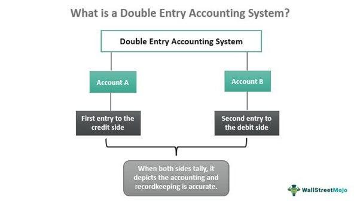

Double-entry accounting, a foundational concept in the field of accounting, serves as a crucial tool for accurately capturing and maintaining a comprehensive view of a company's financial situation. This system requires that every financial transaction is recorded in at least two different accounts, with corresponding debits and credits that maintain the accounting equation: Assets = Liabilities + Equity. This dual nature of recording ensures the accuracy and completeness of financial data, providing a solid groundwork for preparing reliable financial statements. 

The general ledger is central to double-entry accounting, acting as a master document that aggregates all financial transaction data for an organization. Each entry in the ledger consists of a matched credit and debit entry, reinforcing the accountability and traceability of financial information. This meticulous documentation is pivotal in forming a transparent view of a company's financial health, thereby supporting managerial decision-making, financial analysis, and regulatory compliance.



In recent years, the principles of double-entry accounting have found significant relevance in modern financial innovations such as algorithmic trading. Algorithmic trading involves using pre-programmed trading instructions for executing orders at high speeds and frequencies, driven by complex mathematical models and algorithms. The precision required in algorithmic trading aligns with the stringent accuracy provided by well-maintained accounting records. Accurate financial data from general ledgers can help in developing trading algorithms that require historical transaction data, revenue patterns, and financial metrics.

A robust understanding of accounting principles, particularly those embodied in double-entry systems, facilitates the integration of financial data into algorithmic models. It enables traders to devise strategies that are not only reflective of current market conditions but also grounded in solid financial performance data. Hence, the seamless integration of accounting systems with trading algorithms can lead to more informed and responsive trading decisions.

In this article, we aim to provide readers with a critical understanding of double-entry accounting and its integration with the general ledger, while highlighting their implications for advanced trading strategies like algorithmic trading. Together, these accounting practices and modern trading approaches illustrate the dynamic interplay between accurate financial record-keeping and innovative financial decision-making.

## Table of Contents

## Understanding the General Ledger

A general ledger serves as the comprehensive accounting record for an organization, systematically documenting every financial transaction throughout its life. This pivotal document underpins the double-entry accounting system—a method designed to ensure the financial integrity and accuracy of a company's records. The dual nature of this system mandates that each financial transaction be recorded in two separate accounts: one as a debit and the other as a credit. This practice ensures that the accounting equation, Assets = Liabilities + Equity, remains balanced at all times.

In the structure of a general ledger, all accounts within the double-entry system are categorized and detailed. These include assets, liabilities, equity, revenues, and expenses. Each account entry affects two accounts simultaneously, following the principle of duality. For example, when a business records the sale of a product, it will debit the accounts receivable to reflect the incoming revenue and credit sales revenue to record the income earned. Conversely, when paying an expense, the ledger will debit the expense account and credit cash or accounts payable, representing the outflow of resources.

The general ledger's capacity to organize and summarize this level of detail provides a foundational tool for the preparation of an organization's financial statements, including the balance sheet, income statement, and cash flow statement. This comprehensive reporting ensures stakeholders have an accurate picture of financial health and enables the organization to meet its regulatory and financial obligations effectively.

Given its integral role, accurate maintenance of the general ledger is crucial for effective financial management. It not only supports daily business operations but also provides insight for strategic planning and decision-making. Inaccurate ledger entries can lead to a misrepresentation of the company's financial position, potentially impacting decision-making and leading to regulatory non-compliance. Thus, rigorous control mechanisms and periodic reconciliations are necessary to maintain the precision and reliability of the ledger.

## The Role of Double-Entry Accounting

Double-entry accounting is a foundational principle crucial for maintaining accurate and reliable financial records. This system requires that every financial transaction is recorded in at least two accounts: as a debit in one account and a credit in another. This dual-sided entry method ensures that the accounting equation, represented as Assets = Liabilities + Equity, remains balanced.

The principle behind double-entry accounting lies in its ability to provide a comprehensive view of how transactions impact a company's financial position. For each transaction, debits and credits must equal, guaranteeing the equality of the equation.

### Principles of Double-Entry Accounting

The fundamental concept of double-entry accounting revolves around the idea that every financial transaction has a dual effect. This dual aspect safeguards the integrity of financial information by ensuring that the total debits equal total credits after each entry, thereby maintaining the balance of the accounting equation.

1. **Debit and Credit Rules**: In basic terms, assets and expenses increase with a debit entry and decrease with a credit. Conversely, liabilities, equity, and revenue accounts increase with a credit and decrease with a debit.

2. **The Accounting Equation**: This equation is the core of double-entry accounting. Each recorded transaction must keep the equation balanced. For instance, purchasing a new piece of equipment for $1000 would involve debiting the Equipment account and crediting the Cash account, affecting both sides of the equation equally.

### Illustrations of Journal Entries

The use of journal entries exemplifies how double-entry accounting operates. Consider the following illustrations:

- **Example 1: Asset Purchase**  
  Suppose a company buys office furniture for $500 with cash. The journal entry would be:
  - Debit: Office Furniture $500
  - Credit: Cash $500  

  This entry increases the asset (Office Furniture) while decreasing another asset (Cash), maintaining balance.

- **Example 2: Revenue Recognition**  
  When a company earns $2000 from services rendered on credit, the entry would be:
  - Debit: Accounts Receivable $2000
  - Credit: Service Revenue $2000  

  In this case, the asset Accounts Receivable increases, and the revenue account also increases, preserving the equation's integrity.

- **Example 3: Liability Settlement**  
  If the company pays off a $300 debt to a supplier using cash, the transaction would be:
  - Debit: Accounts Payable $300
  - Credit: Cash $300  

  Here, the liability (Accounts Payable) decreases, balanced by a decrease in an asset (Cash).

### Importance of Accurate Records

Ensuring a balanced accounting equation with double-entry accounting provides several benefits:
- **Error Detection**: Discrepancies immediately highlight errors since the accounts would not balance.
- **Financial Transparency**: Stakeholders gain a clear view of a company's financial health through accurately maintained records.
- **Compliance**: This system supports adherence to broader accounting standards and regulations, crucial for audits and legal requirements.

In conclusion, double-entry accounting is essential for maintaining an organization's financial integrity. By requiring every transaction to have equal and opposite effects, it provides a structured and reliable method for recording financial data. This system not only helps organizations maintain precise financial records but also supports strategic financial decision-making.

## General Ledger Examples

Practical applications of general ledger accounting through the double-entry system involve accurately recording a variety of transactions that impact a company's financial position. Here, we examine examples of balance sheet and income statement transactions to illustrate how these records provide clarity and precision in financial reporting.

### Balance Sheet Transactions

1. **Acquisition of Assets:**
   When a company purchases a piece of equipment for $10,000, the transaction must be recorded in the general ledger. In the double-entry system, this transaction would be represented as follows:

   - **Debit:** Equipment account for $10,000
   - **Credit:** Cash or Bank account for $10,000

   This entry ensures that the balance sheet equation (Assets = Liabilities + Equity) remains balanced, as an increase in assets (equipment) is matched by a decrease in another asset account (cash/bank).

2. **Incurring Liabilities:**
   Consider a scenario where a company takes out a loan of $5,000. The journal entry for this liability would be:

   - **Debit:** Cash account for $5,000
   - **Credit:** Loan Payable account for $5,000

   This reflects an increase in both assets (cash) and liabilities (loan payable), maintaining the equilibrium of the accounting equation.

### Income Statement Transactions

1. **Recording Revenue:**
   When a company earns revenue from sales totaling $3,000, the record in the general ledger must ensure that this income is recognized appropriately:

   - **Debit:** Accounts Receivable or Cash account for $3,000
   - **Credit:** Sales Revenue account for $3,000

   This journals the sales revenue, impacting both the income statement (through increased revenue) and the balance sheet (increased cash or receivables).

2. **Documenting Expenses:**
   Suppose the company incurs utility expenses amounting to $500. The related journal entry would look like this:

   - **Debit:** Utilities Expense account for $500
   - **Credit:** Cash or Accounts Payable account for $500

   This reflects a decrease in equity through increased expenses on the income statement while balancing the ledger.

### Code Example

Below is a simple Python snippet demonstrating how such transactions could be recorded programmatically, reflecting the double-entry mechanism:

```python
class Ledger:
    def __init__(self):
        self.entries = []

    def add_entry(self, debit_account, credit_account, amount):
        self.entries.append((debit_account, credit_account, amount))
        print(f"Debit: {debit_account}, Credit: {credit_account}, Amount: {amount}")

ledger = Ledger()

# Asset purchase
ledger.add_entry('Equipment', 'Cash', 10000)

# Loan acquisition
ledger.add_entry('Cash', 'Loan Payable', 5000)

# Sale transaction
ledger.add_entry('Accounts Receivable', 'Sales Revenue', 3000)

# Expense recording
ledger.add_entry('Utilities Expense', 'Cash', 500)
```

This example script simulates adding entries to a ledger, showing the debit and credit sides of each transaction. This simple representation exemplifies the structured nature of the general ledger in recording financial transactions, supporting both transparency and accuracy in financial reporting.

## Integrating General Ledger Accounting with Algorithmic Trading

Algorithmic trading, defined as the use of algorithms to execute trading decisions based on predetermined criteria, demands impeccable precision and accuracy in financial data management. This is where general ledger accounting becomes a cornerstone in providing foundational support. 

General ledger accounting offers the structured financial data crucial for developing effective trading algorithms. The accuracy and integrity of the data stored within a general ledger ensure that trading decisions are based on reliable financial information. In double-entry accounting, each transaction is meticulously recorded as both a debit and a credit. This ensures that the accounting equation (Assets = Liabilities + Equity) remains balanced, providing a holistic view of an organization's financial health. Such historical accuracy is critical for calibrating trading algorithms, which depend on precise historical data for predictive modeling and decision-making processes.

Trading algorithms often require data inputs such as profit margins, [liquidity](/wiki/liquidity-risk-premium) ratios, and capital allocation insights, all of which can be accurately derived from a well-maintained general ledger. Consider, for example, an algorithm tasked with dynamically reallocating a portfolio based on profit and loss reports. The algorithm would require real-time profit data, which can be accurately derived and cross-verified using information from a general ledger. Here, Python can play a pivotal role by interfacing with accounting data systems to fetch and process this information.

```python
import pandas as pd

# Simulating a portion of general ledger data as a DataFrame
ledger_data = {
    'Account': ['Sales', 'Expenses', 'Net Profit'],
    'Amount': [100000, 75000, 25000]
}

df = pd.DataFrame(ledger_data)

def fetch_account_balance(account_name):
    return df[df['Account'] == account_name]['Amount'].sum()

# Example function to calculate and update trading position based on net profit
def update_trading_position():
    net_profit = fetch_account_balance('Net Profit')
    if net_profit > 20000:
        # Logic to increase risk exposure or portfolio size
        print("Increasing trading position based on net profit.")
    else:
        # Logic to decrease risk exposure or portfolio size
        print("Decreasing trading position based on net profit.")

update_trading_position()
```

Organizations that have successfully integrated accounting systems with [algorithmic trading](/wiki/algorithmic-trading) tend to maintain a seamless data flow between the front-end trading modules and back-end financial recording systems. For instance, some hedge funds strategically utilize proprietary accounting software that automatically updates trading algorithms with real-time financial metrics derived from their general ledger, allowing for rapid adjustments in trading strategies.

Moreover, advanced firms often leverage [machine learning](/wiki/machine-learning) techniques to analyze financial patterns from their general ledger, feeding insights directly into algorithmic models. This integration has enabled the automation of various portfolio management tasks, thereby optimizing overall trading performance and ensuring compliance with financial reporting standards.

In summary, by ensuring data integrity and providing comprehensive financial metrics, general ledger accounting systems play an essential role in enhancing the decision-making capabilities of algorithmic trading models. This integration not only elevates trading efficiency but also enriches the financial transparency and accountability of trading operations.

## Conclusion

Maintaining comprehensive and accurate account records through the general ledger and the double-entry system is central to effective financial management. These systems ensure the consistency and reliability of financial reporting, which is crucial for informed decision-making. By recording each transaction as both a debit and a credit, the double-entry system upholds the integrity of the accounting equation (Assets = Liabilities + Equity) and provides a complete picture of a company's financial status.

As accounting practices continue to evolve, they play an increasingly vital role in supporting financial decision-making, particularly in innovative areas like algorithmic trading. This modern trading approach demands precise and timely financial data, which can be efficiently supplied through robust accounting systems that integrate double-entry accounting with real-time data analytics. Accurate accounting records help mitigate risks, optimize trading strategies, and comply with regulatory standards.

Looking ahead, the future of accounting practices appears poised to grow more dynamic as technological advancements reshape the financial landscape. Innovations such as [artificial intelligence](/wiki/ai-artificial-intelligence), machine learning, and blockchain are expected to further enhance the accuracy, speed, and transparency of financial transactions. Accounting professionals will need to adapt by harnessing these technologies to improve data analysis and decision-making processes. By doing so, they can ensure that accounting remains a cornerstone of financial stability and innovation in increasingly complex and technologically driven markets.

## References & Further Reading

[1]: ["Advances in Financial Machine Learning"](https://www.amazon.com/Advances-Financial-Machine-Learning-Marcos/dp/1119482089) by Marcos Lopez de Prado

[2]: ["Evidence-Based Technical Analysis: Applying the Scientific Method and Statistical Inference to Trading Signals"](https://www.amazon.com/Evidence-Based-Technical-Analysis-Scientific-Statistical/dp/0470008741) by David Aronson

[3]: ["Machine Learning for Algorithmic Trading"](https://github.com/stefan-jansen/machine-learning-for-trading) by Stefan Jansen

[4]: ["Quantitative Trading: How to Build Your Own Algorithmic Trading Business"](https://www.amazon.com/Quantitative-Trading-Build-Algorithmic-Business/dp/1119800064) by Ernest P. Chan

[5]: Basu, S. (1977). ["Investment Performance of Common Stocks in Relation to Their Price-Earnings Ratios: A Test of the Efficient Market Hypothesis."](https://www.semanticscholar.org/paper/Investment-Performance-of-Common-Stocks-in-Relation-Basu/44633e88f0bb1a068b07f5a90e111c4eb971a5a3) The Journal of Finance, 32(3), 663-682.