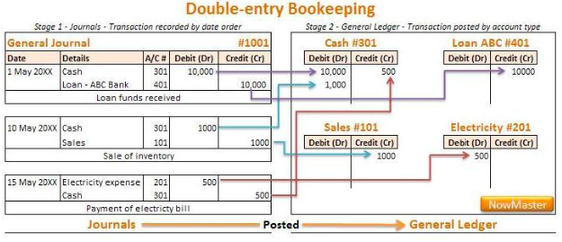

## Table of Contents

## What is a general ledger?

A general ledger is a record that keeps track of all the money that comes in and goes out of a business. It's like a big notebook where every financial transaction is written down. Each transaction is sorted into different categories, called accounts, such as sales, expenses, and assets. This helps businesses see where their money is coming from and where it's going.

The general ledger is very important because it helps businesses make sure their financial records are correct. It's used to create financial statements, like the income statement and balance sheet, which show how well the business is doing. By looking at the general ledger, business owners can make smart decisions about how to spend and save their money.

## What is the purpose of a general ledger in accounting?

The general ledger is like a big diary for a business's money. It keeps a record of all the money that comes in and goes out. Every time money moves, like when someone buys something or the business pays a bill, it gets written down in the general ledger. This helps the business keep track of everything in one place. It's important because it makes sure that all the money stuff is written down correctly.

The general ledger is also used to make important reports, like the income statement and balance sheet. These reports show how much money the business made and how much it spent. By looking at these reports, people who run the business can see if they are doing well or if they need to make changes. The general ledger helps them understand their money better and make good decisions about how to use it.

## How does a general ledger differ from a general journal?

A general ledger and a general journal are both important parts of keeping track of a business's money, but they do different jobs. A general journal is like a diary where every money move is written down as it happens. It's the first place where transactions are recorded, and each entry includes the date, the accounts affected, and a short note about what happened. Think of it as the starting point for keeping track of money.

On the other hand, a general ledger is like a big notebook that organizes all those money moves into different categories, called accounts. Each account in the general ledger shows all the money that has come in and gone out for that specific category, like sales or expenses. The general ledger takes the information from the general journal and sorts it out so it's easier to see where the money is coming from and where it's going. This helps in making reports and understanding the business's financial health.

## What is double-entry accounting?

Double-entry accounting is a way of keeping track of money where every transaction is recorded in two places. It's like making sure both sides of a seesaw are balanced. When you do something with money, like buying something or getting paid, you write it down twice. One side shows where the money came from, and the other side shows where it went. This helps make sure all the money adds up correctly.

This system helps keep everything in balance. If you spend money, you take it away from one account, like your cash account, and add it to another, like your expenses account. If you get money, you add it to one account, like your cash account, and take it away from another, like your sales account. By doing this, you can easily check if your records are right because the total amount of money coming in should always match the total amount going out. This makes it easier to find mistakes and keep your money records accurate.

## Why is double-entry accounting important for businesses?

Double-entry accounting is really important for businesses because it helps keep their money records accurate. Every time money moves, like when a business buys something or gets paid, it gets recorded in two places. This makes sure that the total amount of money coming in always matches the total amount going out. If the numbers don't match, it's easy to spot and fix mistakes. This system helps businesses trust their financial records and make sure everything is correct.

Using double-entry accounting also helps businesses see a clear picture of their money situation. It shows how much money the business has, where it's coming from, and where it's going. This information is used to make important reports like the income statement and balance sheet. These reports help business owners understand if they are making money or losing it, and make smart decisions about how to spend and save their money. In the end, double-entry accounting helps businesses run smoothly and stay on top of their finances.

## Can you explain the basic principle behind double-entry accounting?

Double-entry accounting is a way of keeping track of money where every transaction is written down twice. This means that for every bit of money that comes into a business, there's an equal amount that goes out. It's like a seesaw that always stays balanced. If you spend money, you take it away from one account, like your cash account, and add it to another, like your expenses account. If you get money, you add it to one account, like your cash account, and take it away from another, like your sales account.

This system helps make sure all the money adds up correctly. If the numbers don't match, it's easy to spot and fix mistakes. This keeps the business's money records accurate and trustworthy. By using double-entry accounting, businesses can see a clear picture of their money situation, which helps them make important reports and smart decisions about how to spend and save their money.

## How do debits and credits work in a double-entry system?

In double-entry accounting, every transaction involves both a debit and a credit. A debit is an entry on the left side of an account, and it increases assets or expenses. A credit is an entry on the right side of an account, and it increases liabilities, equity, or revenue. When you record a transaction, the total amount of debits must equal the total amount of credits. This keeps everything balanced, like a seesaw.

For example, if you buy a new computer for your business, you would debit your computer equipment account because it's an asset that's increasing. At the same time, you would credit your cash account because you're spending money. Both the debit and the credit are for the same amount, so the transaction stays balanced. This system helps you keep track of where your money is going and coming from, making sure your financial records are correct.

## What are the common accounts used in a general ledger?

In a general ledger, there are many common accounts that businesses use to keep track of their money. Some of the most important ones are assets, which are things the business owns like cash, equipment, and inventory. Liabilities are what the business owes, like loans or bills. Equity shows the owner's stake in the business. Revenue accounts track the money coming in from sales or services, while expense accounts show the money going out for things like rent, utilities, and salaries.

These accounts help businesses organize their financial information. For example, the cash account will show all the money coming in and going out in cash form. The accounts receivable account keeps track of money that customers owe the business. On the other hand, accounts payable shows what the business owes to suppliers. By using these accounts, businesses can see a clear picture of their financial health and make better decisions about managing their money.

## How do you record transactions in a general ledger using double-entry accounting?

When you record transactions in a general ledger using double-entry accounting, you write down each transaction in two different accounts. This means that for every bit of money that comes into a business, there's an equal amount that goes out. For example, if you buy a new computer for your business, you would increase (debit) your computer equipment account because it's an asset that's growing. At the same time, you would decrease (credit) your cash account because you're spending money. Both the debit and the credit are for the same amount, so the transaction stays balanced.

This system helps keep everything in order and accurate. Every transaction you record in the general ledger must have a debit and a credit that match up. If you sell a product, you would increase (credit) your sales revenue account because you're making money. At the same time, you would decrease (debit) your inventory account because you're selling something from your stock. By doing this, you make sure that the total amount of money coming in always equals the total amount going out. This way, you can easily check your records and make sure everything is correct.

## What are the steps to reconcile accounts in a general ledger?

Reconciling accounts in a general ledger means making sure the numbers in your records match up with other records, like bank statements. You start by looking at your general ledger and finding the account you want to check. Then, you get the other record, like a bank statement, and compare the two. You look for any differences between what's in your general ledger and what's in the other record. If you find any differences, you need to figure out why they're different. Maybe you forgot to write down a transaction, or maybe there was a mistake. You fix these differences by making the right changes in your general ledger.

Once you've fixed all the differences, you add up all the numbers again to make sure they match. If everything matches up, then your account is reconciled. This is important because it helps make sure your financial records are correct. By doing this regularly, you can catch mistakes early and keep your business's money records accurate. It's like making sure all the pieces of a puzzle fit together perfectly.

## How can errors in a double-entry system be identified and corrected?

Errors in a double-entry system can be found by checking if the total debits equal the total credits. If they don't match, you know there's a mistake somewhere. You start by looking at your general ledger and comparing it with other records, like bank statements or receipts. If you find a difference, you need to figure out why. It could be because you forgot to record a transaction, recorded it in the wrong account, or made a math mistake. By going through your records carefully, you can spot these errors.

Once you find an error, you fix it by making the right changes in your general ledger. If you missed a transaction, you add it in with the correct debit and credit. If you put a transaction in the wrong account, you move it to the right place. And if you made a math mistake, you correct the numbers. After making these changes, you add up all the debits and credits again to make sure they match. This way, you keep your financial records accurate and trustworthy.

## What advanced techniques can be used to analyze data from a general ledger?

One advanced way to look at the data in a general ledger is by using something called "ratio analysis." This means you take numbers from different accounts and compare them to see how the business is doing. For example, you can look at the "current ratio," which compares what the business owns (assets) to what it owes (liabilities) in the short term. This helps you see if the business has enough money to pay its bills. Another useful ratio is the "profit margin," which shows how much money the business keeps after paying for everything it needs to run. By using these ratios, you can understand the business's health better and make smart decisions.

Another technique is "trend analysis," where you look at how the numbers in the general ledger change over time. You can see if sales are going up or down, or if expenses are getting bigger or smaller. This helps you spot patterns and predict what might happen in the future. For example, if you see that sales are growing every month, you might decide to buy more inventory or hire more staff. Trend analysis can also help you find problems early, like if costs are rising faster than sales. By keeping an eye on these trends, you can manage your business better and plan for the future.

## References & Further Reading

[1]: ["Advances in Financial Machine Learning"](https://www.amazon.com/Advances-Financial-Machine-Learning-Marcos/dp/1119482089) by Marcos Lopez de Prado

[2]: ["Evidence-Based Technical Analysis: Applying the Scientific Method and Statistical Inference to Trading Signals"](https://www.amazon.com/Evidence-Based-Technical-Analysis-Scientific-Statistical/dp/0470008741) by David Aronson

[3]: ["Machine Learning for Algorithmic Trading"](https://github.com/stefan-jansen/machine-learning-for-trading) by Stefan Jansen

[4]: ["Quantitative Trading: How to Build Your Own Algorithmic Trading Business"](https://www.amazon.com/Quantitative-Trading-Build-Algorithmic-Business/dp/1119800064) by Ernest P. Chan

[5]: Basu, S. (1977). ["Investment Performance of Common Stocks in Relation to Their Price-Earnings Ratios: A Test of the Efficient Market Hypothesis."](https://www.semanticscholar.org/paper/Investment-Performance-of-Common-Stocks-in-Relation-Basu/44633e88f0bb1a068b07f5a90e111c4eb971a5a3) The Journal of Finance, 32(3), 663-682.