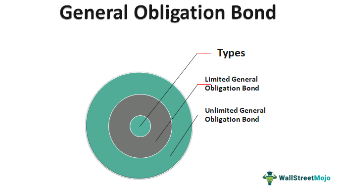

## Table of Contents

## What is a general obligation bond?

A general obligation bond is a type of bond that governments issue to raise money for big projects like building schools or fixing roads. When a government issues this bond, it promises to pay back the money it borrowed, plus interest, using its general funds. This means the government can use money from taxes or other sources to make these payments.

These bonds are considered safe because they are backed by the government's ability to tax its citizens. Investors like them because they are less risky than other types of bonds. If a government can't pay back the bond, it might raise taxes or cut spending in other areas to make sure it can meet its obligations.

## What is a revenue bond?

A revenue bond is a type of bond that a government or a company issues to raise money for a specific project. Unlike general obligation bonds, revenue bonds are not backed by the government's ability to tax its citizens. Instead, they are paid back using the money earned from the project itself. For example, if a city builds a new toll road using revenue bonds, the money to pay back the bond comes from the tolls people pay to use the road.

Revenue bonds can be riskier than general obligation bonds because if the project doesn't make enough money, there might not be enough to pay back the bondholders. This means that investors need to think carefully about the project's potential to earn money before they decide to buy a revenue bond. Despite the higher risk, some investors like revenue bonds because they can offer higher interest rates to make up for the extra risk.

## How are general obligation bonds funded?

General obligation bonds are funded using the government's general funds. This means the money to pay back these bonds comes from the government's overall budget, which includes money from taxes and other sources. When a government decides to issue a general obligation bond, it promises to use this general money to pay back the bondholders, both the money they borrowed and the interest on that money.

These bonds are seen as safe because they are backed by the government's power to tax its citizens. If the government doesn't have enough money in its general funds to pay back the bonds, it can raise taxes or cut spending in other areas to make sure it can meet its obligations. This makes general obligation bonds a popular choice for investors who want a safer investment.

## How are revenue bonds funded?

Revenue bonds are funded using the money that comes from the project they are used to build. If a city builds a new bridge and uses revenue bonds to pay for it, the money to pay back the bonds will come from the tolls people pay to use the bridge. This means the success of the project is really important because if it doesn't make enough money, there might not be enough to pay back the people who bought the bonds.

Because revenue bonds depend on the project making money, they can be riskier than other types of bonds. Investors need to think carefully about whether the project will make enough money to pay back the bonds. Even though they are riskier, revenue bonds can offer higher interest rates to make up for the extra risk, which can attract investors looking for a bigger return on their money.

## What are the different types of general obligation bonds?

General obligation bonds can be split into two main types: limited tax bonds and unlimited tax bonds. Limited tax bonds are backed by a specific tax, like a property tax, that can only be used to pay back these bonds. The government can't raise this tax to pay back the bonds if it runs out of money. Unlimited tax bonds, on the other hand, are backed by the government's ability to raise taxes without a limit. This means if the government needs more money to pay back the bonds, it can raise taxes as much as it needs to.

Another type of general obligation bond is the double-barreled bond. These bonds are backed by both the government's general funds and a specific revenue source, like fees from a public service. This makes them less risky because they have two ways to be paid back. Double-barreled bonds are often used for projects that are important to the community but might not make enough money on their own to pay back the bonds.

## What are the main uses of general obligation bonds?

General obligation bonds are mainly used by governments to pay for big projects that help the whole community. These projects often include building new schools, fixing roads, and making parks. Since these projects are important for everyone in the community, using general obligation bonds makes sense because the government can use money from taxes to pay for them.

These bonds are also used for things that don't make money on their own, like public safety buildings or libraries. Because general obligation bonds are backed by the government's power to tax, they are a good way to pay for these important projects. This helps make sure that the community can have the services and buildings it needs, even if they don't bring in money directly.

## What are the main uses of revenue bonds?

Revenue bonds are used to pay for projects that will make money. For example, a city might use revenue bonds to build a new toll road or a water treatment plant. The money to pay back these bonds comes from the fees people pay to use the road or the water. This means the project has to be successful and make enough money to cover the cost of the bonds.

These bonds are also used for projects like airports or sports stadiums where people pay to use the services. If the project makes more money than expected, it can be good for the people who bought the bonds because they might get paid back faster or get more interest. But if the project doesn't make enough money, it can be risky because there might not be enough to pay back the bonds.

## How do the repayment risks differ between general obligation bonds and revenue bonds?

The repayment risk for general obligation bonds is usually lower than for revenue bonds. This is because general obligation bonds are backed by the government's ability to tax its citizens. If the government runs out of money, it can raise taxes or cut spending in other areas to make sure it can pay back the bondholders. This makes general obligation bonds a safer choice for investors because the government has many ways to get the money it needs.

On the other hand, revenue bonds have a higher repayment risk because they depend on the money made by the project they are used to build. If the project, like a toll road or a sports stadium, doesn't make enough money, there might not be enough to pay back the bondholders. This makes revenue bonds riskier, but they can also offer higher interest rates to make up for the extra risk. Investors need to think carefully about whether the project will be successful before buying these bonds.

## What are the tax implications for investors in general obligation bonds versus revenue bonds?

The tax implications for investors in general obligation bonds and revenue bonds can be different, but they both have some things in common. Interest earned from most municipal bonds, including both general obligation and revenue bonds, is usually free from federal income tax. This makes them attractive to investors in higher tax brackets because they can keep more of the money they earn.

However, there are some differences to think about. If you live in the state where the bond is issued, the interest might also be free from state and local taxes. This is true for both types of bonds. But, if you buy bonds from another state, you might have to pay state taxes on the interest. So, it's important to check the tax rules in your state before you invest in either general obligation or revenue bonds.

## How do credit ratings typically differ between general obligation bonds and revenue bonds?

Credit ratings for general obligation bonds are usually higher than those for revenue bonds. This is because general obligation bonds are backed by the government's power to tax its citizens. If the government needs more money to pay back the bonds, it can raise taxes or cut spending in other areas. This makes general obligation bonds safer for investors, so credit rating agencies often give them higher ratings.

Revenue bonds, on the other hand, have credit ratings that depend on how much money the project is expected to make. If the project, like a toll road or a sports stadium, is expected to make a lot of money, the revenue bond might get a higher credit rating. But if the project is riskier and might not make enough money, the credit rating will be lower. This means revenue bonds can have a wider range of credit ratings, from high to low, depending on the project's expected success.

## What are the legal and regulatory considerations for issuing general obligation bonds compared to revenue bonds?

When a government wants to issue general obligation bonds, it has to follow certain rules. These bonds are backed by the government's ability to tax its citizens, so the government needs to get permission from voters before it can issue them. This usually means holding a vote where people decide if they want to pay more taxes to fund the project. Also, the government has to follow rules about how much it can borrow and how it can use the money. These rules are set by laws and can be different in each state.

For revenue bonds, the rules are a bit different because these bonds are paid back with money made by the project itself. The government doesn't need to get permission from voters to issue these bonds because they are not backed by taxes. But, the government still has to follow rules about how it can use the money and what projects it can fund with revenue bonds. These rules are also set by laws, and they can change depending on the state and the type of project.

## How do general obligation bonds and revenue bonds perform during economic downturns?

General obligation bonds usually do better during economic downturns than revenue bonds. This is because they are backed by the government's power to tax its citizens. Even if people are spending less money and the economy is struggling, the government can still raise taxes or cut spending in other areas to make sure it can pay back the bonds. This makes general obligation bonds safer for investors, so they often keep their value better during tough economic times.

Revenue bonds, on the other hand, can have a harder time during economic downturns. These bonds depend on the money made by the project they are used to build, like a toll road or a sports stadium. If people are spending less money and the economy is struggling, the project might not make as much money. This means there might not be enough money to pay back the bonds, which can make them riskier for investors. So, revenue bonds can lose value more easily during economic downturns.

## References & Further Reading

[1]: Fabozzi, F. J. (Ed.). (2007). ["Handbook of Municipal Bonds."](https://www.amazon.com/Handbook-Municipal-Bonds-Frank-Fabozzi-ebook/dp/B004JQP2VS) John Wiley & Sons.

[2]: Fabozzi, F. J., & Vink, D. (2012). ["Fixed Income Analysis Workbook,"](https://www.amazon.com/Fixed-Income-Analysis-Frank-Fabozzi/dp/047005221X) John Wiley & Sons. 

[3]: Lopez de Prado, M. (2018). ["Advances in Financial Machine Learning."](https://www.amazon.com/Advances-Financial-Machine-Learning-Marcos/dp/1119482089) Wiley.

[4]: Aronson, D. R. (2007). ["Evidence-Based Technical Analysis: Applying the Scientific Method and Statistical Inference to Trading Signals."](https://onlinelibrary.wiley.com/doi/book/10.1002/9781118268315) Wiley.

[5]: Jansen, S. (2020). ["Machine Learning for Algorithmic Trading."](https://github.com/stefan-jansen/machine-learning-for-trading) Packt Publishing.

[6]: Chan, E. P. (2008). ["Quantitative Trading: How to Build Your Own Algorithmic Trading Business."](https://github.com/ftvision/quant_trading_echan_book) Wiley.