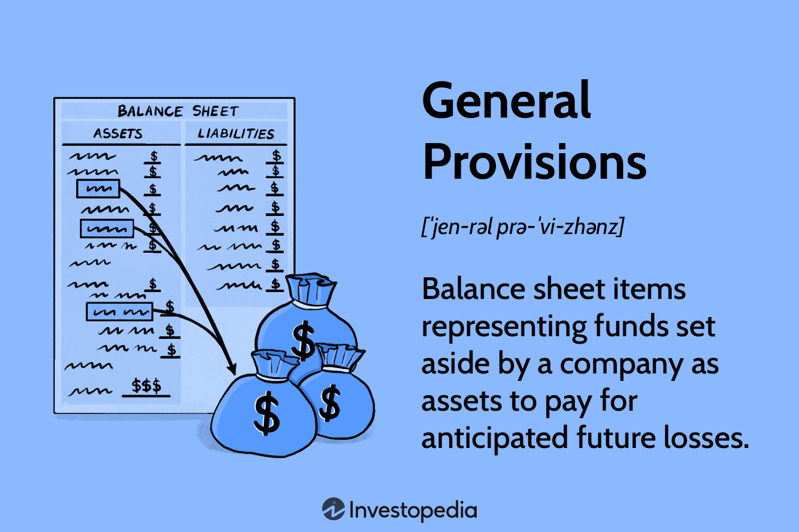

The integration of financial accounting concepts in algorithmic trading is transforming the financial landscape. With rapid advancements in technology and increasing complexity in financial markets, the interplay between financial accounting and algorithmic trading has become more significant than ever. This synergy is primarily characterized by the integration of provision accounting, which plays a pivotal role in enhancing trading strategies.

Provision accounting focuses on the allocation of funds to cover anticipated future losses or liabilities, providing a financial cushion for various uncertainties. In the context of algorithmic trading, accurate forecasting and strategic management of potential risks are crucial. By incorporating general provisions, algorithmic models can operate with an added layer of financial security, ensuring that unforeseen market events do not lead to substantial financial setbacks.

Understanding and effectively implementing provision accounting requires a comprehensive grasp of both financial accounting principles and market dynamics. Financial professionals can leverage these insights to improve decision-making processes, optimize trading algorithms, and ultimately achieve better trading outcomes. This involves not only proficiency in accounting practices such as accrual accounting and the matching principle but also the ability to anticipate and quantify financial risks that may impact trading strategies.

In this article, we explore how these components work together to form a robust financial strategy. By examining the nuances of provision accounting and its application in algorithmic trading, we aim to provide financial professionals with the tools necessary to enhance accuracy in accounting practices while improving the efficacy of trading operations. This article serves as a comprehensive guide for those looking to reconcile traditional accounting methodologies with modern trading technologies, fostering more resilient and responsive financial management systems.

## Table of Contents

## Understanding General Provisions

Understanding General Provisions involves recognizing their pivotal role in financial accounting, particularly in preparing for future uncertainties. General provisions represent monetary reserves set aside by businesses to cushion against potential financial challenges or liabilities that may arise. This proactive financial management practice is essential for maintaining accurate financial records and ensuring compliance with established accounting standards such as Generally Accepted Accounting Principles (GAAP) and International Financial Reporting Standards (IFRS).

In financial accounting, general provisions are essential because they align with the principle of conservatism, which dictates that potential expenses and liabilities should be recognized as soon as they can be reasonably estimated. This allows businesses to present a truthful depiction of their financial health, thus maintaining transparency and trust with stakeholders. Establishing general provisions involves estimating potential future losses, which requires judgment and an understanding of the business environment.

The regulatory criteria for recording general provisions are guided by GAAP and IFRS, both of which outline specific conditions under which provisions should be recognized. According to these standards, a provision should be recognized when: 
1. An entity has a present obligation as a result of a past event.
2. It is probable that an outflow of resources embodying economic benefits will be required to settle the obligation.
3. A reliable estimate can be made of the amount of the obligation.

These criteria ensure that provisions recorded are reasonable and justified, thereby supporting the integrity and accuracy of financial statements. In financial reporting, the role of general provisions goes beyond mere regulatory compliance; they offer a strategic advantage by acting as a financial buffer. By anticipating and preparing for uncertain financial events, organizations are better positioned to absorb potential financial shocks without significantly disturbing their financial equilibrium.

General provisions enhance financial planning by allowing companies to allocate resources more effectively. With reserved funds set aside for hypothetical adverse scenarios, businesses can proceed with confidence in their regular operations and growth strategies. This financial discipline not only supports sound risk management practices but also contributes to the long-term stability and sustainability of the organization.

In summary, understanding and implementing general provisions as part of financial accounting empowers organizations to maintain robust and resilient financial strategies while adhering to crucial accounting standards. By acknowledging potential future liabilities today, companies ensure more reliable financial outcomes tomorrow.

## Financial Accounting and Its Core Principles

Financial accounting is the meticulous process of recording, summarizing, and reporting an organization's financial transactions. Its foundation lies in essential principles that not only ensure the accuracy and consistency of financial statements but also support adherence to established regulatory standards. 

### Core Principles of Financial Accounting

Two pivotal principles in financial accounting are accrual accounting and the matching principle. Accrual accounting recognizes financial events when they occur, regardless of when cash transactions happen. This principle ensures that income and expenditures are recorded in the periods to which they relate. For instance, if a service is provided in December but payment is received in January, the revenue is still recorded in December.

The matching principle complements accrual accounting by stipulating that expenses should be recorded in the same period as the revenues they help to generate. This aligns costs with the revenues they facilitate, providing a more accurate depiction of a company's financial performance. For example, if a company incurs costs for producing goods that are sold in the following quarter, those costs are recorded as expenses in the same quarter the sales occur. 

Together, these principles uphold the integrity of financial reporting, ensuring that financial statements reflect true economic conditions.

### Achieving Transparency and Compliance

Financial accounting's transparency is crucial for informed decision-making and regulatory compliance. Adherence to Generally Accepted Accounting Principles (GAAP) or International Financial Reporting Standards (IFRS) is vital. GAAP, primarily used in the United States, provides a framework for standardizing accounting activities, while IFRS offers a global approach. These frameworks enhance the credibility of financial statements, fostering trust among investors, creditors, and other stakeholders.

Accurate financial reporting is fundamental to maintaining stakeholders' confidence. By providing a reliable and standardized depiction of an organization's financial position, financial accounting enables stakeholders to assess the company's health and make informed decisions.

### Financial Accounting in Algorithmic Trading

In [algorithmic trading](/wiki/algorithmic-trading), financial accounting plays a critical role. The precision and consistency offered by accurate accounting information enhance the decision-making capabilities of trading algorithms. Algorithms rely on financial data to predict market trends, manage risks, and optimize transaction timings. By integrating precise accounting data, such as recorded provisions or accrued expenses, trading algorithms can achieve superior accuracy in their predictive models, ultimately boosting trading efficiency.

Moreover, financial accounting provides a framework for evaluating the financial impacts of various trading strategies. By analyzing financial statements, traders can assess the profitability and risk profile of their operations, adjusting algorithms to optimize returns. The alignment of accounting data with trading strategies enhances the strategic planning process, ensuring that financial and business objectives are met harmoniously.

Financial accounting, with its well-established principles and frameworks, serves as a backbone for robust financial management and strategic decision-making, particularly in environments like algorithmic trading where precision and reliability are paramount.

## Recording and Managing Provisions

Recording provisions in financial statements is a critical process in financial accounting, ensuring that anticipated future obligations are accurately represented. Provisions, being liabilities of uncertain timing or amount, are essential to maintaining the integrity of financial statements and adhering to accounting standards such as GAAP (Generally Accepted Accounting Principles) and IFRS (International Financial Reporting Standards).

Provisions impact the balance sheet by appearing as liabilities, reflecting the company's potential obligations. They are also crucial in the income statement, where they impact net income by being recorded as expenses. For example, a provision for warranty claims would be recorded as follows:

1. **Balance Sheet Impact**: Provisions are recorded in the liabilities section. This decreases net assets, reflecting the anticipated outflow of economic resources.

2. **Income Statement Impact**: When a provision is recognized, it is expensed, reducing the company's operating profit. This matches expenses to the periods to which they relate, adhering to the matching principle.

### Estimation Techniques

Estimating provisions requires careful judgment and often involves actuarial or statistical techniques. Accurate estimation is crucial for reflecting the true financial position of a company. Methods include:

- **Historical Analysis**: Examining historical data to project future liabilities—this is common for provisions related to warranties or returns.
- **Scenario Analysis**: Evaluating different scenarios and assigning probabilities to estimate potential future outcomes.
- **Actuarial Valuation**: Used for long-term provisions like employee benefits, involving complex financial and actuarial techniques.

### Relationship with Accrued Expenses and Specific Provisions

Provisions and accrued expenses are both liabilities but differ in certainty and timing. Accrued expenses are liabilities for incurred costs waiting to be paid, with the amount and timing typically more certain. Conversely, provisions are liabilities of uncertain timing or amount, necessitating estimation.

Specific provisions are set aside for known future events, like legal disputes, while general provisions cover a broader range of unspecified future costs. Both impact financial reporting, with specific provisions providing clarity on the anticipated financial impact of known risks.

### Challenges in Provisioning

Several challenges exist in recording and managing provisions:

- **Estimation Uncertainties**: The inherent uncertainty in predicting future events poses a significant challenge. It requires robust methodologies and frequent reassessment to ensure accuracy.
- **Regulatory Changes**: Evolving regulations can influence provision criteria and reporting requirements. Staying updated with accounting standards is crucial for compliance.
- **Disclosure Requirements**: Companies must provide sufficient disclosure in their financial statements, detailing the nature, timing, and amount of provisions, which requires transparent and detailed reporting practices.

By maintaining rigorous accounting practices in recording and managing provisions, companies can ensure their financial statements accurately reflect their financial position, facilitating better decision-making and maintaining stakeholder confidence.

## The Role of Provisions in Algorithmic Trading

Provision accounting plays a pivotal role in enhancing the robustness of algorithmic trading operations. By setting aside reserves to anticipate future financial obligations or losses, provision accounting offers a safeguard, enabling trading strategies to thrive in volatile markets. Algorithmic trading, characterized by the use of computer algorithms to execute trading orders efficiently, relies on precise financial forecasting, where provisions act as a stabilizing [factor](/wiki/factor-investing).

Accurate financial forecasting is integral to algorithmic trading strategies. Provisions enhance this forecasting by accounting for potential discrepancies and uncertainties, thereby enabling algorithms to operate efficiently under diverse market conditions. Provisions are set for various types of risks, including credit, operational, and market risks, each of which carries specific implications for trading outcomes.

**Credit Risk**: In algorithmic trading, credit risk involves the probability of counterparties defaulting on their financial obligations. Provisioning for credit risk ensures that trading models can accommodate potential defaults, thus reducing the trading platform’s exposure to significant financial losses.

**Operational Risk**: This pertains to the risk of loss resulting from inadequate or failed internal processes, systems, or external events. Provisions geared towards operational risk safeguard trading platforms against discrepancies arising from technical failures or human errors, which can severely impact trading decisions.

**Market Risk**: Defined as the risk of losses in positions arising from movements in market prices, market risk is inherently prevalent in trading activities. Provisioning for market risk involves setting aside resources to buffer the impact of sudden market shifts, thereby enabling algorithms to maintain stability and continue executing trades profitably.

Understanding the impact of financial provisions on algorithmic models is crucial for optimizing decision-making processes. Provisions influence the initial conditions and constraints within algorithms, which in turn affect trading outputs. By incorporating provisions into their models, traders can adjust their strategies based on projected financial buffers, leading to more informed and conservative trading decisions.

In practical applications, case studies illustrate the effectiveness of provision strategies within algorithmic trading environments. For instance, during a market downturn, a trading platform with substantial market risk provisions may outperform its peers by strategically adjusting its trading algorithms to minimize losses. Similarly, platforms with robust operational risk provisions might demonstrate greater resilience in the face of software bugs or system outages, ensuring continuity in trading activities.

In summary, the integration of provision accounting in algorithmic trading operations enhances financial forecasting and risk management efficiency. Provisions fortify the trading environment against credit, market, and operational risks, ultimately leading to more resilient and dynamic algorithmic trading strategies.

## Integrating Accounting Practices With Algo Trading

The integration of accounting practices with algorithmic trading consists of merging accrual accounting principles and real-time trading strategies to maximize financial outcomes. Accrual accounting, a foundational element of financial reporting, reflects financial events by matching revenues to expenses at the time transactions occur, regardless of when cash flows do. This principle is crucial in providing an accurate depiction of a company's financial health, which directly supports the intricacies of algorithmic trading.

Algorithmic trading relies heavily on data accuracy and timeliness. Trading algorithms use historical and real-time data to execute trades based on predefined strategies, often targeting minimal time discrepancies to capitalize on market inefficiencies. Accurate financial data is pivotal here, as it refines the execution of these algorithms. For example, balance sheet data, profit margins, and cash flow projections must be precise to predict market behavior accurately. The implementation of accrual accounting ensures this accuracy, offering a consistent financial depiction that trading software can leverage to optimize decision-making.

Financial accounting principles, like the matching principle and revenue recognition, guide strategic trading decisions by providing a standardized framework for evaluating a firm's financial performance. These principles ensure that revenues and expenses are recorded in the period they occur, aligning financial reports with economic realities. This alignment is crucial for trading algorithms that assess risk and return based on such financial disclosures. When these reports reflect true economic conditions, algorithms can better assess asset valuations and market trends, leading to sounder investment choices.

Financial transparency and effective risk management underpin successful trading outcomes. Transparency in financial reporting enables traders and stakeholders to understand a firm's fiscal status comprehensively, reducing information asymmetry. By adopting rigorous accounting standards, firms can provide clear and detailed financial statements that inform trading models on parameters such as [liquidity](/wiki/liquidity-risk-premium) and leverage. Moreover, risk management benefits significantly from accurate financial reporting. Knowing a firm's financial liabilities and potential revenues enables analysts to compute risk-adjusted returns and input these calculations into algorithms that balance risk exposure.

This integration offers substantial benefits for enhancing both accounting accuracy and trading efficiency. The precise alignment of financial data with trading strategies can minimize discrepancies and operational errors. Accurate financial disclosures foster a robust platform for algorithmic strategies, allowing them to execute with heightened precision and reduced latency. Simultaneously, the transparency mandated by stringent accounting standards enhances investor confidence and stability in financial markets, fostering an environment conducive to algorithm-driven trading strategies. As the financial ecosystem continues to advance technologically, this symbiotic relationship between accounting practices and algorithmic trading will be pivotal in shaping the future landscape of finance.

## Conclusion

The integration of provision accounting, financial accounting, and algorithmic trading creates a comprehensive financial framework that enhances strategic financial planning and yields a competitive advantage. Effective mastery of these interconnected disciplines allows financial professionals to optimize accounting practices and trading outcomes. Provision accounting provides a financial cushion by setting aside funds to cover anticipated future losses, thus allowing traders to mitigate potential risks associated with algorithm deployment in uncertain markets. Understanding financial accounting principles ensures the accurate representation of financial statements, which in turn stabilizes algorithmic models by providing a reliable financial base to predict market trends and behaviors.

As financial environments grow more complex and dynamic, the proficiency in these areas remains essential for maintaining regulatory compliance and fostering stakeholder trust. Integrating accounting practices with algorithmic trading not only supports strategic decision-making but also enhances transparency and risk management. This synthesis cultivates more resilient financial management systems capable of adapting to changing financial parameters and technological innovations.

Ultimately, by combining traditional financial practices with cutting-edge algorithmic trading technology, this approach promotes the evolution of both conventional and digital financial sectors, leading to advanced, responsive, and innovative financial management solutions. This multifaceted understanding is indeed crucial for professionals seeking to navigate and succeed in the rapidly evolving landscape of modern finance.

## References & Further Reading

[1]: ["Advances in Financial Machine Learning"](https://www.amazon.com/Advances-Financial-Machine-Learning-Marcos/dp/1119482089) by Marcos Lopez de Prado

[2]: ["Machine Learning for Algorithmic Trading"](https://www.amazon.com/Machine-Learning-Algorithmic-Trading-alternative/dp/1839217715) by Stefan Jansen

[3]: ["Quantitative Trading: How to Build Your Own Algorithmic Trading Business"](https://www.amazon.com/Quantitative-Trading-Build-Algorithmic-Business/dp/1119800064) by Ernest P. Chan

[4]: ["Financial Accounting: An Introduction to Concepts, Methods and Uses"](https://www.amazon.com/Financial-Accounting-Introduction-Available-CengageNOW/dp/0324651147) by Roman L. Weil, Katherine Schipper, and Jennifer Francis

[5]: ["The Basics of Algorithmic Trading: Concepts and Examples"](https://www.investopedia.com/articles/active-trading/101014/basics-algorithmic-trading-concepts-and-examples.asp) by Rishi K. Narang, in Automated Trading with R

[6]: ["Handbook of Multi-Commodity Markets and Products: Structuring, Trading and Risk Management"](https://www.amazon.com/Handbook-Multi-Commodity-Markets-Products-Structuring/dp/047074524X) by Andrea Roncoroni, Gianluca Fusai, and Mark Cummins