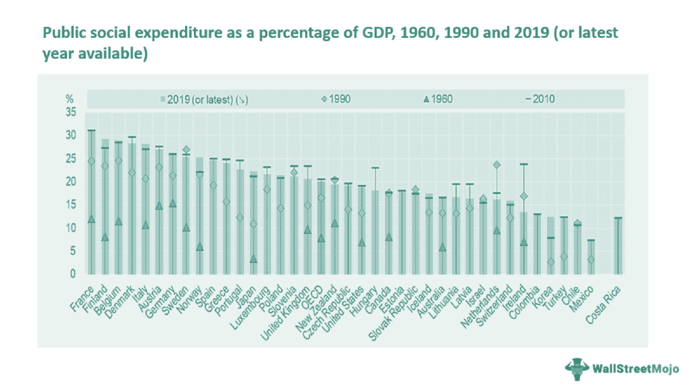

The modern financial landscape is undergoing a profound transformation, driven by technological advancements and innovative trading methods. Public distribution and supply chain management are central to the functioning of financial markets, providing the frameworks necessary for the efficient distribution of shares to a broad audience. These mechanisms ensure that shares are accessible to the general public, paving the way for widespread ownership of publicly traded companies.

Algorithmic trading, often referred to as algo trading, is a significant technological advancement within these processes. It employs sophisticated algorithms to execute trades and manage the supply chain more effectively. By leveraging complex computational models and real-time data, algo trading enhances the speed and precision of trading operations, thus contributing to improved market efficiency.



Algo trading's integration into public distribution mechanisms facilitates a more streamlined and efficient share allocation process. It ensures that trades occur at optimal prices and volumes, minimizing market disruption and enhancing liquidity. By automating many aspects of trading, algorithmic solutions can quickly adjust to changing market conditions, offering a dynamic response capability that is crucial in today's fast-paced trading environments.

This article sheds light on the synergy between public distribution supply chain management and algo trading, detailing how these components work together within the financial markets. Through an exploration of their collaborative functions, we aim to provide a comprehensive understanding of the pivotal role they play in ensuring the smooth operation and growth of capital markets.

## Table of Contents

## Understanding Public Distribution in Financial Markets

Public distribution in financial markets involves offering a company's shares to the general public through processes such as Initial Public Offerings (IPOs) or Follow-on Public Offerings (FPOs). These mechanisms are vital for broadening the base of shareholders, thereby democratizing share ownership and granting retail investors opportunities to become part-owners of publicly traded companies.

IPOs represent the first occasion on which a company offers its shares to the public, marking the transition from private to public ownership. This process is a critical milestone for companies seeking to raise capital for expansion, debt repayment, or other corporate purposes. FPOs, on the other hand, refer to the issuance of additional shares by an already public company to raise more capital. Both IPOs and FPOs are instrumental in increasing a company’s financing options and providing opportunities for investors.

The offerings are typically managed by investment banks and financial institutions. These entities play a crucial role in coordinating the process and ensuring regulatory compliance. They help price the initial offering shares, which involves evaluating the company’s financial performance, growth prospects, and comparative industry data to determine a fair and attractive share price. Investment banks also underwrite the shares, meaning they may purchase the shares directly from the issuing company and sell them to the public, thereby assuming the risk associated with the sale of shares.

In practice, the public distribution of shares also involves roadshows where company executives present their business to potential investors. This step is pivotal in building investor interest and securing commitments from institutional investors, which are integral during the book-building process. The book-building process helps in determining investor appetite and assists in setting the final offer price by indicating the demand levels at various price points.

Throughout the process, regulatory frameworks, such as those enforced by the Securities and Exchange Commission (SEC) in the United States or the Financial Conduct Authority (FCA) in the United Kingdom, ensure that offerings are conducted with transparency and fairness. These regulations mandate extensive disclosure requirements so investors can make informed decisions based on the company's financial health and future prospects.

In conclusion, public distribution serves as an essential conduit for transferring ownership and control from private hands to the broader public, fostering wider participation in the equity markets. This not only aids in capital accumulation for the issuers but also empowers individual investors by transforming them into fractional business owners with the potential for capital appreciation and dividends.

## Supply Chain Management in the Context of Public Distribution

Supply chain management in public distribution involves coordinating the systems and processes that ensure shares and securities are effectively distributed to investors. This management framework integrates various functions critical to the efficient flow of financial products from issuers to the public marketplace. 

One of the primary components of supply chain management for public distribution is initial price setting. This process involves determining the price of the shares to be distributed during public offerings such as IPOs or FPOs. Investment banks and financial advisors typically conduct a thorough analysis of the company's financial performance, market conditions, and investor sentiment to set a competitive starting price. This ensures that the share price reflects both the company's value and the market's willingness to invest.

Book-building is another critical component. This dynamic pricing process involves soliciting potential investors' interest to determine the demand for the shares being offered. Essentially, book-building allows underwriters to gauge investor interest at various price levels, enabling them to refine the initial pricing strategy before the shares are publicly launched. The feedback collected during this phase can lead to adjustments in the price range or even the number of shares offered.

Demand assessment also plays a crucial role in supply chain management for public distribution. This involves evaluating the level and type of investor interest, distinguishing between institutional and retail subscribers. Accurate demand assessment helps in effectively allocating shares to different market segments, ensuring broad participation and market stability.

Finally, distribution logistics involves the physical and electronic mechanisms that transfer securities to investors. This includes the allocation process, where shares are apportioned according to investor demand and the strategy designed during book-building. Transparent and structured distribution logistics are essential for maintaining fairness and investor confidence. These logistics ensure that all investors have equitable access to purchase shares, based on the rules set forth by regulatory bodies and facilitated by the broker-dealer network.

In essence, effective supply chain management in public distribution balances investor demand with the availability of shares, ensuring transparency and fairness throughout the process. These mechanisms are structured to align supply and demand, fostering a stable and efficient marketplace.

## The Role of Algorithmic Trading in Distribution Mechanisms

Algorithmic trading plays a crucial role in modern public distribution mechanisms, fundamentally transforming how trades are executed, volumes are managed, and pricing is optimized during public offerings. Computer algorithms are employed to automate these processes, which significantly increases the speed and accuracy of trading activities compared to manual methods.

High-frequency trading ([HFT](/wiki/high-frequency-trading-strategies)), a specialized subset of [algorithmic trading](/wiki/algorithmic-trading), is specifically designed to manage large trade volumes efficiently. It enhances market stability during public distributions by executing a high number of transactions in fractions of a second. The primary objective of HFT is to take advantage of small market inefficiencies or price discrepancies, thereby providing [liquidity](/wiki/liquidity-risk-premium) to the market and smoothing out [volatility](/wiki/volatility-trading-strategies).

These trading algorithms are capable of analyzing vast amounts of real-time market data, historical trends, and other financial metrics. Such analysis enables the algorithms to make informed trading decisions rapidly. For example, algorithms can track the price movements of an IPO, assessing both supply and demand to help determine an optimal price point. This is achieved by employing mathematical models and statistical techniques to identify patterns or trends within the data.

A typical algorithm used in this context might involve a series of steps like these in Python:

```python
import numpy as np
import pandas as pd

def analyze_market_data(historical_data, real_time_data):
    # Calculate moving averages
    historical_avg = np.mean(historical_data)
    real_time_avg = np.mean(real_time_data)

    # Assess current market trend
    trend = "upward" if real_time_avg > historical_avg else "downward"

    return trend

def execute_order(trend, current_price):
    # Decision based on market trend analysis
    if trend == "upward" and current_price < target_price:
        # Execute buy order
        return "Buying shares"
    elif trend == "downward" and current_price > target_price:
        # Execute sell order
        return "Selling shares"
    else:
        return "Holding position"

# Example usage
historical_data = [100, 102, 101, 104, 103]
real_time_data = [105, 106, 107]

market_trend = analyze_market_data(historical_data, real_time_data)
action = execute_order(market_trend, current_price=106)

print(f"Market trend: {market_trend}, Action: {action}")
```

The code snippet above illustrates a simplified process of analyzing market data to determine the current trend and subsequently executing a trade order based on this analysis. More sophisticated algorithms would incorporate models such as autoregressive integrated moving averages (ARIMA) or [machine learning](/wiki/machine-learning)-based approaches to predict future price movements and make more nuanced decisions.

Algorithmic trading technologies continue to evolve, incorporating new data sources and more advanced analytical techniques. This ongoing innovation promises to further enhance their effectiveness in public distribution mechanisms, ensuring efficient and transparent market operations.

## Strategic Phases of Algo Trading in Public Distributions

In the context of public distributions, algorithmic trading serves several strategic phases that are crucial in orchestrating effective financial operations. These phases encompass pre-launch analysis, book building and pricing, real-time adjustments, and risk management. Each phase is integral to ensuring a seamless and optimal execution of shares in the market.

**Pre-Launch Analysis**

Before executing any public distribution, a thorough pre-launch analysis is essential. This phase involves evaluating market conditions, such as volatility, liquidity, and investor sentiment. Algorithms in this context are used to collect and analyze data from various financial indicators to fine-tune execution strategies. For instance, historical price patterns and [volume](/wiki/volume-trading-strategy) trends are assessed to predict potential market movements. This analysis ensures that the strategies are aligned with the offering's objectives, with algorithms often simulating different market conditions to stress-test various scenarios.

**Book Building and Pricing**

During the book building process, algorithms play a critical role in evaluating market demand and setting the optimal issue price. This phase involves collecting bids from potential investors to construct an [order book](/wiki/order-book-trading-strategies), which reflects the demand at various price levels. Algorithms can quickly analyze the bids, assess demand dynamics, and suggest a pricing model that maximizes issuer proceeds while maintaining fair market equilibrium. 

For example, consider a simplified algorithm that utilizes a weighted price calculation to determine the optimal price:

```python
def calculate_optimal_price(order_book):
    total_quantity = sum(order['quantity'] for order in order_book)
    weighted_price = sum(order['price'] * order['quantity'] for order in order_book) / total_quantity
    return weighted_price

order_book = [
    {'price': 100, 'quantity': 50},
    {'price': 102, 'quantity': 70},
    {'price': 98, 'quantity': 30},
]

optimal_price = calculate_optimal_price(order_book)
print("Optimal Issue Price:", optimal_price)
```

**Real-Time Adjustment**

Once trading commences, algorithms must dynamically adjust orders to counteract any market fluctuations, thereby minimizing the impact on market prices and ensuring a smooth execution. By continuously monitoring live market data, algorithms recalibrate buying and selling activities based on real-time supply and demand changes. For instance, if there is sudden increased demand, algorithms might moderate the release of shares to prevent excessive volatility.

**Risk Management**

Throughout each phase, risk management is pivotal to safeguard against potential adverities caused by market volatility or unforeseen events. Algorithms contribute by constantly monitoring market indicators and adjusting strategies to minimize exposure to risky scenarios. This includes setting up automated stop-loss orders or hedging against potential downturns. Risk management algorithms may also employ statistical measures, such as Value at Risk (VaR), to quantify potential losses and guide decision-making.

These strategic phases underscore the value of algorithmic trading in effectively managing public distributions. By improving adaptability, accuracy, and speed of execution, algorithms not only enhance the distribution process but also contribute to overall market stability and efficiency.

## Examples and Real-World Applications

XYZ Corporation’s IPO illustrates the transformative impact of algorithmic trading on public distributions. During its IPO, XYZ leveraged advanced algorithms to automate and optimize various stages of the process. Specifically, algo trading enabled XYZ to achieve efficient order execution by continuously analyzing market conditions and adjusting trades in response to fluctuating demand. This adaptability ensured that orders were filled at optimal prices, thus maintaining a stable and efficient market.

One significant advantage of using algorithmic trading was evident in the price discovery process. By harnessing algorithms, XYZ Corporation effectively processed vast amounts of market data, swiftly identifying trends and investor sentiment. This capability facilitated the determination of an optimal offering price that balanced company valuation with investor interest, minimizing the risk of price volatility.

Moreover, algorithmic trading played a crucial role in volatility control during the IPO. High-frequency trading algorithms constantly monitored trading activity, executing rapid transactions that stabilized the price and mitigated sharp fluctuations. The result was a smoother and more predictable trading environment, bolstering investor confidence and supporting a successful public offering.

Renowned firms like Renaissance Technologies and Two Sigma exemplify the broader application of algorithmic trading in public distributions. These firms employ sophisticated algorithms tailored to manage diverse market operations. By integrating powerful data analytics and machine learning techniques, they enhance the efficiency of public offerings, ensuring precise estimations of demand and accurate pricing strategies.

For instance, Renaissance Technologies uses quantitative models to predict market movements and adjust trading strategies in real-time. This approach allows for more precise allocation of shares and better management of supply and demand dynamics. Similarly, Two Sigma leverages machine learning to sift through historical and real-time data, optimizing the timing and pricing of public offerings to favor both issuers and investors.

In summary, the application of algorithmic trading in real-world scenarios such as XYZ Corporation's IPO and the operations of top-tier investment firms highlights the substantial benefits of this technology. By streamlining processes, enhancing price discovery, and controlling volatility, algorithmic trading significantly improves the efficacy and transparency of public distribution strategies in the financial markets.

## Conclusion

The integration of algorithmic trading in public distribution mechanisms has revolutionized the financial markets by enhancing efficiency, transparency, and accuracy. With the ability to process vast amounts of market data at high speeds, algorithms allow for precise execution and improved price discovery during public offerings. This technological advancement ensures that securities are allocated in a fair and efficient manner, meeting the demands of both retail and institutional investors.

As technology continues to progress, the tools and techniques of algorithmic trading will evolve, providing even greater opportunities for investors. Advancements in machine learning and [artificial intelligence](/wiki/ai-artificial-intelligence) are poised to further refine algorithmic strategies, enabling more sophisticated analyses of market trends and investor behaviors. This evolution promises to create more robust capital markets, where resources are allocated more effectively and market opportunities are maximized.

Understanding the synergy between public distribution supply chain management and algorithmic trading is crucial for financial ecosystem stakeholders. Effective collaboration between these elements is essential for minimizing risks, optimizing resource allocation, and enhancing market stability. As these systems continue to integrate, stakeholders must remain informed and adaptable to leverage these advancements for strategic growth and investment success.

In conclusion, the fusion of algorithmic trading with public distribution mechanisms paves the way for a more dynamic and equitable financial landscape, underpinned by continuous innovation and technological progress.

## References & Further Reading

[1]: Bergstra, J., Bardenet, R., Bengio, Y., & Kégl, B. (2011). ["Algorithms for Hyper-Parameter Optimization."](https://dl.acm.org/doi/10.5555/2986459.2986743) Advances in Neural Information Processing Systems 24.

[2]: ["Advances in Financial Machine Learning"](https://www.amazon.com/Advances-Financial-Machine-Learning-Marcos/dp/1119482089) by Marcos Lopez de Prado

[3]: ["Evidence-Based Technical Analysis: Applying the Scientific Method and Statistical Inference to Trading Signals"](https://www.amazon.com/Evidence-Based-Technical-Analysis-Scientific-Statistical/dp/0470008741) by David Aronson

[4]: ["Machine Learning for Algorithmic Trading"](https://github.com/stefan-jansen/machine-learning-for-trading) by Stefan Jansen

[5]: ["Quantitative Trading: How to Build Your Own Algorithmic Trading Business"](https://www.amazon.com/Quantitative-Trading-Build-Algorithmic-Business/dp/1119800064) by Ernest P. Chan