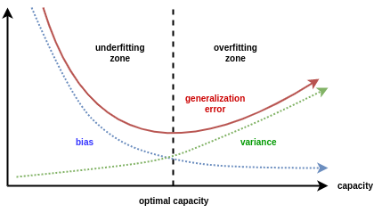

## Table of Contents

## What is a Generalization Curve in machine learning?

A Generalization Curve in machine learning shows how well a model can predict new data it hasn't seen before. It's a graph that plots the model's performance, usually accuracy or error rate, against the amount of training data used. As you add more training data, the model's performance on both the training data and new, unseen data (called validation data) is tracked. The goal is to see if the model can generalize well, meaning it can make good predictions on new data, not just the data it was trained on.

The shape of the Generalization Curve can tell us a lot about the model. Ideally, as you increase the amount of training data, the performance on both the training and validation data should improve. However, if the model starts to perform much better on the training data than on the validation data, it might be overfitting. This means the model is too focused on the training data and not good at predicting new data. On the other hand, if the performance on both sets of data is poor, the model might be underfitting, meaning it's too simple to capture the patterns in the data. By looking at the Generalization Curve, you can adjust the model to find the right balance and improve its ability to generalize.

## Why is the Generalization Curve important in machine learning?

The Generalization Curve is important in machine learning because it helps us understand how well a model can work with new data. When we train a model, we want it to not only do well on the data it was trained on but also on data it has never seen before. The Generalization Curve shows us this by plotting the model's performance on both the training data and new, unseen data as we increase the amount of training data. This helps us see if the model is learning the right things or if it's just memorizing the training data.

If the model's performance on the new data is much worse than on the training data, it might be overfitting. This means the model is too focused on the training data and won't work well in the real world. On the other hand, if the model's performance is poor on both sets of data, it might be underfitting, meaning it's too simple to capture the patterns in the data. By looking at the Generalization Curve, we can adjust the model to find the right balance and improve its ability to work with new data. This is crucial for making sure our models are useful and reliable in real-world situations.

## How does the Generalization Curve relate to overfitting and underfitting?

The Generalization Curve helps us see if our model is overfitting or underfitting by showing how well it works on both the training data and new data. If the model's performance on the new data is a lot worse than on the training data, it might be overfitting. This means the model is too focused on the training data and not good at predicting new data. Overfitting happens when the model is too complex and learns the noise in the training data instead of the real patterns. We can see this on the Generalization Curve as a big gap between the performance on the training data and the new data.

On the other hand, if the model's performance is bad on both the training data and the new data, it might be underfitting. This means the model is too simple to capture the patterns in the data. Underfitting happens when the model is not complex enough to learn the important features of the data. On the Generalization Curve, we can see this as low performance on both sets of data, with little to no gap between them. By looking at the Generalization Curve, we can adjust our model to find the right balance and make sure it can predict new data well.

## What are the typical components of a Generalization Curve?

A Generalization Curve usually has two main parts: the x-axis and the y-axis. The x-axis shows the amount of training data used to train the model. This can be the number of examples or the percentage of the total dataset. The y-axis shows how well the model is doing, often measured by accuracy or error rate. There are usually two lines on the curve: one for the training data and one for the validation data, which is new data the model hasn't seen during training.

These two lines help us see how the model is doing as we give it more data to learn from. The training line shows how well the model is doing on the data it was trained on. The validation line shows how well the model can predict new data. If the training line is much higher than the validation line, it means the model might be overfitting. If both lines are low, the model might be underfitting. By looking at how these lines change as we add more data, we can understand if our model is learning the right things or if we need to make changes to improve it.

## How can you plot a Generalization Curve?

To plot a Generalization Curve, you first need to split your data into a training set and a validation set. The training set is used to train your model, and the validation set is used to test how well your model can predict new data it hasn't seen before. As you train your model with increasing amounts of the training data, you measure its performance on both the training set and the validation set. This performance can be measured by accuracy, error rate, or any other relevant metric. You then plot these performance metrics against the amount of training data used, usually on the x-axis.

On the graph, the x-axis represents the amount of training data, which can be shown as the number of examples or the percentage of the total dataset. The y-axis shows the performance metric, like accuracy or error rate. You'll have two lines on the graph: one for the training data performance and one for the validation data performance. As you add more training data, you plot the performance of the model on both sets of data. This helps you see if the model is learning well or if it's overfitting or underfitting. By looking at the shape and the gap between the two lines, you can make adjustments to improve your model's ability to generalize to new data.

## What metrics are commonly used to evaluate the Generalization Curve?

The most common metrics used to evaluate the Generalization Curve are accuracy and error rate. Accuracy is how often the model's predictions are correct. It's usually shown as a percentage. For example, if a model gets 90 out of 100 predictions right, its accuracy is 90%. Error rate is the opposite of accuracy. It's how often the model's predictions are wrong, also shown as a percentage. If a model gets 10 out of 100 predictions wrong, its error rate is 10%. These metrics help us see if the model is learning well as we give it more data to train on.

Other metrics that can be used include mean squared error (MSE) and mean absolute error (MAE) for regression problems. MSE measures the average of the squares of the errors, which means it gives more weight to larger errors. The formula for MSE is $$ \text{MSE} = \frac{1}{n} \sum_{i=1}^{n} (y_i - \hat{y}_i)^2 $$, where $$ y_i $$ is the true value and $$ \hat{y}_i $$ is the predicted value. MAE, on the other hand, measures the average of the absolute errors, giving equal weight to all errors. The formula for MAE is $$ \text{MAE} = \frac{1}{n} \sum_{i=1}^{n} |y_i - \hat{y}_i| $$. These metrics help us understand how far off the model's predictions are from the true values, which is important for seeing how well the model generalizes to new data.

## How does the choice of model complexity affect the Generalization Curve?

The choice of model complexity has a big impact on the Generalization Curve. If a model is too simple, it might not be able to learn the patterns in the data well. This is called underfitting. On the Generalization Curve, an underfitting model will have low performance on both the training data and the new data. The lines for training and validation performance will be close together but low on the graph. This means the model isn't complex enough to capture the important features of the data, so it can't make good predictions, even on the data it was trained on.

On the other hand, if a model is too complex, it might learn the training data too well, including the random noise. This is called overfitting. On the Generalization Curve, an overfitting model will have high performance on the training data but much lower performance on the new data. The training line will be high on the graph, while the validation line will be lower, showing a big gap between them. This means the model is too focused on the training data and can't generalize well to new data. By choosing the right level of model complexity, we can find a balance where the model learns the important patterns without overfitting, leading to a better Generalization Curve where the training and validation lines are close together and high on the graph.

## Can you explain the bias-variance tradeoff in the context of the Generalization Curve?

The bias-variance tradeoff is all about finding the right balance when building a model. Bias is when a model is too simple and can't learn the patterns in the data well. This leads to underfitting, which you can see on the Generalization Curve as low performance on both the training and validation data. Variance is when a model is too complex and learns the noise in the training data instead of the real patterns. This leads to overfitting, which you can see on the Generalization Curve as a big gap between the high performance on the training data and the lower performance on the validation data.

By understanding the bias-variance tradeoff, we can adjust our model to improve its performance on the Generalization Curve. If the model has high bias, we need to make it more complex so it can learn the patterns better. This will move the lines on the Generalization Curve up, showing better performance on both the training and validation data. If the model has high variance, we need to make it simpler so it doesn't focus too much on the training data. This will bring the training and validation lines closer together on the Generalization Curve, showing that the model can generalize better to new data. The goal is to find the sweet spot where the model has just the right amount of complexity to learn the important patterns without overfitting.

## How do different machine learning algorithms impact the shape of the Generalization Curve?

Different [machine learning](/wiki/machine-learning) algorithms can create different shapes on the Generalization Curve because they learn from data in different ways. Simple algorithms like linear regression might have a Generalization Curve that shows underfitting, with low performance on both training and validation data. This is because linear regression can only learn simple, straight-line patterns. If the data has more complex patterns, linear regression won't be able to capture them well, leading to high bias. On the Generalization Curve, you'll see both the training and validation lines staying low as you add more data, showing that the model isn't learning the important patterns.

More complex algorithms like decision trees or neural networks might show overfitting on the Generalization Curve. These models can learn very complex patterns, including the noise in the training data. If a decision tree is too deep, it might fit the training data perfectly but do poorly on new data. This shows up on the Generalization Curve as a big gap between the training line, which is high, and the validation line, which is lower. This gap means the model has high variance because it's too focused on the training data and can't generalize well to new data. By choosing the right algorithm and tuning its complexity, you can find a balance that makes the Generalization Curve show good performance on both training and validation data.

## What techniques can be used to improve generalization as shown by the Generalization Curve?

To improve how well a model can predict new data, which is what the Generalization Curve shows, you can use a few different techniques. One way is to use more training data. When you have more data to train on, the model can learn more about the real patterns in the data instead of just the noise. This can help reduce overfitting, making the training and validation lines on the Generalization Curve closer together. Another technique is regularization. Regularization adds a penalty to the model's complexity, which can help prevent overfitting. For example, in linear regression, you might use L2 regularization, which adds a term to the loss function like $$ \text{Loss} = \text{MSE} + \lambda \sum_{i=1}^{n} \theta_i^2 $$, where $$ \lambda $$ is the regularization parameter and $$ \theta_i $$ are the model's parameters.

Another way to improve generalization is by using cross-validation. Cross-validation splits the data into different parts and trains the model on some parts while testing it on others. This helps you see how well the model can predict new data and can help you choose the right model complexity. You can also try different model architectures or hyperparameters. For example, in a [neural network](/wiki/neural-network), you might change the number of layers or the learning rate to find the best balance between bias and variance. By trying these techniques and looking at how they change the Generalization Curve, you can make your model better at predicting new data.

## How does the size and quality of the training data influence the Generalization Curve?

The size of the training data can really change how the Generalization Curve looks. If you have a lot of training data, the model can learn more about the real patterns in the data instead of just the noise. This can make the model better at predicting new data, which means the training and validation lines on the Generalization Curve will be closer together and higher up. But if you don't have enough data, the model might not learn the important patterns well, leading to overfitting. On the Generalization Curve, you'll see a big gap between the training line, which is high, and the validation line, which is lower. So, using more training data can help the model generalize better and make the Generalization Curve look better.

The quality of the training data also matters a lot for the Generalization Curve. If the data is clean and represents the real world well, the model can learn the right things and predict new data better. This will show up on the Generalization Curve as good performance on both the training and validation data. But if the data is noisy or not a good representation of the real world, the model might learn the wrong things, leading to overfitting or underfitting. On the Generalization Curve, you might see a big gap between the training and validation lines if the data is noisy, or low performance on both lines if the data doesn't represent the real world well. So, making sure your training data is high quality can help your model generalize better and improve the Generalization Curve.

## What advanced methods exist for analyzing and optimizing the Generalization Curve in deep learning models?

In [deep learning](/wiki/deep-learning), advanced methods like early stopping and learning rate scheduling can help analyze and optimize the Generalization Curve. Early stopping means you stop training the model when the performance on the validation data starts to get worse, even if the performance on the training data is still getting better. This helps prevent overfitting and keeps the training and validation lines on the Generalization Curve close together. Learning rate scheduling changes the learning rate during training, often starting with a high rate and then lowering it. This can help the model learn quickly at first and then fine-tune its predictions, making the Generalization Curve show better performance on new data.

Another advanced method is using techniques like dropout and batch normalization. Dropout randomly turns off some of the neurons in the neural network during training, which helps prevent overfitting by making the model less dependent on any single neuron. On the Generalization Curve, this can show up as better performance on the validation data because the model is more robust. Batch normalization normalizes the inputs to each layer, which can help the model learn faster and more stably. This can make the Generalization Curve smoother and show better generalization because the model can learn the important patterns in the data more effectively. By using these methods, you can make your deep learning model better at predicting new data and improve how the Generalization Curve looks.

## References & Further Reading

[1]: Bishop, C. M. (2006). ["Pattern Recognition and Machine Learning"](https://www.cs.uoi.gr/~arly/courses/ml/tmp/Bishop_book.pdf). Springer.

[2]: Goodfellow, I., Bengio, Y., & Courville, A. (2016). ["Deep Learning"](https://link.springer.com/article/10.1007/s10710-017-9314-z). MIT Press.

[3]: Hastie, T., Tibshirani, R., & Friedman, J. (2009). ["The Elements of Statistical Learning: Data Mining, Inference, and Prediction"](https://link.springer.com/book/10.1007/978-0-387-84858-7). Springer Science & Business Media.

[4]: Chollet, F. (2017). ["Deep Learning with Python"](https://www.manning.com/books/deep-learning-with-python). Manning Publications.

[5]: Mohri, M., Rostamizadeh, A., & Talwalkar, A. (2018). ["Foundations of Machine Learning"](https://cs.nyu.edu/~mohri/mlbook/). MIT Press.

[6]: Sutton, R. S., & Barto, A. G. (2018). ["Reinforcement Learning: An Introduction"](https://web.stanford.edu/class/psych209/Readings/SuttonBartoIPRLBook2ndEd.pdf). MIT Press.