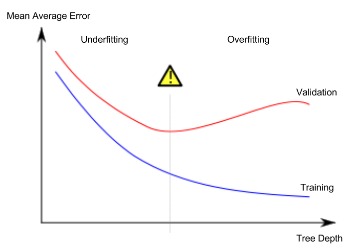

## Table of Contents

## What is generalization in the context of machine learning?

Generalization in machine learning refers to how well a model can accurately predict or classify new, unseen data after being trained on a specific dataset. It's like teaching a child to recognize different types of fruits. If you show them apples and oranges, and they can later identify a banana as a fruit, that's good generalization. The goal is for the model to learn the underlying patterns and rules from the training data, so it can apply them to new situations.

However, achieving good generalization can be challenging. If a model is too simple, it might not capture all the important patterns in the data, leading to underfitting. On the other hand, if a model is too complex, it might memorize the training data, including any noise or errors, which leads to overfitting. Overfitting means the model performs well on the training data but poorly on new data. To improve generalization, techniques like cross-validation, regularization, and using a diverse and large enough dataset are often employed.

## Why is generalization important in machine learning models?

Generalization is important in machine learning because it helps models work well with new data they haven't seen before. Imagine you're learning to ride a bike on a flat road. If you can only ride on flat roads and not on hills or rough paths, that's not very useful. A good bike rider can handle different types of roads. Similarly, a machine learning model that can generalize well can handle different kinds of data, making it more useful and reliable in real-world situations.

If a model can't generalize, it might do great on the data it was trained on but fail when faced with new data. This is like memorizing a script for a play but not being able to improvise if something unexpected happens. To make sure a model can generalize, we use techniques like splitting the data into training and testing sets, using regularization to prevent overfitting, and making sure the training data is diverse and large enough. This way, the model learns the general rules and patterns, not just the specifics of the training data.

## How does overfitting affect generalization?

Overfitting is when a [machine learning](/wiki/machine-learning) model learns the training data too well, including any mistakes or random patterns that are not important. This makes the model really good at predicting the training data but bad at predicting new data. It's like memorizing a whole book for a test but not understanding the main ideas. When the model sees new data, it can't use what it learned because it was too focused on the details of the training data.

This problem hurts the model's ability to generalize. Generalization is when a model can use what it learned from the training data to make good predictions on new data. If a model is overfitting, it won't be able to do this well. To fix overfitting, we can use techniques like regularization, which helps the model focus on the important patterns, or we can use more data to train the model so it sees more examples and learns the general rules better.

## What is the difference between training, validation, and test datasets in relation to generalization?

In machine learning, we use different sets of data to help a model learn and check how well it can generalize. The training dataset is used to teach the model. It's like a teacher showing a student many examples of math problems so the student can learn how to solve them. The model looks at the training data, tries to find patterns, and adjusts itself to make better predictions. If the model only sees the training data, it might get too good at it and start to overfit, meaning it won't work well on new problems.

To avoid overfitting and check how well the model can generalize, we use a validation dataset. This is a separate set of data that the model doesn't see during training. It's like giving the student a practice test to see if they can solve new math problems. The model uses the validation data to fine-tune its performance and adjust things like how complex it should be. This helps the model learn the general rules better, not just the specifics of the training data.

Finally, the test dataset is used to give a final, unbiased evaluation of how well the model can generalize. This set of data is kept completely separate from both the training and validation data. It's like the final exam for the student. The model has never seen this data before, so it's a true test of whether it can apply what it learned to new situations. By using these three types of datasets, we can train a model that not only does well on the data it was trained on but also performs well on new, unseen data.

## What are some common techniques used to improve model generalization?

To help a model generalize better, one common technique is using more data for training. The more examples a model sees, the better it can learn the general patterns that are important, instead of just memorizing the specific details of a smaller dataset. Another technique is regularization, which adds a penalty to the model for being too complex. This helps prevent overfitting by encouraging the model to focus on the most important patterns. There are different types of regularization, like L1 and L2, which work a bit differently but both aim to keep the model simple enough to generalize well.

Another important technique is cross-validation. This involves splitting the data into smaller parts and training the model multiple times, each time using a different part of the data for validation. This helps make sure the model's performance is consistent across different subsets of the data, which is a good sign that it can generalize well. Additionally, using techniques like [data augmentation](/wiki/data-augmentation) can help by creating new training examples from the existing data, like flipping images or adding noise to audio, which helps the model learn to handle different variations of the same data.

Finally, choosing the right model complexity is crucial. If a model is too simple, it might not capture all the important patterns in the data, leading to underfitting. On the other hand, if a model is too complex, it might memorize the training data, including any noise or errors, which leads to overfitting. Techniques like pruning in decision trees or dropout in neural networks help control model complexity and improve generalization. By balancing these techniques, we can train models that not only perform well on the training data but also on new, unseen data.

## How does the bias-variance tradeoff relate to generalization?

The bias-variance tradeoff is a key concept in machine learning that directly impacts how well a model can generalize. Bias refers to the error introduced by approximating a real-world problem with a simplified model. If a model has high bias, it might be too simple and miss important patterns in the data, leading to underfitting. On the other hand, variance refers to the error introduced by sensitivity to small fluctuations in the training data. A model with high variance might fit the training data too closely, including noise and errors, leading to overfitting. The tradeoff comes from the fact that reducing bias often increases variance, and vice versa. To achieve good generalization, we need to find the right balance between these two types of errors.

To visualize this, imagine a model's performance as a target. Bias is like shooting arrows that consistently miss the center but land in the same spot. Variance is like shooting arrows that land all over the place but might get close to the center by chance. A good model should aim for low bias and low variance, hitting close to the center consistently. In mathematical terms, the total error of a model can be expressed as $$ \text{Total Error} = \text{Bias}^2 + \text{Variance} + \text{Irreducible Error} $$. The irreducible error is the noise inherent in any real-world data that no model can predict perfectly. By understanding and managing the bias-variance tradeoff, we can train models that generalize well to new, unseen data.

## Can you explain the concept of cross-validation and its role in assessing generalization?

Cross-validation is a technique used in machine learning to check how well a model can generalize to new data. It works by splitting the available data into smaller parts, called folds. The model is trained on all but one of these folds and then tested on the remaining fold. This process is repeated multiple times, with each fold getting a turn as the test set. This way, every piece of data gets used for both training and testing, giving a more reliable estimate of how the model will perform on new, unseen data.

By using cross-validation, we can get a better idea of a model's ability to generalize because it helps us see how well the model performs across different subsets of the data. If a model performs well on all the folds, it's a good sign that it has learned the general patterns and not just memorized the training data. This technique helps us avoid overfitting and choose the best model or the best settings for our model, making it more likely to work well when we use it in the real world.

## What are regularization techniques and how do they help with generalization?

Regularization techniques are methods used in machine learning to prevent a model from overfitting. Overfitting happens when a model learns the training data too well, including the noise and errors, and can't perform well on new data. Regularization helps by adding a penalty to the model's complexity. This penalty encourages the model to be simpler, which means it focuses on the most important patterns in the data rather than memorizing every detail. Two common types of regularization are L1 and L2. L1 regularization, also known as Lasso, adds a penalty equal to the absolute value of the model's parameters, which can lead to some parameters becoming zero. L2 regularization, or Ridge, adds a penalty equal to the square of the model's parameters, which tends to shrink all parameters towards zero but doesn't usually make them exactly zero.

By using regularization, we help the model generalize better to new data. For example, in L2 regularization, the penalty term added to the loss function is $$ \alpha \sum_{i=1}^{n} \theta_i^2 $$, where $$ \alpha $$ is the regularization parameter and $$ \theta_i $$ are the model's parameters. This term discourages the model from having large parameter values, which keeps the model from fitting the training data too closely. In practice, choosing the right amount of regularization is important. If the regularization is too strong, the model might become too simple and underfit the data. But if it's just right, the model will be able to learn the general patterns from the training data and perform well on new data, which is the goal of good generalization.

## How does the choice of model complexity impact generalization?

The choice of model complexity has a big impact on how well a model can generalize to new data. If a model is too simple, it might not be able to learn all the important patterns in the data. This is called underfitting. For example, if you try to fit a straight line to data that has a curve, the line won't capture the curve's shape, and it won't predict new data well. On the other hand, if a model is too complex, it might learn the training data too well, including any mistakes or random patterns that aren't important. This is called overfitting. An overfit model might do great on the training data but fail when it sees new data because it focused too much on the details of the training data.

To find the right balance, we use techniques like regularization and cross-validation. Regularization adds a penalty to the model's complexity, which helps it focus on the important patterns and not overfit. For example, L2 regularization adds a penalty term $$ \alpha \sum_{i=1}^{n} \theta_i^2 $$ to the loss function, where $$ \alpha $$ is the regularization parameter and $$ \theta_i $$ are the model's parameters. This term encourages smaller parameter values, which helps the model generalize better. Cross-validation helps us check the model's performance on different subsets of the data, making sure it can handle new data well. By carefully choosing the model's complexity and using these techniques, we can train models that generalize well and work effectively on new, unseen data.

## What role do feature selection and dimensionality reduction play in improving generalization?

Feature selection and dimensionality reduction are important techniques that help improve how well a machine learning model can generalize to new data. Feature selection involves choosing only the most important pieces of information, or features, from the data to use in the model. By using fewer features, we make the model simpler and less likely to overfit. Overfitting happens when a model learns the training data too well, including any mistakes or random patterns, and can't perform well on new data. By selecting the right features, we help the model focus on what's really important, which makes it better at predicting new data.

Dimensionality reduction is another way to simplify the data and help with generalization. It works by transforming the data into a lower-dimensional space while trying to keep as much important information as possible. For example, Principal Component Analysis (PCA) is a common technique that reduces the number of features by creating new ones that are combinations of the original features. This can make the data easier to work with and help the model avoid overfitting. By reducing the complexity of the data, dimensionality reduction helps the model learn the general patterns better, which leads to better performance on new, unseen data.

## How can ensemble methods enhance the generalization of machine learning models?

Ensemble methods help machine learning models generalize better by combining the predictions of multiple models. Imagine you have a group of friends, and each friend is good at different things. If you ask them all to help you with a problem, you might get a better answer than if you just asked one friend. In the same way, ensemble methods take the predictions from several models and combine them, often leading to better results on new data. This is because different models might make different kinds of mistakes, and by combining them, the ensemble can often cancel out those mistakes and focus on the correct predictions.

There are different types of ensemble methods, like bagging and boosting. Bagging, or Bootstrap Aggregating, involves training multiple models on different subsets of the data and then averaging their predictions. A popular example of bagging is Random Forests, which combine the predictions of many decision trees. Boosting, on the other hand, trains models one after another, with each new model focusing on the mistakes made by the previous ones. A well-known boosting method is Gradient Boosting, which builds models in a sequence to minimize the errors of the combined model. Both bagging and boosting help models generalize better by reducing overfitting and improving the overall accuracy on new, unseen data.

## What advanced metrics can be used to evaluate the generalization performance of a model?

To evaluate how well a model can generalize to new data, we can use advanced metrics like the Area Under the Receiver Operating Characteristic Curve (AUC-ROC) and the Area Under the Precision-Recall Curve (AUC-PR). The AUC-ROC measures how well a model can distinguish between positive and negative classes across different thresholds. A higher AUC-ROC value means the model is better at telling the difference between the classes, which is a good sign of good generalization. The AUC-PR is useful when the classes are imbalanced, meaning one class has a lot more examples than the other. It focuses on the model's ability to find all the positive examples while keeping the number of false positives low. Both of these metrics give us a more complete picture of how well the model will work on new data.

Another useful metric is the Mean Absolute Error (MAE) or the Root Mean Squared Error (RMSE) for regression problems. These metrics measure how far off the model's predictions are from the actual values. The MAE is the average of the absolute differences between predictions and actual values, while the RMSE is the square root of the average of the squared differences. Both give us a sense of how well the model generalizes, but RMSE puts more weight on larger errors. For example, the formulas for these metrics are $$ \text{MAE} = \frac{1}{n} \sum_{i=1}^{n} |y_i - \hat{y}_i| $$ and $$ \text{RMSE} = \sqrt{\frac{1}{n} \sum_{i=1}^{n} (y_i - \hat{y}_i)^2} $$, where $y_i$ is the actual value, $\hat{y}_i$ is the predicted value, and $n$ is the number of samples. By using these advanced metrics, we can better understand and improve a model's ability to generalize to new, unseen data.

## References & Further Reading

[1]: Goodfellow, I., Bengio, Y., & Courville, A. (2016). ["Deep Learning."](https://link.springer.com/article/10.1007/s10710-017-9314-z) MIT Press.

[2]: Bishop, C. M. (2006). ["Pattern Recognition and Machine Learning."](https://www.cs.uoi.gr/~arly/courses/ml/tmp/Bishop_book.pdf) Springer.

[3]: Ng, A. Y. (2004). ["Feature selection, L1 vs. L2 regularization, and rotational invariance."](https://dl.acm.org/doi/10.1145/1015330.1015435) Proceedings of the twenty-first International Conference on Machine Learning.

[4]: Hastie, T., Tibshirani, R., & Friedman, J. (2009). ["The Elements of Statistical Learning: Data Mining, Inference, and Prediction."](https://link.springer.com/book/10.1007/978-0-387-84858-7) Springer.

[5]: Friedman, J., Hastie, T., & Tibshirani, R. (2001). ["The Elements of Statistical Learning: Data Mining, Inference, and Prediction."](https://link.springer.com/book/10.1007/978-0-387-84858-7) Springer.