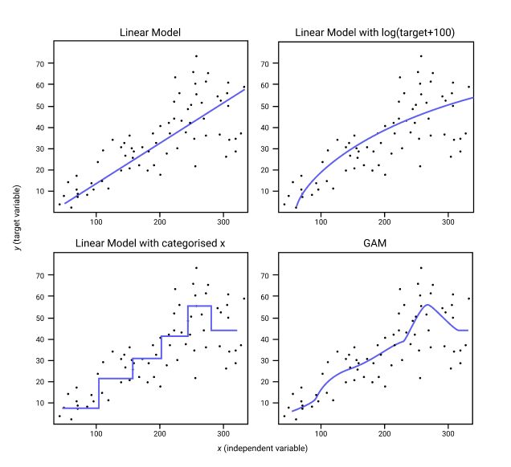

## Table of Contents

## What is a Generalized Additive Model (GAM) and how does it differ from traditional linear models?

A Generalized Additive Model (GAM) is a type of statistical model that allows you to understand how different factors affect an outcome in a more flexible way compared to traditional linear models. In a traditional linear model, you assume that the relationship between each predictor and the outcome is a straight line. For example, if you're looking at how much exercise affects weight loss, a linear model would assume that every additional hour of exercise leads to the same amount of weight loss. In contrast, a GAM allows each predictor to have a more complex, non-linear relationship with the outcome. This means that the effect of exercise on weight loss could increase, decrease, or change in other ways as the amount of exercise changes.

The key difference between GAMs and traditional linear models lies in how they represent the relationships between predictors and the outcome. In a linear model, the relationship is represented by a simple equation like $$y = \beta_0 + \beta_1 x_1 + \beta_2 x_2 + ... + \beta_n x_n$$. Here, each $$\beta$$ is a coefficient that determines how much each predictor $$x$$ affects the outcome $$y$$. In a GAM, the relationship is represented by a sum of smooth functions, like $$y = \beta_0 + f_1(x_1) + f_2(x_2) + ... + f_n(x_n)$$. Each function $$f$$ can take on a non-linear shape that best fits the data, allowing for more accurate modeling of complex relationships. This flexibility makes GAMs particularly useful in situations where the true relationships between variables are not straightforward.

## How do GAMs incorporate non-linear relationships between predictors and the response variable?

Generalized Additive Models (GAMs) incorporate non-linear relationships by allowing each predictor to have its own smooth function that best fits the data. Instead of assuming a straight line like in traditional linear models, GAMs use these smooth functions to capture how the relationship between a predictor and the response variable might change in a more complex way. For example, if you're looking at how temperature affects ice cream sales, a GAM can show that sales increase rapidly at first as temperature rises, but then level off or even decrease if it gets too hot.

In a GAM, the relationship between the predictors and the response variable is represented by the equation $$y = \beta_0 + f_1(x_1) + f_2(x_2) + ... + f_n(x_n)$$. Here, $$f_1, f_2, ..., f_n$$ are smooth functions that can take on various shapes to best represent the data. These functions are typically estimated using techniques like splines or other smoothing methods, which help the model adapt to the non-linear patterns in the data. This flexibility makes GAMs a powerful tool for understanding complex relationships in data without forcing them into a linear framework.

## What are the basic components of a GAM and how are they represented mathematically?

A Generalized Additive Model (GAM) is made up of a few key parts. The first part is the intercept, which is a starting value for the model. This is represented by $$\beta_0$$ in the equation. The second part is the set of smooth functions, one for each predictor. These functions are what allow the model to capture non-linear relationships. Each function, like $$f_1(x_1)$$, $$f_2(x_2)$$, and so on, represents how a specific predictor affects the outcome in a flexible way.

The whole model is put together by adding up the intercept and all the smooth functions. So, the full equation for a GAM looks like this: $$y = \beta_0 + f_1(x_1) + f_2(x_2) + ... + f_n(x_n)$$. Here, $$y$$ is the outcome you're trying to predict, and each $$x$$ is a predictor. The smooth functions $$f$$ are usually estimated using methods like splines, which help the model fit the data without making it too complicated. This way, GAMs can show how each predictor affects the outcome in a way that's more accurate than just using straight lines.

## Can you explain the concept of smooth functions in the context of GAMs?

In Generalized Additive Models (GAMs), smooth functions are used to show how each predictor affects the outcome in a flexible way. Instead of using a straight line like in regular linear models, smooth functions can curve and bend to fit the data better. They help the model capture non-linear patterns, which means they can show how the effect of a predictor changes as its value changes. For example, if you're looking at how temperature affects ice cream sales, a smooth function can show that sales go up quickly at first as it gets warmer, but then they might level off or even drop if it gets too hot.

These smooth functions are usually estimated using methods like splines. Splines are a way to draw a smooth curve through a set of points, and they help make sure the curve fits the data well without getting too complicated. In a GAM, each predictor gets its own smooth function, and all these functions are added together to make the final model. So, the equation for a GAM looks like $$y = \beta_0 + f_1(x_1) + f_2(x_2) + ... + f_n(x_n)$$, where $$y$$ is the outcome, $$\beta_0$$ is the starting value, and each $$f_i(x_i)$$ is a smooth function for a predictor. This way, GAMs can show how each predictor affects the outcome in a way that's more accurate than just using straight lines.

## How does one select the appropriate smoothing parameters in a GAM?

Choosing the right smoothing parameters in a Generalized Additive Model (GAM) is important to make sure the model fits the data well without being too complicated. These parameters control how wiggly or smooth the functions in the model are. If the functions are too wiggly, they might fit the data too closely and not be good at predicting new data. If they're too smooth, they might miss important patterns in the data. The goal is to find a balance that captures the true relationships in the data without overfitting.

One common way to choose the smoothing parameters is by using cross-validation. This method involves splitting the data into parts, using some parts to fit the model, and then checking how well the model predicts the other parts. By trying different levels of smoothing and seeing which one works best, you can find the best parameters. Another approach is to use something called the Generalized Cross-Validation (GCV) score. The GCV score helps find a good balance between how well the model fits the data and how simple it is. This can be done automatically in many software packages that fit GAMs, like R's `mgcv` package, which uses these methods to choose the smoothing parameters for you.

In practice, you might use a tool like R's `mgcv` package to fit a GAM and let it choose the smoothing parameters for you. For example, you could write code like this to fit a GAM with automatic smoothing parameter selection:

```R
library(mgcv)
model <- gam(y ~ s(x1) + s(x2), data = your_data)
summary(model)
```

In this code, `s(x1)` and `s(x2)` tell the model to use smooth functions for the predictors `x1` and `x2`. The `gam` function will automatically choose the best smoothing parameters to fit the data well.

## What are some common types of basis functions used in GAMs?

In Generalized Additive Models (GAMs), basis functions are used to create the smooth functions that capture the relationship between predictors and the outcome. One common type of basis function is the cubic regression spline. These splines work by fitting a series of cubic polynomials that connect at points called knots. The placement and number of these knots affect how flexible the smooth function can be. For example, if you have a predictor called `temperature`, a cubic regression spline might look like $$f(temperature) = \sum_{i=1}^{k} \beta_i B_i(temperature)$$, where $$B_i$$ are the basis functions and $$k$$ is the number of basis functions used.

Another type of basis function used in GAMs is the thin plate regression spline. These are especially useful for modeling data in more than one dimension. Thin plate splines minimize a measure of roughness, which helps keep the smooth function from being too wiggly. They're often used when you have predictors that might interact with each other in complex ways. For instance, if you're looking at how both `temperature` and `humidity` affect `ice_cream_sales`, a thin plate regression spline might be used to model this relationship as $$f(temperature, humidity) = \sum_{i=1}^{k} \beta_i B_i(temperature, humidity)$$.

A third type of basis function is the P-spline, or penalized B-spline. P-splines combine B-splines with a penalty that helps control the smoothness of the function. This penalty discourages the function from being too wiggly, which can help prevent overfitting. P-splines are versatile and can be used in many different situations. In R, you could use P-splines in a GAM like this:

```R
library(mgcv)
model <- gam(ice_cream_sales ~ s(temperature, bs = "ps") + s(humidity, bs = "ps"), data = your_data)
summary(model)
```

In this code, `bs = "ps"` tells the `s()` function to use P-splines for the smooth terms.

## How do Neural Additive Models (NAM) extend the concept of GAMs?

Neural Additive Models (NAM) build on the idea of Generalized Additive Models (GAM) by using neural networks to create the smooth functions for each predictor. In a GAM, the relationship between a predictor and the outcome is shown by a smooth function, like $$y = \beta_0 + f_1(x_1) + f_2(x_2) + ... + f_n(x_n)$$. NAMs take this a step further by using small neural networks instead of traditional smooth functions like splines. This allows NAMs to capture even more complex patterns in the data because neural networks can learn very flexible relationships.

NAMs keep the additive structure of GAMs, meaning they still add up the effects of each predictor to get the final outcome. But, by using neural networks, NAMs can handle non-linear relationships in a way that's often more powerful than the smooth functions used in GAMs. This makes NAMs useful for situations where the relationships between predictors and the outcome are very complicated and hard to capture with simpler models.

## What is base boosting and how is it applied to improve GAM performance?

Base boosting is a way to make Generalized Additive Models (GAMs) work better. It's like giving the model a step-by-step boost to fit the data more accurately. In base boosting, you start with a simple model and then slowly add more complex parts to it. Each time you add a new part, you check how much it helps the model fit the data better. This process keeps going until the model fits the data well without becoming too complicated.

In a GAM, base boosting helps by gradually building up the smooth functions that represent how each predictor affects the outcome. For example, if you're looking at how temperature affects ice cream sales, base boosting would start with a simple guess and then add small adjustments to capture the relationship more accurately. The formula for a boosted GAM might look like $$y = \beta_0 + \sum_{m=1}^{M} \nu f_m(x)$$, where $$f_m(x)$$ are the smooth functions added in each boosting step, and $$\nu$$ is a small number that controls how much each new function contributes. This way, base boosting helps the model learn the right shape of the relationship between predictors and the outcome without overfitting.

## How can one interpret the results of a fitted GAM?

Interpreting the results of a fitted Generalized Additive Model (GAM) involves understanding both the overall model fit and the individual effects of each predictor. The summary of a GAM usually includes an intercept, which is the starting value of the model, and the smooth functions for each predictor. These smooth functions show how each predictor affects the outcome in a non-linear way. For example, if you're looking at how temperature affects ice cream sales, the smooth function for temperature might show that sales increase rapidly at first as it gets warmer, but then they might level off or even decrease if it gets too hot. You can see these effects by looking at the plots of the smooth functions, which help you understand how the relationship between a predictor and the outcome changes.

The summary also provides [statistics](/wiki/bayesian-statistics) like the degrees of freedom (edf) for each smooth function. The edf tells you how wiggly the smooth function is. A higher edf means the function is more complex and can capture more detailed patterns in the data. For example, if the edf for the temperature predictor is high, it means the model found a complex relationship between temperature and ice cream sales. Additionally, the summary includes p-values that tell you if the smooth function for a predictor is important for explaining the outcome. If the p-value is low, it means the predictor has a significant effect on the outcome. By looking at these details, you can get a good sense of how well the model fits the data and which predictors are most important.

## What are the advantages of using GAMs over other machine learning models for certain types of data?

Generalized Additive Models (GAMs) have some special advantages when you want to understand how different things affect your outcome in a clear way. They let you see how each predictor changes the outcome without making everything too complicated. For example, if you're looking at how temperature affects ice cream sales, a GAM can show you exactly how sales go up or down as it gets warmer or cooler. This is because GAMs use smooth functions for each predictor, like $$y = \beta_0 + f_1(x_1) + f_2(x_2) + ... + f_n(x_n)$$, where each $$f_i(x_i)$$ is a curve that fits the data well. This makes it easy to explain to others how each [factor](/wiki/factor-investing) works because you can show them the curves.

Another big advantage of GAMs is that they are good at handling data where the relationships between predictors and the outcome aren't straight lines. Many other models, like regular linear models, assume that the effect of a predictor is the same no matter what its value is. But in real life, things often don't work that way. For instance, if you're studying how much exercise affects weight loss, the effect might be bigger at first and then get smaller as you exercise more. GAMs can capture these kinds of changes easily, making them a great choice when you're dealing with data that has these non-linear patterns.

## How do you handle overfitting in GAMs, and what techniques can be used to prevent it?

Overfitting in Generalized Additive Models (GAMs) happens when the model fits the data too closely and misses the bigger picture. This can make the model good at explaining what's already happened but bad at predicting new things. To stop this from happening, you need to make sure the model isn't too complicated. One way to do this is by choosing the right amount of smoothing for the smooth functions. If the functions are too wiggly, they might fit the data too closely and cause overfitting.

One technique to prevent overfitting in GAMs is to use cross-validation. This means you split your data into parts, use some parts to fit the model, and then check how well it predicts the other parts. By trying different levels of smoothing and seeing which one works best, you can find the right balance. Another way is to use something called the Generalized Cross-Validation (GCV) score. The GCV score helps you find a good balance between how well the model fits the data and how simple it is. Many software packages, like R's `mgcv` package, can do this automatically for you. For example, you could use the following code to fit a GAM and let it choose the smoothing parameters to avoid overfitting:

```R
library(mgcv)
model <- gam(y ~ s(x1) + s(x2), data = your_data)
summary(model)
```

In this code, `s(x1)` and `s(x2)` tell the model to use smooth functions for the predictors `x1` and `x2`. The `gam` function will automatically choose the best smoothing parameters to fit the data well without overfitting.

## What are some advanced techniques for extending GAMs, such as interactions between smooth terms?

One advanced way to make Generalized Additive Models (GAMs) even better is by adding interactions between smooth terms. In a regular GAM, each predictor gets its own smooth function, like $$y = \beta_0 + f_1(x_1) + f_2(x_2) + ... + f_n(x_n)$$. But sometimes, how one predictor affects the outcome can change depending on another predictor. For example, if you're looking at how temperature and humidity affect ice cream sales, the effect of temperature might be different when it's really humid compared to when it's dry. To handle this, you can add a smooth term that captures the interaction between two predictors, like $$f_{1,2}(x_1, x_2)$$. This lets the model show how the effect of one predictor changes with different values of another predictor, making the model more accurate and flexible.

In R's `mgcv` package, you can include interactions between smooth terms using the `ti()` function, which stands for tensor product interaction. For example, if you want to see how temperature and humidity together affect ice cream sales, you could use the following code to fit a GAM with an interaction term:

```R
library(mgcv)
model <- gam(ice_cream_sales ~ s(temperature) + s(humidity) + ti(temperature, humidity), data = your_data)
summary(model)
```

In this code, `s(temperature)` and `s(humidity)` are the smooth functions for each predictor, and `ti(temperature, humidity)` is the interaction term. This way, the model can capture how the effect of temperature on ice cream sales changes with different levels of humidity, giving you a more detailed understanding of the data.