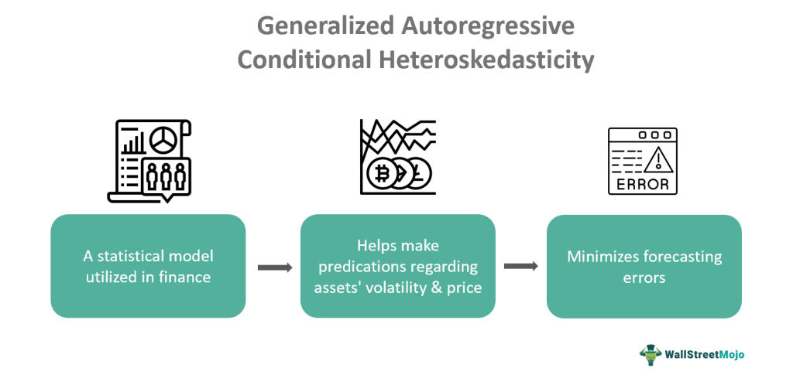

## Table of Contents

## What is the basic concept of volatility in financial markets?

Volatility in financial markets refers to how much and how quickly the price of an asset, like a stock or a currency, changes over time. If the price of an asset moves up and down a lot in a short period, we say it has high volatility. On the other hand, if the price stays pretty stable without big swings, it has low volatility. Think of it like the weather: a volatile market is like a stormy day with sudden changes, while a stable market is like a calm, sunny day.

Understanding volatility is important for investors because it helps them gauge the risk of their investments. High volatility can mean higher potential returns, but it also comes with a greater chance of losing money. For example, if you invest in a stock with high volatility, the price might go up a lot, but it could also drop suddenly. On the other hand, investing in something with low volatility might not offer big gains, but it's usually safer because the price doesn't change as dramatically.

## What is heteroskedasticity and why is it important in time series analysis?

Heteroskedasticity is a term used in statistics that means the variability of a variable is not constant over time. In simpler terms, it means that the spread or dispersion of data points changes at different points in a time series. Imagine you're looking at the monthly sales of ice cream. In the summer, sales might jump around a lot because of the heat, but in the winter, they might stay pretty steady. That's heteroskedasticity – the ups and downs in sales are bigger in some months than others.

This concept is important in time series analysis because it can affect how we make predictions and understand data. If we ignore heteroskedasticity, our statistical models might give us wrong or misleading results. For example, if we're trying to predict future ice cream sales, a model that doesn't account for the bigger swings in summer might underestimate how much ice cream we need to have in stock. By recognizing and dealing with heteroskedasticity, we can build better models that give us more accurate predictions and help us make smarter decisions.

## What is the Autoregressive Conditional Heteroskedasticity (ARCH) model and how does it address heteroskedasticity?

The Autoregressive Conditional Heteroskedasticity (ARCH) model is a way to deal with changing variability in time series data. It was created by Robert Engle in the early 1980s. The main idea behind the ARCH model is that the variability of a time series can depend on what happened in the past. For example, if the stock market had big swings yesterday, it might have big swings today too. The ARCH model looks at past data to predict how much the data might change in the future.

The ARCH model helps address heteroskedasticity by allowing the variance of the errors (the difference between the actual data and the model's prediction) to change over time. Instead of assuming that the errors always have the same size, the ARCH model says that the size of the errors can be influenced by past errors. This makes the model more flexible and better at capturing the ups and downs in the data. By using the ARCH model, we can get a better understanding of how the variability in our data changes and make more accurate predictions.

## How does the GARCH model extend the ARCH model, and what are its key components?

The GARCH model, which stands for Generalized Autoregressive Conditional Heteroskedasticity, is an extension of the ARCH model. It was developed by Tim Bollerslev in 1986 to make the ARCH model more flexible and better at handling the changing variability in time series data. While the ARCH model looks only at past errors to predict future variability, the GARCH model also considers how the variability itself has changed over time. This means that the GARCH model can capture longer-term patterns in the data's ups and downs, making it more useful for a wider range of situations.

The key components of the GARCH model are the autoregressive part and the moving average part. The autoregressive part is similar to the ARCH model, where the model looks at past errors to predict future variability. The moving average part, on the other hand, looks at how the variability itself has changed over time. By combining these two parts, the GARCH model can better predict how much the data might change in the future. This makes it a powerful tool for understanding and forecasting the volatility in financial markets, weather patterns, and many other types of time series data.

## What are the mathematical formulations of the GARCH(p, q) model?

The GARCH(p, q) model is a way to predict how much a time series might change in the future. It has two main parts: the "p" part looks at past errors, and the "q" part looks at how the variability itself has changed over time. The model says that the variance at time t, which we call σ²_t, depends on past errors (ε²) and past variances (σ²). The formula for the GARCH(p, q) model is: σ²_t = ω + α₁ε²_(t-1) + α₂ε²_(t-2) + ... + α_qε²_(t-q) + β₁σ²_(t-1) + β₂σ²_(t-2) + ... + β_pσ²_(t-p). Here, ω is a constant, α's are the weights for past errors, and β's are the weights for past variances.

In simple terms, the GARCH model says that today's variability depends on how much the data jumped around in the recent past and how much it has been changing over time. The α's tell us how important the recent jumps are, and the β's tell us how important the past variability is. By choosing the right values for p and q, and the right weights for α and β, we can make a model that fits our data well and helps us predict future changes.

## How do you estimate the parameters of a GARCH model?

To estimate the parameters of a GARCH model, we usually use a method called maximum likelihood estimation (MLE). This method tries to find the values of the parameters (like ω, α, and β) that make the model fit the data as well as possible. We start by guessing some values for these parameters, then we use a computer to change these guesses little by little until we find the values that make the model work best. This process can be a bit tricky because there are many parameters to adjust, and we need to make sure the model stays stable and makes sense.

Once we have our estimated parameters, we need to check if they are good enough. We do this by looking at how well the model fits the data and by doing some statistical tests. For example, we might use a test called the Ljung-Box test to see if there are any patterns left in the data that the model didn't catch. If the model fits well and passes these tests, we can feel more confident that our GARCH model is doing a good job of predicting how much the data might change in the future.

## What are the common diagnostic tests used to validate a GARCH model?

After estimating the parameters of a GARCH model, we need to check if it's doing a good job. One common test is the Ljung-Box test, which helps us see if there are any patterns left in the data that the model didn't catch. If the test shows that there are still patterns, it means our model might need to be tweaked. Another test we use is the ARCH-LM test, which checks if the model has properly accounted for the changing variability in the data. If this test shows that there's still some variability that the model didn't capture, we might need to adjust the model or try a different one.

We also look at the residuals, which are the differences between the actual data and what the model predicted. If the residuals look random and don't show any patterns, it's a good sign that our model is working well. We can plot these residuals to see if they look like white noise, which means they're just random ups and downs without any clear pattern. If we see any patterns in the residuals, it might mean our model needs to be improved. By using these tests and looking at the residuals, we can make sure our GARCH model is giving us reliable predictions about how much the data might change in the future.

## How can GARCH models be applied in financial risk management and forecasting?

GARCH models are really helpful for people who work in finance, especially when they need to manage risks and make predictions about the future. Imagine you're in charge of a big investment fund, and you need to figure out how much money to set aside just in case the market takes a wild swing. A GARCH model can help you predict how much the market might jump around in the future by looking at how it has moved in the past. This helps you decide how much risk you're willing to take and how much money you need to keep safe to cover any unexpected losses.

These models are also great for forecasting how much a stock or a currency might change in value. If you're a trader trying to guess what the price of a stock will do next week, you can use a GARCH model to see how much the price has been moving lately. By understanding this, you can make smarter bets on whether the price will go up or down. This can help you make better trading decisions and maybe even make more money. So, GARCH models are like a crystal ball for finance professionals, helping them see and prepare for the future a bit better.

## What are the limitations and potential pitfalls of using GARCH models?

Using GARCH models can be tricky because they have some limitations. One big problem is that they can be hard to set up right. You need to pick the right numbers for the model, and if you get them wrong, your predictions might not be very good. Also, GARCH models assume that the way the data changes stays the same over time, but in real life, things can change a lot. If the market starts behaving differently than it used to, the model might not work as well anymore.

Another issue is that GARCH models can be sensitive to the data you use. If you have a lot of data, the model might work well, but if you don't have enough, it might give you bad predictions. Plus, these models can be complicated to understand and use, so you might need a lot of math skills or a good computer program to help you. If you're not careful, you might end up trusting the model too much and making bad decisions based on its predictions.

## How do different variants of GARCH models (e.g., EGARCH, TGARCH) address specific issues in volatility modeling?

Different versions of GARCH models, like EGARCH and TGARCH, help fix some problems that the regular GARCH model can have. For example, the regular GARCH model treats good news and bad news the same way when it comes to how much the market might jump around. But in real life, bad news often makes the market move more than good news. The EGARCH model, which stands for Exponential GARCH, takes this into account. It looks at whether the news is good or bad and changes how it predicts the market's ups and downs based on that. This makes the EGARCH model better at handling situations where bad news causes bigger swings in the market.

Another version, called TGARCH or Threshold GARCH, also deals with the idea that bad news can affect the market differently than good news. The TGARCH model has a special part that kicks in when the market goes down a lot, making it more sensitive to big drops. This helps the model predict how much the market might change when there's a big drop, which is something the regular GARCH model might miss. By using these different versions of GARCH models, people can get a better understanding of how the market might move, especially when things get tough.

## What advanced techniques can be used to improve the performance of GARCH models?

One way to make GARCH models work better is by using something called machine learning. Machine learning is like teaching a computer to learn from data and get better at making predictions over time. By combining GARCH models with machine learning, we can let the computer figure out the best way to predict how much the market might jump around. This can help the model adapt to new situations and give us more accurate predictions. For example, we can use a type of machine learning called neural networks to help the GARCH model learn from past data and make better guesses about the future.

Another advanced technique is to use something called regime-switching models. These models can switch between different ways of predicting the market's ups and downs, depending on what's happening. For example, the market might act differently during a big economic crisis than it does during normal times. A regime-switching GARCH model can switch between a model for normal times and a model for crisis times, making its predictions more accurate. By using these advanced techniques, we can make our GARCH models smarter and better at helping us understand and predict how much the market might change in the future.

## How do GARCH models integrate with other econometric models for more comprehensive analysis?

GARCH models can be combined with other econometric models to give us a fuller picture of what's happening in the market. For example, we might use a GARCH model together with an ARIMA model, which is good at predicting the actual values of things like stock prices. The ARIMA model can help us guess where the price might go next, while the GARCH model can tell us how much the price might jump around. By using both models together, we can get a better idea of both the direction and the volatility of the market, which helps us make smarter decisions.

Another way to use GARCH models with other models is by combining them with vector autoregression (VAR) models. VAR models look at how different things in the economy, like interest rates and stock prices, affect each other. When we add a GARCH model to a VAR model, we can see not just how these things are connected, but also how much they might change over time. This can be really helpful for understanding how different parts of the economy might move together and how much risk we might face. By putting GARCH models together with other econometric models, we can get a more complete and accurate view of the financial world.

## What are GARCH Models and how do we understand them?

Generalized Autoregressive Conditional Heteroskedasticity (GARCH) models are instrumental in the analysis of time-series data, particularly for predicting [volatility](/wiki/volatility-trading-strategies) in financial markets. These models are based on the premise that financial time series, such as stock returns, exhibit volatility clustering—a phenomenon where large changes tend to be followed by large changes, regardless of sign, and small changes tend to be followed by small changes.

The GARCH model builds upon the Autoregressive Conditional Heteroskedasticity (ARCH) model proposed by Robert Engle in 1982. The ARCH model was designed to model time-dependent volatility using past error terms. However, to capture more extensive volatility patterns, the GARCH model incorporates a moving average component. This allows it to efficiently model and predict both short and long-term volatility dynamics by considering both past squared observations and past variances.

Mathematically, the GARCH(p, q) model can be expressed as follows:

$$
\sigma_t^2 = \alpha_0 + \sum_{i=1}^{p} \alpha_i \epsilon_{t-i}^2 + \sum_{j=1}^{q} \beta_j \sigma_{t-j}^2
$$

where:
- $\sigma_t^2$ is the conditional variance at time $t$.
- $\alpha_0$, $\alpha_i$, and $\beta_j$ are the parameters of the model.
- $\epsilon_{t-i}^2$ represents the past squared residuals.
- $\sigma_{t-j}^2$ represents the past variances.

The GARCH model's inclusion of both autoregressive (AR) and moving average (MA) components allows it to capture the persistence and variation in volatility more effectively than the ARCH model alone. One of the key attractions of GARCH models is their ability to handle financial data's frequently observed fat tails and volatility clustering.

GARCH models are particularly beneficial for financial markets as they provide a mechanism to model time-varying volatility. This characteristic is crucial, as the assumption of constant volatility does not hold in real-world financial markets, where certain periods may exhibit heightened volatility due to economic events or market shocks.

In the financial industry, GARCH models are commonly used for various applications, including risk management, portfolio optimization, and derivative pricing. They offer significant advantages in forecasting future volatility, which is vital for pricing options and assessing the risk of financial instruments.

Overall, understanding GARCH models is essential for interpreting the complexities of financial market volatility, providing quantitative analysts with robust tools to improve their strategies and risk assessments. GARCH's ability to account for varying volatility makes it indispensable for making informed decisions in various trading and financial contexts.

## What is the history and evolution of GARCH models?

The Generalized Autoregressive Conditional Heteroskedasticity (GARCH) model is a significant advancement in financial econometrics, developed by Tim Bollerslev in 1986. It builds upon the foundational Autoregressive Conditional Heteroskedasticity (ARCH) model introduced by Robert Engle in 1982. Engle's ARCH model was groundbreaking in addressing the issue of time-varying volatility or conditional heteroskedasticity in financial time series. The ARCH model recognizes that volatility in financial returns is not constant and can be modeled as a function of past errors. This idea laid the groundwork for more sophisticated models that could capture complex patterns in volatility.

The introduction of the GARCH model marked a pivotal moment as it incorporated a moving average component into the ARCH framework. This enhancement allowed the GARCH model to model volatility more accurately and flexibly. The GARCH(p, q) model specifies that the current variance depends not only on past squared observations (ARCH term) but also on past variances (GARCH term). The standard formulation is given by:

$$
\sigma_t^2 = \alpha_0 + \sum_{i=1}^p \alpha_i \epsilon_{t-i}^2 + \sum_{j=1}^q \beta_j \sigma_{t-j}^2
$$

Here, $\sigma_t^2$ represents the current period's variance, $\epsilon_{t-i}$ are past error terms, and $\alpha_i$ and $\beta_j$ are parameters of the model. The ability of GARCH models to account for volatility clustering—where high-volatility events tend to cluster together—makes them particularly useful for financial data analysis.

Over the years, the basic GARCH model has extended into various forms to accommodate different financial phenomena. These extensions include the GARCH-M (GARCH-in-Mean) model, which incorporates volatility into the mean equation, suggesting that expected returns are a function of volatility. Integrated GARCH (IGARCH) accounts for situations where shocks to volatility have a permanent effect. Furthermore, Exponential GARCH (EGARCH) and Threshold GARCH (TGARCH) were developed to capture asymmetric effects, allowing for different impacts of positive and negative shocks on volatility.

The flexibility and robustness of GARCH models have made them indispensable in financial modeling. They are extensively used for risk management, option pricing, and portfolio allocation, providing critical insights into volatility dynamics. The evolution of GARCH from its origins in the 1980s to the diverse array of models available today underscores its continued relevance and utility in econometrics and finance, helping analysts and traders manage risks and forecast market movements more effectively.

## How is GARCH applied in algorithmic trading?

In [algorithmic trading](/wiki/algorithmic-trading), accurately forecasting market volatility is essential for effective risk management and the development of robust trading strategies. GARCH models play a significant role in this domain by providing insightful forecasts of volatility patterns, which are crucial for the creation and refinement of trading algorithms. 

GARCH models are particularly valued for their ability to capture and represent the clustering of volatility, a phenomenon frequently observed in financial markets where periods of high volatility are interspersed with periods of relative calm. By providing a predictive framework that accounts for these patterns, GARCH models enhance a trader’s understanding of potential market fluctuations.

The integration of GARCH models into trading algorithms typically involves several steps. Initially, a GARCH model is calibrated to historical market data to estimate the current volatility and predict future volatility. Such predictions enable traders to adjust their position sizes, optimize asset allocation, and implement hedging strategies that mitigate the risks associated with adverse price movements.

For instance, consider a trader looking to manage a portfolio exposed to significant market risk. By incorporating a GARCH(1,1) model, which is the most commonly used variant of the GARCH family, the trader can model the conditional variance of returns. The GARCH(1,1) model is defined as:

$$
\sigma_{t}^{2} = \omega + \alpha \epsilon_{t-1}^{2} + \beta \sigma_{t-1}^{2}
$$

where $\sigma_{t}^{2}$ is the variance at time $t$, $\omega$ is a constant, $\alpha$ is the coefficient of the lagged squared residual from the mean equation, and $\beta$ is the coefficient of the lagged variance. This equation helps in understanding how past squared returns and past variances affect current volatility.

Traders can program their algorithmic systems to monitor and respond to volatility forecasts generated by the GARCH model. For example, an algorithm can increase the hedge ratio during periods of predicted high volatility to protect the portfolio from potential losses. Conversely, when lower volatility is forecasted, the algorithm might reduce hedging positions to capitalize on anticipated stable market conditions.

Furthermore, GARCH models assist in the calculation of Value at Risk (VaR), which quantifies the potential loss in value of a portfolio with a certain confidence level over a defined period. This is critical for compliance and risk control, ensuring that a portfolio’s risk level aligns with the trader's risk tolerance and regulatory requirements.

Incorporating GARCH models into algorithmic trading systems, therefore, not only improves the precision of volatility forecasting but also enhances strategic decision-making. The resulting algorithms are better equipped to handle various market conditions, ultimately leading to improved performance and risk-adjusted returns.

## What are the benefits of using GARCH models in trading?

GARCH models provide a robust framework for measuring and forecasting financial market volatility, a crucial [factor](/wiki/factor-investing) in managing portfolio risk. These models excel in capturing time-dependent volatility, which is essential for anticipating and responding to market changes. Unlike traditional volatility measurement approaches, GARCH models account for changes in volatility over time, offering more precise estimations essential for effective risk management.

One of the foremost benefits of GARCH models in trading is their capacity to offer improved volatility forecasting. By leveraging past data, GARCH models can describe how volatility patterns evolve, giving traders an edge in predicting future market conditions. This ability to forecast volatility, typically expressed as conditional variance, allows for more informed decisions in asset allocation and portfolio management.

Moreover, GARCH models enhance risk management frameworks by providing a more accurate measure of expected market fluctuations. For example, conditional volatility forecasts can be integrated into Value at Risk (VaR) calculations, a popular risk management tool. VaR can offer superior insights into the potential losses a portfolio might experience, thereby informing risk mitigation strategies.

The mathematical formulation of GARCH models, represented as GARCH(p, q), where 'p' is the order of the GARCH terms and 'q' is the order of the ARCH terms, captures autocorrelations in variance. This leads to better handling of volatility clustering often observed in financial markets. The standard GARCH(1, 1) model, for instance, is expressed as:

$$
\sigma_t^2 = \omega + \alpha \cdot \epsilon_{t-1}^2 + \beta \cdot \sigma_{t-1}^2
$$

where $\sigma_t^2$ is the conditional variance, $\omega$ is a constant term, $\alpha$ is the coefficient of lagged squared residuals, and $\beta$ is the coefficient of lagged conditional variance. These components allow the model to capture persistent periods of high and low volatility more effectively.

Integrating GARCH models in trading strategies also assists in optimizing derivative pricing and hedging strategies. Accurate volatility forecasts improve the pricing of options and other derivative products, which are sensitive to volatility changes. Consequently, traders can construct better hedging strategies, thereby reducing potential losses due to adverse market movements.

Despite requiring advanced statistical proficiency and computational resources, the deployment of GARCH models offers traders a competitive edge. By providing better forecasts and volatility measures, these models significantly enhance strategic decision-making and risk assessment, ensuring traders remain well-prepared against adverse market fluctuations.

## References & Further Reading

[1]: Bollerslev, T. (1986). ["Generalized Autoregressive Conditional Heteroskedasticity."](https://www.sciencedirect.com/science/article/pii/0304407686900631) Journal of Econometrics, 31(3), 307-327.

[2]: Engle, R. F. (1982). ["Autoregressive Conditional Heteroscedasticity with Estimates of the Variance of United Kingdom Inflation."](https://www.econometricsociety.org/publications/econometrica/1982/07/01/autoregressive-conditional-heteroscedasticity-estimates) Econometrica, 50(4), 987-1007.

[3]: Francq, C., & Zakoian, J. M. (2019). ["GARCH Models: Structure, Statistical Inference and Financial Applications."](https://www.semanticscholar.org/paper/GARCH-Models%3A-Structure%2C-Statistical-Inference-and-Francq-Zakoian/b9a3d23682a6059f617905fadd8d7973d2b04b30) Wiley.

[4]: Alexander, C. (2001). ["Market Models: A Guide to Financial Data Analysis."](https://www.casact.org/sites/default/files/old/marketmodels.pdf) Wiley.

[5]: Engle, R. F. (2001). ["GARCH 101: The Use of ARCH/GARCH Models in Applied Econometrics."](https://www.aeaweb.org/articles?id=10.1257/jep.15.4.157) Journal of Economic Perspectives, 15(4), 157-168.