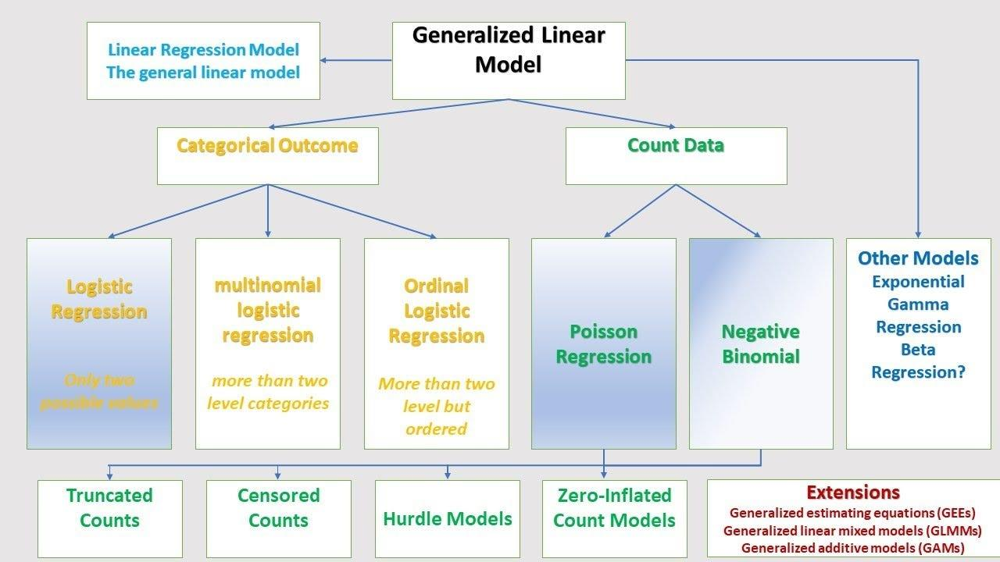

## Table of Contents

## What is a Generalized Linear Model (GLM) in the context of machine learning?

A Generalized Linear Model (GLM) is a flexible extension of traditional linear regression that allows for modeling different types of data, not just normally distributed ones. In a GLM, the relationship between the dependent variable and the independent variables is described using a link function, which connects the expected value of the dependent variable to a linear combination of the predictors. This makes GLMs suitable for a variety of data types, such as binary outcomes (like yes/no), count data, or continuous data with non-normal distributions.

For example, if you're trying to predict whether it will rain tomorrow (a yes/no outcome), you might use a logistic regression, which is a type of GLM. The logistic function, or logit link, transforms the linear combination of predictors into a probability between 0 and 1. Mathematically, if $$ p $$ is the probability of rain, the model might look like $$ \text{logit}(p) = \beta_0 + \beta_1 x_1 + \beta_2 x_2 + ... $$, where $$ \text{logit}(p) = \ln\left(\frac{p}{1-p}\right) $$. This setup allows GLMs to handle a wide range of problems in machine learning, making them a powerful tool in data analysis.

## How does a GLM differ from a traditional linear regression model?

A Generalized Linear Model (GLM) and a traditional linear regression model both aim to find relationships between variables, but they work differently. A traditional linear regression model assumes that the dependent variable is normally distributed and that there's a straight-line relationship between the dependent and independent variables. For example, if you want to predict a person's weight based on their height, a linear regression would assume that weight increases linearly with height. The model's equation would look like $$ y = \beta_0 + \beta_1 x + \epsilon $$, where $$ y $$ is the weight, $$ x $$ is the height, and $$ \epsilon $$ is the error term.

On the other hand, a GLM is more flexible because it can handle different types of dependent variables, not just those that are normally distributed. GLMs use a link function to connect the expected value of the dependent variable to a linear combination of the predictors. For instance, if you're trying to predict whether it will rain (a yes/no outcome), you might use a logistic regression, which is a type of GLM. The logistic function, or logit link, transforms the linear combination into a probability between 0 and 1. The model's equation would be $$ \text{logit}(p) = \beta_0 + \beta_1 x_1 + \beta_2 x_2 + ... $$, where $$ \text{logit}(p) = \ln\left(\frac{p}{1-p}\right) $$. This makes GLMs very useful for a wider range of data types and problems in machine learning.

## What types of distributions can be used with GLMs?

Generalized Linear Models (GLMs) can handle different types of data by using various distributions. Some common distributions used in GLMs include the normal distribution, which is used in regular linear regression. The binomial distribution is used for binary outcomes, like yes/no or success/failure situations. The Poisson distribution is used for count data, like the number of times something happens. The gamma distribution is used for continuous data that is always positive, like the time it takes to complete a task.

Each distribution in a GLM comes with its own link function, which connects the expected value of the dependent variable to a linear combination of the predictors. For example, if you're using a normal distribution, the link function is just the identity function, so the model looks like $$ y = \beta_0 + \beta_1 x_1 + \beta_2 x_2 + ... $$. If you're using a binomial distribution for a yes/no outcome, you use the logit link function, and the model becomes $$ \text{logit}(p) = \beta_0 + \beta_1 x_1 + \beta_2 x_2 + ... $$, where $$ \text{logit}(p) = \ln\left(\frac{p}{1-p}\right) $$. This flexibility allows GLMs to fit different types of data more accurately than traditional linear regression.

## What is the role of the link function in GLMs?

The link function in Generalized Linear Models (GLMs) is what makes them so useful. It's a special function that helps connect the expected value of the dependent variable to a linear combination of the predictors. In simpler terms, it changes the scale of the dependent variable so that it fits better with the predictors. For example, if you're trying to predict whether it will rain (yes or no), you use a logit link function. This function transforms the probability of rain into a number that can be used in a linear equation.

Let's say you're using a GLM to predict if it will rain. The probability of rain, $$ p $$, is what you want to predict. The logit link function transforms this probability into a new value, $$ \text{logit}(p) = \ln\left(\frac{p}{1-p}\right) $$. This new value can then be modeled as a linear combination of your predictors, like $$ \text{logit}(p) = \beta_0 + \beta_1 x_1 + \beta_2 x_2 + ... $$. This way, the GLM can handle different types of data, not just the ones that fit a straight line.

## Can you explain the concept of exponential family distributions in relation to GLMs?

Exponential family distributions are a group of probability distributions that can be used in Generalized Linear Models (GLMs). They're special because they can be written in a certain way that makes them easier to work with in GLMs. Think of them like a big family of distributions that share a common structure. This structure is important because it lets us use the same basic math to handle different kinds of data, like counts, yes/no answers, or continuous numbers.

In GLMs, the exponential family distributions help us connect the expected value of the dependent variable to the predictors using a link function. For example, if you're trying to predict the number of times something happens (like the number of emails you get in a day), you might use a Poisson distribution, which is part of the exponential family. The link function for a Poisson GLM is usually the log function, so the model looks like $$ \ln(\mu) = \beta_0 + \beta_1 x_1 + \beta_2 x_2 + ... $$, where $$ \mu $$ is the expected number of emails. This setup makes it easier to fit the model to the data and get good predictions.

## How do you choose the appropriate link function for a given problem in GLMs?

Choosing the right link function in a Generalized Linear Model (GLM) depends on the type of data you're working with and the distribution of your dependent variable. If you're trying to predict something that can only be yes or no, like whether it will rain, you should use the logit link function. This function transforms the probability of rain into a number that fits well with your predictors. The formula for this is $$ \text{logit}(p) = \ln\left(\frac{p}{1-p}\right) $$, where $$ p $$ is the probability of rain. If you're predicting the number of times something happens, like the number of emails you get in a day, you should use the log link function with a Poisson distribution. This is because the log function helps the model fit the data better. The formula for this is $$ \ln(\mu) = \beta_0 + \beta_1 x_1 + \beta_2 x_2 + ... $$, where $$ \mu $$ is the expected number of emails.

The link function you choose also depends on what makes sense for your problem. For example, if you're predicting something that's always positive, like the time it takes to complete a task, you might use a gamma distribution with a log link function. This is because the log function ensures that your predictions stay positive. The formula for this would be $$ \ln(\mu) = \beta_0 + \beta_1 x_1 + \beta_2 x_2 + ... $$, where $$ \mu $$ is the expected time. In the end, the right link function helps your GLM fit the data well and give you good predictions.

## What are some common applications of GLMs in machine learning?

Generalized Linear Models (GLMs) are used a lot in [machine learning](/wiki/machine-learning) for different kinds of problems. One common use is in predicting whether something will happen or not, like if it will rain tomorrow. For this, you might use a logistic regression, which is a type of GLM. The logistic function, or logit link, helps turn the probability of rain into a number that can be used in the model. The formula for this is $$ \text{logit}(p) = \ln\left(\frac{p}{1-p}\right) $$, where $$ p $$ is the probability of rain. This kind of model is really helpful for things like predicting if a customer will buy a product or if a patient has a certain disease.

Another use for GLMs is in predicting how many times something happens, like the number of emails you get in a day. For this, you might use a Poisson regression, which is another type of GLM. The Poisson distribution works well with count data, and the log link function helps the model fit the data better. The formula for this is $$ \ln(\mu) = \beta_0 + \beta_1 x_1 + \beta_2 x_2 + ... $$, where $$ \mu $$ is the expected number of emails. This kind of model is useful for things like predicting how many people will visit a website or how many defects there might be in a product.

## How do you estimate the parameters of a GLM?

Estimating the parameters of a Generalized Linear Model (GLM) involves finding the best values for the coefficients, like $$ \beta_0, \beta_1, \beta_2, ... $$, that make the model fit the data well. The most common way to do this is by using a method called maximum likelihood estimation (MLE). MLE looks at how likely it is to see the data you have if you use a certain set of parameters. The goal is to find the set of parameters that makes this likelihood as high as possible. For example, if you're using a logistic regression to predict if it will rain, MLE would help you find the $$ \beta $$ values that make the model's predictions match the actual rain data as closely as possible.

To actually find these best parameters, you often use an algorithm called Iteratively Reweighted Least Squares (IRLS). IRLS works by starting with a guess for the parameters and then making small changes to them to improve the fit of the model. It keeps doing this until the changes are so small that the model can't get any better. This process is like adjusting the knobs on a radio to get the best sound; you keep turning them until you find the right spot. In the end, the parameters you find with IRLS are the ones that make your GLM work the best for predicting things like whether it will rain or how many emails you'll get.

## What are the advantages of using GLMs over other machine learning models?

Generalized Linear Models (GLMs) are really good at handling different types of data. They can work with things like yes/no answers, counts, or even numbers that aren't normally distributed. This makes them very useful for a lot of different problems. For example, if you want to predict if it will rain, you can use a logistic regression, which is a type of GLM. The formula for this is $$ \text{logit}(p) = \ln\left(\frac{p}{1-p}\right) $$, where $$ p $$ is the chance of rain. GLMs are also easy to understand because they're based on simple math, so you can see how the different parts of your data affect the predictions.

Another advantage of GLMs is that they're good at explaining why they make certain predictions. They give you clear numbers, called coefficients, that show how each predictor affects the outcome. This makes it easier to explain the model to other people and to make decisions based on the model. For example, if you're using a GLM to predict how many emails you'll get, the formula might look like $$ \ln(\mu) = \beta_0 + \beta_1 x_1 + \beta_2 x_2 + ... $$, where $$ \mu $$ is the expected number of emails. This way, you can see exactly how things like the day of the week or the number of people in your contacts affect your email count.

## How can you assess the goodness of fit for a GLM?

To check how well a Generalized Linear Model (GLM) fits your data, you can use a few different methods. One common way is to look at the deviance, which is a measure of how much the model's predictions differ from the actual data. If the deviance is small, it means the model fits the data pretty well. Another way is to use the Akaike Information Criterion (AIC), which helps you compare different models. A lower AIC score means a better fit, but you also need to think about how many parameters the model uses. For example, if you're using a logistic regression to predict if it will rain, you might use the formula $$ \text{logit}(p) = \ln\left(\frac{p}{1-p}\right) $$. You can then calculate the deviance or AIC to see how well the model works.

Another way to assess the goodness of fit is by using residuals, which are the differences between the actual data and the model's predictions. If the residuals are spread out randomly and don't show any patterns, it's a good sign that the model fits well. You can also use a chi-squared test to see if the model fits the data better than a simpler model. For example, if you're predicting the number of emails you get with a Poisson regression using the formula $$ \ln(\mu) = \beta_0 + \beta_1 x_1 + \beta_2 x_2 + ... $$, you can check the residuals to see if the model's predictions are close to the actual numbers. If the residuals are small and don't follow any pattern, it means your GLM is doing a good job.

## What are some common challenges or limitations when working with GLMs?

One common challenge when working with Generalized Linear Models (GLMs) is choosing the right link function and distribution for your data. If you pick the wrong one, your model might not fit the data well. For example, if you're trying to predict if it will rain using a logistic regression, you need to use the logit link function, which is $$ \text{logit}(p) = \ln\left(\frac{p}{1-p}\right) $$. If you use a different link function, your predictions might not make sense. Another issue is that GLMs can be sensitive to outliers or unusual data points. These can pull the model's predictions away from what's typical, making the model less accurate.

Another limitation of GLMs is that they assume a linear relationship between the predictors and the dependent variable after the link function is applied. This might not always be true in real life. For example, if you're predicting the number of emails you get using a Poisson regression with the formula $$ \ln(\mu) = \beta_0 + \beta_1 x_1 + \beta_2 x_2 + ... $$, the model assumes that the log of the expected number of emails changes linearly with the predictors. If the real relationship is more complicated, the GLM might not capture it well. Also, GLMs can struggle with multicollinearity, where the predictors are closely related to each other. This can make it hard to tell which predictors are really important for the model's predictions.

## How can GLMs be extended to handle more complex data structures, such as mixed effects or hierarchical models?

Generalized Linear Models (GLMs) can be extended to handle more complex data structures like mixed effects or hierarchical models by incorporating random effects into the model. These random effects allow the model to account for variability within different groups or levels of the data. For example, if you're studying student test scores across different schools, you might use a mixed effects model. This model would include fixed effects, which are the same for all students, like the effect of study time on test scores, and random effects, which vary by school, like the average test score for each school. The formula for a mixed effects model might look like $$ \text{logit}(p_{ij}) = \beta_0 + \beta_1 x_{ij} + u_i $$, where $$ p_{ij} $$ is the probability of passing for student $$ j $$ in school $$ i $$, $$ \beta_0 $$ and $$ \beta_1 $$ are fixed effects, and $$ u_i $$ is the random effect for school $$ i $$.

These extensions make GLMs more flexible and able to handle data that has a nested or hierarchical structure. For example, in a hierarchical model, you might be looking at patients within hospitals, where each hospital might have its own characteristics that affect patient outcomes. By adding random effects for hospitals, you can account for these differences and get a better understanding of how different factors influence patient outcomes. This approach helps to improve the accuracy of the model and provides more detailed insights into the data.