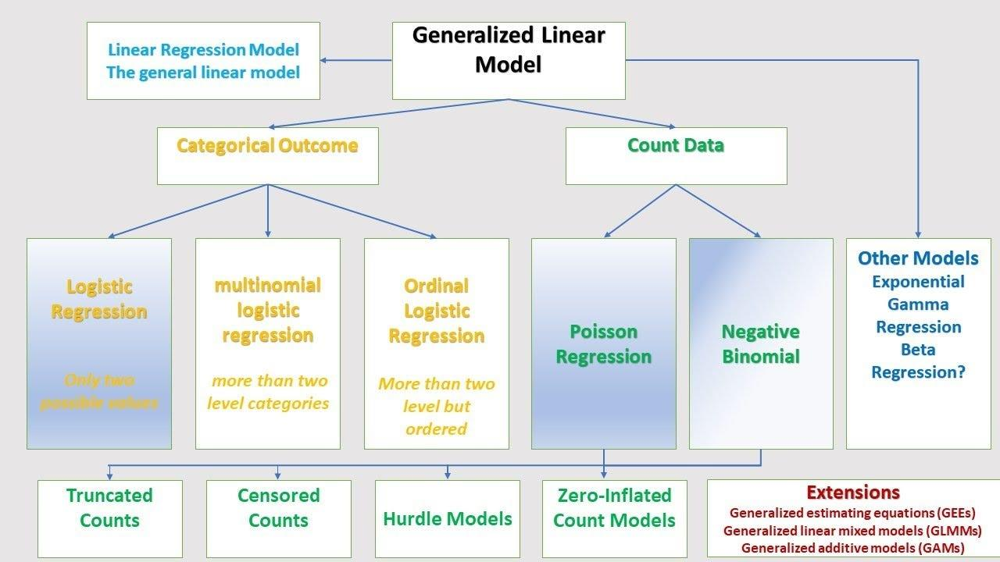

## Table of Contents

## What is a Generalized Linear Model (GLM) and how does it differ from traditional linear models?

A Generalized Linear Model (GLM) is a flexible extension of traditional linear models that allows for the analysis of data that doesn't necessarily follow a normal distribution. In traditional linear models, the response variable is assumed to be normally distributed and the model directly predicts the mean of this variable. However, in GLMs, the response variable can have different distributions like Poisson, binomial, or gamma, and the model predicts the mean of the response variable through a link function. The link function transforms the expected value of the response variable to a linear combination of the predictors, allowing the model to handle various types of data more effectively.

The key difference between GLMs and traditional linear models lies in their ability to handle non-normal data and their use of a link function. Traditional linear models, such as ordinary least squares regression, assume a linear relationship between the predictors and the response variable, and they are best suited for continuous, normally distributed outcomes. In contrast, GLMs can model outcomes that are counts, proportions, or have other non-normal distributions. For example, in a logistic regression, which is a type of GLM, the link function is the logit function, and it models the probability of a binary outcome. This flexibility makes GLMs a powerful tool in statistical analysis, allowing researchers to model a wider range of data types and relationships more accurately.

## Can you explain the components of a GLM, including the random component, systematic component, and link function?

A Generalized Linear Model (GLM) has three main components: the random component, the systematic component, and the link function. The random component describes the distribution of the response variable. Unlike traditional linear models that assume a normal distribution, GLMs can use other distributions like Poisson for count data or binomial for binary data. This component helps the model understand the variability and nature of the data it's working with.

The systematic component involves the predictors or independent variables. It's a linear combination of these predictors, often represented as $$ \eta = \beta_0 + \beta_1 x_1 + \beta_2 x_2 + \ldots + \beta_p x_p $$, where $$\eta$$ is the linear predictor, $$\beta_0$$ is the intercept, and $$\beta_1, \beta_2, \ldots, \beta_p$$ are the coefficients for the predictors $$x_1, x_2, \ldots, x_p$$. This part of the model captures how the predictors influence the response variable.

The link function connects the random and systematic components. It transforms the expected value of the response variable, denoted as $$\mu$$, into the linear predictor $$\eta$$. The link function, often written as $$g(\mu) = \eta$$, allows the model to handle different types of data. For example, in logistic regression, the link function is the logit function, $$g(\mu) = \ln\left(\frac{\mu}{1-\mu}\right)$$, which transforms probabilities into a linear scale. This flexibility makes GLMs powerful tools for modeling a wide range of data types.

## How does the choice of link function affect the interpretation of a GLM?

The choice of link function in a Generalized Linear Model (GLM) changes how we understand the relationship between the predictors and the response variable. The link function transforms the expected value of the response variable into a linear predictor. This transformation means that the coefficients in the model represent changes on the scale of the link function, not directly on the scale of the response variable. For example, in logistic regression, which uses the logit link function $$g(\mu) = \ln\left(\frac{\mu}{1-\mu}\right)$$, the coefficients represent changes in the log-odds of the response variable, not the probability itself.

Different link functions lead to different interpretations of the model's coefficients. For instance, if we use a log link function $$g(\mu) = \ln(\mu)$$ in a Poisson regression for count data, the coefficients represent multiplicative changes in the expected count. This means that a one-unit increase in a predictor leads to a proportional increase or decrease in the expected count, depending on the sign and magnitude of the coefficient. By choosing the right link function, we can make the model's predictions and interpretations more meaningful and aligned with the nature of the data we are analyzing.

## What are some common types of GLMs and their applications in machine learning?

Generalized Linear Models (GLMs) are used in many areas of [machine learning](/wiki/machine-learning) because they can handle different types of data. One common type of GLM is logistic regression, which is used for binary classification problems. In logistic regression, the link function is the logit function, $$g(\mu) = \ln\left(\frac{\mu}{1-\mu}\right)$$. This model predicts the probability that an event will happen, like whether an email is spam or not. Logistic regression is widely used in areas like medical diagnosis, credit scoring, and marketing.

Another type of GLM is Poisson regression, which is used for modeling count data. The link function for Poisson regression is the log function, $$g(\mu) = \ln(\mu)$$. This model is useful in fields like insurance, where you might want to predict the number of claims, or in healthcare, to predict the number of hospital visits. Poisson regression helps understand how different factors affect the expected count of events.

A third type of GLM is the gamma regression, which is used for modeling continuous, positive response variables with right-skewed distributions. The link function for gamma regression can be the log function or the inverse function, $$g(\mu) = \frac{1}{\mu}$$. Gamma regression is often used in finance to model stock prices or in environmental science to model pollution levels. These models help in understanding how different variables influence the response variable in a non-normal distribution setting.

## How is Logistic Regression implemented as a GLM, and what types of problems can it solve?

Logistic Regression is a type of Generalized Linear Model (GLM) that is used for binary classification problems. In this model, the response variable is binary, meaning it can only take two values, like yes or no, or 0 and 1. The link function used in logistic regression is the logit function, which is written as $$g(\mu) = \ln\left(\frac{\mu}{1-\mu}\right)$$. This function transforms the probability of the response variable into a linear combination of the predictors. The model then predicts the probability that the response variable will be 1, given the values of the predictors. For example, if you want to predict whether an email is spam or not, logistic regression can help by looking at features like the sender's email address or the words in the email.

Logistic Regression can solve many types of problems where the outcome is binary. It is commonly used in medical diagnosis to predict whether a patient has a certain disease based on symptoms and test results. In finance, it can be used to predict whether a loan applicant will default on a loan, helping banks make better lending decisions. In marketing, logistic regression can help predict whether a customer will buy a product based on their past behavior and demographic information. These examples show how logistic regression, as a GLM, can be a powerful tool for making predictions in various fields.

## Can you describe how Linear Regression fits into the framework of GLMs?

Linear Regression is actually a special type of Generalized Linear Model (GLM) where the response variable follows a normal distribution. In GLMs, the link function connects the expected value of the response variable to a linear combination of the predictors. For Linear Regression, the link function is the identity function, which means the expected value of the response variable, $$\mu$$, is directly equal to the linear predictor, $$\eta$$. So, if you have a model like $$y = \beta_0 + \beta_1 x_1 + \beta_2 x_2 + \ldots + \beta_p x_p + \epsilon$$, where $$\epsilon$$ is the error term, the link function is simply $$g(\mu) = \mu = \eta = \beta_0 + \beta_1 x_1 + \beta_2 x_2 + \ldots + \beta_p x_p$$.

Because Linear Regression uses the identity link function and assumes a normal distribution for the response variable, it fits neatly into the GLM framework but with some restrictions. It's great for predicting continuous outcomes like house prices or temperatures, where the errors are assumed to be normally distributed. This makes Linear Regression a simpler and more straightforward model compared to other GLMs that can handle different types of data distributions and link functions.

## What is the role of the Procrustes analysis in the context of GLMs?

Procrustes analysis is a statistical technique that is not directly part of Generalized Linear Models (GLMs), but it can be used in conjunction with them for certain types of data analysis. Procrustes analysis is used to compare the shapes of two or more sets of data by transforming them to see how well they match. It's like trying to fit two shapes together by rotating, scaling, or reflecting one shape to see how similar it is to another. In the context of GLMs, if you have data that represents shapes or configurations, you might use Procrustes analysis to preprocess this data before fitting it into a GLM. This can help in aligning the data so that the GLM can better model the relationships between the predictors and the response variable.

For example, imagine you are studying the shapes of leaves from different trees and you want to see if certain environmental factors affect these shapes. You could use Procrustes analysis to align all the leaf shapes to a common reference shape before using a GLM to analyze how factors like sunlight or soil type influence the leaf shapes. By doing this, you make sure that any differences you find in the GLM are due to the environmental factors and not just due to differences in how the leaves were measured or oriented. This way, Procrustes analysis helps in making the data more suitable for the GLM, improving the accuracy and interpretability of your results.

## How do you assess the goodness of fit for a GLM?

To assess the goodness of fit for a Generalized Linear Model (GLM), you can use several methods. One common approach is to look at the deviance, which measures how well the model fits the data. The deviance is like a score that tells you how much the model's predictions differ from the actual data. A lower deviance means the model fits the data better. You can compare the deviance of your model to a null model, which is a simple model with no predictors, to see if adding predictors improves the fit. If the difference in deviance is large and statistically significant, it suggests your model is a good fit.

Another way to check the goodness of fit is by using the Pearson chi-square statistic. This statistic compares the observed values to the values predicted by the model. If the Pearson chi-square statistic is close to the degrees of freedom of the model, it suggests a good fit. You can also use residual plots to visually inspect the fit. Residuals are the differences between the observed and predicted values. If the residuals are randomly scattered around zero, it indicates that the model fits well. If you see patterns or trends in the residuals, it might mean the model needs to be improved.

## What are the diagnostic tools and techniques used to validate a GLM?

To validate a Generalized Linear Model (GLM), you can use several diagnostic tools and techniques. One common method is to look at the residuals, which are the differences between the actual data and the model's predictions. If the residuals are randomly scattered around zero, it suggests that the model fits the data well. You can plot these residuals against the fitted values or the predictors to check for any patterns. If you see patterns, like a curve or a trend, it might mean the model needs to be adjusted. Another tool is the deviance, which measures how well the model fits the data. A lower deviance means a better fit. You can compare the deviance of your model to a simpler model, like a null model with no predictors, to see if your model is an improvement.

Another technique is to use the Pearson chi-square statistic, which compares the observed values to the values predicted by the model. If the Pearson chi-square statistic is close to the degrees of freedom of the model, it suggests a good fit. You can also use the Akaike Information Criterion (AIC) or the Bayesian Information Criterion (BIC) to compare different models. These criteria balance the model's fit with its complexity, helping you choose the best model. For example, a lower AIC or BIC value indicates a better model. Additionally, you can perform a likelihood ratio test to see if adding more predictors significantly improves the model's fit. This test compares the likelihood of the data under two different models, one with and one without the additional predictors. If the difference is statistically significant, it suggests that the more complex model is better.

## How can one handle overdispersion in GLMs, and what are the implications of not addressing it?

Overdispersion in Generalized Linear Models (GLMs) happens when the data shows more variability than the model expects. For example, if you're using a Poisson regression to predict the number of events, but the actual counts are more spread out than the Poisson distribution allows, you have overdispersion. To handle this, you can use a quasi-Poisson model, which adds an extra parameter to account for the extra variability. Another way is to use a negative binomial model, which is more flexible and can handle overdispersion better than the Poisson model. You can also try adding more predictors to your model to see if they help explain the extra variability.

If you don't address overdispersion, your model's results can be misleading. For instance, the standard errors of the coefficients might be too small, which can make you think that the predictors are more important than they really are. This can lead to wrong conclusions and bad decisions based on your model. By recognizing and fixing overdispersion, you make your model more accurate and reliable, helping you understand your data better and make better predictions.

## What advanced techniques can be used to extend GLMs, such as mixed models or zero-inflated models?

One advanced technique to extend Generalized Linear Models (GLMs) is to use mixed models, also known as hierarchical or multilevel models. Mixed models are useful when your data has a structure, like students within schools or patients within hospitals. These models can handle both fixed effects, which are the same for everyone, and random effects, which vary across groups. For example, if you're studying student test scores, you might have fixed effects like the amount of study time, and random effects like the effect of different schools. Mixed models help you understand how these different levels affect your outcome, making your analysis more accurate and detailed.

Another advanced technique is using zero-inflated models, which are helpful when your data has more zeros than you would expect from a standard GLM. For instance, if you're counting the number of times people visit a doctor, you might see a lot of zeros because many people don't go to the doctor at all. A zero-inflated model can handle this by using two parts: one part predicts whether the count is zero or not, and the other part predicts the count if it's not zero. This way, you can better model data with lots of zeros, making your predictions more accurate. Both mixed models and zero-inflated models extend GLMs to handle more complex data situations, improving the reliability of your analysis.

## How do you compare different GLMs to choose the best model for a given dataset?

To compare different Generalized Linear Models (GLMs) and choose the best one for a given dataset, you can use several methods. One way is to look at the Akaike Information Criterion (AIC) and the Bayesian Information Criterion (BIC). These criteria help you balance the model's fit with its complexity. A lower AIC or BIC value means a better model. For example, if Model A has an AIC of 200 and Model B has an AIC of 180, Model B is likely a better fit for your data. You can also compare the deviance of different models. The deviance measures how well the model fits the data, and a lower deviance means a better fit. By comparing the deviance of different models, you can see which one fits your data the best.

Another way to compare GLMs is by using cross-validation. This method involves splitting your data into training and testing sets, fitting the model on the training set, and then checking how well it predicts the data in the testing set. If one model performs better on the test set, it might be a better choice. You can also look at the residuals, which are the differences between the actual data and the model's predictions. If the residuals are randomly scattered around zero, it suggests the model fits well. By plotting the residuals against the fitted values or the predictors, you can see if there are any patterns that suggest the model needs improvement. Using these methods, you can make a more informed decision about which GLM is the best for your dataset.