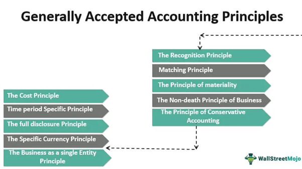

## Table of Contents

## What are Generally Accepted Accounting Principles (GAAP)?

Generally Accepted Accounting Principles, or GAAP, are a set of rules and guidelines that companies in the United States must follow when they report their financial information. These principles make sure that everyone is using the same methods to record and present their financial data, so it's easier for investors, creditors, and others to understand and compare the financial health of different companies.

GAAP covers many areas of accounting, like how to record revenue, expenses, assets, and liabilities. It also includes rules on how to prepare financial statements, like the balance sheet and income statement. By following GAAP, companies can provide clear and consistent financial information, which helps build trust with people who use this information to make decisions.

## Why were GAAP developed?

GAAP were developed to make sure that all companies in the United States follow the same rules when they show their financial information. Before GAAP, different companies used different ways to record and report their money matters. This made it hard for people like investors and creditors to understand and compare the financial health of different companies. By having a common set of rules, GAAP helps everyone trust the financial information they see.

Another reason GAAP were developed is to protect investors and the public. When companies follow the same accounting rules, it's easier for people to spot if something is wrong or if a company is trying to hide problems. This makes the financial markets fairer and more transparent. GAAP helps keep the economy stable by making sure financial information is clear and reliable.

## Who is required to follow GAAP?

In the United States, companies that are publicly traded on stock exchanges have to follow GAAP. This means big companies that anyone can buy shares in must use these rules to show their financial information. The reason for this is to make sure everyone can trust the numbers and compare different companies easily.

Not just public companies, but also many private companies choose to follow GAAP. Even though they are not required to, it can help them look more professional and trustworthy to banks and investors. Some government organizations and non-profit groups also use GAAP to keep their financial reporting clear and consistent.

## What are the main objectives of GAAP?

The main objectives of GAAP are to make sure that financial reporting is clear and easy to understand. GAAP sets rules that companies must follow when they show their money information. This helps everyone, like investors and creditors, see the real financial health of a company. When everyone uses the same rules, it's easier to compare different companies and make smart choices about where to put money.

Another big goal of GAAP is to keep the financial markets fair and honest. By having strict rules, GAAP helps stop companies from hiding problems or making their finances look better than they really are. This protects people who invest money and helps keep the economy stable. When financial information is reliable and everyone trusts it, the whole system works better.

## Can you explain the basic principles of GAAP?

The basic principles of GAAP help make sure that financial information is clear and fair. One important principle is the Revenue Recognition Principle, which says that companies should only record money as income when they have actually earned it, not just when they get paid. Another key principle is the Matching Principle, which means that companies need to match their expenses with the income they made during the same time period. This helps show a true picture of how much money the company made or lost.

Another principle is the Cost Principle, which says that companies should record the cost of something at the price they paid for it, not what it might be worth now. This keeps the numbers simple and honest. The Full Disclosure Principle is also important because it says that companies need to tell everything that might affect someone's understanding of their financial health. This means being open about any big risks or important events.

The last basic principle is the Going Concern Principle, which assumes that a company will keep operating in the future, unless there's clear evidence that it won't. This helps when making long-term plans and decisions. By following these principles, GAAP makes sure that everyone can trust the financial information and use it to make smart choices.

## How does GAAP differ from International Financial Reporting Standards (IFRS)?

GAAP and IFRS are both sets of rules for how companies should show their financial information, but they come from different places and have some differences. GAAP is used in the United States and is made by the Financial Accounting Standards Board (FASB). IFRS is used in many other countries around the world and is made by the International Accounting Standards Board (IASB). One big difference is how they handle inventory. GAAP uses the Last In, First Out (LIFO) method, while IFRS does not allow LIFO. This means that under GAAP, a company might show different costs for the same products than it would under IFRS.

Another difference is in how the two systems treat development costs. Under IFRS, companies can record these costs as assets if they meet certain rules, but under GAAP, these costs usually have to be recorded as expenses right away. This can make a company's financial statements look different depending on which rules they follow. Also, IFRS tends to be more principle-based, meaning it gives general guidelines that companies have to interpret, while GAAP is more rule-based, with lots of specific rules to follow. This can make IFRS more flexible but also harder to apply consistently across different companies.

## What are some common GAAP financial statements?

GAAP financial statements help companies show their money situation clearly. One common statement is the Balance Sheet. It shows what a company owns, like money or buildings, and what it owes, like loans. It also shows the owner's part of the business, called equity. The Balance Sheet helps everyone see if the company is strong or if it has a lot of debt.

Another important statement is the Income Statement. This shows how much money a company made from selling things or services, called revenue, and how much it spent, called expenses. By looking at the Income Statement, you can see if the company made a profit or lost money during a certain time. It's a good way to check if the company is doing well or not.

The last common statement is the Cash Flow Statement. This shows how money moves in and out of the company. It breaks down money into three parts: from running the business, from buying or selling things like buildings, and from borrowing or paying back loans. The Cash Flow Statement helps everyone see where the money is coming from and going to, which is important for understanding if the company can pay its bills.

## How are revenues and expenses recognized under GAAP?

Under GAAP, revenues are recognized when they are earned, not when the money is received. This means a company can record income on its [books](/wiki/algo-trading-books) as soon as it has done the work or delivered the product, even if the customer hasn't paid yet. For example, if a company finishes a project in December but doesn't get paid until January, it still counts that money as revenue in December. This is called the Revenue Recognition Principle. It helps show a true picture of when the company earned the money, which is important for understanding its financial health.

Expenses are recognized under GAAP using the Matching Principle. This means that expenses should be recorded in the same period as the revenues they helped to earn. So if a company spends money on something that helps it make sales, like buying materials or paying workers, those costs should be recorded in the same time period as the sales they helped create. This way, the income statement shows a clear link between the money coming in and the money going out, giving a more accurate view of the company's profit or loss.

## What is the role of the Financial Accounting Standards Board (FASB) in GAAP?

The Financial Accounting Standards Board (FASB) is the group that makes the rules for GAAP. They decide how companies in the United States should show their financial information. The FASB's job is to make sure these rules are clear and fair, so everyone can trust the numbers they see. They work to keep the rules up to date, so they fit with how businesses work today.

FASB listens to a lot of different people when they make or change rules. They talk to people who use financial information, like investors and accountants, to make sure the rules are helpful and make sense. By doing this, FASB helps keep the financial markets honest and helps everyone understand how well companies are doing.

## How have recent changes in GAAP affected financial reporting?

Recent changes in GAAP have made financial reporting more clear and fair. One big change is how companies report their leases. Before, some leases were not shown on the balance sheet, but now, under the new rules, companies have to show all their leases. This makes it easier for people to see how much a company is spending on leases and helps them understand the company's financial health better.

Another change is in how companies report revenue. The new rules make it clearer when a company can say they've earned money. This helps stop companies from making their profits look bigger than they really are. These changes make financial statements more trustworthy and easier to compare between different companies. By keeping the rules up to date, GAAP helps everyone make better decisions about where to put their money.

## What are some challenges businesses face in complying with GAAP?

One challenge businesses face in complying with GAAP is keeping up with the changes in the rules. GAAP is always being updated to make sure it fits with how businesses work today. This means companies need to spend time and money to learn the new rules and change how they do their accounting. It can be hard for small businesses because they might not have a lot of people who know about accounting to help them.

Another challenge is the cost of following GAAP. Companies need to hire accountants or use special software to make sure they are doing everything right. This can be expensive, especially for small businesses. Also, if a company makes a mistake in their financial reporting, it can get in trouble with the government or lose the trust of investors. So, businesses have to be very careful and spend a lot of time making sure they follow GAAP correctly.

## How can a company ensure it is compliant with GAAP?

To make sure a company follows GAAP, it needs to keep up with the rules that the Financial Accounting Standards Board (FASB) sets. This means the company should always check for any new changes or updates to GAAP. They can do this by reading updates from FASB, going to training sessions, or hiring accountants who know a lot about GAAP. It's also important for the company to have good systems and software that help them do their accounting the right way. This can make it easier to keep track of everything and make sure they are following the rules.

Another way a company can stay compliant with GAAP is by having regular checks and reviews of their financial statements. They can hire outside auditors to look at their books and make sure everything is done correctly. These auditors can find any mistakes and help the company fix them before they become big problems. By doing these checks often, the company can show that it cares about being honest and clear with its financial information. This helps build trust with investors and other people who look at the company's numbers.

## References & Further Reading

[1]: ["An Introduction to Algorithmic Trading: Basic to Advanced Strategies"](https://onlinelibrary.wiley.com/doi/book/10.1002/9781119206033) by Edward Leshik and Jane Cralle

[2]: ["International Financial Reporting Standards (IFRS): A Practical Guide"](https://documents.worldbank.org/en/publication/documents-reports/documentdetail/520891468139494304/international-financial-reporting-standards-a-practical-guide-sixth-edition) by Hennie van Greuning, Darrel Scott, and Simonet Terblanche

[3]: Financial Accounting Standards Board (FASB). ["Generally Accepted Accounting Principles (GAAP)"](https://fasb.org/standards)

[4]: ["Financial Markets and Trading: An Introduction to Market Microstructure and Trading Strategies"](https://archive.org/details/financialmarkets0000schm) by Anatoly B. Schmidt

[5]: International Accounting Standards Board (IASB). ["International Financial Reporting Standards (IFRS)"](https://www.ifrs.org/groups/international-accounting-standards-board/)

[6]: ["Algorithmic Trading and DMA: An Introduction to Direct Access Trading Strategies"](https://www.semanticscholar.org/paper/Algorithmic-trading-%26-DMA-%3A-an-introduction-to-Johnson/aa5de1ab883d5e23b6651faa7c1807586d688e4b) by Barry Johnson