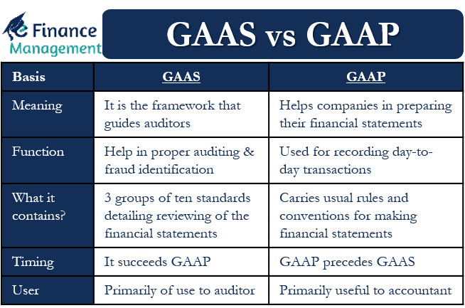

Understanding the essential auditing and accounting standards is crucial for investors, businesses, and financial professionals. Generally Accepted Auditing Standards (GAAS) and Generally Accepted Accounting Principles (GAAP) are integral to ensuring both accuracy and transparency in financial reporting. GAAS provides a framework for conducting audits, ensuring that financial statements are scrutinized under reliable protocols. Simultaneously, GAAP lays out the principles and guidelines that govern the preparation of financial statements, ensuring consistency and comparability.

In today's fast-evolving financial markets, algorithmic trading has emerged as a significant force. This form of trading, which relies on automated systems to execute trades at speeds and volumes humans cannot match, underscores the need for reliable financial data. The integrity and accuracy of this data—which underpin algorithmic trading strategies—depend hugely on the businesses adhering to GAAS and GAAP standards.



This article examines how GAAS and GAAP form the foundational framework essential for reliable financial reporting and explore their interaction within the arena of algorithmic trading, highlighting the importance of robust auditing standards for ensuring market integrity and functionality.

## Table of Contents

## What are Generally Accepted Auditing Standards (GAAS)?

Generally Accepted Auditing Standards (GAAS) refer to a framework of authoritative guidelines that auditors follow to ensure the accuracy, consistency, and reliability of a company's financial records. Established by the Auditing Standards Board (ASB) of the American Institute of Certified Public Accountants (AICPA), GAAS is instrumental in shaping the procedures and principles underlying the auditing process. 

The standards are fundamental in promoting quality audits by encompassing three main components: general standards, standards of fieldwork, and standards of reporting. 

1. **General Standards**: These emphasize the auditor’s qualifications and the importance of maintaining an impartial mindset and professional demeanor. The auditor must possess adequate technical training and proficiency, maintain independence in mental attitude, and exercise due professional care during the audit process. 

2. **Standards of Fieldwork**: These ensure that audit practices contribute to the collection and analysis of relevant data. They require proper planning and supervision of audit work, a thorough understanding of the audited company, and sufficient competent evidence to support an opinion on the financial statements.

3. **Standards of Reporting**: These standards guide how auditors convey their findings. They necessitate stating whether financial statements are in accordance with generally accepted accounting principles (GAAP), identifying circumstances when consistency in the application of accounting principles is not observed, ensuring informative disclosures are in the financial statements, and expressing an opinion regarding the whole set of financial documents or asserting that an opinion cannot be provided.

GAAS establishes a comprehensive framework that mandates rigorous scrutiny of financial documents, aiming to produce audits that stakeholders can trust. These audits ensure that financial statements are free from material misstatement, thus instilling confidence in business assessments, investment decisions, and financial market stability.

## Understanding Generally Accepted Accounting Principles (GAAP)

Generally Accepted Accounting Principles (GAAP) comprise a set of accounting rules mandated by the Financial Accounting Standards Board (FASB), essential for companies operating in the United States to follow when preparing their financial reports. These authoritative standards are intended to ensure that financial statements are presented consistently and transparently, enabling analysts and investors to make informed decisions. The FASB establishes and revises GAAP to reflect the evolving landscape of business practices, ensuring that financial reporting remains relevant and accurate.

GAAP encompasses several key principles that govern how financial information is recorded and reported. Among these principles are:

1. **Principle of Regularity**: Adherence to standardized rules and regulations outlined in GAAP.
2. **Principle of Consistency**: Financial reporting should be consistent across periods unless a change is justified and disclosed.
3. **Principle of Sincerity**: Financial statements should provide a truthful representation of a company’s financial position.
4. **Principle of Permanence of Methods**: Use consistent procedures and methods throughout the accounting process.
5. **Principle of Non-Compensation**: Requires full disclosure of all financial data, without compensating liabilities with assets or expenses with revenue.
6. **Principle of Prudence**: Accounting should be performed with caution, and uncertainties and risks should be disclosed.
7. **Principle of Continuity**: Assumes that a business will continue to operate for the foreseeable future.
8. **Principle of Periodicity**: Financial statements should be reported at regular intervals.

The synergy between GAAP and GAAS is a cornerstone of financial reporting integrity. While GAAP focuses on the rules for how companies should prepare financial reports, Generally Accepted Auditing Standards (GAAS) provide a framework for auditors to assess whether those reports accurately reflect the financial status of an entity. Auditors employ GAAS guidelines to evaluate the adherence of financial statements to GAAP, instilling confidence in the accuracy and reliability of reported financial information. This relationship is pivotal in maintaining the trustworthiness of financial data, which is crucial for stakeholders, including algorithmic traders who rely on accurate and timely data for decision-making.

Effective application of GAAP ensures that all entities are measured and evaluated using the same metrics, thereby promoting fairness and comparability among organizations. As financial landscapes and regulatory environments evolve, GAAP continuously adapts to address complexities and nuances in financial reporting, mitigating risks of misrepresentation. This ongoing refinement helps maintain a robust framework that nurtures investor confidence and supports the intricate operations of financial markets.

## GAAS vs. GAAP: Key Differences and Interactions

While Generally Accepted Accounting Principles (GAAP) and Generally Accepted Auditing Standards (GAAS) are both essential to financial reporting, they serve distinct roles within the fiscal framework. GAAP focuses on the rules and conventions for recording financial transactions and preparing financial statements. Its primary concern is the presentation of accounting information in a consistent and transparent manner. These principles are crucial for companies in the United States to ensure that financial statements are comparable and understandable for investors, analysts, and other stakeholders.

On the other hand, GAAS provides the framework that auditors use to evaluate the financial statements prepared under GAAP. These standards are developed primarily by the Auditing Standards Board (ASB) of the American Institute of Certified Public Accountants (AICPA). GAAS focuses on auditors' performance during their examination of a company's financial records. Key components of GAAS include the need for auditors to have appropriate technical training and proficiency, to act with independence in mental attitude, and to exercise due professional care in planning and performing the audit and preparing the report.

The interaction between GAAP and GAAS is critical in maintaining the integrity and trustworthiness of financial reporting. Auditors apply GAAS to verify that companies adhere to GAAP during the preparation of their financial statements. This process ensures not only the accuracy but also the transparency and reliability of financial reporting. An auditor's opinion, rendered following an audit that adheres to GAAS, provides assurance to the public that financial statements present a true and fair view in accordance with GAAP.

In [algorithmic trading](/wiki/algorithmic-trading), where split-second decisions often rely on volumes of financial data, understanding the precise differences and interactions between GAAP and GAAS is essential. High-frequency trading algorithms depend on reliable financial information; thus, the role of GAAS in confirming GAAP-compliant statements enhances confidence in such financial analytics. Investors and developers of trading algorithms can make more accurate and informed decisions when they are confident that the underlying financial data has been accurately audited.

Python and other programming languages are integral to algorithmic trading systems, automating tasks that require minute detail and rapid execution. A simple example of how critical accuracy is in financial data processing might involve reading audited financial reports into a [machine learning](/wiki/machine-learning) model:

```python
import pandas as pd

# Hypothetical function to read audited financial data
def load_financial_data(file_path):
    data = pd.read_csv(file_path)
    # Process data ensuring adherence to GAAP standards
    clean_data = data.dropna().drop_duplicates()
    return clean_data

# Load and process audited financial data
financial_data = load_financial_data('audited_financials.csv')
```

This script illustrates how vital clean and verified data is in these systems. The adherence to GAAS facilitates a verified data set that is crucial for algorithmic models.

In conclusion, while GAAP dictates the structure and consistency of financial statements, GAAS ensures the fidelity and accuracy of these documents through rigorous audit processes. Their interplay is indispensable to the integrity of financial reporting and provides a foundation that supports the advanced analytic techniques employed in algorithmic trading.

## The Role of Auditing Standards in Algorithmic Trading

Algorithmic trading, characterized by the use of complex algorithms to make trading decisions at lightning speed, fundamentally depends on the integrity and accuracy of financial data. Generally Accepted Auditing Standards (GAAS) ensure that this data is rigorously audited, providing the reliability that algorithmic systems require. GAAS establishes a thorough framework for auditors to verify financial records, reducing the risk of errors that could adversely affect trading outcomes. Complementarily, financial data must adhere to the Generally Accepted Accounting Principles (GAAP) to ensure consistent reporting and transparency.

Data integrity is pivotal in algorithmic trading as algorithms execute trades based on real-time analysis of financial statements. Ensuring this integrity through strict adherence to GAAS and GAAP is crucial. For instance, any discrepancies in reported earnings or financial ratios due to lax auditing could mislead algorithms, resulting in detrimental trading decisions. By maintaining high standards in auditing, GAAS helps identify and rectify discrepancies, ensuring the data processed by trading algorithms is both accurate and reliable.

Moreover, as algorithmic trading systems evolve, so does the complexity and [volume](/wiki/volume-trading-strategy) of financial data they process. This evolution necessitates heightened scrutiny and innovative auditing practices. Robust auditing frameworks are increasingly essential to prevent misrepresentation. Advanced algorithms analyze nuances in financial data, and even minor inaccuracies can lead to substantial financial repercussions. Therefore, auditing standards must adapt to these evolving demands, integrating technology to enhance precision in financial data validation.

Future adaptations in GAAS will likely include leveraging advancements in data analytics and [artificial intelligence](/wiki/ai-artificial-intelligence) to enhance audit accuracy. An auditor might employ machine learning algorithms to identify unusual patterns in financial data that warrant further investigation, a practice which aligns with continually evolving algorithmic trading systems. Such technological integrations will enhance the reliability of audits, providing the robust framework that algorithmic trading demands. Thus, the confluence of well-defined auditing standards and algorithmic trading can sustain the financial system's efficiency and trustworthiness.

## Challenges and Future Directions for GAAS and GAAP

The increasing complexity and globalization of financial markets pose significant challenges for Generally Accepted Auditing Standards (GAAS) and Generally Accepted Accounting Principles (GAAP). These standards must evolve to incorporate technological advancements and address the intricacies of emerging financial instruments. As financial markets become more sophisticated, there is a growing need for auditors and accountants to integrate technology into their practices and to work towards global harmonization of auditing and accounting standards. 

The advent of complex financial products and digital assets, such as cryptocurrencies, necessitates an update in existing standards to ensure accurate and consistent financial reporting. The intricate nature of these instruments can obscure their financial impact, making robust auditing guidelines essential. The Financial Accounting Standards Board (FASB) and other regulatory bodies must continuously revise GAAP to accommodate these new instruments, ensuring they are consistently reported across different jurisdictions.

Moreover, auditors are increasingly leveraging technology to enhance their auditing processes. Technologies such as data analytics and artificial intelligence can improve the accuracy and efficiency of audits by sifting through vast amounts of financial data to identify irregularities and potential risks. These technologies can also streamline routine auditing tasks, allowing auditors to focus on more complex issues that require professional judgment.

Future developments in auditing standards will also need to address cybersecurity concerns, which present a growing risk in today's digital financial landscape. Ensuring the integrity and security of financial data is crucial, especially with the rise of algorithmic trading, where data accuracy directly impacts trading decisions and financial outcomes. Auditors must be equipped to evaluate cybersecurity policies and controls effectively, ensuring that companies are protected against data breaches and cyber threats.

Integration of technology in the auditing and accounting fields could also include the development of automated auditing tools, reducing human error and increasing the reliability of audit findings. Global harmonization of standards remains a critical aim, aiming to create a universal set of guidelines that can facilitate cross-border transactions and financial reporting. This harmonization effort will support the reliability and comparability of financial information, enhancing stakeholder confidence in global financial markets.

In conclusion, GAAS and GAAP must continue to innovate and adapt to the changing financial landscape, ensuring they remain relevant and effective in promoting transparency and integrity in financial reporting. By addressing technological advancements and cybersecurity threats, these standards will support the evolving needs of financial markets and contribute to the stability and growth of global economies.

## Conclusion

Certainly, here is the conclusion for the article:

The Generally Accepted Auditing Standards (GAAS) and Generally Accepted Accounting Principles (GAAP) form the backbone of financial integrity, acting as fundamental pillars not only for traditional financial reporting but also for innovative processes such as algorithmic trading. These standards establish a foundation of trust and precision in financial data, which is crucial for the efficient functioning of financial markets.

As financial landscapes evolve—driven by technological advancements, complex global markets, and emerging financial instruments—GAAS and GAAP adapt to remain relevant and effective. Their evolution ensures that financial reporting and auditing practices are equipped to handle new challenges, such as those posed by cybersecurity threats and algorithmic trading strategies. The adaptability of these standards helps to safeguard the accuracy and transparency that stakeholders depend on, thereby fostering confidence in financial analyses and decision-making processes.

Understanding and adhering to GAAS and GAAP is critical for maintaining trust in financial markets. These standards provide a reliable framework that supports the growth and development of algorithmic trading by ensuring the integrity of financial data and the credibility of financial reports. As the financial ecosystem continues to change, GAAS and GAAP will remain essential, promoting accuracy and transparency in financial transactions and reporting, and thereby sustaining investor confidence and market stability.

## References & Further Reading

[1]: American Institute of Certified Public Accountants (AICPA). ["Codification of Statements on Auditing Standards."](https://onlinelibrary.wiley.com/doi/book/10.1002/9781119741817) AICPA.

[2]: Financial Accounting Standards Board (FASB). ["About the FASB."](https://fasb.org/about-us/about-the-fasb) FASB.

[3]: Bellovary, J., Giacomino, D., & Akers, M. (2005). ["A Review of Bankruptcy Prediction Studies: 1930 to Present."](https://www.jstor.org/stable/41948574) Journal of Financial Education, 31, 1-42.

[4]: Christensen, H., & Feltham, G. (2005). ["Economics of Accounting: Volume I - Information in Markets."](https://link.springer.com/book/10.1007/978-1-4615-1133-5) Springer.

[5]: Black, F. (1976). ["Studies of Stock Price Volatility Changes."](https://public.econ.duke.edu/~boller/Published_Papers/AB_Volatility_Contents_18.pdf) Proceedings of the 1976 Meeting of the American Statistical Association, Business and Economic Statistics Section, 177-181.