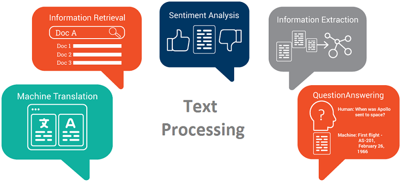

## Table of Contents

## What is generated text in the context of machine learning?

Generated text in the context of machine learning refers to the text that is produced by a computer program, specifically by models trained to understand and generate human language. These models, often called language models, use large amounts of text data to learn patterns and structures of language. Once trained, they can generate new text that resembles the training data, making them useful for tasks like writing stories, answering questions, or even creating poetry.

The process of generating text typically involves feeding a prompt or starting text into the model, which then continues the text based on what it has learned. For example, if you give the model the beginning of a sentence, it will predict and generate the rest of the sentence. This is done using probabilities calculated from the training data, where the model chooses the most likely next word or sequence of words. The quality of the generated text depends on the model's training and the diversity and size of the dataset it was trained on.

## How does machine learning generate text?

Machine learning generates text by using special computer programs called language models. These models are trained on a lot of text, like books, articles, and websites. They learn how words and sentences are usually put together. When you give the model a starting piece of text, it uses what it learned to guess what words should come next. It does this by looking at the patterns in the text it was trained on and choosing the most likely words to continue the sentence.

For example, if you start with "The cat sat on the," the model might guess "mat" because it often sees those words together. The model uses math to figure out the chances of different words coming next. It picks the word with the highest chance and adds it to the sentence. Then it does the same thing again with the new sentence, and keeps going until it finishes. This way, the model can create whole sentences or even long stories that sound like they were written by a person.

## What are the common applications of generated text?

Generated text is used in many ways. One common use is in writing tools that help people create content faster. For example, some apps can write emails, reports, or even stories based on a few words you give them. This can save a lot of time and help people who find writing hard. Another use is in chatbots and virtual assistants. These programs can talk to people and answer their questions using generated text. This makes them seem more human and helpful.

Another important use of generated text is in language translation. Machines can translate text from one language to another quickly and accurately. This helps people communicate across different languages without needing a human translator. Generated text is also used in creating fake data for testing software. Developers can make up names, addresses, and other information to see if their programs work correctly without using real people's data. This keeps things private and safe.

## What are the basic models used for text generation?

The basic models used for text generation are mainly of two types: rule-based models and statistical models. Rule-based models use a set of pre-defined rules to generate text. These rules can be simple, like choosing words based on grammar rules, or more complex, like using templates to fill in words. For example, a rule might say that after the word "the," the next word should be a noun. These models are good for simple tasks but can struggle with more varied and creative text generation.

Statistical models, on the other hand, use data to learn how to generate text. One common type of statistical model is the Markov chain, which predicts the next word based on the previous word or words. Another type is the n-gram model, which looks at sequences of n words to predict what comes next. For example, a bigram model (where $$ n = 2 $$) might use the probability of seeing "the cat" to predict that "sat" is a likely next word. These models can generate more varied text than rule-based models but still have limitations in understanding long-range dependencies in language.

More advanced statistical models include neural networks, particularly recurrent neural networks (RNNs) and transformers. RNNs can remember previous words in a sequence, making them better at understanding context. Transformers, which use a mechanism called attention, can look at all words in a sentence at once to generate text. These models can create very human-like text and are used in many modern applications like chatbots and writing assistants.

## How does a language model learn to generate text?

A language model learns to generate text by looking at a lot of examples. Imagine you want to teach a computer to write like a person. You give it many [books](/wiki/algo-trading-books), articles, and websites to read. The computer looks for patterns in how words are used together. For example, it notices that "the cat" is often followed by "sat." It keeps track of these patterns and uses them to guess what words should come next when it's generating new text. This is done using math, where the computer calculates the chances of different words following each other. The more examples the computer sees, the better it gets at guessing the right words.

To make the learning process better, the computer uses special math formulas called algorithms. One common type of algorithm is called a [neural network](/wiki/neural-network). Neural networks are like tiny brains inside the computer that can learn from examples. They have layers that process the text and figure out which words are most likely to come next. For example, a neural network might use a formula like $$ P(w_i | w_{i-1}, w_{i-2}, ...) $$ to predict the next word $$ w_i $$ based on the previous words. Over time, the neural network adjusts itself to get better at predicting the right words. This way, the language model can generate text that sounds more and more like it was written by a person.

## What is the role of neural networks in text generation?

Neural networks play a big role in text generation. They are like tiny brains inside a computer that can learn from examples. When you give a neural network a lot of text to read, it looks for patterns in how words are used together. For example, it notices that "the cat" is often followed by "sat." The neural network uses math to figure out which words are most likely to come next. This math is often done using a formula like $$ P(w_i | w_{i-1}, w_{i-2}, ...) $$, which predicts the next word $$ w_i $$ based on the previous words.

Over time, the neural network gets better at predicting the right words. It does this by adjusting itself to make better guesses. This process is called training. Once the neural network is trained well, it can generate text that sounds a lot like it was written by a person. This is why neural networks are used in many modern applications, like chatbots and writing assistants, to create text that is helpful and sounds natural.

## What are some popular datasets used for training text generation models?

Some popular datasets used for training text generation models include the Wikipedia dump, which contains a large amount of text from Wikipedia articles. This dataset is great for training models because it covers a wide range of topics and has a lot of information. Another popular dataset is the Common Crawl, which is a collection of web pages from the internet. It's huge and diverse, making it useful for teaching models about how people write on the web.

Other datasets that are often used include the BookCorpus, which is made up of text from thousands of books. This is good for training models to understand longer pieces of writing and storytelling. The Reddit comments dataset is also popular. It contains millions of comments from the Reddit website, which helps models learn how people talk and discuss things online. Each of these datasets helps models learn different aspects of language, making them better at generating text that sounds like it was written by a human.

## How can one evaluate the quality of generated text?

Evaluating the quality of generated text can be done in several ways. One common method is to use human evaluation, where people read the text and rate it based on how natural and coherent it sounds. They might look at things like grammar, spelling, and whether the text makes sense. Another way is to use automatic metrics, like BLEU or ROUGE scores, which compare the generated text to a reference text. These scores measure how similar the two texts are, but they don't always capture the full quality of the text.

Another approach is to use perplexity, which is a measure of how well a model predicts a given text. A lower perplexity means the model is better at guessing the next word, which can be a sign of good text generation. You can calculate perplexity using a formula like $$ \text{Perplexity} = 2^{-\frac{1}{N} \sum_{i=1}^N \log_2 p(w_i | w_{1}^{i-1})} $$, where $$ N $$ is the number of words, and $$ p(w_i | w_{1}^{i-1}) $$ is the probability of the word given the previous words. Besides these methods, some people also check if the generated text is useful for its intended purpose, like answering questions or writing stories.

## What are the challenges faced in text generation using machine learning?

One big challenge in text generation using [machine learning](/wiki/machine-learning) is making the text sound natural and coherent. Sometimes, the generated text can have grammar mistakes or not make sense. This happens because the model might not fully understand the context or the rules of language. Another challenge is keeping the text diverse and interesting. If a model is trained on a dataset that is not varied enough, it might keep repeating the same phrases or ideas. This can make the text boring and less useful for things like writing stories or answering questions.

Another challenge is dealing with long texts. Language models can struggle to remember what was said at the beginning of a long piece of text, which can lead to inconsistencies. For example, if a story starts with "Once upon a time, there was a king," the model might forget about the king later on. To solve this, researchers use special models like recurrent neural networks (RNNs) or transformers, which are better at understanding long-range dependencies. However, these models can be hard to train and need a lot of computing power. The quality of the generated text also depends a lot on the training data. If the data has biases or errors, the generated text will too. This makes it important to use good, clean data for training.

## What advanced techniques are used to improve text generation?

One advanced technique to improve text generation is using transformer models. Transformers are good at understanding long pieces of text because they can look at all the words at once. They use something called attention, which helps the model focus on the most important parts of the text. This makes the generated text more coherent and natural. For example, if you start a story with "Once upon a time, there was a king," a transformer can remember the king throughout the story and keep the text consistent. Transformers need a lot of data and computing power to train, but they can produce very good results.

Another technique is fine-tuning. This means taking a model that was already trained on a big dataset and training it more on a smaller, specific dataset. Fine-tuning helps the model learn to write in a certain style or about a certain topic. For example, if you want the model to write like a famous author, you can fine-tune it on that author's books. This makes the generated text more tailored to what you need. Fine-tuning can also help fix some of the problems in the original training data, like biases or errors, by using cleaner, more focused data for the second round of training.

## How does transfer learning impact text generation models?

Transfer learning helps text generation models a lot by using what they already know from one task to do well in another task. Imagine you teach a model to read and understand a lot of books. Then, you want it to write stories. Instead of starting from scratch, you can use what the model learned from reading books to help it write better stories. This saves time and makes the model better at writing because it already knows a lot about language. It's like how learning to read helps you write better in school.

One way transfer learning works is by fine-tuning. This means you take a model that was trained on a big dataset and train it a bit more on a smaller, specific dataset. For example, if you want the model to write like a famous author, you can fine-tune it on that author's books. This makes the generated text sound more like what you want. Fine-tuning can also fix some problems in the original training data, like biases or mistakes, by using cleaner, more focused data for the second round of training. This way, the model can generate text that is not only better but also more accurate and useful for specific tasks.

## What are the ethical considerations in deploying text generation models?

When we use text generation models, we need to think about ethics. One big issue is making sure the text is not harmful. Sometimes, these models can make up fake news or say things that are not true. This can hurt people or spread lies. We also need to be careful about bias. If the data used to train the model has biases, like being unfair to certain groups of people, the text the model makes will have those biases too. This can lead to unfair treatment or hurtful words. So, we need to check the data carefully and try to fix any problems before we use the model.

Another thing to think about is privacy. Text generation models can sometimes use personal information from the data they were trained on. This means they might share private details about people without meaning to. We need to make sure we protect people's privacy by removing personal information from the training data. Also, we should be clear with people about when they are talking to a machine and not a person. This helps build trust and keeps things honest. By thinking about these ethical issues, we can use text generation models in a way that is safe and fair for everyone.

## References & Further Reading

[1]: Vaswani, A., Shazeer, N., Parmar, N., Uszkoreit, J., Jones, L., Gomez, A. N., Kaiser, Ł., & Polosukhin, I. (2017). ["Attention Is All You Need."](https://arxiv.org/abs/1706.03762) arXiv preprint arXiv:1706.03762.

[2]: Radford, A., Wu, J., Child, R., Luan, D., Amodei, D., & Sutskever, I. (2019). ["Language Models are Unsupervised Multitask Learners."](https://cdn.openai.com/better-language-models/language_models_are_unsupervised_multitask_learners.pdf) OpenAI.

[3]: Devlin, J., Chang, M. W., Lee, K., & Toutanova, K. (2018). ["BERT: Pre-training of Deep Bidirectional Transformers for Language Understanding."](https://arxiv.org/abs/1810.04805) arXiv preprint arXiv:1810.04805.

[4]: Mikolov, T., Chen, K., Corrado, G., & Dean, J. (2013). ["Efficient Estimation of Word Representations in Vector Space."](https://arxiv.org/abs/1301.3781) arXiv preprint arXiv:1301.3781.

[5]: Goldberg, Y. (2017). ["Neural Network Methods for Natural Language Processing."](https://link.springer.com/book/10.1007/978-3-031-02165-7) Synthesis Lectures on Human Language Technologies.

[6]: Goodfellow, I., Bengio, Y., & Courville, A. (2016). ["Deep Learning."](https://www.deeplearningbook.org/) MIT Press.

[7]: Pennington, J., Socher, R., & Manning, C. D. (2014). ["GloVe: Global Vectors for Word Representation."](https://aclanthology.org/D14-1162/) Proceedings of the 2014 Conference on Empirical Methods in Natural Language Processing (EMNLP).