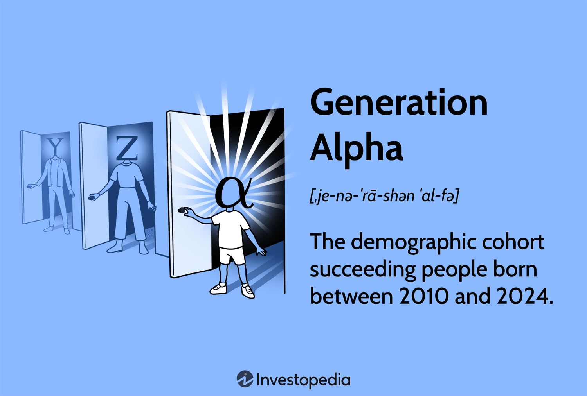

## Table of Contents

## What is Generation Alpha?

Generation Alpha is the name given to the group of people born from around 2010 to 2025. They come after Generation Z. This generation is growing up with technology all around them, like smartphones, tablets, and the internet. They are sometimes called "iPad kids" because many of them start using iPads and other devices at a very young age.

Because technology is such a big part of their lives, Generation Alpha is expected to be very good with technology. They might also have different ways of learning and communicating compared to older generations. As they grow up, they will shape the future with new ideas and ways of doing things. It's exciting to think about what they will do and how they will change the world.

## When were the first members of Generation Alpha born?

The first members of Generation Alpha were born in 2010. This means that the oldest members of this generation are now teenagers.

Generation Alpha is the group of kids and young people who come after Generation Z. They are growing up with technology all around them, like smartphones and the internet. This makes them different from older generations because they start using technology at a very young age.

## What are the key characteristics of Generation Alpha?

Generation Alpha, born from 2010 to 2025, is growing up surrounded by technology like smartphones, tablets, and the internet. This makes them very comfortable with technology from a young age. They are often called "iPad kids" because many of them start using iPads and other devices when they are very young. Because of this, they are expected to be very good at using technology and might even come up with new ways to use it.

This generation is also expected to have different ways of learning and communicating compared to older generations. They might learn more through digital means, like online classes or educational apps, rather than traditional [books](/wiki/algo-trading-books) and classrooms. As they grow up, they could change the world with new ideas and ways of doing things. It's exciting to think about what Generation Alpha will do in the future.

## How does technology influence Generation Alpha?

Technology has a big impact on Generation Alpha. They are growing up with smartphones, tablets, and the internet all around them. This means they start using technology when they are very young. Because of this, they are very good at using devices like iPads and computers. They are often called "iPad kids" because many of them learn to use iPads before they even go to school.

This early exposure to technology changes the way Generation Alpha learns and communicates. They might learn more from online classes or educational apps than from traditional books and classrooms. This could make them think and solve problems in new ways. As they grow up, they might use technology to come up with new ideas and change the world. It's exciting to think about what they will do in the future.

## What are the educational trends affecting Generation Alpha?

Generation Alpha is growing up with technology all around them. This means they often learn through digital tools like tablets and educational apps. Instead of just using books, they might use online classes or videos to learn new things. This can make learning more fun and interactive for them. They might also learn at their own pace, using technology to go back and review lessons whenever they need to.

Because of technology, the way teachers teach Generation Alpha is changing too. Teachers might use more digital tools in the classroom, like interactive whiteboards or online quizzes. This can help make lessons more interesting and keep students engaged. Also, because Generation Alpha is good with technology, they might learn to solve problems in new and creative ways. This could help them think differently and come up with new ideas as they grow up.

## How do family structures impact Generation Alpha?

Family structures have a big impact on Generation Alpha. Many families today are different from how they used to be. Some kids live with just one parent, some live with two parents, and others might live with grandparents or other relatives. This can affect how Generation Alpha kids grow up. For example, if they live with a single parent, they might have to help out more at home or spend more time with other family members or friends.

The way families work can also change how Generation Alpha kids learn and use technology. In some families, both parents might work a lot, so kids might use tablets or smartphones more to keep themselves busy. This can make them really good with technology but might also mean they spend less time talking and playing with family members. On the other hand, families that spend a lot of time together might help Generation Alpha kids learn important social skills and feel more supported as they grow up.

## What are the potential career paths for Generation Alpha?

Generation Alpha, born from 2010 to 2025, will likely have many different career paths because they are growing up with so much technology around them. They might be really good at jobs that use technology, like working with computers, making apps, or even creating new kinds of technology. They could also be interested in jobs that help make the world better, like working on green energy or solving big problems like climate change. Because they are so comfortable with technology, they might find new ways to do old jobs, making them more efficient or easier.

Another area where Generation Alpha might find careers is in health and wellness. With technology, they could help create new ways to keep people healthy, like using apps to track fitness or using virtual reality to help with therapy. They might also be interested in jobs that help people connect and communicate, like working in social media or creating new ways for people to talk to each other online. As they grow up, the world will change a lot, and Generation Alpha will have the chance to pick careers that fit with those changes.

## How might Generation Alpha change the workforce?

Generation Alpha will change the workforce because they grew up with a lot of technology. They are really good at using computers, smartphones, and the internet. This means they might find new ways to do jobs that we haven't thought of yet. They could make old jobs easier or more efficient by using technology. For example, they might use apps to help with work or come up with new technology to solve problems.

They might also be interested in jobs that help the world, like working on green energy or fixing big problems like climate change. Because they are so comfortable with technology, they could help create new ways to keep people healthy, like using fitness apps or virtual reality for therapy. As they grow up, they will bring new ideas to the workforce and change how we work in the future.

## What are the predicted social values of Generation Alpha?

Generation Alpha is growing up with technology all around them, so they might value things like being connected and staying in touch with people online. They might also care a lot about the environment and want to make the world a better place. Because they are so used to using technology, they might believe that it can help solve big problems like climate change.

They might also value diversity and inclusion more than older generations. Growing up in a world that is more connected, they see and learn about different cultures and ways of life. This could make them more open to new ideas and more accepting of people who are different from them. As they grow up, these values could shape the way they live and work, making them leaders in creating a more connected and inclusive world.

## What global challenges will Generation Alpha face?

Generation Alpha will face many big challenges as they grow up. One of the biggest challenges is climate change. They will need to find ways to make the world a better place and stop the planet from getting too hot. This means they might work on new ways to use energy that don't hurt the environment, like solar power or wind power. They will also need to deal with more storms and changes in the weather that can make life harder.

Another challenge is technology. As they grow up with so much technology around them, they will need to figure out how to use it in good ways and not let it control their lives too much. They will need to learn how to stay safe online and how to use technology to help solve problems, not just for fun. This could mean working on new apps or tools that help people learn or stay healthy.

Lastly, Generation Alpha will face challenges with jobs and the economy. As technology changes the way we work, they might need to learn new skills to find good jobs. They will also need to deal with big differences in how much money people have, which can make life harder for some people. They might need to work together to find ways to make sure everyone has a chance to do well.

## How can society prepare for the needs of Generation Alpha?

Society can prepare for Generation Alpha by making sure they have good education that includes a lot of technology. Since these kids grow up using iPads and smartphones, schools should use these tools to help them learn. Teachers can use online classes, educational apps, and interactive lessons to make learning fun and interesting. This will help Generation Alpha learn at their own pace and get ready for jobs that use a lot of technology. It's also important to teach them how to use technology safely and responsibly, so they can use it to solve problems without letting it take over their lives.

Another way to prepare for Generation Alpha is to focus on the environment. These kids will grow up with climate change as a big problem, so society needs to help them learn about it and find ways to fix it. This means teaching them about green energy and how to take care of the planet. It's also important to make sure they have the chance to work on these problems when they grow up. By preparing them to face these challenges, we can help Generation Alpha make the world a better place.

Lastly, society should help Generation Alpha learn about different cultures and be open to new ideas. Because they grow up in a connected world, they will see and learn about many different ways of life. By teaching them to be inclusive and accepting, we can help them build a world where everyone has a chance to do well. This means making sure they have the skills and support they need to work together and solve big problems.

## What long-term impacts might Generation Alpha have on the world?

Generation Alpha will have a big impact on the world because they are growing up with a lot of technology. They are really good at using computers, smartphones, and the internet. This means they might come up with new ways to do jobs and solve problems that we haven't thought of yet. They could make old jobs easier or more efficient by using technology. For example, they might use apps to help with work or create new technology to fix big problems like climate change. As they grow up, they will bring new ideas to the workforce and change how we work in the future.

Another long-term impact of Generation Alpha will be on the environment. They will grow up knowing about climate change and will want to make the world a better place. They might work on new ways to use energy that don't hurt the environment, like solar power or wind power. They will also need to deal with more storms and changes in the weather that can make life harder. By focusing on these issues from a young age, Generation Alpha could help create a world that is cleaner and safer for everyone.

Generation Alpha will also change how we think about social values. They grow up in a connected world and will value things like staying in touch with people online. They might also care a lot about diversity and inclusion, being more open to new ideas and accepting of people who are different from them. As they grow up, these values could shape the way they live and work, making them leaders in creating a more connected and inclusive world.

## References & Further Reading

[1]: Bergstra, J., Bardenet, R., Bengio, Y., & Kégl, B. (2011). ["Algorithms for Hyper-Parameter Optimization."](https://papers.nips.cc/paper/4443-algorithms-for-hyper-parameter-optimization) Advances in Neural Information Processing Systems 24.

[2]: Lopez de Prado, M. (2018). ["Advances in Financial Machine Learning."](https://www.amazon.com/Advances-Financial-Machine-Learning-Marcos/dp/1119482089) John Wiley & Sons.

[3]: Aronson, D. R. (2006). ["Evidence-Based Technical Analysis: Applying the Scientific Method and Statistical Inference to Trading Signals."](https://www.amazon.com/Evidence-Based-Technical-Analysis-Scientific-Statistical/dp/0470008741) Wiley.

[4]: Jansen, S. (2020). ["Machine Learning for Algorithmic Trading."](https://github.com/stefan-jansen/machine-learning-for-trading) Packt Publishing.

[5]: Chan, E. P. (2008). ["Quantitative Trading: How to Build Your Own Algorithmic Trading Business."](https://github.com/ftvision/quant_trading_echan_book) John Wiley & Sons.