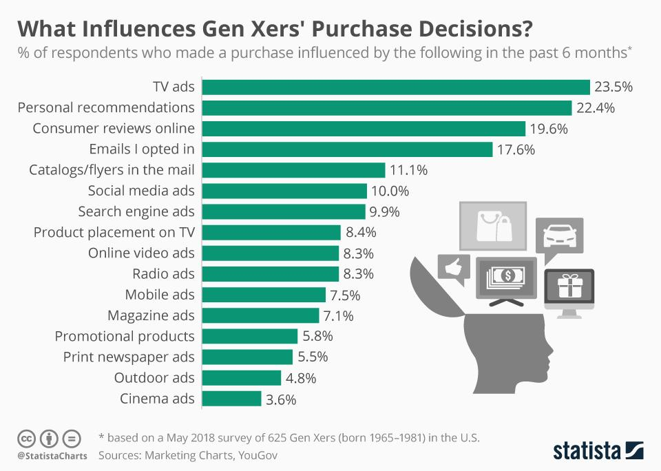

## Table of Contents

## What is Generation X?

Generation X, often shortened to Gen X, is the group of people born between the early 1960s and the early 1980s. They grew up during a time when the world was changing a lot. Many of their parents were part of the Baby Boomer generation. Gen Xers saw the rise of personal computers and the start of the internet. They also experienced big changes in family life, like more parents getting divorced and more moms working outside the home.

Gen X is known for being independent and good at solving problems. They had to learn to do things on their own because their parents were often busy. This generation is also known for being the first to really use technology in their daily lives. They helped shape the way we use technology today. Many Gen Xers are now in their 40s and 50s, and they play important roles in businesses and communities.

## What are the birth years that define Generation X?

Generation X, or Gen X, includes people born from the early 1960s to the early 1980s. This means if you were born between about 1960 and 1984, you are part of this group.

Gen Xers grew up during a time when many things were changing. They saw the start of personal computers and the internet. They also experienced changes in family life, like more divorces and more moms working outside the home.

## What are the key demographic characteristics of Generation X?

Generation X, or Gen X, is made up of people born between the early 1960s and the early 1980s. This group is known for being independent and good at solving problems. They grew up during a time when many things were changing, like the rise of personal computers and the start of the internet. Gen Xers also saw big changes in family life, with more parents getting divorced and more moms working outside the home. This made them learn to do things on their own because their parents were often busy.

Gen Xers are now in their 40s and 50s. They play important roles in businesses and communities. Many of them are parents and have helped shape the way we use technology today. They are often seen as a bridge between the older Baby Boomers and the younger Millennials. Gen Xers value work-life balance and are known for being adaptable and resourceful.

## How does Generation X differ from Baby Boomers and Millennials?

Generation X, born between the early 1960s and early 1980s, is different from Baby Boomers and Millennials in many ways. Baby Boomers, born between 1946 and 1964, grew up during a time of economic growth and optimism. They were a large group and had a big impact on society. On the other hand, Gen Xers grew up during a time when families were changing a lot, with more divorces and more moms working. They also saw the start of personal computers and the internet. This made them independent and good at solving problems because they had to learn to do things on their own.

Millennials, born between the early 1980s and the late 1990s, are known for growing up with technology all around them. They are very comfortable with digital devices and social media. Millennials also care a lot about work-life balance and often look for jobs that fit their values. Gen Xers, while also tech-savvy, had to adapt to technology as it grew. They are seen as a bridge between the older Baby Boomers and the younger Millennials. Gen Xers value independence and are often seen as more adaptable than both Boomers and Millennials.

## What major historical events shaped Generation X?

Generation X, born between the early 1960s and early 1980s, grew up during a time when many big things were happening. One of the biggest events was the rise of personal computers and the start of the internet. This changed how people worked and lived. Gen Xers were the first to really use technology in their daily lives. They also saw the end of the Cold War, which was a long time of tension between the United States and the Soviet Union. The fall of the Berlin Wall in 1989 was a big moment that showed the world was changing.

Another important event was the increase in divorce rates during the 1970s and 1980s. Many Gen Xers grew up in families where their parents got divorced. This made them learn to be independent and solve problems on their own. Also, more moms started working outside the home, which was different from how things were before. Gen Xers also lived through the AIDS crisis in the 1980s, which made them more aware of health issues. All these events helped shape who they are and how they see the world.

## What are the common values and attitudes of Generation X?

Generation X, born between the early 1960s and early 1980s, values independence a lot. They grew up during a time when many parents got divorced and more moms worked outside the home. This made them learn to do things on their own. They are good at solving problems and are very adaptable. Gen Xers also care about work-life balance. They want to have a good job but also want time for their family and hobbies.

Gen Xers are also known for being tech-savvy. They saw the start of personal computers and the internet. They had to learn and adapt to new technology as it grew. This makes them different from Baby Boomers, who were older when technology started to change, and Millennials, who grew up with technology all around them. Gen Xers value being able to use technology to make their lives easier and better.

## How has Generation X influenced popular culture?

Generation X has had a big impact on popular culture. They grew up during a time when music and movies were changing a lot. Gen Xers helped make grunge music popular in the 1990s. Bands like Nirvana and Pearl Jam were big hits with this group. They also liked movies that showed how they felt about the world. Films like "Reality Bites" and "Clerks" were about young people trying to find their way in life. These movies and music helped show what Gen Xers were thinking and feeling.

Gen Xers also helped change TV shows. They liked shows that were different and funny, like "The Simpsons" and "Seinfeld." These shows were about everyday life but in a new way. Gen Xers also started to use the internet more. They helped make websites and blogs popular. This changed how people shared information and ideas. Gen Xers have left a big mark on music, movies, TV, and the internet.

## What is the economic impact of Generation X?

Generation X has had a big impact on the economy. They grew up during a time when many things were changing, like the rise of personal computers and the start of the internet. Many Gen Xers started their careers during the 1980s and 1990s, a time when the economy was growing. They helped make technology a big part of business. Many of them started their own companies or worked in tech, which helped create new jobs and grow the economy.

Now, Gen Xers are in their 40s and 50s. They are at the peak of their careers and have a lot of money to spend. They buy houses, cars, and other big things. They also save for their future and their kids' education. This spending and saving helps keep the economy strong. Gen Xers are also starting to retire, which means they will need to use their savings. This can affect how much money is in the economy and how people plan for their future.

## How has Generation X affected the workplace and leadership styles?

Generation X has changed the workplace and leadership styles a lot. They grew up seeing big changes in technology and family life. This made them independent and good at solving problems. When they started working, they brought these skills to their jobs. Gen Xers are known for being flexible and able to adapt to new situations. They helped make the workplace more about teamwork and less about strict rules. They also started to use technology more at work, like emails and computers, which changed how people work together.

Gen Xers also changed how leaders act. They value work-life balance and want to have time for their family and hobbies. This made them push for more flexible work hours and remote work. They also like leaders who are honest and clear about what they want. Gen Xers often lead by example and work well with others. They are good at listening and making sure everyone's ideas are heard. This has made workplaces more open and friendly.

## What are the political leanings and voting patterns of Generation X?

Generation X, born between the early 1960s and early 1980s, has varied political leanings. They grew up during a time when many things were changing, like the end of the Cold War and the rise of personal computers. This made them think about the world in different ways. Some Gen Xers lean more to the left and care about social issues like equality and the environment. Others lean more to the right and focus on things like economic freedom and personal responsibility. Overall, Gen Xers are not as easy to group into one political side as some other generations.

When it comes to voting, Gen Xers are known for being independent thinkers. They often look at each election and decide based on what they think is best at that time. They don't always stick to one political party. This can make it hard to predict how they will vote. In recent years, some Gen Xers have been more likely to vote for candidates who focus on practical solutions and less on party politics. Their voting patterns can change a lot depending on the issues and candidates in each election.

## How does Generation X approach technology and digital media?

Generation X grew up during a time when technology was starting to change a lot. They saw the first personal computers and the start of the internet. This made them the first group to really use technology in their daily lives. They had to learn and adapt to new gadgets and software as they came out. This made Gen Xers good at figuring out how to use new technology. They are not as comfortable with technology as Millennials, who grew up with it all around them, but they are much better with it than Baby Boomers, who were older when technology started to change.

Gen Xers use technology in many ways. They use it at work to make their jobs easier and to stay connected with their team. They also use the internet and social media to keep in touch with friends and family. Many Gen Xers have their own websites or blogs where they share their ideas and thoughts. They also like to use technology for fun, like playing video games or watching movies online. Overall, Gen Xers see technology as a tool that can help them live better lives. They are always ready to learn new things and use technology to solve problems.

## What are the future trends and predictions for Generation X as they age?

As Generation X gets older, they will keep changing the world around them. They are now in their 40s and 50s, which means they are at the peak of their careers. Many of them will start to retire soon. When they retire, they will have more time for hobbies and family. They will also need to use their savings, which can affect the economy. Gen Xers care a lot about work-life balance, so they might push for better retirement plans that let them enjoy life after work.

Gen Xers will also keep using technology as they age. They grew up with computers and the internet, so they are good at using new gadgets. They will use technology to stay healthy and connected with friends and family. They might use apps to track their health or video calls to talk to their grandkids. Gen Xers are also likely to keep working with younger generations to make the world better. They have a lot of experience and knowledge to share, and they will use it to help solve big problems like climate change and inequality.

## What is Generation X: The Cautious Optimists?

Generation X, located between the Baby Boomers and Millennials, displays distinct characteristics in their engagement with trading, particularly algorithmic trading. Known for their cautious optimism, many members of Generation X seek a balance between conventional investment methods and emerging technological advancements. Their adoption of algorithmic trading is guided by a careful evaluation of risks and benefits.

While Generation X appreciates the innovation and efficiency that algo trading offers, there is a genuine concern regarding its inherent risks. These risks include market volatility and potential technical failures. The generation's skepticism often stems from the financial instability experienced during key economic crises of their adult years, such as the dot-com bubble and the 2008 financial crisis.

Many Gen Xers use algorithmic trading as a complementary tool to enhance their existing investment strategies. By integrating algo trading with traditional methods, they can optimize risk-reward scenarios. This can be illustrated using risk-adjusted return metrics like the Sharpe Ratio, which is calculated as:

$$
\text{Sharpe Ratio} = \frac{E(R_p) - R_f}{\sigma_p}
$$

where $E(R_p)$ is the expected portfolio return, $R_f$ is the risk-free rate, and $\sigma_p$ is the standard deviation of portfolio returns. By maximizing the Sharpe Ratio, Generation X investors aim to improve the efficiency of their portfolios by achieving higher returns for a given level of risk.

Although not as quick to embrace new technologies as Millennials, Generation X adapts effectively once the value of algorithmic strategies is validated. This adaptability comes from a practical approach towards integrating innovation with their investment objectives. They are often influenced by successful case studies, expert opinions, and a robust track record of algorithmic strategies proving beneficial over time.

In conclusion, the cautious yet optimistic attitude of Generation X enables them to approach algorithmic trading with both curiosity and caution. Their strategic integration of traditional and innovative practices highlights their unique place in the investment landscape. This balance allows them to harness the benefits of algorithmic trading while mitigating potential risks.

## References & Further Reading

[1]: Bergstra, J., Bardenet, R., Bengio, Y., & Kégl, B. (2011). ["Algorithms for Hyper-Parameter Optimization."](https://papers.nips.cc/paper/4443-algorithms-for-hyper-parameter-optimization) Advances in Neural Information Processing Systems 24.

[2]: ["Advances in Financial Machine Learning"](https://www.amazon.com/Advances-Financial-Machine-Learning-Marcos/dp/1119482089) by Marcos Lopez de Prado

[3]: ["Evidence-Based Technical Analysis: Applying the Scientific Method and Statistical Inference to Trading Signals"](https://www.wiley.com/en-us/Evidence+Based+Technical+Analysis%3A+Applying+the+Scientific+Method+and+Statistical+Inference+to+Trading+Signals-p-9780470008744) by David Aronson

[4]: ["Machine Learning for Algorithmic Trading"](https://github.com/PacktPublishing/Machine-Learning-for-Algorithmic-Trading-Second-Edition) by Stefan Jansen

[5]: ["Quantitative Trading: How to Build Your Own Algorithmic Trading Business"](https://www.amazon.com/Quantitative-Trading-Build-Algorithmic-Business/dp/1119800064) by Ernest P. Chan